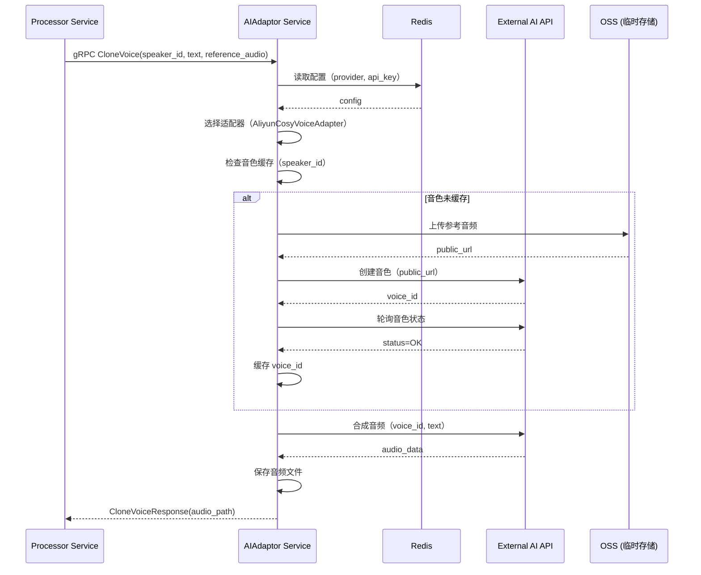

# AIAdaptor 服务设计文档（第二层）

**文档版本**: 1.0  
**最后更新**: 2025-10-30  
**服务定位**: Go gRPC 微服务，负责 AI 服务统一接口和适配器管理

---

## 1. 服务定位与核心职责

### 1.1 服务定位

`AIAdaptor` 是整个系统的**AI 服务适配器层**，负责封装所有外部 AI API 调用，通过适配器模式实现业务逻辑与厂商解耦。

### 1.2 核心职责

* **统一接口**: 为 Processor 提供统一的 AI 服务接口（ASR、翻译、LLM、声音克隆）
* **适配器管理**: 封装厂商特定逻辑，支持多厂商切换
* **音色管理**: 管理声音克隆的音色注册、缓存、轮询（针对阿里云 CosyVoice）
* **配置读取**: 从 Redis 读取用户配置的 API 密钥和厂商选择
* **错误处理**: 统一错误处理和降级策略

### 1.3 服务边界

**负责**:
- 提供统一的 AI 服务 gRPC 接口
- 封装厂商特定的 API 调用逻辑
- 管理音色注册、缓存、轮询
- 从 Redis 读取和解密 API 密钥

**不负责**:
- AI 流程编排（由 Processor 负责）
- 任务状态管理（由 Processor 负责）
- 音频分离（由 AudioSeparator 负责）

---

## 2. gRPC 接口定义

### 2.1 Proto 文件定义

```protobuf
syntax = "proto3";

package aiadaptor;

option go_package = "./aiadaptor";

// AIAdaptor 服务定义
service AIAdaptor {
  // ASR（语音识别 + 说话人日志）
  rpc ASR(ASRRequest) returns (ASRResponse);
  
  // 文本润色
  rpc Polish(PolishRequest) returns (PolishResponse);
  
  // 翻译
  rpc Translate(TranslateRequest) returns (TranslateResponse);
  
  // 译文优化
  rpc Optimize(OptimizeRequest) returns (OptimizeResponse);
  
  // 声音克隆
  rpc CloneVoice(CloneVoiceRequest) returns (CloneVoiceResponse);
}

// ASR 请求
message ASRRequest {
  string audio_path = 1;  // 音频文件路径
}

// ASR 响应
message ASRResponse {
  repeated Speaker speakers = 1;  // 说话人列表
}

message Speaker {
  string speaker_id = 1;           // 说话人 ID
  repeated Sentence sentences = 2; // 句子列表
}

message Sentence {
  string text = 1;       // 文本内容
  double start_time = 2; // 开始时间（秒）
  double end_time = 3;   // 结束时间（秒）
}

// 文本润色请求
message PolishRequest {
  string text = 1;        // 原始文本
  string video_type = 2;  // 视频类型（tech, casual, education, default）
  string custom_prompt = 3; // 用户自定义 Prompt（可选）
}

// 文本润色响应
message PolishResponse {
  string polished_text = 1; // 润色后的文本
}

// 翻译请求
message TranslateRequest {
  string text = 1;        // 原始文本
  string source_lang = 2; // 源语言（默认 en）
  string target_lang = 3; // 目标语言（默认 zh）
  string video_type = 4;  // 视频类型（tech, casual, education, default）
}

// 翻译响应
message TranslateResponse {
  string translated_text = 1; // 翻译后的文本
}

// 译文优化请求
message OptimizeRequest {
  string text = 1; // 翻译后的文本
}

// 译文优化响应
message OptimizeResponse {
  string optimized_text = 1; // 优化后的文本
}

// 声音克隆请求
message CloneVoiceRequest {
  string speaker_id = 1;       // 说话人 ID（用于缓存）
  string text = 2;             // 要合成的文本
  string reference_audio = 3;  // 参考音频路径
}

// 声音克隆响应
message CloneVoiceResponse {
  string audio_path = 1; // 合成的音频路径
}
```

---

## 3. 适配器模式设计

### 3.1 适配器接口定义（伪代码）

```
# ASR 适配器接口
interface ASRAdapter:
    function ASR(audio_path: string) -> ASRResult

# 翻译适配器接口
interface TranslationAdapter:
    function Translate(text: string, source_lang: string, target_lang: string, video_type: string) -> string

# LLM 适配器接口
interface LLMAdapter:
    function Polish(text: string, video_type: string, custom_prompt: string) -> string
    function Optimize(text: string) -> string

# 声音克隆适配器接口
interface VoiceCloningAdapter:
    function CloneVoice(speaker_id: string, text: string, reference_audio: string) -> string
```

### 3.2 适配器实现（伪代码）

```
# 阿里云 CosyVoice 适配器
class AliyunCosyVoiceAdapter implements VoiceCloningAdapter:
    voice_cache: Map<speaker_id, voice_id>  # 音色缓存
    
    function CloneVoice(speaker_id, text, reference_audio):
        # 1. 检查缓存
        voice_id = voice_cache.get(speaker_id)
        
        if voice_id == null:
            # 2. 上传参考音频到公网（临时 OSS）
            public_url = upload_to_oss(reference_audio)
            
            # 3. 调用 CosyVoice API 创建音色
            voice_id = create_voice(public_url)
            
            # 4. 轮询音色状态，直到 OK
            wait_for_voice_ready(voice_id)
            
            # 5. 缓存 voice_id
            voice_cache.set(speaker_id, voice_id)
        
        # 6. 使用 voice_id 合成音频
        audio_path = synthesize(voice_id, text)
        return audio_path
```

**注**：具体实现见第三层文档 `AIAdaptor-design-detail.md`。

---

## 4. 核心逻辑伪代码

### 4.1 ASR 服务逻辑

```
function ASR(request: ASRRequest):
    # 1. 从 Redis 读取配置
    config = redis.get("app:settings")
    provider = config.asr_provider  # 例如：aliyun, azure, google
    
    # 2. 选择适配器
    adapter = get_asr_adapter(provider)
    
    # 3. 调用适配器
    result = adapter.ASR(request.audio_path)
    
    # 4. 返回结果
    return ASRResponse(speakers=result.speakers)
```

### 4.2 声音克隆服务逻辑

```
function CloneVoice(request: CloneVoiceRequest):
    # 1. 从 Redis 读取配置
    config = redis.get("app:settings")
    provider = config.voice_cloning_provider  # 例如：aliyun_cosyvoice
    
    # 2. 选择适配器
    adapter = get_voice_cloning_adapter(provider)
    
    # 3. 调用适配器（音色管理逻辑在适配器内部）
    audio_path = adapter.CloneVoice(
        speaker_id=request.speaker_id,
        text=request.text,
        reference_audio=request.reference_audio
    )
    
    # 4. 返回结果
    return CloneVoiceResponse(audio_path=audio_path)
```

---

## 5. 服务交互时序图



---

## 6. 错误码清单

| 错误码 | gRPC 状态码 | 说明 | 处理建议 |
|--------|-------------|------|----------|
| `INVALID_ARGUMENT` | `INVALID_ARGUMENT` | 参数无效 | 检查输入参数 |
| `UNAUTHENTICATED` | `UNAUTHENTICATED` | API 密钥无效 | 检查 API 密钥配置 |
| `PERMISSION_DENIED` | `PERMISSION_DENIED` | API 配额不足 | 检查账户余额 |
| `INTERNAL` | `INTERNAL` | 外部 API 调用失败 | 检查网络和 API 状态 |
| `DEADLINE_EXCEEDED` | `DEADLINE_EXCEEDED` | 请求超时 | 增加超时时间或重试 |

---

## 7. 关键配置项定义

### 7.1 环境变量（.env 文件）

```bash
# AIAdaptor 服务配置
AI_ADAPTOR_GRPC_PORT=50053           # gRPC 服务端口
API_KEY_ENCRYPTION_SECRET=xxx        # API 密钥加密密钥（32字节）

# Redis 配置
REDIS_HOST=redis
REDIS_PORT=6379
```

### 7.2 应用配置（Redis）

```json
{
  "asr_provider": "aliyun",
  "asr_api_key": "encrypted_key",
  "asr_endpoint": "https://...",
  
  "translation_provider": "deepl",
  "translation_api_key": "encrypted_key",
  "translation_video_type": "tech",
  
  "polishing_provider": "openai",
  "polishing_api_key": "encrypted_key",
  "polishing_enabled": false,
  "polishing_video_type": "tech",
  "polishing_custom_prompt": "",
  
  "voice_cloning_provider": "aliyun_cosyvoice",
  "voice_cloning_api_key": "encrypted_key",
  "voice_cloning_endpoint": "https://...",
  "voice_cloning_auto_select_reference": true
}
```

---

## 8. 音色管理策略（针对阿里云 CosyVoice）

### 8.1 音色缓存结构

```
voice_cache: Map<speaker_id, VoiceInfo>

struct VoiceInfo:
    voice_id: string           // 阿里云返回的音色 ID
    created_at: timestamp      // 创建时间
    reference_audio: string    // 参考音频路径
```

### 8.2 音色注册流程（伪代码）

```
function RegisterVoice(speaker_id, reference_audio):
    # 1. 上传参考音频到临时 OSS
    public_url = upload_to_temp_oss(reference_audio)
    
    # 2. 调用阿里云 API 创建音色
    response = aliyun_api.create_voice(
        audio_url=public_url,
        duration=get_duration(reference_audio)
    )
    voice_id = response.voice_id
    
    # 3. 轮询音色状态（最多等待 60 秒）
    for i in range(60):
        status = aliyun_api.query_voice_status(voice_id)
        if status == "OK":
            break
        sleep(1)
    
    if status != "OK":
        return error("音色注册超时")
    
    # 4. 缓存音色信息
    voice_cache.set(speaker_id, VoiceInfo{
        voice_id=voice_id,
        created_at=now(),
        reference_audio=reference_audio
    })
    
    return voice_id
```

---

## 9. 与第一层文档的对应关系

本文档是 `notes/Base-Design.md` 第一层架构文档的细化，对应以下章节：

- **1.2 系统架构与设计**: 适配器模式
- **1.3 技术栈选型**: AI 服务厂商选择
- **1.4 项目工程结构**: `server/mcp/ai-adaptor/`
- **1.5 核心业务工作流**: 步骤 7-11（AI 处理）
- **ADR-004**: AI 服务统一接口设计
- **ADR-007**: 声音克隆服务选型

---

## 10. 后续工作

### 10.1 第三层文档

创建 `notes/AIAdaptor-design-detail.md`，包含：
- Go 代码实现
- 各个适配器的具体实现
- 音色管理的具体实现
- 单元测试和集成测试

### 10.2 开发任务

1. 实现 gRPC 服务（main.go）
2. 实现适配器接口（adapters/interface.go）
3. 实现阿里云 CosyVoice 适配器（adapters/aliyun_cosyvoice.go）
4. 实现其他适配器（ASR、翻译、LLM）
5. 实现音色管理逻辑（voice_manager.go）
6. 编写单元测试
7. 集成到 docker-compose.yml

---

