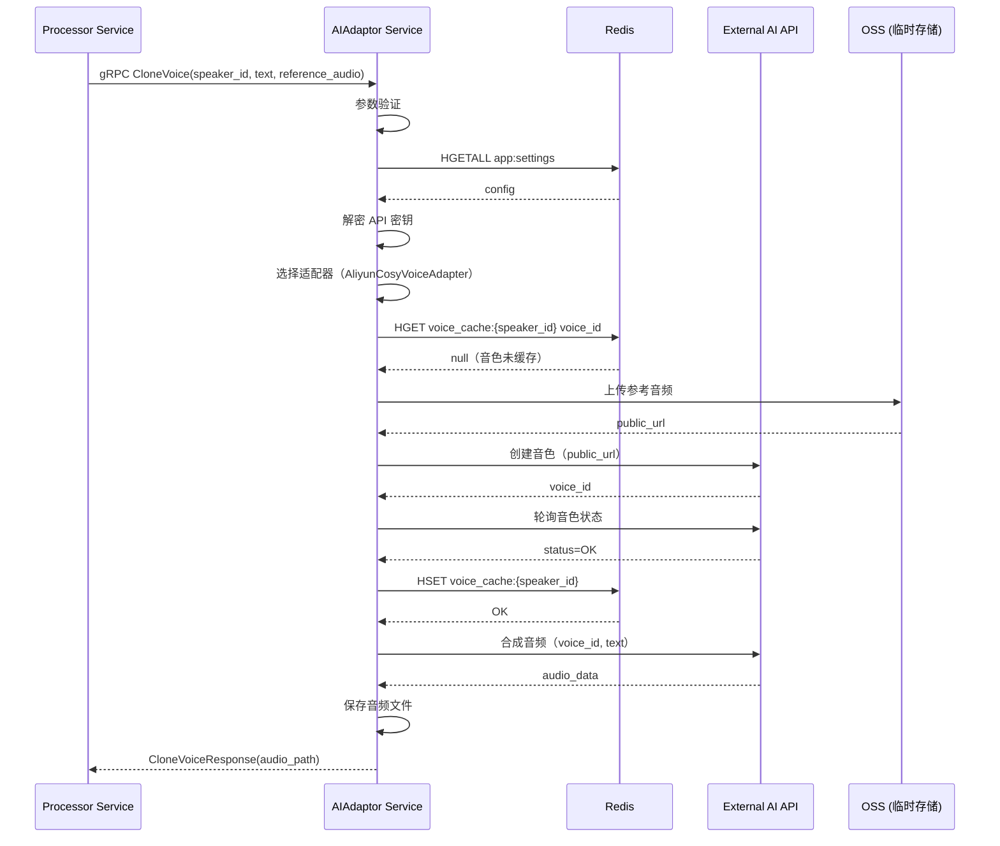
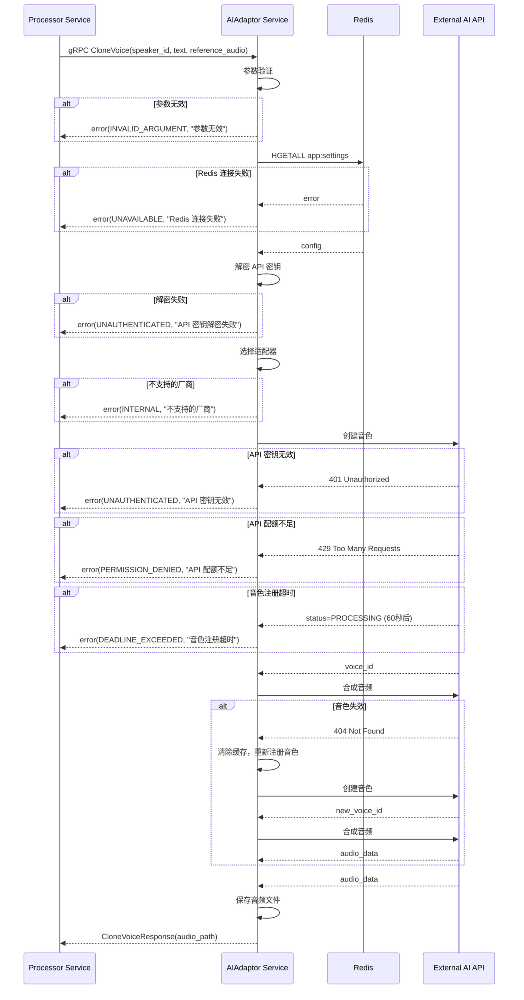
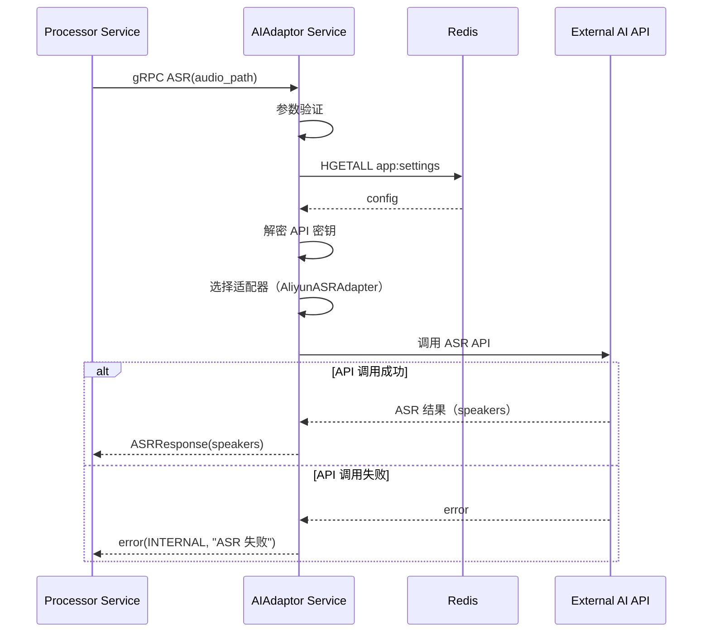
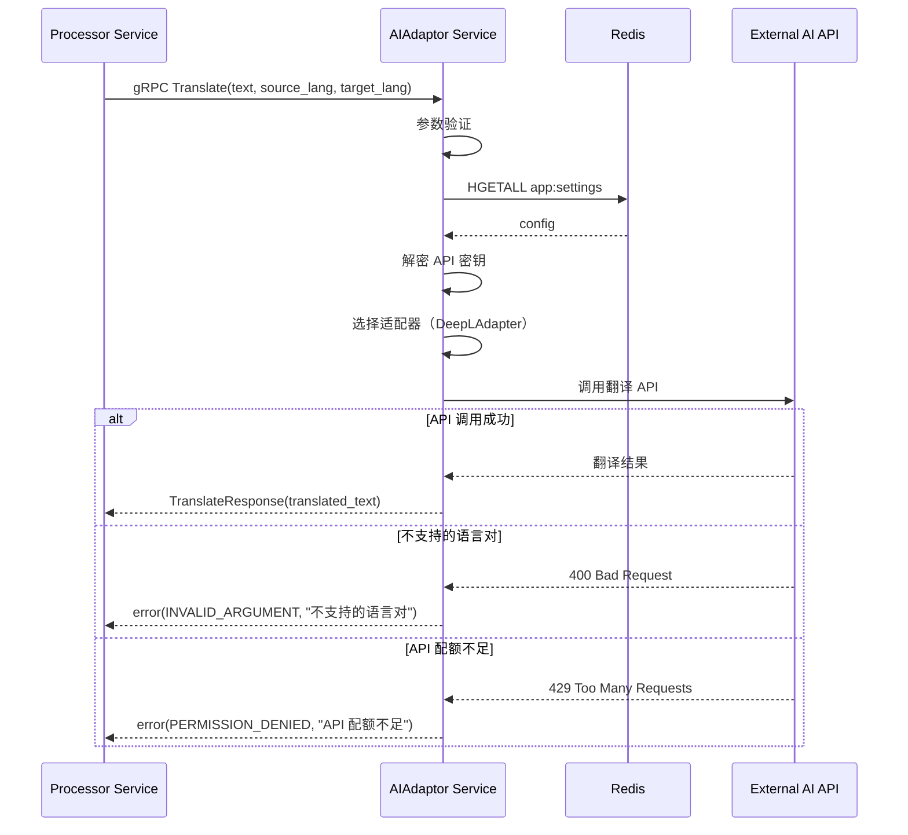

# AIAdaptor 服务设计文档（第二层）

**文档版本**: 1.3
**关联宏观架构**: `notes/Base-Design.md` v2.0
**最后更新**: 2025-11-01
**服务定位**: Go gRPC 微服务，负责 AI 服务统一接口和适配器管理

## 版本历史

- **v1.3 (2025-11-01)**:
  - **重大更新**：全面完善第二层文档质量，符合 design-rules.md 规范
  - 补充第5章"关键逻辑步骤"：增加详细的错误处理、数据验证、配置解密等步骤
  - 补充第4章"适配器模式设计"：增加 ASR、翻译、LLM 适配器实现示例
  - 补充第9章"音色管理策略"：增加缓存失效处理、重试策略、降级策略
  - 完善第7章"错误码清单"：增加业务特定错误码和触发场景
  - 完善第8章"配置项定义"：增加类型、默认值、是否必填说明
  - 完善第6章"服务交互时序图"：增加错误处理分支
  - 完善第4.1节"适配器接口定义"：增加参数说明、返回值说明、错误处理说明
  - 更新文档变更历史
- **v1.2 (2025-10-31)**:
  - **补充第3章"核心数据结构"**：符合 design-rules.md 第二层文档模板要求
  - 新增 3.1 节"Redis 数据结构"（app:settings、voice_cache）
  - 新增 3.2 节"内存数据结构"（适配器注册表、音色缓存管理器）
  - 调整后续章节编号（原第3章→第4章，以此类推）
  - 更新文档变更历史
- **v1.1 (2025-10-30)**:
  - 更新关联宏观架构版本为 v2.0（Base-Design.md 已完成冗余清理）
  - 新增版本历史章节
  - 更新"与第一层文档的对应关系"章节，引用 v2.0
  - 新增"文档变更历史"章节
- **v1.0 (2025-10-30)**: 初始版本

---

## 1. 服务定位与核心职责

### 1.1 服务定位

`AIAdaptor` 是整个系统的**AI 服务适配器层**，负责封装所有外部 AI API 调用，通过适配器模式实现业务逻辑与厂商解耦。

### 1.2 核心职责

* **统一接口**: 为 Processor 提供统一的 AI 服务接口（ASR、翻译、LLM、声音克隆）
* **适配器管理**: 封装厂商特定逻辑，支持多厂商切换
* **音色管理**: 管理声音克隆的音色注册、缓存、轮询（针对阿里云 CosyVoice）
* **配置读取**: 从 Redis 读取用户配置的 API 密钥和厂商选择
* **错误处理**: 统一错误处理和降级策略

### 1.3 服务边界

**负责**:
- 提供统一的 AI 服务 gRPC 接口
- 封装厂商特定的 API 调用逻辑
- 管理音色注册、缓存、轮询
- 从 Redis 读取和解密 API 密钥

**不负责**:
- AI 流程编排（由 Processor 负责）
- 任务状态管理（由 Processor 负责）
- 音频分离（由 AudioSeparator 负责）

---

## 2. gRPC 接口定义

### 2.1 Proto 文件定义

```protobuf
syntax = "proto3";

package aiadaptor;

option go_package = "./aiadaptor";

// AIAdaptor 服务定义
service AIAdaptor {
  // ASR（语音识别 + 说话人日志）
  rpc ASR(ASRRequest) returns (ASRResponse);
  
  // 文本润色
  rpc Polish(PolishRequest) returns (PolishResponse);
  
  // 翻译
  rpc Translate(TranslateRequest) returns (TranslateResponse);
  
  // 译文优化
  rpc Optimize(OptimizeRequest) returns (OptimizeResponse);
  
  // 声音克隆
  rpc CloneVoice(CloneVoiceRequest) returns (CloneVoiceResponse);
}

// ASR 请求
message ASRRequest {
  string audio_path = 1;  // 音频文件路径
}

// ASR 响应
message ASRResponse {
  repeated Speaker speakers = 1;  // 说话人列表
}

message Speaker {
  string speaker_id = 1;           // 说话人 ID
  repeated Sentence sentences = 2; // 句子列表
}

message Sentence {
  string text = 1;       // 文本内容
  double start_time = 2; // 开始时间（秒）
  double end_time = 3;   // 结束时间（秒）
}

// 文本润色请求
message PolishRequest {
  string text = 1;        // 原始文本
  string video_type = 2;  // 视频类型（tech, casual, education, default）
  string custom_prompt = 3; // 用户自定义 Prompt（可选）
}

// 文本润色响应
message PolishResponse {
  string polished_text = 1; // 润色后的文本
}

// 翻译请求
message TranslateRequest {
  string text = 1;        // 原始文本
  string source_lang = 2; // 源语言（默认 en）
  string target_lang = 3; // 目标语言（默认 zh）
  string video_type = 4;  // 视频类型（tech, casual, education, default）
}

// 翻译响应
message TranslateResponse {
  string translated_text = 1; // 翻译后的文本
}

// 译文优化请求
message OptimizeRequest {
  string text = 1; // 翻译后的文本
}

// 译文优化响应
message OptimizeResponse {
  string optimized_text = 1; // 优化后的文本
}

// 声音克隆请求
message CloneVoiceRequest {
  string speaker_id = 1;       // 说话人 ID（用于缓存）
  string text = 2;             // 要合成的文本
  string reference_audio = 3;  // 参考音频路径
}

// 声音克隆响应
message CloneVoiceResponse {
  string audio_path = 1; // 合成的音频路径
}
```

---

## 3. 核心数据结构

### 3.1 Redis 数据结构

#### 3.1.1 应用配置（Hash）

**Key**: `app:settings`

**用途**: 存储应用配置，AIAdaptor 服务从此读取 API 密钥和厂商选择

**访问模式**: 只读（由 Gateway 服务写入和更新）

**关键字段**（AIAdaptor 服务关注的字段）:

| 字段名                                | 类型   | 说明                                       |
| ------------------------------------- | ------ | ------------------------------------------ |
| `asr_provider`                        | string | ASR 服务商标识（如 `aliyun`、`azure`）     |
| `asr_api_key`                         | string | 加密存储的 API Key（需解密后使用）         |
| `asr_endpoint`                        | string | 自定义端点 URL（可选）                     |
| `polishing_enabled`                   | string | 是否启用文本润色（`"true"` 或 `"false"`）  |
| `polishing_provider`                  | string | 文本润色服务商标识（如 `openai-gpt4o`）    |
| `polishing_api_key`                   | string | 加密存储的 API Key                         |
| `polishing_custom_prompt`             | string | 用户自定义的润色 Prompt（可选）            |
| `polishing_video_type`                | string | 翻译预设类型（可选）                       |
| `translation_provider`                | string | 翻译服务商标识（如 `deepl`、`google`）     |
| `translation_api_key`                 | string | 加密存储的 API Key                         |
| `translation_endpoint`                | string | 自定义端点 URL（可选）                     |
| `translation_video_type`              | string | 翻译预设类型（可选）                       |
| `optimization_enabled`                | string | 是否启用译文优化（`"true"` 或 `"false"`）  |
| `optimization_provider`               | string | 译文优化服务商标识                         |
| `optimization_api_key`                | string | 加密存储的 API Key                         |
| `voice_cloning_provider`              | string | 声音克隆服务商标识（如 `aliyun_cosyvoice`）|
| `voice_cloning_api_key`               | string | 加密存储的 API Key                         |
| `voice_cloning_endpoint`              | string | 自定义端点 URL（可选）                     |
| `voice_cloning_auto_select_reference` | string | 是否自动选择参考音频（`"true"` 或 `"false"`）|

**注意事项**:
- 所有 API Key 字段使用 AES-256-GCM 加密存储，AIAdaptor 服务需解密后使用
- 布尔值字段存储为字符串 `"true"` 或 `"false"`
- 空值字段存储为空字符串 `""`
- 加密密钥通过环境变量 `API_KEY_ENCRYPTION_SECRET` 传入

#### 3.1.2 音色缓存（Hash，针对阿里云 CosyVoice）

**Key**: `voice_cache:{speaker_id}`

**用途**: 缓存已注册的音色信息，避免重复注册

**数据类型**: Redis Hash

**字段定义**:

| 字段名             | 类型   | 示例值                                      | 说明                     |
| ------------------ | ------ | ------------------------------------------- | ------------------------ |
| `voice_id`         | string | `"cosyvoice_voice_12345"`                   | 阿里云返回的音色 ID      |
| `created_at`       | string | `"2025-10-30T10:30:00Z"`                    | 创建时间（ISO 8601 格式）|
| `reference_audio`  | string | `"{LOCAL_STORAGE_PATH}/task_123/segments/speaker_1_segment_0.wav"` | 参考音频路径             |

**生命周期**:
- 创建时机：首次为某个 speaker_id 克隆声音时
- 过期策略：不设置 TTL，由 GC 定时任务清理（与任务目录一起删除）
- 访问模式：读写（AIAdaptor 服务）

**示例**:
```
HGETALL voice_cache:speaker_1
1) "voice_id"
2) "cosyvoice_voice_12345"
3) "created_at"
4) "2025-10-30T10:30:00Z"
5) "reference_audio"
6) "{LOCAL_STORAGE_PATH}/task_123/segments/speaker_1_segment_0.wav"
```

### 3.2 内存数据结构

#### 3.2.1 适配器注册表

**用途**: 管理所有已注册的适配器实例

**数据结构**（伪代码）:

```go
type AdapterRegistry struct {
    asrAdapters           map[string]ASRAdapter           // key: provider name
    translationAdapters   map[string]TranslationAdapter   // key: provider name
    llmAdapters           map[string]LLMAdapter           // key: provider name
    voiceCloningAdapters  map[string]VoiceCloningAdapter  // key: provider name
}
```

**初始化时机**: AIAdaptor 服务启动时

**访问模式**: 只读（启动后不再修改）

#### 3.2.2 音色缓存管理器（内存层）

**用途**: 在内存中缓存 Redis 中的音色信息，减少 Redis 访问

**数据结构**（伪代码）:

```go
type VoiceManager struct {
    cache map[string]*VoiceInfo  // key: speaker_id
    mu    sync.RWMutex            // 读写锁
}

type VoiceInfo struct {
    VoiceID        string    // 阿里云返回的音色 ID
    CreatedAt      time.Time // 创建时间
    ReferenceAudio string    // 参考音频路径
}
```

**缓存策略**:
- 首次访问时从 Redis 加载
- 写入时同时更新 Redis 和内存
- 不设置过期时间（由 GC 定时任务清理）

**并发安全**: 使用读写锁保护

---

## 4. 适配器模式设计

### 4.1 适配器接口定义（伪代码）

#### 4.1.1 ASR 适配器接口

```
interface ASRAdapter:
    function ASR(audio_path: string, api_key: string, endpoint: string) -> ASRResult
```

**参数说明**:
- `audio_path`: 音频文件的本地路径
- `api_key`: 解密后的 API 密钥
- `endpoint`: 自定义端点 URL（可选，为空则使用默认端点）

**返回值**:
- `ASRResult`: 包含 speakers 列表的结构体

**错误处理**:
- 抛出 `APIError`（包含 code 和 message）
- `code 401`: API 密钥无效
- `code 429`: API 配额不足
- `code 5xx`: 外部 API 服务错误

#### 4.1.2 翻译适配器接口

```
interface TranslationAdapter:
    function Translate(text: string, source_lang: string, target_lang: string, video_type: string, api_key: string, endpoint: string) -> string
```

**参数说明**:
- `text`: 待翻译的文本
- `source_lang`: 源语言代码（如 `en`）
- `target_lang`: 目标语言代码（如 `zh`）
- `video_type`: 视频类型（tech, casual, education, default）
- `api_key`: 解密后的 API 密钥
- `endpoint`: 自定义端点 URL（可选）

**返回值**:
- `string`: 翻译后的文本

**错误处理**:
- 抛出 `APIError`（包含 code 和 message）
- `code 401`: API 密钥无效
- `code 429`: API 配额不足
- `code 400`: 不支持的语言对
- `code 5xx`: 外部 API 服务错误

#### 4.1.3 LLM 适配器接口

```
interface LLMAdapter:
    function Polish(text: string, video_type: string, custom_prompt: string, api_key: string, endpoint: string) -> string
    function Optimize(text: string, api_key: string, endpoint: string) -> string
```

**参数说明**:
- `text`: 待处理的文本
- `video_type`: 视频类型（tech, casual, education, default）
- `custom_prompt`: 用户自定义 Prompt（可选）
- `api_key`: 解密后的 API 密钥
- `endpoint`: 自定义端点 URL（可选）

**返回值**:
- `string`: 处理后的文本

**错误处理**:
- 抛出 `APIError`（包含 code 和 message）
- `code 401`: API 密钥无效
- `code 429`: API 配额不足
- `code 400`: Prompt 格式错误
- `code 5xx`: 外部 API 服务错误

#### 4.1.4 声音克隆适配器接口

```
interface VoiceCloningAdapter:
    function CloneVoice(speaker_id: string, text: string, reference_audio: string, api_key: string, endpoint: string) -> string
```

**参数说明**:
- `speaker_id`: 说话人 ID（用于缓存）
- `text`: 要合成的文本
- `reference_audio`: 参考音频路径
- `api_key`: 解密后的 API 密钥
- `endpoint`: 自定义端点 URL（可选）

**返回值**:
- `string`: 合成的音频路径

**错误处理**:
- 抛出 `APIError`（包含 code 和 message）
- `code 401`: API 密钥无效
- `code 429`: API 配额不足
- `code 404`: 音色不存在
- `code 408`: 音色注册超时
- `code 5xx`: 外部 API 服务错误

### 4.2 适配器实现（伪代码）

#### 4.2.1 阿里云 ASR 适配器

```
class AliyunASRAdapter implements ASRAdapter:
    function ASR(audio_path, api_key, endpoint):
        # 1. 准备请求参数
        if endpoint is empty:
            endpoint = "https://nls-gateway.cn-shanghai.aliyuncs.com/stream/v1/asr"

        # 2. 上传音频文件到阿里云 OSS（临时存储）
        oss_url = upload_to_aliyun_oss(audio_path, api_key)

        # 3. 调用阿里云 ASR API
        request = {
            "app_key": extract_app_key(api_key),
            "file_link": oss_url,
            "enable_speaker_diarization": true  # 启用说话人分离
        }

        response = http_post(endpoint, request, headers={
            "Authorization": "Bearer " + api_key
        })

        # 4. 检查响应
        if response.status_code == 401:
            throw APIError(401, "invalid API key")
        else if response.status_code == 429:
            throw APIError(429, "API quota exceeded")
        else if response.status_code >= 500:
            throw APIError(response.status_code, "external API error")

        # 5. 解析结果
        result = parse_aliyun_asr_response(response.body)
        return result
```

#### 4.2.2 DeepL 翻译适配器

```
class DeepLAdapter implements TranslationAdapter:
    function Translate(text, source_lang, target_lang, video_type, api_key, endpoint):
        # 1. 准备请求参数
        if endpoint is empty:
            endpoint = "https://api-free.deepl.com/v2/translate"

        # 2. 根据 video_type 调整翻译参数
        formality = get_formality_by_video_type(video_type)  # tech -> "more", casual -> "less"

        # 3. 调用 DeepL API
        request = {
            "text": [text],
            "source_lang": source_lang.upper(),
            "target_lang": target_lang.upper(),
            "formality": formality
        }

        response = http_post(endpoint, request, headers={
            "Authorization": "DeepL-Auth-Key " + api_key,
            "Content-Type": "application/json"
        })

        # 4. 检查响应
        if response.status_code == 403:
            throw APIError(401, "invalid API key")
        else if response.status_code == 456:
            throw APIError(429, "API quota exceeded")
        else if response.status_code == 400:
            throw APIError(400, "unsupported language pair")
        else if response.status_code >= 500:
            throw APIError(response.status_code, "external API error")

        # 5. 解析结果
        result = parse_deepl_response(response.body)
        return result.translations[0].text
```

#### 4.2.3 OpenAI LLM 适配器

```
class OpenAIAdapter implements LLMAdapter:
    function Polish(text, video_type, custom_prompt, api_key, endpoint):
        # 1. 准备请求参数
        if endpoint is empty:
            endpoint = "https://api.openai.com/v1/chat/completions"

        # 2. 构建 Prompt
        if custom_prompt is not empty:
            system_prompt = custom_prompt
        else:
            system_prompt = get_default_polish_prompt(video_type)

        # 3. 调用 OpenAI API
        request = {
            "model": "gpt-4o",
            "messages": [
                {"role": "system", "content": system_prompt},
                {"role": "user", "content": text}
            ],
            "temperature": 0.7
        }

        response = http_post(endpoint, request, headers={
            "Authorization": "Bearer " + api_key,
            "Content-Type": "application/json"
        })

        # 4. 检查响应
        if response.status_code == 401:
            throw APIError(401, "invalid API key")
        else if response.status_code == 429:
            throw APIError(429, "API quota exceeded")
        else if response.status_code >= 500:
            throw APIError(response.status_code, "external API error")

        # 5. 解析结果
        result = parse_openai_response(response.body)
        return result.choices[0].message.content

    function Optimize(text, api_key, endpoint):
        # 优化逻辑与 Polish 类似，使用不同的 system_prompt
        system_prompt = "你是一个专业的译文优化助手，请优化以下翻译，使其更加流畅自然。"
        # ... 其余逻辑与 Polish 相同
```

#### 4.2.4 阿里云 CosyVoice 适配器

```
class AliyunCosyVoiceAdapter implements VoiceCloningAdapter:
    voice_manager: VoiceManager  # 音色缓存管理器

    function CloneVoice(speaker_id, text, reference_audio, api_key, endpoint):
        # 1. 检查缓存
        voice_info = voice_manager.get(speaker_id)

        if voice_info == null:
            # 2. 注册新音色
            voice_id = register_voice(speaker_id, reference_audio, api_key, endpoint)
        else:
            voice_id = voice_info.voice_id

        # 3. 使用 voice_id 合成音频
        try:
            audio_path = synthesize(voice_id, text, api_key, endpoint)
        catch APIError as e:
            if e.code == 404:
                # 音色失效，重新注册
                voice_manager.delete(speaker_id)
                voice_id = register_voice(speaker_id, reference_audio, api_key, endpoint)
                audio_path = synthesize(voice_id, text, api_key, endpoint)
            else:
                throw e

        return audio_path

    function register_voice(speaker_id, reference_audio, api_key, endpoint):
        # 1. 上传参考音频到公网（临时 OSS）
        public_url = upload_to_oss(reference_audio, api_key)

        # 2. 调用 CosyVoice API 创建音色
        if endpoint is empty:
            endpoint = "https://nls-gateway.cn-shanghai.aliyuncs.com/cosyvoice/v1/voice"

        request = {
            "audio_url": public_url,
            "duration": get_audio_duration(reference_audio)
        }

        response = http_post(endpoint, request, headers={
            "Authorization": "Bearer " + api_key
        })

        if response.status_code != 200:
            throw APIError(response.status_code, "failed to create voice")

        voice_id = response.body.voice_id

        # 3. 轮询音色状态，直到 OK（最多等待 60 秒）
        for i in range(60):
            status = query_voice_status(voice_id, api_key, endpoint)
            if status == "OK":
                break
            sleep(1)

        if status != "OK":
            throw APIError(408, "voice registration timeout")

        # 4. 缓存 voice_id
        voice_manager.set(speaker_id, VoiceInfo{
            voice_id: voice_id,
            created_at: now(),
            reference_audio: reference_audio
        })

        return voice_id
```

**注**：具体实现见第三层文档 `AIAdaptor-design-detail.md`。

### 4.3 适配器注册与初始化

```
function InitializeAdapters():
    # 1. 创建适配器注册表
    registry = AdapterRegistry{}

    # 2. 注册 ASR 适配器
    registry.asrAdapters["aliyun"] = new AliyunASRAdapter()
    registry.asrAdapters["azure"] = new AzureASRAdapter()
    registry.asrAdapters["google"] = new GoogleASRAdapter()

    # 3. 注册翻译适配器
    registry.translationAdapters["deepl"] = new DeepLAdapter()
    registry.translationAdapters["google"] = new GoogleTranslateAdapter()
    registry.translationAdapters["azure"] = new AzureTranslateAdapter()

    # 4. 注册 LLM 适配器
    registry.llmAdapters["openai-gpt4o"] = new OpenAIAdapter()
    registry.llmAdapters["claude"] = new ClaudeAdapter()
    registry.llmAdapters["gemini"] = new GeminiAdapter()

    # 5. 注册声音克隆适配器
    registry.voiceCloningAdapters["aliyun_cosyvoice"] = new AliyunCosyVoiceAdapter()

    return registry

function GetAdapter(registry, provider_type, provider_name):
    # 根据类型和名称获取适配器
    if provider_type == "asr":
        adapter = registry.asrAdapters[provider_name]
    else if provider_type == "translation":
        adapter = registry.translationAdapters[provider_name]
    else if provider_type == "llm":
        adapter = registry.llmAdapters[provider_name]
    else if provider_type == "voice_cloning":
        adapter = registry.voiceCloningAdapters[provider_name]

    if adapter == null:
        throw error("unsupported provider: " + provider_name)

    return adapter
```

---

## 5. 关键逻辑步骤

### 5.1 ASR 服务逻辑

```
function ASR(request: ASRRequest):
    # 步骤 1: 参数验证
    if request.audio_path is empty:
        return error(INVALID_ARGUMENT, "audio_path is required")

    if not file_exists(request.audio_path):
        return error(INVALID_ARGUMENT, "audio file not found: " + request.audio_path)

    # 步骤 2: 从 Redis 读取配置
    try:
        config = redis.HGETALL("app:settings")
    catch RedisError as e:
        return error(UNAVAILABLE, "failed to connect to Redis: " + e.message)

    if config is null or config is empty:
        return error(INTERNAL, "app settings not found in Redis")

    provider = config["asr_provider"]
    encrypted_api_key = config["asr_api_key"]
    endpoint = config["asr_endpoint"]  # 可选

    if provider is empty:
        return error(INTERNAL, "asr_provider not configured")

    if encrypted_api_key is empty:
        return error(INTERNAL, "asr_api_key not configured")

    # 步骤 3: 解密 API 密钥
    try:
        api_key = decrypt_aes256gcm(encrypted_api_key, API_KEY_ENCRYPTION_SECRET)
    catch DecryptionError as e:
        return error(UNAUTHENTICATED, "failed to decrypt API key: " + e.message)

    # 步骤 4: 选择适配器
    try:
        adapter = GetAdapter(adapter_registry, "asr", provider)
    catch error as e:
        return error(INTERNAL, "unsupported ASR provider: " + provider)

    # 步骤 5: 调用适配器
    try:
        result = adapter.ASR(request.audio_path, api_key, endpoint)
    catch APIError as e:
        if e.code == 401 or e.code == 403:
            return error(UNAUTHENTICATED, "invalid API key: " + e.message)
        else if e.code == 429:
            return error(PERMISSION_DENIED, "API quota exceeded: " + e.message)
        else if e.code >= 500:
            return error(INTERNAL, "external API error: " + e.message)
        else:
            return error(INTERNAL, "ASR failed: " + e.message)
    catch TimeoutError as e:
        return error(DEADLINE_EXCEEDED, "ASR request timeout: " + e.message)

    # 步骤 6: 验证结果
    if result is null or result.speakers is empty:
        return error(INTERNAL, "ASR returned empty result")

    # 步骤 7: 返回结果
    return ASRResponse(speakers=result.speakers)
```

### 5.2 文本润色服务逻辑

```
function Polish(request: PolishRequest):
    # 步骤 1: 参数验证
    if request.text is empty:
        return error(INVALID_ARGUMENT, "text is required")

    # 步骤 2: 从 Redis 读取配置
    try:
        config = redis.HGETALL("app:settings")
    catch RedisError as e:
        return error(UNAVAILABLE, "failed to connect to Redis: " + e.message)

    # 步骤 3: 检查是否启用文本润色
    polishing_enabled = config["polishing_enabled"]
    if polishing_enabled != "true":
        # 未启用，直接返回原文
        return PolishResponse(polished_text=request.text)

    provider = config["polishing_provider"]
    encrypted_api_key = config["polishing_api_key"]
    endpoint = config["polishing_endpoint"]  # 可选

    if provider is empty or encrypted_api_key is empty:
        return error(INTERNAL, "polishing provider or API key not configured")

    # 步骤 4: 解密 API 密钥
    try:
        api_key = decrypt_aes256gcm(encrypted_api_key, API_KEY_ENCRYPTION_SECRET)
    catch DecryptionError as e:
        return error(UNAUTHENTICATED, "failed to decrypt API key: " + e.message)

    # 步骤 5: 选择适配器
    try:
        adapter = GetAdapter(adapter_registry, "llm", provider)
    catch error as e:
        return error(INTERNAL, "unsupported LLM provider: " + provider)

    # 步骤 6: 准备参数
    video_type = request.video_type
    if video_type is empty:
        video_type = config["polishing_video_type"]  # 使用配置的默认值
    if video_type is empty:
        video_type = "default"

    custom_prompt = request.custom_prompt
    if custom_prompt is empty:
        custom_prompt = config["polishing_custom_prompt"]  # 使用配置的默认值

    # 步骤 7: 调用适配器
    try:
        polished_text = adapter.Polish(request.text, video_type, custom_prompt, api_key, endpoint)
    catch APIError as e:
        if e.code == 401 or e.code == 403:
            return error(UNAUTHENTICATED, "invalid API key: " + e.message)
        else if e.code == 429:
            return error(PERMISSION_DENIED, "API quota exceeded: " + e.message)
        else if e.code == 400:
            return error(INVALID_ARGUMENT, "invalid prompt: " + e.message)
        else:
            return error(INTERNAL, "polishing failed: " + e.message)
    catch TimeoutError as e:
        return error(DEADLINE_EXCEEDED, "polishing request timeout: " + e.message)

    # 步骤 8: 验证结果
    if polished_text is empty:
        # 降级策略：返回原文
        log_warn("polishing returned empty result, using original text")
        polished_text = request.text

    # 步骤 9: 返回结果
    return PolishResponse(polished_text=polished_text)
```

### 5.3 翻译服务逻辑

```
function Translate(request: TranslateRequest):
    # 步骤 1: 参数验证
    if request.text is empty:
        return error(INVALID_ARGUMENT, "text is required")

    # 步骤 2: 从 Redis 读取配置
    try:
        config = redis.HGETALL("app:settings")
    catch RedisError as e:
        return error(UNAVAILABLE, "failed to connect to Redis: " + e.message)

    provider = config["translation_provider"]
    encrypted_api_key = config["translation_api_key"]
    endpoint = config["translation_endpoint"]  # 可选

    if provider is empty or encrypted_api_key is empty:
        return error(INTERNAL, "translation provider or API key not configured")

    # 步骤 3: 解密 API 密钥
    try:
        api_key = decrypt_aes256gcm(encrypted_api_key, API_KEY_ENCRYPTION_SECRET)
    catch DecryptionError as e:
        return error(UNAUTHENTICATED, "failed to decrypt API key: " + e.message)

    # 步骤 4: 选择适配器
    try:
        adapter = GetAdapter(adapter_registry, "translation", provider)
    catch error as e:
        return error(INTERNAL, "unsupported translation provider: " + provider)

    # 步骤 5: 准备参数
    source_lang = request.source_lang
    if source_lang is empty:
        source_lang = "en"  # 默认源语言

    target_lang = request.target_lang
    if target_lang is empty:
        target_lang = "zh"  # 默认目标语言

    video_type = request.video_type
    if video_type is empty:
        video_type = config["translation_video_type"]  # 使用配置的默认值
    if video_type is empty:
        video_type = "default"

    # 步骤 6: 调用适配器
    try:
        translated_text = adapter.Translate(request.text, source_lang, target_lang, video_type, api_key, endpoint)
    catch APIError as e:
        if e.code == 401 or e.code == 403:
            return error(UNAUTHENTICATED, "invalid API key: " + e.message)
        else if e.code == 429:
            return error(PERMISSION_DENIED, "API quota exceeded: " + e.message)
        else if e.code == 400:
            return error(INVALID_ARGUMENT, "unsupported language pair: " + e.message)
        else:
            return error(INTERNAL, "translation failed: " + e.message)
    catch TimeoutError as e:
        return error(DEADLINE_EXCEEDED, "translation request timeout: " + e.message)

    # 步骤 7: 验证结果
    if translated_text is empty:
        return error(INTERNAL, "translation returned empty result")

    # 步骤 8: 返回结果
    return TranslateResponse(translated_text=translated_text)
```

### 5.4 译文优化服务逻辑

```
function Optimize(request: OptimizeRequest):
    # 步骤 1: 参数验证
    if request.text is empty:
        return error(INVALID_ARGUMENT, "text is required")

    # 步骤 2: 从 Redis 读取配置
    try:
        config = redis.HGETALL("app:settings")
    catch RedisError as e:
        return error(UNAVAILABLE, "failed to connect to Redis: " + e.message)

    # 步骤 3: 检查是否启用译文优化
    optimization_enabled = config["optimization_enabled"]
    if optimization_enabled != "true":
        # 未启用，直接返回原文
        return OptimizeResponse(optimized_text=request.text)

    provider = config["optimization_provider"]
    encrypted_api_key = config["optimization_api_key"]
    endpoint = config["optimization_endpoint"]  # 可选

    if provider is empty or encrypted_api_key is empty:
        return error(INTERNAL, "optimization provider or API key not configured")

    # 步骤 4: 解密 API 密钥
    try:
        api_key = decrypt_aes256gcm(encrypted_api_key, API_KEY_ENCRYPTION_SECRET)
    catch DecryptionError as e:
        return error(UNAUTHENTICATED, "failed to decrypt API key: " + e.message)

    # 步骤 5: 选择适配器
    try:
        adapter = GetAdapter(adapter_registry, "llm", provider)
    catch error as e:
        return error(INTERNAL, "unsupported LLM provider: " + provider)

    # 步骤 6: 调用适配器
    try:
        optimized_text = adapter.Optimize(request.text, api_key, endpoint)
    catch APIError as e:
        if e.code == 401 or e.code == 403:
            return error(UNAUTHENTICATED, "invalid API key: " + e.message)
        else if e.code == 429:
            return error(PERMISSION_DENIED, "API quota exceeded: " + e.message)
        else:
            return error(INTERNAL, "optimization failed: " + e.message)
    catch TimeoutError as e:
        return error(DEADLINE_EXCEEDED, "optimization request timeout: " + e.message)

    # 步骤 7: 验证结果
    if optimized_text is empty:
        # 降级策略：返回原文
        log_warn("optimization returned empty result, using original text")
        optimized_text = request.text

    # 步骤 8: 返回结果
    return OptimizeResponse(optimized_text=optimized_text)
```

### 5.5 声音克隆服务逻辑

```
function CloneVoice(request: CloneVoiceRequest):
    # 步骤 1: 参数验证
    if request.speaker_id is empty:
        return error(INVALID_ARGUMENT, "speaker_id is required")

    if request.text is empty:
        return error(INVALID_ARGUMENT, "text is required")

    if request.reference_audio is empty:
        return error(INVALID_ARGUMENT, "reference_audio is required")

    if not file_exists(request.reference_audio):
        return error(INVALID_ARGUMENT, "reference audio file not found: " + request.reference_audio)

    # 步骤 2: 从 Redis 读取配置
    try:
        config = redis.HGETALL("app:settings")
    catch RedisError as e:
        return error(UNAVAILABLE, "failed to connect to Redis: " + e.message)

    provider = config["voice_cloning_provider"]
    encrypted_api_key = config["voice_cloning_api_key"]
    endpoint = config["voice_cloning_endpoint"]  # 可选

    if provider is empty or encrypted_api_key is empty:
        return error(INTERNAL, "voice cloning provider or API key not configured")

    # 步骤 3: 解密 API 密钥
    try:
        api_key = decrypt_aes256gcm(encrypted_api_key, API_KEY_ENCRYPTION_SECRET)
    catch DecryptionError as e:
        return error(UNAUTHENTICATED, "failed to decrypt API key: " + e.message)

    # 步骤 4: 选择适配器
    try:
        adapter = GetAdapter(adapter_registry, "voice_cloning", provider)
    catch error as e:
        return error(INTERNAL, "unsupported voice cloning provider: " + provider)

    # 步骤 5: 调用适配器（音色管理逻辑在适配器内部）
    try:
        audio_path = adapter.CloneVoice(
            speaker_id=request.speaker_id,
            text=request.text,
            reference_audio=request.reference_audio,
            api_key=api_key,
            endpoint=endpoint
        )
    catch APIError as e:
        if e.code == 401 or e.code == 403:
            return error(UNAUTHENTICATED, "invalid API key: " + e.message)
        else if e.code == 429:
            return error(PERMISSION_DENIED, "API quota exceeded: " + e.message)
        else if e.code == 404:
            return error(NOT_FOUND, "voice not found: " + e.message)
        else if e.code == 408:
            return error(DEADLINE_EXCEEDED, "voice registration timeout: " + e.message)
        else:
            return error(INTERNAL, "voice cloning failed: " + e.message)
    catch TimeoutError as e:
        return error(DEADLINE_EXCEEDED, "voice cloning request timeout: " + e.message)

    # 步骤 6: 验证结果
    if audio_path is empty or not file_exists(audio_path):
        return error(INTERNAL, "voice cloning returned invalid audio path")

    # 步骤 7: 返回结果
    return CloneVoiceResponse(audio_path=audio_path)
```

---

## 6. 服务交互时序图

### 6.1 声音克隆服务时序图（成功路径）



### 6.2 声音克隆服务时序图（错误处理分支）



### 6.3 ASR 服务时序图



### 6.4 翻译服务时序图



---

## 7. 错误码清单

### 7.1 通用错误码

| 错误码 | gRPC 状态码 | 说明 | 触发场景 | 处理建议 |
|--------|-------------|------|----------|----------|
| `INVALID_ARGUMENT` | `INVALID_ARGUMENT` | 参数无效 | 1. audio_path/text/speaker_id 为空<br>2. 文件不存在<br>3. 不支持的语言对 | 检查输入参数，确保必填字段不为空 |
| `UNAUTHENTICATED` | `UNAUTHENTICATED` | API 密钥无效 | 1. API 密钥解密失败<br>2. 外部 API 返回 401/403 | 检查 Redis 中的 API 密钥配置，确保加密密钥正确 |
| `PERMISSION_DENIED` | `PERMISSION_DENIED` | API 配额不足 | 外部 API 返回 429 | 检查外部 API 账户余额和配额限制 |
| `INTERNAL` | `INTERNAL` | 内部错误 | 1. Redis 配置缺失<br>2. 不支持的厂商<br>3. 外部 API 返回 5xx<br>4. 结果验证失败 | 检查 Redis 配置、网络连接和外部 API 状态 |
| `DEADLINE_EXCEEDED` | `DEADLINE_EXCEEDED` | 请求超时 | 1. 外部 API 调用超时<br>2. 音色注册超时（超过 60 秒） | 增加超时时间或重试，检查网络状况 |
| `UNAVAILABLE` | `UNAVAILABLE` | 服务不可用 | Redis 连接失败 | 检查 Redis 连接配置和网络 |
| `NOT_FOUND` | `NOT_FOUND` | 资源不存在 | 阿里云音色 ID 失效（外部 API 返回 404） | 清除缓存，重新注册音色 |
| `FAILED_PRECONDITION` | `FAILED_PRECONDITION` | 前置条件未满足 | 音色注册状态不是 OK | 等待音色注册完成或重新注册 |

### 7.2 业务特定错误码详细说明

#### 7.2.1 ASR 服务错误码

| 场景 | 错误码 | 错误消息示例 | 处理建议 |
|------|--------|--------------|----------|
| 音频文件不存在 | `INVALID_ARGUMENT` | `audio file not found: /path/to/file.mp3` | 检查文件路径是否正确 |
| ASR 配置缺失 | `INTERNAL` | `asr_provider not configured` | 在 Redis 中配置 asr_provider |
| API 密钥解密失败 | `UNAUTHENTICATED` | `failed to decrypt API key: invalid key` | 检查 API_KEY_ENCRYPTION_SECRET 环境变量 |
| 不支持的 ASR 厂商 | `INTERNAL` | `unsupported ASR provider: unknown_provider` | 检查 asr_provider 配置，支持的值：aliyun, azure, google |
| ASR 返回空结果 | `INTERNAL` | `ASR returned empty result` | 检查音频文件是否包含有效语音 |

#### 7.2.2 翻译服务错误码

| 场景 | 错误码 | 错误消息示例 | 处理建议 |
|------|--------|--------------|----------|
| 文本为空 | `INVALID_ARGUMENT` | `text is required` | 检查输入文本 |
| 翻译配置缺失 | `INTERNAL` | `translation provider or API key not configured` | 在 Redis 中配置 translation_provider 和 translation_api_key |
| 不支持的语言对 | `INVALID_ARGUMENT` | `unsupported language pair: en -> xx` | 检查源语言和目标语言代码是否正确 |
| 翻译返回空结果 | `INTERNAL` | `translation returned empty result` | 检查外部 API 状态 |

#### 7.2.3 文本润色服务错误码

| 场景 | 错误码 | 错误消息示例 | 处理建议 |
|------|--------|--------------|----------|
| 文本为空 | `INVALID_ARGUMENT` | `text is required` | 检查输入文本 |
| 润色配置缺失 | `INTERNAL` | `polishing provider or API key not configured` | 在 Redis 中配置 polishing_provider 和 polishing_api_key |
| Prompt 格式错误 | `INVALID_ARGUMENT` | `invalid prompt: ...` | 检查 custom_prompt 格式 |
| 润色返回空结果 | 无错误（降级） | 日志：`polishing returned empty result, using original text` | 返回原文，记录警告日志 |

#### 7.2.4 译文优化服务错误码

| 场景 | 错误码 | 错误消息示例 | 处理建议 |
|------|--------|--------------|----------|
| 文本为空 | `INVALID_ARGUMENT` | `text is required` | 检查输入文本 |
| 优化配置缺失 | `INTERNAL` | `optimization provider or API key not configured` | 在 Redis 中配置 optimization_provider 和 optimization_api_key |
| 优化返回空结果 | 无错误（降级） | 日志：`optimization returned empty result, using original text` | 返回原文，记录警告日志 |

#### 7.2.5 声音克隆服务错误码

| 场景 | 错误码 | 错误消息示例 | 处理建议 |
|------|--------|--------------|----------|
| speaker_id 为空 | `INVALID_ARGUMENT` | `speaker_id is required` | 检查输入参数 |
| 参考音频不存在 | `INVALID_ARGUMENT` | `reference audio file not found: /path/to/file.wav` | 检查文件路径是否正确 |
| 声音克隆配置缺失 | `INTERNAL` | `voice cloning provider or API key not configured` | 在 Redis 中配置 voice_cloning_provider 和 voice_cloning_api_key |
| 音色注册超时 | `DEADLINE_EXCEEDED` | `voice registration timeout` | 增加 VOICE_REGISTER_TIMEOUT 配置或重试 |
| 音色不存在 | `NOT_FOUND` | `voice not found: voice_id_xxx` | 清除缓存，重新注册音色 |
| 音频路径无效 | `INTERNAL` | `voice cloning returned invalid audio path` | 检查外部 API 返回结果 |

### 7.3 错误处理策略

#### 7.3.1 重试策略

| 错误类型 | 是否重试 | 重试次数 | 重试间隔 | 说明 |
|---------|---------|---------|---------|------|
| `UNAVAILABLE` (Redis) | 是 | 3 | 1 秒 | Redis 连接失败，短暂重试 |
| `DEADLINE_EXCEEDED` (API) | 是 | 2 | 2 秒 | 外部 API 超时，适度重试 |
| `INTERNAL` (5xx) | 是 | 2 | 2 秒 | 外部 API 服务错误，适度重试 |
| `UNAUTHENTICATED` | 否 | - | - | API 密钥错误，重试无意义 |
| `PERMISSION_DENIED` | 否 | - | - | 配额不足，重试无意义 |
| `INVALID_ARGUMENT` | 否 | - | - | 参数错误，重试无意义 |

#### 7.3.2 降级策略

| 服务 | 降级场景 | 降级行为 | 说明 |
|------|---------|---------|------|
| 文本润色 | 1. polishing_enabled = false<br>2. 润色返回空结果 | 返回原文 | 润色是可选功能，降级不影响核心流程 |
| 译文优化 | 1. optimization_enabled = false<br>2. 优化返回空结果 | 返回原文 | 优化是可选功能，降级不影响核心流程 |
| 声音克隆 | 音色失效（404） | 清除缓存，重新注册音色 | 自动恢复，对调用方透明 |

#### 7.3.3 错误日志级别

| 错误码 | 日志级别 | 说明 |
|--------|---------|------|
| `INVALID_ARGUMENT` | `WARN` | 客户端错误，记录警告 |
| `UNAUTHENTICATED` | `ERROR` | 配置错误，需要人工介入 |
| `PERMISSION_DENIED` | `ERROR` | 配额不足，需要人工介入 |
| `INTERNAL` | `ERROR` | 内部错误，需要排查 |
| `DEADLINE_EXCEEDED` | `WARN` | 超时错误，可能是网络问题 |
| `UNAVAILABLE` | `ERROR` | 服务不可用，需要排查 |
| `NOT_FOUND` | `WARN` | 资源不存在，可能是缓存失效 |

---

## 8. 关键配置项定义

### 8.1 环境变量（.env 文件）

| 配置项 | 类型 | 默认值 | 是否必填 | 说明 |
|--------|------|--------|----------|------|
| `AI_ADAPTOR_GRPC_PORT` | int | `50053` | 否 | gRPC 服务端口 |
| `API_KEY_ENCRYPTION_SECRET` | string | 无 | **是** | API 密钥加密密钥（必须是 32 字节的十六进制字符串） |
| `REDIS_HOST` | string | `redis` | 否 | Redis 主机地址 |
| `REDIS_PORT` | int | `6379` | 否 | Redis 端口 |
| `REDIS_PASSWORD` | string | 空 | 否 | Redis 密码（如果 Redis 启用了认证） |
| `REDIS_DB` | int | `0` | 否 | Redis 数据库编号 |
| `VOICE_CACHE_TTL` | int | `0` | 否 | 音色缓存过期时间（秒，0 表示不过期） |
| `VOICE_REGISTER_TIMEOUT` | int | `60` | 否 | 音色注册超时时间（秒） |
| `VOICE_REGISTER_RETRY` | int | `3` | 否 | 音色注册失败重试次数 |
| `VOICE_REGISTER_RETRY_INTERVAL` | int | `5` | 否 | 音色注册重试间隔（秒） |
| `API_CALL_TIMEOUT` | int | `30` | 否 | 外部 API 调用超时时间（秒） |
| `API_CALL_RETRY` | int | `2` | 否 | 外部 API 调用失败重试次数 |
| `API_CALL_RETRY_INTERVAL` | int | `2` | 否 | 外部 API 调用重试间隔（秒） |
| `LOG_LEVEL` | string | `info` | 否 | 日志级别（debug, info, warn, error） |

**示例 .env 文件**:

```bash
# AIAdaptor 服务配置
AI_ADAPTOR_GRPC_PORT=50053
API_KEY_ENCRYPTION_SECRET=0123456789abcdef0123456789abcdef0123456789abcdef0123456789abcdef

# Redis 配置
REDIS_HOST=redis
REDIS_PORT=6379
REDIS_PASSWORD=
REDIS_DB=0

# 音色管理配置
VOICE_CACHE_TTL=0
VOICE_REGISTER_TIMEOUT=60
VOICE_REGISTER_RETRY=3
VOICE_REGISTER_RETRY_INTERVAL=5

# API 调用配置
API_CALL_TIMEOUT=30
API_CALL_RETRY=2
API_CALL_RETRY_INTERVAL=2

# 日志配置
LOG_LEVEL=info
```

### 8.2 应用配置（Redis）

```json
{
  "asr_provider": "aliyun",
  "asr_api_key": "encrypted_key",
  "asr_endpoint": "https://...",
  
  "translation_provider": "deepl",
  "translation_api_key": "encrypted_key",
  "translation_video_type": "tech",
  
  "polishing_provider": "openai",
  "polishing_api_key": "encrypted_key",
  "polishing_enabled": false,
  "polishing_video_type": "tech",
  "polishing_custom_prompt": "",
  
  "voice_cloning_provider": "aliyun_cosyvoice",
  "voice_cloning_api_key": "encrypted_key",
  "voice_cloning_endpoint": "https://...",
  "voice_cloning_auto_select_reference": true
}
```

---

## 9. 音色管理策略（针对阿里云 CosyVoice）

### 9.1 音色缓存结构

```
voice_cache: Map<speaker_id, VoiceInfo>

struct VoiceInfo:
    voice_id: string           // 阿里云返回的音色 ID
    created_at: timestamp      // 创建时间
    reference_audio: string    // 参考音频路径
```

### 9.2 音色注册流程（伪代码）

```
function RegisterVoice(speaker_id, reference_audio, api_key, endpoint):
    retry_count = 0
    max_retries = VOICE_REGISTER_RETRY  # 从环境变量读取，默认 3

    while retry_count <= max_retries:
        try:
            # 1. 上传参考音频到临时 OSS
            public_url = upload_to_temp_oss(reference_audio, api_key)

            # 2. 调用阿里云 API 创建音色
            if endpoint is empty:
                endpoint = "https://nls-gateway.cn-shanghai.aliyuncs.com/cosyvoice/v1/voice"

            request = {
                "audio_url": public_url,
                "duration": get_audio_duration(reference_audio)
            }

            response = http_post(endpoint, request, headers={
                "Authorization": "Bearer " + api_key
            })

            if response.status_code != 200:
                throw APIError(response.status_code, "failed to create voice")

            voice_id = response.body.voice_id

            # 3. 轮询音色状态（最多等待 VOICE_REGISTER_TIMEOUT 秒）
            timeout = VOICE_REGISTER_TIMEOUT  # 从环境变量读取，默认 60
            for i in range(timeout):
                status_response = http_get(endpoint + "/" + voice_id, headers={
                    "Authorization": "Bearer " + api_key
                })

                if status_response.status_code == 200:
                    status = status_response.body.status
                    if status == "OK":
                        break
                    else if status == "FAILED":
                        throw APIError(500, "voice registration failed")

                sleep(1)

            if status != "OK":
                throw APIError(408, "voice registration timeout")

            # 4. 缓存音色信息到 Redis
            redis.HSET("voice_cache:" + speaker_id, {
                "voice_id": voice_id,
                "created_at": now().to_iso8601(),
                "reference_audio": reference_audio
            })

            # 5. 缓存音色信息到内存
            voice_manager.set(speaker_id, VoiceInfo{
                voice_id: voice_id,
                created_at: now(),
                reference_audio: reference_audio
            })

            log_info("voice registered successfully: speaker_id=" + speaker_id + ", voice_id=" + voice_id)
            return voice_id

        catch APIError as e:
            retry_count++
            if retry_count > max_retries:
                log_error("voice registration failed after " + max_retries + " retries: " + e.message)
                throw e

            log_warn("voice registration failed, retrying (" + retry_count + "/" + max_retries + "): " + e.message)
            sleep(VOICE_REGISTER_RETRY_INTERVAL)  # 从环境变量读取，默认 5 秒
```

### 9.3 音色缓存失效处理

#### 9.3.1 缓存失效场景

| 场景 | 检测方式 | 处理策略 | 说明 |
|------|---------|---------|------|
| **场景 1**: Redis 缓存被清理 | `HGET voice_cache:{speaker_id} voice_id` 返回 null | 重新注册音色 | 正常流程，对调用方透明 |
| **场景 2**: 内存缓存未命中 | `voice_manager.get(speaker_id)` 返回 null | 从 Redis 加载，如果 Redis 也没有则重新注册 | 正常流程，对调用方透明 |
| **场景 3**: 阿里云音色 ID 失效 | 调用 `synthesize(voice_id, text)` 返回 404 | 清除缓存，重新注册音色 | 自动恢复，对调用方透明 |
| **场景 4**: 音色注册失败 | `RegisterVoice` 抛出异常 | 重试 3 次，失败后返回错误给 Processor | 需要人工介入 |

#### 9.3.2 缓存失效处理流程（伪代码）

```
function GetOrRegisterVoice(speaker_id, reference_audio, api_key, endpoint):
    # 1. 检查内存缓存
    voice_info = voice_manager.get(speaker_id)

    if voice_info != null:
        log_debug("voice found in memory cache: speaker_id=" + speaker_id)
        return voice_info.voice_id

    # 2. 检查 Redis 缓存
    redis_data = redis.HGETALL("voice_cache:" + speaker_id)

    if redis_data is not null and redis_data["voice_id"] is not empty:
        # 从 Redis 恢复到内存
        voice_info = VoiceInfo{
            voice_id: redis_data["voice_id"],
            created_at: parse_iso8601(redis_data["created_at"]),
            reference_audio: redis_data["reference_audio"]
        }
        voice_manager.set(speaker_id, voice_info)
        log_info("voice loaded from Redis cache: speaker_id=" + speaker_id)
        return voice_info.voice_id

    # 3. 缓存未命中，注册新音色
    log_info("voice not found in cache, registering new voice: speaker_id=" + speaker_id)
    voice_id = RegisterVoice(speaker_id, reference_audio, api_key, endpoint)
    return voice_id
```

#### 9.3.3 音色失效自动恢复流程（伪代码）

```
function SynthesizeWithAutoRecovery(speaker_id, text, reference_audio, api_key, endpoint):
    # 1. 获取或注册音色
    voice_id = GetOrRegisterVoice(speaker_id, reference_audio, api_key, endpoint)

    # 2. 尝试合成音频
    try:
        audio_path = synthesize(voice_id, text, api_key, endpoint)
        return audio_path
    catch APIError as e:
        if e.code == 404:
            # 音色失效，清除缓存并重新注册
            log_warn("voice not found (404), clearing cache and re-registering: speaker_id=" + speaker_id)

            # 清除内存缓存
            voice_manager.delete(speaker_id)

            # 清除 Redis 缓存
            redis.DEL("voice_cache:" + speaker_id)

            # 重新注册音色
            new_voice_id = RegisterVoice(speaker_id, reference_audio, api_key, endpoint)

            # 重新合成音频
            audio_path = synthesize(new_voice_id, text, api_key, endpoint)
            log_info("voice re-registered and synthesis succeeded: speaker_id=" + speaker_id)
            return audio_path
        else:
            # 其他错误，直接抛出
            throw e
```

### 9.4 音色缓存清理策略

#### 9.4.1 自动清理

- **触发时机**: 任务完成后，由 GC 定时任务清理
- **清理范围**: 删除任务目录时，同时删除关联的音色缓存
- **实现方式**: GC 服务调用 `redis.DEL("voice_cache:{speaker_id}")`

#### 9.4.2 手动清理

- **触发时机**: 用户手动删除任务
- **清理范围**: 删除任务目录时，同时删除关联的音色缓存
- **实现方式**: Task 服务在删除任务时，调用 `redis.DEL("voice_cache:{speaker_id}")`

#### 9.4.3 过期清理（可选）

- **触发时机**: 音色缓存超过 `VOICE_CACHE_TTL` 秒
- **清理范围**: 自动过期的音色缓存
- **实现方式**: 在创建缓存时设置 TTL（如果 `VOICE_CACHE_TTL > 0`）
- **注意**: 默认 `VOICE_CACHE_TTL = 0`，表示不过期

### 9.5 音色管理最佳实践

#### 9.5.1 参考音频选择

- **时长要求**: 建议 3-10 秒
- **质量要求**: 清晰、无噪音、无背景音乐
- **内容要求**: 包含完整的句子，语速正常
- **格式要求**: WAV 或 MP3 格式，采样率 16kHz 或更高

#### 9.5.2 缓存策略建议

- **开发环境**: 设置 `VOICE_CACHE_TTL = 3600`（1 小时），方便测试
- **生产环境**: 设置 `VOICE_CACHE_TTL = 0`（不过期），由 GC 定时任务清理
- **高并发场景**: 增加 `VOICE_REGISTER_TIMEOUT` 和 `VOICE_REGISTER_RETRY`，提高成功率

#### 9.5.3 错误处理建议

- **音色注册失败**: 记录详细日志，包括 speaker_id、reference_audio、错误信息
- **音色失效**: 自动恢复，记录警告日志
- **重试失败**: 返回错误给 Processor，由 Processor 决定是否继续处理

---

## 10. 与第一层文档的对应关系

本文档是 `notes/Base-Design.md v2.0` 第一层架构文档的细化，对应以下章节：

### 10.1 对应章节

| 第一层文档章节 | 对应内容 | 本文档章节 |
|--------------|---------|-----------|
| Base-Design.md 第 1.2 节"系统架构与设计" | 适配器模式 | 第 4 章"适配器模式设计" |
| Base-Design.md 第 1.3 节"技术栈选型" | AI 服务厂商选择 | 第 8.2 章"应用配置" |
| Base-Design.md 第 1.4 节"项目工程结构" | `server/mcp/ai-adaptor/` | 本文档整体 |
| Base-Design.md 第 1.5 节"核心业务工作流" | 步骤 7-11（AI 处理） | 第 5 章"关键逻辑步骤" |
| Base-Design.md ADR-004 | AI 服务统一接口设计 | 第 2 章"gRPC 接口定义" |
| Base-Design.md ADR-007 | 声音克隆服务选型 | 第 9 章"音色管理策略" |

### 10.2 与第一层文档的一致性

- ✅ **适配器模式**：封装厂商特定逻辑，支持多厂商切换（与 Base-Design.md v2.0 一致）
- ✅ **统一接口**：提供统一的 AI 服务 gRPC 接口（与 Base-Design.md v2.0 一致）
- ✅ **配置读取**：从 Redis 读取用户配置的 API 密钥和厂商选择（与 Base-Design.md v2.0 一致）
- ✅ **音色管理**：针对阿里云 CosyVoice 的音色注册、缓存、轮询（与 Base-Design.md v2.0 一致）

---

## 11. 后续工作

### 11.1 第三层文档

创建 `notes/AIAdaptor-design-detail.md`，包含：
- Go 代码实现
- 各个适配器的具体实现
- 音色管理的具体实现
- 单元测试和集成测试

### 11.2 开发任务

1. 实现 gRPC 服务（main.go）
2. 实现适配器接口（adapters/interface.go）
3. 实现阿里云 CosyVoice 适配器（adapters/aliyun_cosyvoice.go）
4. 实现其他适配器（ASR、翻译、LLM）
5. 实现音色管理逻辑（voice_manager.go）
6. 编写单元测试
7. 集成到 docker-compose.yml

---

## 12. 文档变更历史

| 版本 | 日期       | 变更内容                                                                                     |
| ---- | ---------- | -------------------------------------------------------------------------------------------- |
| 1.3  | 2025-11-01 | **重大更新**：全面完善第二层文档质量，符合 design-rules.md 规范。<br>1. **补充第5章"关键逻辑步骤"**：增加详细的错误处理、数据验证、配置解密等步骤（5.1-5.5 节）。<br>2. **补充第4章"适配器模式设计"**：增加 ASR、翻译、LLM 适配器实现示例（4.2.1-4.2.3 节），增加适配器注册与初始化逻辑（4.3 节），完善接口定义的参数说明、返回值说明、错误处理说明（4.1.1-4.1.4 节）。<br>3. **补充第9章"音色管理策略"**：增加缓存失效处理（9.3 节）、缓存清理策略（9.4 节）、最佳实践（9.5 节），完善音色注册流程的重试策略和错误处理（9.2 节）。<br>4. **完善第7章"错误码清单"**：增加业务特定错误码（7.2 节）、错误处理策略（7.3 节），包括重试策略、降级策略、错误日志级别。<br>5. **完善第8章"配置项定义"**：增加类型、默认值、是否必填说明（8.1 节），新增音色管理和 API 调用相关配置项。<br>6. **完善第6章"服务交互时序图"**：增加错误处理分支（6.2 节），新增 ASR 和翻译服务时序图（6.3-6.4 节）。 |
| 1.2  | 2025-10-31 | 1. **补充第3章"核心数据结构"**，符合 design-rules.md 第二层文档模板要求。 2. 新增 Redis 数据结构定义（app:settings、voice_cache）。 3. 新增内存数据结构定义（适配器注册表、音色缓存管理器）。 4. 调整后续章节编号（原第3章→第4章，以此类推）。 |
| 1.1  | 2025-10-30 | 1. 更新关联宏观架构版本为 v2.0。 2. 新增版本历史章节。 3. 更新"与第一层文档的对应关系"章节。 4. 新增"文档变更历史"章节。 |
| 1.0  | 2025-10-30 | 初始版本。                                                                                   |

---

