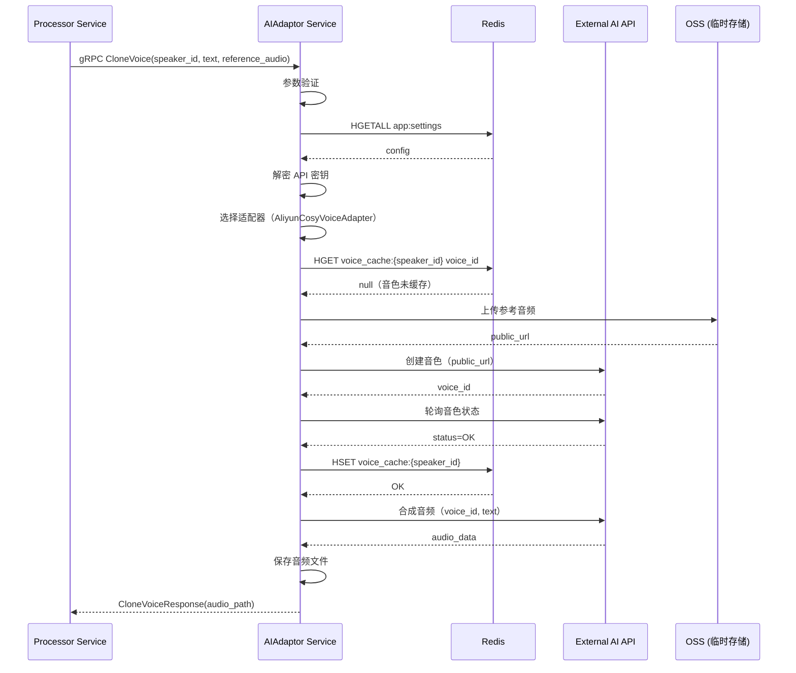
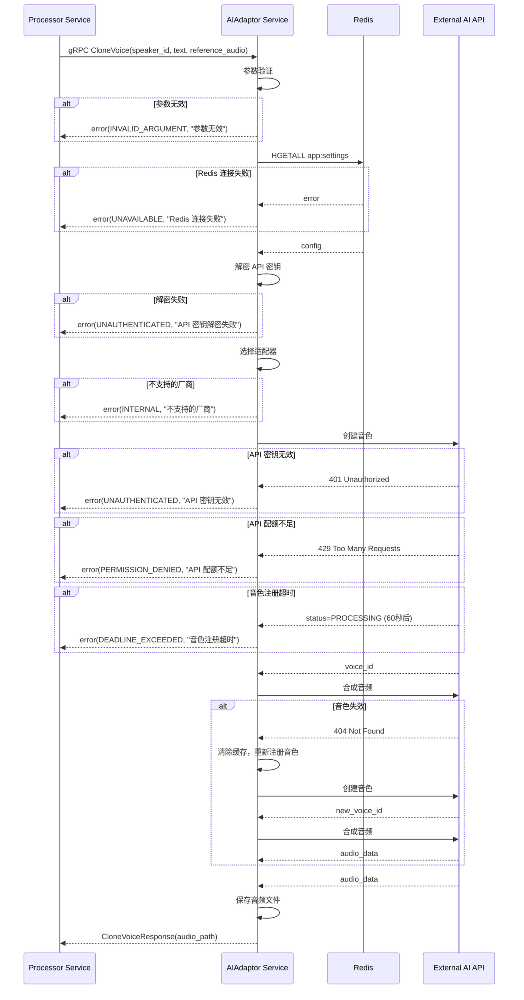
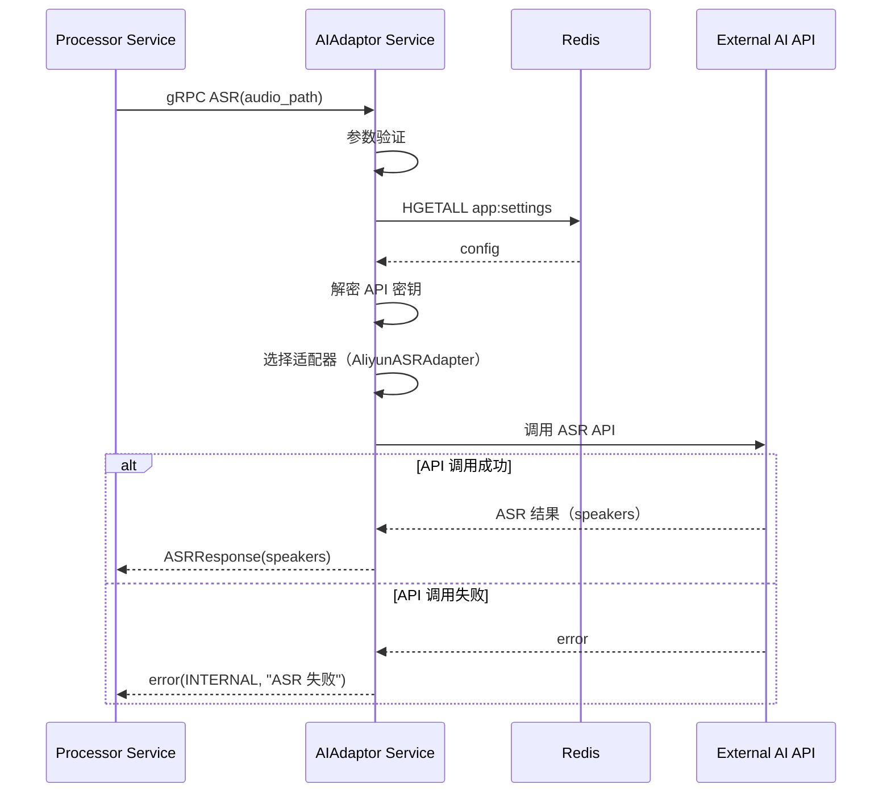
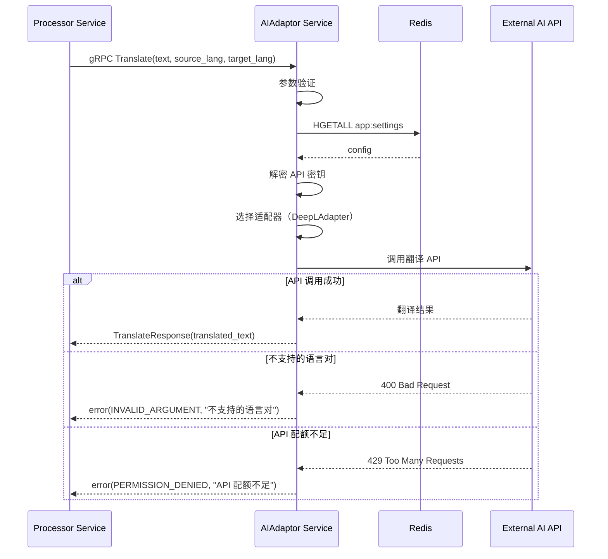

# AIAdaptor 服务设计文档（第二层）

**文档版本**: 1.5
**关联宏观架构**: `notes/Base-Design.md` v2.1
**最后更新**: 2025-11-02
**服务定位**: Go gRPC 微服务，负责 AI 服务统一接口和适配器管理

## 版本历史

- **v1.5 (2025-11-02)**:
  - **接口契约更新**：修正 video_type 枚举值为详细格式（professional_tech, casual_natural, educational_rigorous, default）
  - **职责澄清**：确认 ASR 接口不返回 audio_segment_path（音频片段切分由 Processor 负责）
  - **关联架构更新**：同步 Base-Design.md v2.1 的职责划分变更
  - **目的**：与 Base-Design.md v2.1 保持一致，符合单一职责原则
- **v1.4 (2025-11-02)**:
  - **严重问题修复**：全面修复违反 design-rules.md 规范的伪代码问题
  - 修复第 4.2 节：移除适配器实现伪代码，改为支持的适配器清单（表格形式）
  - 修复第 4.3 节：将适配器初始化伪代码改为关键逻辑步骤
  - 新增第 4.4 节：适配器选择逻辑（关键逻辑步骤）
  - 修复第 5 章：将所有服务逻辑从伪代码改为关键逻辑步骤（5.1-5.5 节）
  - 修复第 9.2 节：将音色注册流程从伪代码改为关键逻辑步骤
  - 修复第 9.3.2-9.3.3 节：将缓存失效处理和自动恢复流程从伪代码改为关键逻辑步骤
  - 修复第 3.2 节：将 Go 代码结构定义改为表格形式
  - 修复第 4.1 节：将适配器接口伪代码改为表格形式的接口规范
  - 符合 design-rules.md 第 122-162 行的"关键逻辑步骤"规范
  - 更新文档变更历史
- **v1.3 (2025-11-01)**:
  - **重大更新**：全面完善第二层文档质量，符合 design-rules.md 规范
  - 补充第5章"关键逻辑步骤"：增加详细的错误处理、数据验证、配置解密等步骤
  - 补充第4章"适配器模式设计"：增加 ASR、翻译、LLM 适配器实现示例
  - 补充第9章"音色管理策略"：增加缓存失效处理、重试策略、降级策略
  - 完善第7章"错误码清单"：增加业务特定错误码和触发场景
  - 完善第8章"配置项定义"：增加类型、默认值、是否必填说明
  - 完善第6章"服务交互时序图"：增加错误处理分支
  - 完善第4.1节"适配器接口定义"：增加参数说明、返回值说明、错误处理说明
  - 更新文档变更历史
- **v1.2 (2025-10-31)**:
  - **补充第3章"核心数据结构"**：符合 design-rules.md 第二层文档模板要求
  - 新增 3.1 节"Redis 数据结构"（app:settings、voice_cache）
  - 新增 3.2 节"内存数据结构"（适配器注册表、音色缓存管理器）
  - 调整后续章节编号（原第3章→第4章，以此类推）
  - 更新文档变更历史
- **v1.1 (2025-10-30)**:
  - 更新关联宏观架构版本为 v2.0（Base-Design.md 已完成冗余清理）
  - 新增版本历史章节
  - 更新"与第一层文档的对应关系"章节，引用 v2.0
  - 新增"文档变更历史"章节
- **v1.0 (2025-10-30)**: 初始版本

---

## 1. 服务定位与核心职责

### 1.1 服务定位

`AIAdaptor` 是整个系统的**AI 服务适配器层**，负责封装所有外部 AI API 调用，通过适配器模式实现业务逻辑与厂商解耦。

### 1.2 核心职责

* **统一接口**: 为 Processor 提供统一的 AI 服务接口（ASR、翻译、LLM、声音克隆）
* **适配器管理**: 封装厂商特定逻辑，支持多厂商切换
* **音色管理**: 管理声音克隆的音色注册、缓存、轮询（针对阿里云 CosyVoice）
* **配置读取**: 从 Redis 读取用户配置的 API 密钥和厂商选择
* **错误处理**: 统一错误处理和降级策略

### 1.3 服务边界

**负责**:
- 提供统一的 AI 服务 gRPC 接口
- 封装厂商特定的 API 调用逻辑
- 管理音色注册、缓存、轮询
- 从 Redis 读取和解密 API 密钥

**不负责**:
- AI 流程编排（由 Processor 负责）
- 任务状态管理（由 Processor 负责）
- 音频分离（由 AudioSeparator 负责）

---

## 2. gRPC 接口定义

### 2.1 Proto 文件定义

```protobuf
syntax = "proto3";

package aiadaptor;

option go_package = "./aiadaptor";

// AIAdaptor 服务定义
service AIAdaptor {
  // ASR（语音识别 + 说话人日志）
  rpc ASR(ASRRequest) returns (ASRResponse);
  
  // 文本润色
  rpc Polish(PolishRequest) returns (PolishResponse);
  
  // 翻译
  rpc Translate(TranslateRequest) returns (TranslateResponse);
  
  // 译文优化
  rpc Optimize(OptimizeRequest) returns (OptimizeResponse);
  
  // 声音克隆
  rpc CloneVoice(CloneVoiceRequest) returns (CloneVoiceResponse);
}

// ASR 请求
message ASRRequest {
  string audio_path = 1;  // 音频文件路径
}

// ASR 响应
message ASRResponse {
  repeated Speaker speakers = 1;  // 说话人列表
}

message Speaker {
  string speaker_id = 1;           // 说话人 ID
  repeated Sentence sentences = 2; // 句子列表
}

message Sentence {
  string text = 1;       // 文本内容
  double start_time = 2; // 开始时间（秒）
  double end_time = 3;   // 结束时间（秒）
}

// 文本润色请求
message PolishRequest {
  string text = 1;        // 原始文本
  string video_type = 2;  // 视频类型（professional_tech, casual_natural, educational_rigorous, default）
  string custom_prompt = 3; // 用户自定义 Prompt（可选）
}

// 文本润色响应
message PolishResponse {
  string polished_text = 1; // 润色后的文本
}

// 翻译请求
message TranslateRequest {
  string text = 1;        // 原始文本
  string source_lang = 2; // 源语言（默认 en）
  string target_lang = 3; // 目标语言（默认 zh）
  string video_type = 4;  // 视频类型（professional_tech, casual_natural, educational_rigorous, default）
}

// 翻译响应
message TranslateResponse {
  string translated_text = 1; // 翻译后的文本
}

// 译文优化请求
message OptimizeRequest {
  string text = 1; // 翻译后的文本
}

// 译文优化响应
message OptimizeResponse {
  string optimized_text = 1; // 优化后的文本
}

// 声音克隆请求
message CloneVoiceRequest {
  string speaker_id = 1;       // 说话人 ID（用于缓存）
  string text = 2;             // 要合成的文本
  string reference_audio = 3;  // 参考音频路径
}

// 声音克隆响应
message CloneVoiceResponse {
  string audio_path = 1; // 合成的音频路径
}
```

---

## 3. 核心数据结构

### 3.1 Redis 数据结构

#### 3.1.1 应用配置（Hash）

**Key**: `app:settings`

**用途**: 存储应用配置，AIAdaptor 服务从此读取 API 密钥和厂商选择

**访问模式**: 只读（由 Gateway 服务写入和更新）

**关键字段**（AIAdaptor 服务关注的字段）:

| 字段名                                | 类型   | 说明                                       |
| ------------------------------------- | ------ | ------------------------------------------ |
| `asr_provider`                        | string | ASR 服务商标识（如 `aliyun`、`azure`）     |
| `asr_api_key`                         | string | 加密存储的 API Key（需解密后使用）         |
| `asr_endpoint`                        | string | 自定义端点 URL（可选）                     |
| `polishing_enabled`                   | string | 是否启用文本润色（`"true"` 或 `"false"`）  |
| `polishing_provider`                  | string | 文本润色服务商标识（如 `openai-gpt4o`）    |
| `polishing_api_key`                   | string | 加密存储的 API Key                         |
| `polishing_custom_prompt`             | string | 用户自定义的润色 Prompt（可选）            |
| `polishing_video_type`                | string | 翻译预设类型（可选）                       |
| `translation_provider`                | string | 翻译服务商标识（如 `deepl`、`google`）     |
| `translation_api_key`                 | string | 加密存储的 API Key                         |
| `translation_endpoint`                | string | 自定义端点 URL（可选）                     |
| `translation_video_type`              | string | 翻译预设类型（可选）                       |
| `optimization_enabled`                | string | 是否启用译文优化（`"true"` 或 `"false"`）  |
| `optimization_provider`               | string | 译文优化服务商标识                         |
| `optimization_api_key`                | string | 加密存储的 API Key                         |
| `voice_cloning_provider`              | string | 声音克隆服务商标识（如 `aliyun_cosyvoice`）|
| `voice_cloning_api_key`               | string | 加密存储的 API Key                         |
| `voice_cloning_endpoint`              | string | 自定义端点 URL（可选）                     |
| `voice_cloning_auto_select_reference` | string | 是否自动选择参考音频（`"true"` 或 `"false"`）|

**注意事项**:
- 所有 API Key 字段使用 AES-256-GCM 加密存储，AIAdaptor 服务需解密后使用
- 布尔值字段存储为字符串 `"true"` 或 `"false"`
- 空值字段存储为空字符串 `""`
- 加密密钥通过环境变量 `API_KEY_ENCRYPTION_SECRET` 传入

#### 3.1.2 音色缓存（Hash，针对阿里云 CosyVoice）

**Key**: `voice_cache:{speaker_id}`

**用途**: 缓存已注册的音色信息，避免重复注册

**数据类型**: Redis Hash

**字段定义**:

| 字段名             | 类型   | 示例值                                      | 说明                     |
| ------------------ | ------ | ------------------------------------------- | ------------------------ |
| `voice_id`         | string | `"cosyvoice_voice_12345"`                   | 阿里云返回的音色 ID      |
| `created_at`       | string | `"2025-10-30T10:30:00Z"`                    | 创建时间（ISO 8601 格式）|
| `reference_audio`  | string | `"{LOCAL_STORAGE_PATH}/task_123/segments/speaker_1_segment_0.wav"` | 参考音频路径             |

**生命周期**:
- 创建时机：首次为某个 speaker_id 克隆声音时
- 过期策略：不设置 TTL，由 GC 定时任务清理（与任务目录一起删除）
- 访问模式：读写（AIAdaptor 服务）

**示例**:
```
HGETALL voice_cache:speaker_1
1) "voice_id"
2) "cosyvoice_voice_12345"
3) "created_at"
4) "2025-10-30T10:30:00Z"
5) "reference_audio"
6) "{LOCAL_STORAGE_PATH}/task_123/segments/speaker_1_segment_0.wav"
```

### 3.2 内存数据结构

#### 3.2.1 适配器注册表（AdapterRegistry）

**用途**: 管理所有已注册的适配器实例

**字段定义**:

| 字段名 | 类型 | 说明 |
|--------|------|------|
| asrAdapters | Map<string, ASRAdapter> | ASR 适配器映射表，key 为厂商名称（如 "aliyun", "azure"） |
| translationAdapters | Map<string, TranslationAdapter> | 翻译适配器映射表，key 为厂商名称（如 "deepl", "google"） |
| llmAdapters | Map<string, LLMAdapter> | LLM 适配器映射表，key 为厂商名称（如 "openai-gpt4o", "claude"） |
| voiceCloningAdapters | Map<string, VoiceCloningAdapter> | 声音克隆适配器映射表，key 为厂商名称（如 "aliyun_cosyvoice"） |

**初始化时机**: AIAdaptor 服务启动时

**访问模式**: 只读（启动后不再修改）

#### 3.2.2 音色缓存管理器（VoiceManager）

**用途**: 在内存中缓存 Redis 中的音色信息，减少 Redis 访问

**字段定义**:

| 字段名 | 类型 | 说明 |
|--------|------|------|
| cache | Map<string, VoiceInfo> | 音色信息缓存，key 为 speaker_id |
| mu | 读写锁 | 并发安全保护 |

**VoiceInfo 结构**:

| 字段名 | 类型 | 说明 |
|--------|------|------|
| VoiceID | string | 阿里云返回的音色 ID |
| CreatedAt | timestamp | 创建时间 |
| ReferenceAudio | string | 参考音频路径 |

**缓存策略**:
- 首次访问时从 Redis 加载
- 写入时同时更新 Redis 和内存
- 不设置过期时间（由 GC 定时任务清理）

**并发安全**: 使用读写锁保护

---

## 4. 适配器模式设计

### 4.1 适配器接口定义

> ⚠️ **注意**：本节定义适配器接口的**输入输出规范**，不包含具体实现代码。具体实现见第三层文档 `AIAdaptor-design-detail.md`。

#### 4.1.1 ASR 适配器接口

**接口名称**: `ASRAdapter.ASR`

**输入参数**:

| 参数名 | 类型 | 是否必填 | 说明 |
|--------|------|----------|------|
| audio_path | string | 是 | 音频文件的本地路径 |
| api_key | string | 是 | 解密后的 API 密钥 |
| endpoint | string | 否 | 自定义端点 URL（为空则使用默认端点） |

**返回值**:

| 字段名 | 类型 | 说明 |
|--------|------|------|
| speakers | List<Speaker> | 说话人列表，包含句子级时间戳和文本 |

**错误码**:

| 错误码 | 说明 |
|--------|------|
| 401 | API 密钥无效 |
| 429 | API 配额不足 |
| 5xx | 外部 API 服务错误 |

#### 4.1.2 翻译适配器接口

**接口名称**: `TranslationAdapter.Translate`

**输入参数**:

| 参数名 | 类型 | 是否必填 | 说明 |
|--------|------|----------|------|
| text | string | 是 | 待翻译的文本 |
| source_lang | string | 是 | 源语言代码（如 `en`） |
| target_lang | string | 是 | 目标语言代码（如 `zh`） |
| video_type | string | 否 | 视频类型（tech, casual, education, default） |
| api_key | string | 是 | 解密后的 API 密钥 |
| endpoint | string | 否 | 自定义端点 URL（为空则使用默认端点） |

**返回值**:

| 字段名 | 类型 | 说明 |
|--------|------|------|
| translated_text | string | 翻译后的文本 |

**错误码**:

| 错误码 | 说明 |
|--------|------|
| 401 | API 密钥无效 |
| 429 | API 配额不足 |
| 400 | 不支持的语言对 |
| 5xx | 外部 API 服务错误 |

#### 4.1.3 LLM 适配器接口

**接口名称**: `LLMAdapter.Polish` 和 `LLMAdapter.Optimize`

**Polish 输入参数**:

| 参数名 | 类型 | 是否必填 | 说明 |
|--------|------|----------|------|
| text | string | 是 | 待处理的文本 |
| video_type | string | 否 | 视频类型（tech, casual, education, default） |
| custom_prompt | string | 否 | 用户自定义 Prompt |
| api_key | string | 是 | 解密后的 API 密钥 |
| endpoint | string | 否 | 自定义端点 URL（为空则使用默认端点） |

**Optimize 输入参数**:

| 参数名 | 类型 | 是否必填 | 说明 |
|--------|------|----------|------|
| text | string | 是 | 待优化的文本 |
| api_key | string | 是 | 解密后的 API 密钥 |
| endpoint | string | 否 | 自定义端点 URL（为空则使用默认端点） |

**返回值**:

| 字段名 | 类型 | 说明 |
|--------|------|------|
| processed_text | string | 处理后的文本 |

**错误码**:

| 错误码 | 说明 |
|--------|------|
| 401 | API 密钥无效 |
| 429 | API 配额不足 |
| 400 | Prompt 格式错误 |
| 5xx | 外部 API 服务错误 |

#### 4.1.4 声音克隆适配器接口

**接口名称**: `VoiceCloningAdapter.CloneVoice`

**输入参数**:

| 参数名 | 类型 | 是否必填 | 说明 |
|--------|------|----------|------|
| speaker_id | string | 是 | 说话人 ID（用于缓存） |
| text | string | 是 | 要合成的文本 |
| reference_audio | string | 是 | 参考音频路径 |
| api_key | string | 是 | 解密后的 API 密钥 |
| endpoint | string | 否 | 自定义端点 URL（为空则使用默认端点） |

**返回值**:

| 字段名 | 类型 | 说明 |
|--------|------|------|
| audio_path | string | 合成的音频路径 |

**错误码**:

| 错误码 | 说明 |
|--------|------|
| 401 | API 密钥无效 |
| 429 | API 配额不足 |
| 404 | 音色不存在 |
| 408 | 音色注册超时 |
| 5xx | 外部 API 服务错误 |

### 4.2 支持的适配器清单

> ⚠️ **注意**：具体适配器实现见第三层文档 `AIAdaptor-design-detail.md`。本节仅列出支持的适配器类型。

#### 4.2.1 ASR 适配器

| 厂商标识 | 厂商名称 | 说明 |
|---------|---------|------|
| `aliyun` | 阿里云 | 支持说话人日志（Speaker Diarization） |
| `azure` | 微软 Azure | 支持说话人日志 |
| `google` | Google Cloud | 支持说话人日志 |

#### 4.2.2 翻译适配器

| 厂商标识 | 厂商名称 | 说明 |
|---------|---------|------|
| `deepl` | DeepL | 支持 formality 参数（正式/非正式） |
| `google` | Google Translate | 通用翻译服务 |
| `azure` | 微软 Azure | 支持自定义术语表 |

#### 4.2.3 LLM 适配器

| 厂商标识 | 厂商名称 | 说明 |
|---------|---------|------|
| `openai-gpt4o` | OpenAI GPT-4o | 支持自定义 Prompt |
| `claude` | Anthropic Claude | 支持自定义 Prompt |
| `gemini` | Google Gemini | 支持自定义 Prompt |

#### 4.2.4 声音克隆适配器

| 厂商标识 | 厂商名称 | 说明 |
|---------|---------|------|
| `aliyun_cosyvoice` | 阿里云 CosyVoice | 零样本声音克隆，需要音色注册和轮询 |

### 4.3 适配器初始化流程

**步骤 1: 创建适配器注册表**
- 在 AIAdaptor 服务启动时创建 `AdapterRegistry` 实例
- 初始化四个适配器映射表：asrAdapters, translationAdapters, llmAdapters, voiceCloningAdapters

**步骤 2: 注册 ASR 适配器**
- 注册 `aliyun` → AliyunASRAdapter 实例
- 注册 `azure` → AzureASRAdapter 实例
- 注册 `google` → GoogleASRAdapter 实例

**步骤 3: 注册翻译适配器**
- 注册 `deepl` → DeepLAdapter 实例
- 注册 `google` → GoogleTranslateAdapter 实例
- 注册 `azure` → AzureTranslateAdapter 实例

**步骤 4: 注册 LLM 适配器**
- 注册 `openai-gpt4o` → OpenAIAdapter 实例
- 注册 `claude` → ClaudeAdapter 实例
- 注册 `gemini` → GeminiAdapter 实例

**步骤 5: 注册声音克隆适配器**
- 注册 `aliyun_cosyvoice` → AliyunCosyVoiceAdapter 实例
- 初始化音色缓存管理器（VoiceManager）

**步骤 6: 返回注册表**
- 返回完整的 AdapterRegistry 实例
- 后续通过 `GetAdapter(provider_type, provider_name)` 方法获取适配器

### 4.4 适配器选择逻辑

**步骤 1: 从 Redis 读取厂商配置**
- 根据服务类型（ASR、翻译、LLM、声音克隆）读取对应的 `{service}_provider` 字段
- 例如：ASR 服务读取 `asr_provider` 字段

**步骤 2: 验证厂商标识**
- 检查厂商标识是否为空，为空则返回 `INTERNAL` 错误
- 检查厂商标识是否在支持的适配器清单中

**步骤 3: 获取适配器实例**
- 从 AdapterRegistry 中根据 `provider_type` 和 `provider_name` 获取适配器实例
- 如果适配器不存在，返回 `INTERNAL` 错误（不支持的厂商）

**步骤 4: 调用适配器方法**
- 调用适配器的对应方法（ASR、Translate、Polish、CloneVoice 等）
- 传入解密后的 API 密钥和其他参数

---

## 5. 关键逻辑步骤

> ⚠️ **注意**：根据 `design-rules.md` 第 122-162 行的规范，本章使用"关键逻辑步骤"而非伪代码。每个步骤是明确的业务动作，包含关键判断条件和数据流向。

### 5.1 ASR 服务逻辑

**步骤 1: 参数验证**
- 验证 `audio_path` 是否为空，为空则返回 `INVALID_ARGUMENT` 错误
- 验证音频文件是否存在，不存在则返回 `INVALID_ARGUMENT` 错误

**步骤 2: 从 Redis 读取配置**
- 调用 `redis.HGETALL("app:settings")` 读取应用配置
- 如果 Redis 连接失败，返回 `UNAVAILABLE` 错误
- 如果配置为空，返回 `INTERNAL` 错误（配置未初始化）
- 提取以下字段：
  - `asr_provider`：ASR 服务商标识
  - `asr_api_key`：加密的 API 密钥
  - `asr_endpoint`：自定义端点 URL（可选）
- 验证 `asr_provider` 和 `asr_api_key` 是否为空，为空则返回 `INTERNAL` 错误

**步骤 3: 解密 API 密钥**
- 使用 AES-256-GCM 算法解密 `asr_api_key`
- 解密密钥从环境变量 `API_KEY_ENCRYPTION_SECRET` 读取
- 如果解密失败，返回 `UNAUTHENTICATED` 错误

**步骤 4: 选择适配器**
- 从 AdapterRegistry 中根据 `asr_provider` 获取对应的 ASR 适配器实例
- 如果适配器不存在（不支持的厂商），返回 `INTERNAL` 错误

**步骤 5: 调用适配器**
- 调用适配器的 `ASR(audio_path, api_key, endpoint)` 方法
- 错误处理：
  - 如果返回 401/403（API 密钥无效），返回 `UNAUTHENTICATED` 错误
  - 如果返回 429（API 配额不足），返回 `PERMISSION_DENIED` 错误
  - 如果返回 5xx（外部 API 服务错误），返回 `INTERNAL` 错误
  - 如果超时，返回 `DEADLINE_EXCEEDED` 错误
  - 其他错误，返回 `INTERNAL` 错误

**步骤 6: 验证结果**
- 检查返回结果是否为空或 speakers 列表为空
- 如果为空，返回 `INTERNAL` 错误（ASR 返回空结果）

**步骤 7: 返回结果**
- 返回 `ASRResponse`，包含 speakers 列表

### 5.2 文本润色服务逻辑

**步骤 1: 参数验证**
- 验证 `text` 是否为空，为空则返回 `INVALID_ARGUMENT` 错误

**步骤 2: 从 Redis 读取配置**
- 调用 `redis.HGETALL("app:settings")` 读取应用配置
- 如果 Redis 连接失败，返回 `UNAVAILABLE` 错误

**步骤 3: 检查是否启用文本润色**
- 读取 `polishing_enabled` 字段
- 如果值不是 `"true"`，直接返回原文（降级策略）
- 提取以下字段：
  - `polishing_provider`：LLM 服务商标识
  - `polishing_api_key`：加密的 API 密钥
  - `polishing_endpoint`：自定义端点 URL（可选）
  - `polishing_video_type`：默认视频类型（可选）
  - `polishing_custom_prompt`：默认自定义 Prompt（可选）
- 验证 `polishing_provider` 和 `polishing_api_key` 是否为空，为空则返回 `INTERNAL` 错误

**步骤 4: 解密 API 密钥**
- 使用 AES-256-GCM 算法解密 `polishing_api_key`
- 如果解密失败，返回 `UNAUTHENTICATED` 错误

**步骤 5: 选择适配器**
- 从 AdapterRegistry 中根据 `polishing_provider` 获取对应的 LLM 适配器实例
- 如果适配器不存在，返回 `INTERNAL` 错误

**步骤 6: 准备参数**
- 确定 `video_type`：优先使用请求中的值，其次使用配置中的默认值，最后使用 `"default"`
- 确定 `custom_prompt`：优先使用请求中的值，其次使用配置中的默认值

**步骤 7: 调用适配器**
- 调用适配器的 `Polish(text, video_type, custom_prompt, api_key, endpoint)` 方法
- 错误处理：
  - 如果返回 401/403，返回 `UNAUTHENTICATED` 错误
  - 如果返回 429，返回 `PERMISSION_DENIED` 错误
  - 如果返回 400（Prompt 格式错误），返回 `INVALID_ARGUMENT` 错误
  - 如果超时，返回 `DEADLINE_EXCEEDED` 错误
  - 其他错误，返回 `INTERNAL` 错误

**步骤 8: 验证结果**
- 检查返回结果是否为空
- 如果为空，使用降级策略：返回原文，记录警告日志

**步骤 9: 返回结果**
- 返回 `PolishResponse`，包含润色后的文本（或原文）

### 5.3 翻译服务逻辑

**步骤 1: 参数验证**
- 验证 `text` 是否为空，为空则返回 `INVALID_ARGUMENT` 错误

**步骤 2: 从 Redis 读取配置**
- 调用 `redis.HGETALL("app:settings")` 读取应用配置
- 如果 Redis 连接失败，返回 `UNAVAILABLE` 错误
- 提取以下字段：
  - `translation_provider`：翻译服务商标识
  - `translation_api_key`：加密的 API 密钥
  - `translation_endpoint`：自定义端点 URL（可选）
  - `translation_video_type`：默认视频类型（可选）
- 验证 `translation_provider` 和 `translation_api_key` 是否为空，为空则返回 `INTERNAL` 错误

**步骤 3: 解密 API 密钥**
- 使用 AES-256-GCM 算法解密 `translation_api_key`
- 如果解密失败，返回 `UNAUTHENTICATED` 错误

**步骤 4: 选择适配器**
- 从 AdapterRegistry 中根据 `translation_provider` 获取对应的翻译适配器实例
- 如果适配器不存在，返回 `INTERNAL` 错误

**步骤 5: 准备参数**
- 确定 `source_lang`：优先使用请求中的值，默认为 `"en"`
- 确定 `target_lang`：优先使用请求中的值，默认为 `"zh"`
- 确定 `video_type`：优先使用请求中的值，其次使用配置中的默认值，最后使用 `"default"`

**步骤 6: 调用适配器**
- 调用适配器的 `Translate(text, source_lang, target_lang, video_type, api_key, endpoint)` 方法
- 错误处理：
  - 如果返回 401/403，返回 `UNAUTHENTICATED` 错误
  - 如果返回 429，返回 `PERMISSION_DENIED` 错误
  - 如果返回 400（不支持的语言对），返回 `INVALID_ARGUMENT` 错误
  - 如果超时，返回 `DEADLINE_EXCEEDED` 错误
  - 其他错误，返回 `INTERNAL` 错误

**步骤 7: 验证结果**
- 检查返回结果是否为空
- 如果为空，返回 `INTERNAL` 错误（翻译返回空结果）

**步骤 8: 返回结果**
- 返回 `TranslateResponse`，包含翻译后的文本

### 5.4 译文优化服务逻辑

**步骤 1: 参数验证**
- 验证 `text` 是否为空，为空则返回 `INVALID_ARGUMENT` 错误

**步骤 2: 从 Redis 读取配置**
- 调用 `redis.HGETALL("app:settings")` 读取应用配置
- 如果 Redis 连接失败，返回 `UNAVAILABLE` 错误

**步骤 3: 检查是否启用译文优化**
- 读取 `optimization_enabled` 字段
- 如果值不是 `"true"`，直接返回原文（降级策略）
- 提取以下字段：
  - `optimization_provider`：LLM 服务商标识
  - `optimization_api_key`：加密的 API 密钥
  - `optimization_endpoint`：自定义端点 URL（可选）
- 验证 `optimization_provider` 和 `optimization_api_key` 是否为空，为空则返回 `INTERNAL` 错误

**步骤 4: 解密 API 密钥**
- 使用 AES-256-GCM 算法解密 `optimization_api_key`
- 如果解密失败，返回 `UNAUTHENTICATED` 错误

**步骤 5: 选择适配器**
- 从 AdapterRegistry 中根据 `optimization_provider` 获取对应的 LLM 适配器实例
- 如果适配器不存在，返回 `INTERNAL` 错误

**步骤 6: 调用适配器**
- 调用适配器的 `Optimize(text, api_key, endpoint)` 方法
- 错误处理：
  - 如果返回 401/403，返回 `UNAUTHENTICATED` 错误
  - 如果返回 429，返回 `PERMISSION_DENIED` 错误
  - 如果超时，返回 `DEADLINE_EXCEEDED` 错误
  - 其他错误，返回 `INTERNAL` 错误

**步骤 7: 验证结果**
- 检查返回结果是否为空
- 如果为空，使用降级策略：返回原文，记录警告日志

**步骤 8: 返回结果**
- 返回 `OptimizeResponse`，包含优化后的文本（或原文）

### 5.5 声音克隆服务逻辑

**步骤 1: 参数验证**
- 验证 `speaker_id` 是否为空，为空则返回 `INVALID_ARGUMENT` 错误
- 验证 `text` 是否为空，为空则返回 `INVALID_ARGUMENT` 错误
- 验证 `reference_audio` 是否为空，为空则返回 `INVALID_ARGUMENT` 错误
- 验证参考音频文件是否存在，不存在则返回 `INVALID_ARGUMENT` 错误

**步骤 2: 从 Redis 读取配置**
- 调用 `redis.HGETALL("app:settings")` 读取应用配置
- 如果 Redis 连接失败，返回 `UNAVAILABLE` 错误
- 提取以下字段：
  - `voice_cloning_provider`：声音克隆服务商标识
  - `voice_cloning_api_key`：加密的 API 密钥
  - `voice_cloning_endpoint`：自定义端点 URL（可选）
- 验证 `voice_cloning_provider` 和 `voice_cloning_api_key` 是否为空，为空则返回 `INTERNAL` 错误

**步骤 3: 解密 API 密钥**
- 使用 AES-256-GCM 算法解密 `voice_cloning_api_key`
- 如果解密失败，返回 `UNAUTHENTICATED` 错误

**步骤 4: 选择适配器**
- 从 AdapterRegistry 中根据 `voice_cloning_provider` 获取对应的声音克隆适配器实例
- 如果适配器不存在，返回 `INTERNAL` 错误

**步骤 5: 调用适配器**
- 调用适配器的 `CloneVoice(speaker_id, text, reference_audio, api_key, endpoint)` 方法
- **注意**：音色管理逻辑（缓存检查、音色注册、轮询）在适配器内部实现，对 AIAdaptor 服务透明
- 错误处理：
  - 如果返回 401/403，返回 `UNAUTHENTICATED` 错误
  - 如果返回 429，返回 `PERMISSION_DENIED` 错误
  - 如果返回 404（音色不存在），返回 `NOT_FOUND` 错误
  - 如果返回 408（音色注册超时），返回 `DEADLINE_EXCEEDED` 错误
  - 如果超时，返回 `DEADLINE_EXCEEDED` 错误
  - 其他错误，返回 `INTERNAL` 错误

**步骤 6: 验证结果**
- 检查返回的音频路径是否为空
- 检查音频文件是否存在
- 如果验证失败，返回 `INTERNAL` 错误（声音克隆返回无效音频路径）

**步骤 7: 返回结果**
- 返回 `CloneVoiceResponse`，包含合成的音频路径

---

## 6. 服务交互时序图

### 6.1 声音克隆服务时序图（成功路径）



### 6.2 声音克隆服务时序图（错误处理分支）



### 6.3 ASR 服务时序图



### 6.4 翻译服务时序图



---

## 7. 错误码清单

### 7.1 通用错误码

| 错误码 | gRPC 状态码 | 说明 | 触发场景 | 处理建议 |
|--------|-------------|------|----------|----------|
| `INVALID_ARGUMENT` | `INVALID_ARGUMENT` | 参数无效 | 1. audio_path/text/speaker_id 为空<br>2. 文件不存在<br>3. 不支持的语言对 | 检查输入参数，确保必填字段不为空 |
| `UNAUTHENTICATED` | `UNAUTHENTICATED` | API 密钥无效 | 1. API 密钥解密失败<br>2. 外部 API 返回 401/403 | 检查 Redis 中的 API 密钥配置，确保加密密钥正确 |
| `PERMISSION_DENIED` | `PERMISSION_DENIED` | API 配额不足 | 外部 API 返回 429 | 检查外部 API 账户余额和配额限制 |
| `INTERNAL` | `INTERNAL` | 内部错误 | 1. Redis 配置缺失<br>2. 不支持的厂商<br>3. 外部 API 返回 5xx<br>4. 结果验证失败 | 检查 Redis 配置、网络连接和外部 API 状态 |
| `DEADLINE_EXCEEDED` | `DEADLINE_EXCEEDED` | 请求超时 | 1. 外部 API 调用超时<br>2. 音色注册超时（超过 60 秒） | 增加超时时间或重试，检查网络状况 |
| `UNAVAILABLE` | `UNAVAILABLE` | 服务不可用 | Redis 连接失败 | 检查 Redis 连接配置和网络 |
| `NOT_FOUND` | `NOT_FOUND` | 资源不存在 | 阿里云音色 ID 失效（外部 API 返回 404） | 清除缓存，重新注册音色 |
| `FAILED_PRECONDITION` | `FAILED_PRECONDITION` | 前置条件未满足 | 音色注册状态不是 OK | 等待音色注册完成或重新注册 |

### 7.2 业务特定错误码详细说明

#### 7.2.1 ASR 服务错误码

| 场景 | 错误码 | 错误消息示例 | 处理建议 |
|------|--------|--------------|----------|
| 音频文件不存在 | `INVALID_ARGUMENT` | `audio file not found: /path/to/file.mp3` | 检查文件路径是否正确 |
| ASR 配置缺失 | `INTERNAL` | `asr_provider not configured` | 在 Redis 中配置 asr_provider |
| API 密钥解密失败 | `UNAUTHENTICATED` | `failed to decrypt API key: invalid key` | 检查 API_KEY_ENCRYPTION_SECRET 环境变量 |
| 不支持的 ASR 厂商 | `INTERNAL` | `unsupported ASR provider: unknown_provider` | 检查 asr_provider 配置，支持的值：aliyun, azure, google |
| ASR 返回空结果 | `INTERNAL` | `ASR returned empty result` | 检查音频文件是否包含有效语音 |

#### 7.2.2 翻译服务错误码

| 场景 | 错误码 | 错误消息示例 | 处理建议 |
|------|--------|--------------|----------|
| 文本为空 | `INVALID_ARGUMENT` | `text is required` | 检查输入文本 |
| 翻译配置缺失 | `INTERNAL` | `translation provider or API key not configured` | 在 Redis 中配置 translation_provider 和 translation_api_key |
| 不支持的语言对 | `INVALID_ARGUMENT` | `unsupported language pair: en -> xx` | 检查源语言和目标语言代码是否正确 |
| 翻译返回空结果 | `INTERNAL` | `translation returned empty result` | 检查外部 API 状态 |

#### 7.2.3 文本润色服务错误码

| 场景 | 错误码 | 错误消息示例 | 处理建议 |
|------|--------|--------------|----------|
| 文本为空 | `INVALID_ARGUMENT` | `text is required` | 检查输入文本 |
| 润色配置缺失 | `INTERNAL` | `polishing provider or API key not configured` | 在 Redis 中配置 polishing_provider 和 polishing_api_key |
| Prompt 格式错误 | `INVALID_ARGUMENT` | `invalid prompt: ...` | 检查 custom_prompt 格式 |
| 润色返回空结果 | 无错误（降级） | 日志：`polishing returned empty result, using original text` | 返回原文，记录警告日志 |

#### 7.2.4 译文优化服务错误码

| 场景 | 错误码 | 错误消息示例 | 处理建议 |
|------|--------|--------------|----------|
| 文本为空 | `INVALID_ARGUMENT` | `text is required` | 检查输入文本 |
| 优化配置缺失 | `INTERNAL` | `optimization provider or API key not configured` | 在 Redis 中配置 optimization_provider 和 optimization_api_key |
| 优化返回空结果 | 无错误（降级） | 日志：`optimization returned empty result, using original text` | 返回原文，记录警告日志 |

#### 7.2.5 声音克隆服务错误码

| 场景 | 错误码 | 错误消息示例 | 处理建议 |
|------|--------|--------------|----------|
| speaker_id 为空 | `INVALID_ARGUMENT` | `speaker_id is required` | 检查输入参数 |
| 参考音频不存在 | `INVALID_ARGUMENT` | `reference audio file not found: /path/to/file.wav` | 检查文件路径是否正确 |
| 声音克隆配置缺失 | `INTERNAL` | `voice cloning provider or API key not configured` | 在 Redis 中配置 voice_cloning_provider 和 voice_cloning_api_key |
| 音色注册超时 | `DEADLINE_EXCEEDED` | `voice registration timeout` | 增加 VOICE_REGISTER_TIMEOUT 配置或重试 |
| 音色不存在 | `NOT_FOUND` | `voice not found: voice_id_xxx` | 清除缓存，重新注册音色 |
| 音频路径无效 | `INTERNAL` | `voice cloning returned invalid audio path` | 检查外部 API 返回结果 |

### 7.3 错误处理策略

#### 7.3.1 重试策略

| 错误类型 | 是否重试 | 重试次数 | 重试间隔 | 说明 |
|---------|---------|---------|---------|------|
| `UNAVAILABLE` (Redis) | 是 | 3 | 1 秒 | Redis 连接失败，短暂重试 |
| `DEADLINE_EXCEEDED` (API) | 是 | 2 | 2 秒 | 外部 API 超时，适度重试 |
| `INTERNAL` (5xx) | 是 | 2 | 2 秒 | 外部 API 服务错误，适度重试 |
| `UNAUTHENTICATED` | 否 | - | - | API 密钥错误，重试无意义 |
| `PERMISSION_DENIED` | 否 | - | - | 配额不足，重试无意义 |
| `INVALID_ARGUMENT` | 否 | - | - | 参数错误，重试无意义 |

#### 7.3.2 降级策略

| 服务 | 降级场景 | 降级行为 | 说明 |
|------|---------|---------|------|
| 文本润色 | 1. polishing_enabled = false<br>2. 润色返回空结果 | 返回原文 | 润色是可选功能，降级不影响核心流程 |
| 译文优化 | 1. optimization_enabled = false<br>2. 优化返回空结果 | 返回原文 | 优化是可选功能，降级不影响核心流程 |
| 声音克隆 | 音色失效（404） | 清除缓存，重新注册音色 | 自动恢复，对调用方透明 |

#### 7.3.3 错误日志级别

| 错误码 | 日志级别 | 说明 |
|--------|---------|------|
| `INVALID_ARGUMENT` | `WARN` | 客户端错误，记录警告 |
| `UNAUTHENTICATED` | `ERROR` | 配置错误，需要人工介入 |
| `PERMISSION_DENIED` | `ERROR` | 配额不足，需要人工介入 |
| `INTERNAL` | `ERROR` | 内部错误，需要排查 |
| `DEADLINE_EXCEEDED` | `WARN` | 超时错误，可能是网络问题 |
| `UNAVAILABLE` | `ERROR` | 服务不可用，需要排查 |
| `NOT_FOUND` | `WARN` | 资源不存在，可能是缓存失效 |

---

## 8. 关键配置项定义

### 8.1 环境变量（.env 文件）

| 配置项 | 类型 | 默认值 | 是否必填 | 说明 |
|--------|------|--------|----------|------|
| `AI_ADAPTOR_GRPC_PORT` | int | `50053` | 否 | gRPC 服务端口 |
| `API_KEY_ENCRYPTION_SECRET` | string | 无 | **是** | API 密钥加密密钥（必须是 32 字节的十六进制字符串） |
| `REDIS_HOST` | string | `redis` | 否 | Redis 主机地址 |
| `REDIS_PORT` | int | `6379` | 否 | Redis 端口 |
| `REDIS_PASSWORD` | string | 空 | 否 | Redis 密码（如果 Redis 启用了认证） |
| `REDIS_DB` | int | `0` | 否 | Redis 数据库编号 |
| `VOICE_CACHE_TTL` | int | `0` | 否 | 音色缓存过期时间（秒，0 表示不过期） |
| `VOICE_REGISTER_TIMEOUT` | int | `60` | 否 | 音色注册超时时间（秒） |
| `VOICE_REGISTER_RETRY` | int | `3` | 否 | 音色注册失败重试次数 |
| `VOICE_REGISTER_RETRY_INTERVAL` | int | `5` | 否 | 音色注册重试间隔（秒） |
| `API_CALL_TIMEOUT` | int | `30` | 否 | 外部 API 调用超时时间（秒） |
| `API_CALL_RETRY` | int | `2` | 否 | 外部 API 调用失败重试次数 |
| `API_CALL_RETRY_INTERVAL` | int | `2` | 否 | 外部 API 调用重试间隔（秒） |
| `LOG_LEVEL` | string | `info` | 否 | 日志级别（debug, info, warn, error） |

**示例 .env 文件**:

```bash
# AIAdaptor 服务配置
AI_ADAPTOR_GRPC_PORT=50053
API_KEY_ENCRYPTION_SECRET=0123456789abcdef0123456789abcdef0123456789abcdef0123456789abcdef

# Redis 配置
REDIS_HOST=redis
REDIS_PORT=6379
REDIS_PASSWORD=
REDIS_DB=0

# 音色管理配置
VOICE_CACHE_TTL=0
VOICE_REGISTER_TIMEOUT=60
VOICE_REGISTER_RETRY=3
VOICE_REGISTER_RETRY_INTERVAL=5

# API 调用配置
API_CALL_TIMEOUT=30
API_CALL_RETRY=2
API_CALL_RETRY_INTERVAL=2

# 日志配置
LOG_LEVEL=info
```

### 8.2 应用配置（Redis）

```json
{
  "asr_provider": "aliyun",
  "asr_api_key": "encrypted_key",
  "asr_endpoint": "https://...",
  
  "translation_provider": "deepl",
  "translation_api_key": "encrypted_key",
  "translation_video_type": "tech",
  
  "polishing_provider": "openai",
  "polishing_api_key": "encrypted_key",
  "polishing_enabled": false,
  "polishing_video_type": "tech",
  "polishing_custom_prompt": "",
  
  "voice_cloning_provider": "aliyun_cosyvoice",
  "voice_cloning_api_key": "encrypted_key",
  "voice_cloning_endpoint": "https://...",
  "voice_cloning_auto_select_reference": true
}
```

---

## 9. 音色管理策略（针对阿里云 CosyVoice）

### 9.1 音色缓存结构

```
voice_cache: Map<speaker_id, VoiceInfo>

struct VoiceInfo:
    voice_id: string           // 阿里云返回的音色 ID
    created_at: timestamp      // 创建时间
    reference_audio: string    // 参考音频路径
```

### 9.2 音色注册流程

> ⚠️ **注意**：本节描述音色注册的关键逻辑步骤，具体实现见第三层文档 `AIAdaptor-design-detail.md`。

**步骤 1: 初始化重试参数**
- 设置 `retry_count = 0`
- 从环境变量读取 `VOICE_REGISTER_RETRY`（默认 3）作为最大重试次数

**步骤 2: 上传参考音频到临时 OSS**
- 将参考音频文件上传到阿里云 OSS（临时存储，用于音色注册）
- 获取公网可访问的 URL（`public_url`）

**步骤 3: 调用阿里云 API 创建音色**
- 如果 `endpoint` 为空，使用默认端点：`https://nls-gateway.cn-shanghai.aliyuncs.com/cosyvoice/v1/voice`
- 构建请求参数：
  - `audio_url`: 参考音频的公网 URL
  - `duration`: 参考音频的时长（秒）
- 发送 HTTP POST 请求，携带 `Authorization: Bearer {api_key}` 头
- 如果响应状态码不是 200，抛出 `APIError`
- 从响应中提取 `voice_id`

**步骤 4: 轮询音色状态**
- 从环境变量读取 `VOICE_REGISTER_TIMEOUT`（默认 60 秒）作为超时时间
- 循环轮询音色状态（每秒查询一次）：
  - 发送 HTTP GET 请求到 `{endpoint}/{voice_id}`
  - 检查响应中的 `status` 字段：
    - 如果 `status == "OK"`，跳出循环
    - 如果 `status == "FAILED"`，抛出 `APIError(500, "voice registration failed")`
  - 如果超过超时时间仍未成功，抛出 `APIError(408, "voice registration timeout")`

**步骤 5: 缓存音色信息到 Redis**
- 调用 `redis.HSET("voice_cache:{speaker_id}")` 存储以下字段：
  - `voice_id`: 阿里云返回的音色 ID
  - `created_at`: 创建时间（ISO 8601 格式）
  - `reference_audio`: 参考音频路径

**步骤 6: 缓存音色信息到内存**
- 将 `VoiceInfo` 对象存储到 `voice_manager` 的内存缓存中
- 包含字段：voice_id, created_at, reference_audio

**步骤 7: 记录成功日志**
- 记录 INFO 级别日志：`voice registered successfully: speaker_id={speaker_id}, voice_id={voice_id}`
- 返回 `voice_id`

**步骤 8: 错误处理和重试**
- 如果步骤 2-6 中任何步骤抛出 `APIError`：
  - 增加 `retry_count`
  - 如果 `retry_count > max_retries`，记录 ERROR 日志并抛出异常
  - 否则，记录 WARN 日志，等待 `VOICE_REGISTER_RETRY_INTERVAL` 秒（默认 5 秒），然后重试

### 9.3 音色缓存失效处理

#### 9.3.1 缓存失效场景

| 场景 | 检测方式 | 处理策略 | 说明 |
|------|---------|---------|------|
| **场景 1**: Redis 缓存被清理 | `HGET voice_cache:{speaker_id} voice_id` 返回 null | 重新注册音色 | 正常流程，对调用方透明 |
| **场景 2**: 内存缓存未命中 | `voice_manager.get(speaker_id)` 返回 null | 从 Redis 加载，如果 Redis 也没有则重新注册 | 正常流程，对调用方透明 |
| **场景 3**: 阿里云音色 ID 失效 | 调用 `synthesize(voice_id, text)` 返回 404 | 清除缓存，重新注册音色 | 自动恢复，对调用方透明 |
| **场景 4**: 音色注册失败 | `RegisterVoice` 抛出异常 | 重试 3 次，失败后返回错误给 Processor | 需要人工介入 |

#### 9.3.2 缓存失效处理流程

**步骤 1: 检查内存缓存**
- 调用 `voice_manager.get(speaker_id)` 查询内存缓存
- 如果命中（返回非空 `VoiceInfo`）：
  - 记录 DEBUG 日志：`voice found in memory cache: speaker_id={speaker_id}`
  - 返回 `voice_info.voice_id`

**步骤 2: 检查 Redis 缓存**
- 调用 `redis.HGETALL("voice_cache:{speaker_id}")` 查询 Redis 缓存
- 如果命中（返回非空数据且包含 `voice_id` 字段）：
  - 从 Redis 数据构建 `VoiceInfo` 对象：
    - `voice_id`: Redis 中的 `voice_id` 字段
    - `created_at`: 解析 Redis 中的 `created_at` 字段（ISO 8601 格式）
    - `reference_audio`: Redis 中的 `reference_audio` 字段
  - 将 `VoiceInfo` 对象存储到内存缓存（`voice_manager.set(speaker_id, voice_info)`）
  - 记录 INFO 日志：`voice loaded from Redis cache: speaker_id={speaker_id}`
  - 返回 `voice_info.voice_id`

**步骤 3: 缓存未命中，注册新音色**
- 记录 INFO 日志：`voice not found in cache, registering new voice: speaker_id={speaker_id}`
- 调用 `RegisterVoice(speaker_id, reference_audio, api_key, endpoint)` 注册新音色
- 返回新注册的 `voice_id`

#### 9.3.3 音色失效自动恢复流程

**步骤 1: 获取或注册音色**
- 调用 `GetOrRegisterVoice(speaker_id, reference_audio, api_key, endpoint)` 获取 `voice_id`

**步骤 2: 尝试合成音频**
- 调用 `synthesize(voice_id, text, api_key, endpoint)` 合成音频
- 如果成功，返回音频路径

**步骤 3: 处理音色失效错误（404）**
- 如果 `synthesize` 抛出 `APIError` 且错误码为 404：
  - 记录 WARN 日志：`voice not found (404), clearing cache and re-registering: speaker_id={speaker_id}`
  - 清除内存缓存：`voice_manager.delete(speaker_id)`
  - 清除 Redis 缓存：`redis.DEL("voice_cache:{speaker_id}")`
  - 重新注册音色：`new_voice_id = RegisterVoice(speaker_id, reference_audio, api_key, endpoint)`
  - 重新合成音频：`audio_path = synthesize(new_voice_id, text, api_key, endpoint)`
  - 记录 INFO 日志：`voice re-registered and synthesis succeeded: speaker_id={speaker_id}`
  - 返回音频路径

**步骤 4: 处理其他错误**
- 如果 `synthesize` 抛出其他错误（非 404），直接抛出异常

### 9.4 音色缓存清理策略

#### 9.4.1 自动清理

- **触发时机**: 任务完成后，由 GC 定时任务清理
- **清理范围**: 删除任务目录时，同时删除关联的音色缓存
- **实现方式**: GC 服务调用 `redis.DEL("voice_cache:{speaker_id}")`

#### 9.4.2 手动清理

- **触发时机**: 用户手动删除任务
- **清理范围**: 删除任务目录时，同时删除关联的音色缓存
- **实现方式**: Task 服务在删除任务时，调用 `redis.DEL("voice_cache:{speaker_id}")`

#### 9.4.3 过期清理（可选）

- **触发时机**: 音色缓存超过 `VOICE_CACHE_TTL` 秒
- **清理范围**: 自动过期的音色缓存
- **实现方式**: 在创建缓存时设置 TTL（如果 `VOICE_CACHE_TTL > 0`）
- **注意**: 默认 `VOICE_CACHE_TTL = 0`，表示不过期

### 9.5 音色管理最佳实践

#### 9.5.1 参考音频选择

- **时长要求**: 建议 3-10 秒
- **质量要求**: 清晰、无噪音、无背景音乐
- **内容要求**: 包含完整的句子，语速正常
- **格式要求**: WAV 或 MP3 格式，采样率 16kHz 或更高

#### 9.5.2 缓存策略建议

- **开发环境**: 设置 `VOICE_CACHE_TTL = 3600`（1 小时），方便测试
- **生产环境**: 设置 `VOICE_CACHE_TTL = 0`（不过期），由 GC 定时任务清理
- **高并发场景**: 增加 `VOICE_REGISTER_TIMEOUT` 和 `VOICE_REGISTER_RETRY`，提高成功率

#### 9.5.3 错误处理建议

- **音色注册失败**: 记录详细日志，包括 speaker_id、reference_audio、错误信息
- **音色失效**: 自动恢复，记录警告日志
- **重试失败**: 返回错误给 Processor，由 Processor 决定是否继续处理

---

## 10. 与第一层文档的对应关系

本文档是 `notes/Base-Design.md v2.0` 第一层架构文档的细化，对应以下章节：

### 10.1 对应章节

| 第一层文档章节 | 对应内容 | 本文档章节 |
|--------------|---------|-----------|
| Base-Design.md 第 1.2 节"系统架构与设计" | 适配器模式 | 第 4 章"适配器模式设计" |
| Base-Design.md 第 1.3 节"技术栈选型" | AI 服务厂商选择 | 第 8.2 章"应用配置" |
| Base-Design.md 第 1.4 节"项目工程结构" | `server/mcp/ai-adaptor/` | 本文档整体 |
| Base-Design.md 第 1.5 节"核心业务工作流" | 步骤 7-11（AI 处理） | 第 5 章"关键逻辑步骤" |
| Base-Design.md ADR-004 | AI 服务统一接口设计 | 第 2 章"gRPC 接口定义" |
| Base-Design.md ADR-007 | 声音克隆服务选型 | 第 9 章"音色管理策略" |

### 10.2 与第一层文档的一致性

- ✅ **适配器模式**：封装厂商特定逻辑，支持多厂商切换（与 Base-Design.md v2.0 一致）
- ✅ **统一接口**：提供统一的 AI 服务 gRPC 接口（与 Base-Design.md v2.0 一致）
- ✅ **配置读取**：从 Redis 读取用户配置的 API 密钥和厂商选择（与 Base-Design.md v2.0 一致）
- ✅ **音色管理**：针对阿里云 CosyVoice 的音色注册、缓存、轮询（与 Base-Design.md v2.0 一致）

---

## 11. 后续工作

### 11.1 第三层文档

创建 `notes/AIAdaptor-design-detail.md`，包含：
- Go 代码实现
- 各个适配器的具体实现
- 音色管理的具体实现
- 单元测试和集成测试

### 11.2 开发任务

1. 实现 gRPC 服务（main.go）
2. 实现适配器接口（adapters/interface.go）
3. 实现阿里云 CosyVoice 适配器（adapters/aliyun_cosyvoice.go）
4. 实现其他适配器（ASR、翻译、LLM）
5. 实现音色管理逻辑（voice_manager.go）
6. 编写单元测试
7. 集成到 docker-compose.yml

---

## 12. 文档变更历史

| 版本 | 日期       | 变更内容                                                                                     |
| ---- | ---------- | -------------------------------------------------------------------------------------------- |
| 1.4  | 2025-11-02 | **严重问题修复**：全面修复违反 design-rules.md 规范的伪代码问题，符合第 122-162 行的"关键逻辑步骤"规范。<br>1. **修复第 4.2 节**：移除适配器实现伪代码（AliyunASRAdapter、DeepLAdapter、OpenAIAdapter、AliyunCosyVoiceAdapter），改为支持的适配器清单（表格形式，4.2.1-4.2.4 节）。<br>2. **修复第 4.3 节**：将适配器初始化伪代码（`function InitializeAdapters()`）改为关键逻辑步骤（步骤 1-6）。<br>3. **新增第 4.4 节**：适配器选择逻辑（关键逻辑步骤，步骤 1-4）。<br>4. **修复第 5 章**：将所有服务逻辑从伪代码改为关键逻辑步骤：<br>&nbsp;&nbsp;&nbsp;&nbsp;- 5.1 节 ASR 服务逻辑（步骤 1-7）<br>&nbsp;&nbsp;&nbsp;&nbsp;- 5.2 节文本润色服务逻辑（步骤 1-9）<br>&nbsp;&nbsp;&nbsp;&nbsp;- 5.3 节翻译服务逻辑（步骤 1-8）<br>&nbsp;&nbsp;&nbsp;&nbsp;- 5.4 节译文优化服务逻辑（步骤 1-8）<br>&nbsp;&nbsp;&nbsp;&nbsp;- 5.5 节声音克隆服务逻辑（步骤 1-7）<br>5. **修复第 9.2 节**：将音色注册流程从伪代码（`function RegisterVoice()`）改为关键逻辑步骤（步骤 1-8）。<br>6. **修复第 9.3.2-9.3.3 节**：将缓存失效处理和自动恢复流程从伪代码改为关键逻辑步骤。<br>7. **修复第 3.2 节**：将 Go 代码结构定义（`type AdapterRegistry struct`）改为表格形式。<br>8. **修复第 4.1 节**：将适配器接口伪代码（`interface ASRAdapter`）改为表格形式的接口规范（输入参数、返回值、错误码）。<br>9. **明确模糊点**：在第 5 章和第 9 章开头添加注释，明确说明使用"关键逻辑步骤"而非伪代码，避免信息模糊导致误差幻觉。 |
| 1.3  | 2025-11-01 | **重大更新**：全面完善第二层文档质量，符合 design-rules.md 规范。<br>1. **补充第5章"关键逻辑步骤"**：增加详细的错误处理、数据验证、配置解密等步骤（5.1-5.5 节）。<br>2. **补充第4章"适配器模式设计"**：增加 ASR、翻译、LLM 适配器实现示例（4.2.1-4.2.3 节），增加适配器注册与初始化逻辑（4.3 节），完善接口定义的参数说明、返回值说明、错误处理说明（4.1.1-4.1.4 节）。<br>3. **补充第9章"音色管理策略"**：增加缓存失效处理（9.3 节）、缓存清理策略（9.4 节）、最佳实践（9.5 节），完善音色注册流程的重试策略和错误处理（9.2 节）。<br>4. **完善第7章"错误码清单"**：增加业务特定错误码（7.2 节）、错误处理策略（7.3 节），包括重试策略、降级策略、错误日志级别。<br>5. **完善第8章"配置项定义"**：增加类型、默认值、是否必填说明（8.1 节），新增音色管理和 API 调用相关配置项。<br>6. **完善第6章"服务交互时序图"**：增加错误处理分支（6.2 节），新增 ASR 和翻译服务时序图（6.3-6.4 节）。 |
| 1.2  | 2025-10-31 | 1. **补充第3章"核心数据结构"**，符合 design-rules.md 第二层文档模板要求。 2. 新增 Redis 数据结构定义（app:settings、voice_cache）。 3. 新增内存数据结构定义（适配器注册表、音色缓存管理器）。 4. 调整后续章节编号（原第3章→第4章，以此类推）。 |
| 1.1  | 2025-10-30 | 1. 更新关联宏观架构版本为 v2.0。 2. 新增版本历史章节。 3. 更新"与第一层文档的对应关系"章节。 4. 新增"文档变更历史"章节。 |
| 1.0  | 2025-10-30 | 初始版本。                                                                                   |

---

