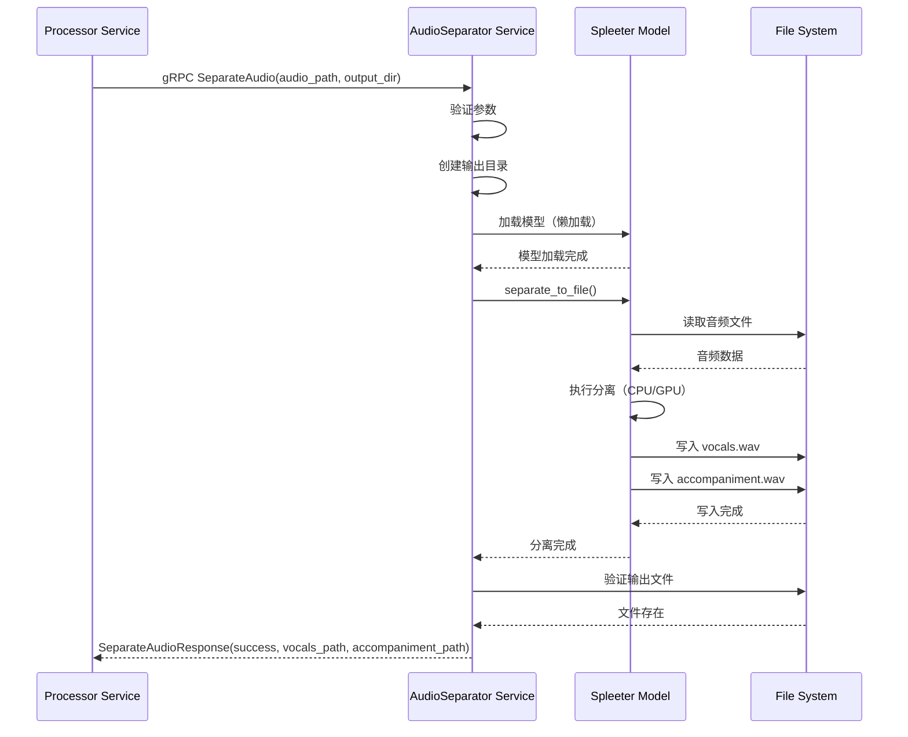

# AudioSeparator 服务设计文档（第二层）

**文档版本**: 1.0  
**最后更新**: 2025-10-30  
**服务定位**: Python gRPC 微服务，负责音频分离（人声 + 背景音）

---

## 1. 服务定位与核心职责

### 1.1 服务定位

`AudioSeparator` 是一个**独立的 Python gRPC 微服务**，部署在 `server/mcp/audio-separator/` 目录下。它是整个系统中唯一的 Python 服务，专门负责音频分离任务。

### 1.2 核心职责

* **音频分离**: 使用 Spleeter 模型将音频分离为人声（vocals）和背景音（accompaniment）
* **gRPC 服务**: 提供 gRPC 接口供 Processor 服务调用
* **可选启用**: 通过配置开关 `audio_separation_enabled` 控制是否启用
* **降级处理**: 如果分离失败，返回错误，由 Processor 服务决定是否降级

### 1.3 服务边界

**负责**:
- 接收音频文件路径
- 调用 Spleeter 模型进行分离
- 返回分离后的人声和背景音文件路径

**不负责**:
- 音频格式转换（由 Processor 服务使用 ffmpeg 完成）
- 音频质量检查（由 Processor 服务完成）
- 文件存储管理（由 Processor 服务完成）

---

## 2. gRPC 接口定义

### 2.1 Proto 文件定义

```protobuf
syntax = "proto3";

package audioseparator;

option go_package = "./audioseparator";

// AudioSeparator 服务定义
service AudioSeparator {
  // 分离音频为人声和背景音
  rpc SeparateAudio(SeparateAudioRequest) returns (SeparateAudioResponse);
}

// 分离音频请求
message SeparateAudioRequest {
  string audio_path = 1;  // 输入音频文件的绝对路径
  string output_dir = 2;  // 输出目录的绝对路径
  int32 stems = 3;        // 分离模式：2stems（人声+背景音），默认 2
}

// 分离音频响应
message SeparateAudioResponse {
  bool success = 1;              // 是否成功
  string vocals_path = 2;        // 人声文件路径
  string accompaniment_path = 3; // 背景音文件路径
  string error_message = 4;      // 错误信息（如果失败）
  int32 processing_time_ms = 5;  // 处理耗时（毫秒）
}
```

### 2.2 接口说明

#### SeparateAudio

**功能**: 分离音频为人声和背景音

**输入**:
- `audio_path`: 输入音频文件的绝对路径（例如：`/data/videos/task_123/audio.wav`）
- `output_dir`: 输出目录的绝对路径（例如：`/data/videos/task_123/separated/`）
- `stems`: 分离模式，默认 2（2stems = 人声 + 背景音）

**输出**:
- `success`: 是否成功（true/false）
- `vocals_path`: 人声文件路径（例如：`/data/videos/task_123/separated/vocals.wav`）
- `accompaniment_path`: 背景音文件路径（例如：`/data/videos/task_123/separated/accompaniment.wav`）
- `error_message`: 错误信息（如果失败）
- `processing_time_ms`: 处理耗时（毫秒）

**错误码**:
- `INVALID_ARGUMENT`: 输入参数无效（文件不存在、路径格式错误）
- `INTERNAL`: Spleeter 模型加载失败或处理失败
- `RESOURCE_EXHAUSTED`: 内存不足或 GPU 资源不足

---

## 3. 核心数据结构

### 3.1 配置结构

```python
@dataclass
class AudioSeparatorConfig:
    """音频分离服务配置"""
    model_name: str = "spleeter:2stems"  # Spleeter 模型名称
    model_path: str = "/models"          # 模型文件路径
    max_workers: int = 1                 # 最大并发处理数
    grpc_port: int = 50052               # gRPC 服务端口
    use_gpu: bool = False                # 是否使用 GPU（从环境变量读取）
```

### 3.2 处理上下文

```python
@dataclass
class SeparationContext:
    """音频分离处理上下文"""
    task_id: str                  # 任务 ID（从 audio_path 提取）
    audio_path: str               # 输入音频路径
    output_dir: str               # 输出目录
    stems: int                    # 分离模式
    start_time: float             # 开始时间（用于计算耗时）
    vocals_path: Optional[str]    # 人声文件路径
    accompaniment_path: Optional[str]  # 背景音文件路径
```

---

## 4. 关键逻辑伪代码

### 4.1 SeparateAudio 处理流程

```python
function SeparateAudio(request):
    # 1. 参数验证
    if not os.path.exists(request.audio_path):
        return error(INVALID_ARGUMENT, "音频文件不存在")
    
    if not os.path.exists(request.output_dir):
        os.makedirs(request.output_dir)
    
    # 2. 初始化上下文
    context = SeparationContext(
        audio_path=request.audio_path,
        output_dir=request.output_dir,
        stems=request.stems or 2,
        start_time=time.time()
    )
    
    # 3. 加载 Spleeter 模型（懒加载，首次调用时加载）
    try:
        separator = get_separator(context.stems)
    except Exception as e:
        return error(INTERNAL, f"模型加载失败: {e}")
    
    # 4. 执行音频分离
    try:
        separator.separate_to_file(
            audio_descriptor=context.audio_path,
            destination=context.output_dir
        )
    except Exception as e:
        return error(INTERNAL, f"音频分离失败: {e}")
    
    # 5. 构建输出路径
    audio_name = os.path.basename(context.audio_path).split('.')[0]
    context.vocals_path = os.path.join(context.output_dir, audio_name, "vocals.wav")
    context.accompaniment_path = os.path.join(context.output_dir, audio_name, "accompaniment.wav")
    
    # 6. 验证输出文件
    if not os.path.exists(context.vocals_path):
        return error(INTERNAL, "人声文件生成失败")
    
    if not os.path.exists(context.accompaniment_path):
        return error(INTERNAL, "背景音文件生成失败")
    
    # 7. 计算耗时
    processing_time_ms = int((time.time() - context.start_time) * 1000)
    
    # 8. 返回成功响应
    return SeparateAudioResponse(
        success=True,
        vocals_path=context.vocals_path,
        accompaniment_path=context.accompaniment_path,
        processing_time_ms=processing_time_ms
    )
```

---

## 5. 服务交互时序图



---

## 6. 错误码清单

| 错误码 | gRPC 状态码 | 说明 | 处理建议 |
|--------|-------------|------|----------|
| `INVALID_ARGUMENT` | `INVALID_ARGUMENT` | 输入参数无效 | 检查文件路径是否正确 |
| `INTERNAL` | `INTERNAL` | 模型加载失败 | 检查模型文件是否存在 |
| `INTERNAL` | `INTERNAL` | 音频分离失败 | 检查音频格式是否支持 |
| `INTERNAL` | `INTERNAL` | 输出文件生成失败 | 检查磁盘空间是否充足 |
| `RESOURCE_EXHAUSTED` | `RESOURCE_EXHAUSTED` | 内存不足 | 降低并发数或增加内存 |

---

## 7. 关键配置项定义

### 7.1 环境变量（.env 文件）

```bash
# AudioSeparator 服务配置
AUDIO_SEPARATOR_GRPC_PORT=50052          # gRPC 服务端口
AUDIO_SEPARATOR_USE_GPU=false            # 是否使用 GPU（true/false）
AUDIO_SEPARATOR_MODEL_PATH=/models       # Spleeter 模型路径
AUDIO_SEPARATOR_MAX_WORKERS=1            # 最大并发处理数
```

### 7.2 配置说明

| 配置项 | 类型 | 默认值 | 说明 |
|--------|------|--------|------|
| `AUDIO_SEPARATOR_GRPC_PORT` | int | 50052 | gRPC 服务监听端口 |
| `AUDIO_SEPARATOR_USE_GPU` | bool | false | 是否使用 GPU 加速 |
| `AUDIO_SEPARATOR_MODEL_PATH` | string | /models | Spleeter 模型文件路径 |
| `AUDIO_SEPARATOR_MAX_WORKERS` | int | 1 | 最大并发处理数（建议 1，避免 OOM） |

---

## 8. 性能指标

### 8.1 CPU 模式

- **处理速度**: 10 分钟音频约 5-15 分钟
- **内存占用**: 500MB - 1GB
- **CPU 占用**: 100%（单核）

### 8.2 GPU 模式

- **处理速度**: 10 分钟音频约 1-2 分钟
- **显存占用**: 2GB - 4GB
- **GPU 占用**: 80% - 100%

---

## 9. 部署说明

### 9.1 Docker 镜像

```dockerfile
FROM python:3.9-slim

# 安装系统依赖
RUN apt-get update && apt-get install -y \
    ffmpeg \
    libsndfile1 \
    && rm -rf /var/lib/apt/lists/*

# 安装 Python 依赖
COPY requirements.txt .
RUN pip install --no-cache-dir -r requirements.txt

# 复制服务代码
COPY . /app
WORKDIR /app

# 暴露 gRPC 端口
EXPOSE 50052

# 启动服务
CMD ["python", "main.py"]
```

### 9.2 依赖清单（requirements.txt）

```txt
grpcio==1.60.0
grpcio-tools==1.60.0
spleeter==2.4.0
tensorflow==2.13.0  # CPU 版本
# tensorflow-gpu==2.13.0  # GPU 版本（如果需要）
```

---

## 10. 与第一层文档的对应关系

本文档是 `notes/Base-Design.md` 第一层架构文档的细化，对应以下章节：

- **1.2 系统架构与设计**: Python 微服务（audio-separator）
- **1.3 技术栈选型**: Spleeter（音频分离）
- **1.4 项目工程结构**: `server/mcp/audio-separator/`
- **4.2 详细步骤拆解**: 步骤 4（音频分离）
- **ADR-008**: 音频分离方案选型（Spleeter）

---

## 11. 后续工作

### 11.1 第三层文档

创建 `notes/AudioSeparator-design-detail.md`，包含：
- Python 代码实现
- gRPC 服务实现
- Spleeter 模型集成
- Docker 镜像构建
- 单元测试

### 11.2 开发任务

1. 实现 gRPC 服务（main.py）
2. 实现 Spleeter 集成（separator.py）
3. 编写 Dockerfile
4. 编写单元测试
5. 集成到 docker-compose.yml

---

