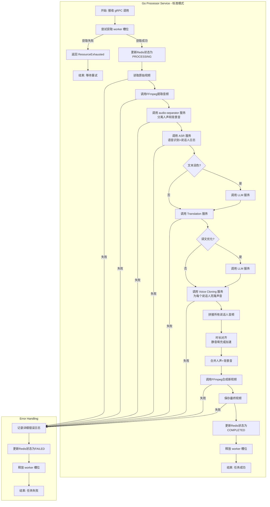

# **1. 项目基石文档：视频翻译服务 (V1.0)**

**文档版本**: 1.3
**最后更新**: 2025年10月30日
**负责人**: (AI技术合伙人)

## **版本历史**

- **v1.3 (2025-10-30)**:
  - **重大架构变更**: 废弃"推模式"，统一为"拉模式"
  - Task 服务不再通过 gRPC 调用 Processor 服务，而是推入 Redis 待处理队列
  - Processor 服务从 Redis 队列拉取任务并处理
  - 更新 Gateway uploadTaskLogic：Gateway 存临时文件，Task 服务负责文件交接
  - 更新 Task 服务 .proto 定义：使用 temp_file_path 而非 original_file_key
  - 废弃 Processor 服务的 ExecuteTask gRPC 接口
  - 明确 audio_segment 的定义：保存在本地文件系统的音频片段文件路径
  - 新增 Redis 队列数据结构定义
- **v1.2 (2025-10-30)**:
  - 服务架构优化：移除 media.rpc，功能合并到 Processor 内部
  - 新增 ai-adaptor 服务：统一 AI 服务接口，封装厂商特定逻辑
  - 明确 Processor 内部结构：logic（编排）+ composer（音频合成）+ mediautil（媒体工具）
  - 明确音色管理位置：在 ai-adaptor 的适配器中实现，Processor 无感知
  - 明确 mcp 层定义：按架构层次划分，不按语言划分（Go/Python 微服务平等共存）
- **v1.1 (2025-10-30)**:
  - 核心架构变更：引入 Python 微服务（audio-separator）用于音频分离
  - 明确声音克隆方案：V1.0 采用阿里云 CosyVoice（零样本克隆）
  - 明确多人场景支持：V1.0 必须支持多说话人场景
  - 更新核心业务工作流：从 14 步扩展到 18 步
  - 新增 ADR-007、ADR-008、ADR-009、ADR-010、ADR-011
  - 提供两种部署模式：CPU 模式（基础）和 GPU 模式（完整）
  - 新增翻译预设类型：专业科技、口语自然、教育严谨
  - 更新资源需求：2C4G（CPU 模式）或 2C4G + GPU（完整模式）
- **v1.0 (2025-10-29)**: 初始文档创建

---

## **文档层次说明**

本项目采用三层文档体系，确保从宏观架构到具体实现的清晰划分：

**第一层：宏观架构设计（本文档）**
- 定位：项目的"宪法"，定义系统边界、核心组件、技术栈和高级工作流
- 内容：项目愿景、架构模式、技术选型、核心业务流程、架构决策记录（ADR）
- 稳定性：高度稳定，所有后续设计不得违背本文档
- 注意：本文档第 2-4 章包含部分第二层内容预览（API 定义、数据结构），最终契约以第二层文档为准

**第二层：模块细分设计**

- 定位：项目的"部门法"，指导具体编码工作的直接蓝图
- 内容：每个微服务的完整 API 契约（.api / .proto 文件）、详细数据结构、核心逻辑伪代码、服务交互时序图
- 命名规范：{服务名}-design.md
- 产出物：Gateway-design.md、Task-design.md、Processor-design.md、AudioSeparator-design.md

**第三层：代码实现与接口文档（开发阶段）**
- 定位：最终可运行、可交互的产物
- 内容：符合第二层设计的 Go/Python 代码、自动生成的 Swagger/gRPC 文档、单元测试和集成测试
- 命名规范：{服务名}-design-detail.md
- 细粒度：控制到接口层级，明确约定函数、方法的入参、返回元素

---

## **1.1 项目愿景与MVP范围**

* **项目愿景**: 创建一个**单用户自部署服务**，能够将包含外语对话的视频（初期为英语）无缝翻译为中文对话。核心目标是不仅翻译内容，还要最大程度地保留原说话者的**情感、语调和节奏**，提供"身临其境"的母语化体验。

* **部署模式**:
  * **CPU 模式（基础）**: 2C4G，跳过音频分离（丢失 BGM），适合无 GPU 资源的用户
  * **GPU 模式（完整）**: 2C4G + NVIDIA GPU（4GB+ 显存），启用音频分离（保留 BGM），推荐追求最佳效果的用户
  * **部署位置**: 用户可根据资源情况选择本地部署或服务器部署
  * **配置方式**: 通过配置开关 `audio_separation_enabled` 控制是否启用音频分离

* **MVP核心范围**:
  * **产品形态**: 一个无需登录的单页面Web应用。
  * **核心流程**: 用户配置 API 密钥 -> 上传视频文件 -> 服务进行异步处理 -> 前端通过轮询机制获取处理状态 -> 处理完成后提供可供下载的、替换了中文音轨的视频文件。
  * **技术路径**: 采用混合处理流程。核心的音频分离通过本地 Python 微服务实现（可选），其他 AI 能力（ASR、翻译、声音克隆等）通过调用大模型厂商 API 实现。V2.0 将扩展端到端 S2ST（AI Dubbing）模式。详见第 1.6 节"处理模式"。
  * **多人场景支持**: V1.0 必须支持多说话人场景（技术视频、访谈、教学视频常态），通过说话人日志区分说话人，为每个说话人分别克隆声音。

## **1.2 系统架构与设计**

* **架构模式**: 采用**混合微服务架构**，明确划分**接入层 (app)** 和 **服务层 (mcp)**。通过**适配器模式**实现业务逻辑与厂商解耦。详见 `notes/架构决策记录.md` ADR-004。
  * **接入层 (`server/app`)**: 负责对外提供 **RESTful API**，作为流量入口，直接与前端客户端交互。
  * **服务层 (`server/mcp`)**: 负责实现所有核心业务逻辑，以内部 **gRPC** 服务的形式存在，不直接对外暴露。
    * **定义**: mcp = Micro-service Provider，按**架构层次**划分，不按语言划分。
    * **组成**: Go 微服务（task、processor、ai-adaptor）和 Python 微服务（audio-separator）平等共存。
* **核心组件交互**:
  * **异步任务处理**: task 服务创建任务记录并推入 Redis 待处理队列（List: `task:pending`），processor 服务从队列中拉取任务并异步执行。这种基于 Redis 队列的"拉模式"在解耦、弹性和健壮性上优于 gRPC "推模式"。详见 `notes/架构决策记录.md` ADR-002。
  * **文件存储方案**:
    * **MVP 阶段**: 使用本地文件系统存储视频文件（`./data/videos`），通过 Volume 挂载到宿主机确保持久化。
    * **存储结构**: `./data/videos/{task_id}/original.mp4` 和 `./data/videos/{task_id}/result.mp4`。
    * **GC 策略**: 定时任务每小时扫描，删除创建时间超过 3 小时的任务目录，避免磁盘空间耗尽。
    * **接口抽象**: 代码层面设计 Storage 接口（Upload, Download, Delete, GetDownloadURL），业务逻辑与存储实现解耦。MVP 阶段实现 LocalStorage，未来可无缝迁移到 MinIO / AWS S3 / 阿里云 OSS，业务代码无需修改。
    * **选型理由**: 单用户自部署场景下，本地文件系统足够满足需求，且节省 100-200MB 内存（MinIO 的资源消耗）。详见 `notes/架构决策记录.md` ADR-001。
  * **状态管理**: MVP阶段，任务的实时状态（排队中、处理中、成功、失败）将存储在 **Redis** 中，通过唯一的 `task_id` 进行快速读写。
  * **应用配置管理**:
    * **配置源**: Redis 作为应用配置的唯一数据源（Key: `app:settings`）。容器启动时从环境变量或配置文件读取初始配置，如果 Redis 中不存在则写入，如果已存在则使用 Redis 中的配置（用户可能已通过 Web 修改）。
    * **持久化**: Redis 启用 AOF 持久化（`appendonly yes`），数据目录挂载到宿主机（`./data/redis`），确保容器重启后配置不丢失。
    * **加密存储**: 用户配置的 API 密钥使用 AES-256-GCM 加密后存储在 Redis 中，加密密钥通过环境变量 `API_KEY_ENCRYPTION_SECRET` 传入。
    * **运行时读取**: processor 服务调用外部 API 时，从 Redis 读取最新配置并解密使用。所有服务共享同一套配置，无需会话隔离（单用户部署场景）。
    * **Web 修改**: 用户通过 Web 界面修改配置时，后端使用 Lua 脚本原子性更新 Redis，并引入乐观锁机制（版本号）避免并发冲突。

## **1.3 技术栈选型**

* **后端语言与框架**:
  * **Go**: GoZero（Gateway、Task、Processor 服务）
  * **Python**: gRPC + TensorFlow（Audio-Separator 服务）
* **服务间通信**: gRPC（内部服务间通信）
* **中间件**:
  * **状态缓存/存储**: Redis
  * **文件存储**: 本地文件系统（MVP 阶段），通过 Storage 接口抽象，未来可迁移到 MinIO / AWS S3 / 阿里云 OSS
* **核心工具库**:
  * **音视频处理**: ffmpeg
  * **音频分离**: Spleeter（Python 微服务，可选启用）
* **外部 API 服务**（用户自行配置 API 密钥，通过适配器模式支持多厂商）:
  * **语音识别 (ASR)**: 待定（候选：阿里云 / Azure / Google Cloud，需支持说话人日志）
  * **文本润色 (LLM)**: 待定（候选：OpenAI GPT / Claude / 火山引擎 Doubao）
  * **翻译 (Translation)**: 待定（候选：Google Translate / DeepL / 火山引擎 / 阿里云）
  * **译文优化 (LLM)**: 待定（候选：OpenAI GPT / Claude / 火山引擎 Doubao）
  * **声音克隆 (Voice Cloning)**: 阿里云 CosyVoice（V1.0，零样本克隆）
  * **AI 配音 (S2ST)**: 待定，V2.0 扩展（候选：ElevenLabs Dubbing / Azure Speech-to-Speech）
  * 注：除声音克隆外，其他 API 厂商选型将在后期进行专业评估
* **技术选型说明**:
  * **核心音频分离**: 通过本地 Python 微服务（Spleeter）实现，完全本地化，无隐私风险（可选启用）
  * **其他 AI 能力**: 通过调用大模型厂商 API 实现（ASR、翻译、声音克隆等）
  * **适配器模式**: 业务逻辑与厂商解耦，未来可无缝切换厂商
* **部署方案**:
  * **容器化**: Docker + Docker Compose
  * **CPU 模式一键部署**: Gateway + Task + Processor + Redis
  * **GPU 模式一键部署**: Gateway + Task + Processor + Audio-Separator + Redis
  * **部署依赖**:
    * Docker 镜像必须包含 ffmpeg 二进制文件（建议版本 >= 4.0）
    * GPU 模式需要 NVIDIA Container Toolkit 和 CUDA 支持
    * 文件存储目录（./data/videos）和 Redis 数据目录（./data/redis）必须挂载到宿主机
  * **配置初始化**:
    * 用户可在 .env 文件或环境变量中配置初始 API 密钥（可选）
    * 用户可通过 audio_separation_enabled 配置开关控制是否启用音频分离
    * Gateway 服务启动时检查 Redis 中是否存在配置（Key: `system:api_keys`）。如果不存在，将环境变量中的初始配置写入 Redis（版本号初始化为 1）。如果已存在，则使用 Redis 中的配置，忽略环境变量。
    * Redis 启用 AOF 持久化（`appendonly yes`），确保容器重启后配置不丢失。


**配置管理说明**:

本项目的配置分为两类，采用不同的管理方式。详见 `notes/架构决策记录.md` ADR-006。

1. **应用配置（热更新）**：
   - 包含：AI 服务厂商选择、API 密钥、服务端点等
   - 存储：Redis（Key: `app:settings`）
   - 修改方式：通过 Web UI 的"设置"页面实时修改，无需重启服务
   - 持久化：Redis AOF + Volume 挂载

2. **环境配置（冷启动）**：
   - 包含：系统资源限制、存储路径、Redis 连接信息、日志级别等
   - 存储：`.env` 文件或环境变量
   - 修改方式：手动编辑 `.env` 文件，执行 `docker-compose restart` 重启服务
   - 配置项清单：
     - `REDIS_HOST`、`REDIS_PORT`：Redis 连接信息
     - `LOCAL_STORAGE_PATH`：本地存储路径（默认 `./data/videos`）
     - `PROCESSOR_MAX_CONCURRENCY`：最大并发处理数（默认 1）
     - `API_KEY_ENCRYPTION_SECRET`：API Key 加密密钥（必填，32字节）
     - `LOG_LEVEL`：日志级别（默认 `info`）
     - `GATEWAY_PORT`：Gateway 服务端口（默认 `8080`）

## **1.4 项目工程结构**

```
video-translator/
├── server/
│   ├── app/      # RESTful API 服务 (接入层)
│   │   └── gateway/
│   ├── mcp/      # gRPC 微服务 (服务层，按架构层次划分，不按语言划分)
│   │   ├── task/              # Go gRPC 微服务：任务管理
│   │   ├── processor/         # Go gRPC 微服务：AI 流程编排 + 音频合成
│   │   ├── ai-adaptor/        # Go gRPC 微服务：AI 服务统一接口
│   │   └── audio-separator/   # Python gRPC 微服务：音频分离（可选启用）
│   └── common/   # 公共代码库
├── client/
│   └── web/      # 前端项目 (Vue, React, etc.)
├── etc/          # 全局部署配置文件
└── go.mod
```

**服务职责说明**（详见各服务的第二层设计文档）:
- **gateway**: 对外 RESTful API，任务上传、状态查询、配置管理
- **task**: 任务状态管理、任务调度
- **processor**: AI 流程编排、音频合成、视频合成（详见 `Processor-design.md`）
- **ai-adaptor**: AI 服务统一接口，封装厂商特定逻辑（详见 `AIAdaptor-design.md`）
- **audio-separator**: 音频分离（人声 + 背景音）（详见 `AudioSeparator-design.md`）

## **1.5 核心业务工作流 (`processor`服务)**

本节描述 MVP 阶段（V1.0）采用的标准模式（级联式流程）。V2.0 将扩展 AI 配音模式（端到端 S2ST），详见第 1.6 节"处理模式"。

1. **拉取任务**: processor 服务后台 Goroutine 定期从 Redis 待处理队列（List: `task:pending`）拉取任务，获取 (task_id, original_file_path)。
2. **并发控制**: 尝试获取 worker 槽位（使用 Channel 信号量），如果已达并发上限，将任务重新推回队列头部，等待下次拉取。详见 ADR-002。
3. **状态更新**: 立即更新 Redis 中任务状态为 PROCESSING。
4. **文件准备**: 从本地文件存储读取原始视频。
5. **音频提取**: 提取音频（内部工具）。
6. **音频分离**（可选）: 如果启用 audio_separation_enabled，调用 audio-separator 服务分离人声和背景音。详见 ADR-008。
7. **语音识别 + 说话人日志**: 调用 ai-adaptor 服务的 ASR 接口，识别多说话人，输出句子级时间戳和音频片段文件路径。输出格式：`[{speaker_id, start, end, text, audio_segment_path}, ...]`，其中 `audio_segment_path` 是保存在本地文件系统的音频片段文件路径（如 `./data/videos/{task_id}/segments/speaker_1_segment_0.wav`）。详见 ADR-009、ADR-011。
8. **文本润色**（可选）: 调用 ai-adaptor 服务的 LLM 接口，根据用户自定义 Prompt 和视频类型进行优化。
9. **文本翻译**: 调用 ai-adaptor 服务的 Translation 接口，将源语言文本翻译为中文。
10. **译文优化**（可选）: 调用 ai-adaptor 服务的 LLM 接口，优化翻译，使其更符合中文表达习惯。
11. **声音克隆**: 调用 ai-adaptor 服务的 Voice Cloning 接口，为每个说话人分别克隆声音。输入为步骤 7 输出的 `audio_segment_path`（参考音频）和翻译后的文本。详见 ADR-007。
12. **音频拼接**: 按时间轴顺序拼接所有说话人的音频（内部工具）。
13. **时长对齐**: 计算时差，优先静音填充，必要时加速语速（内部工具）。详见 ADR-010。
14. **音频合成**: 合并中文人声 + 原背景音（内部工具）。
15. **视频合成**: 合并视频 + 新音轨（内部工具）。
16. **结果保存**: 将最终生成的视频保存到本地文件存储。
17. **状态终更**: 更新 Redis 中任务状态为 COMPLETED，并记录文件路径。
18. **异常处理**: 全程监控，任何步骤失败则立即中止，并更新 Redis 状态为 FAILED，记录错误信息。释放 worker 槽位。

**注**：
- 所有 AI 服务调用通过 ai-adaptor 统一接口实现，具体厂商由用户在应用配置中选择。详见 ADR-004。
- 音频/视频处理（提取、拼接、对齐、合成）由 Processor 内部工具实现。详见 `Processor-design.md`。
- `audio_segment_path` 是保存在本地文件系统的音频片段文件路径，用于声音克隆的参考音频。


## **1.6 处理模式**

本项目支持两种视频翻译处理模式，用户可根据需求选择。MVP 阶段（V1.0）实现标准模式，V2.0 扩展 AI 配音模式。详见 `notes/架构决策记录.md` ADR-005。

### **标准模式（Cascaded Mode）**

**流程**: 音频分离 → ASR + 说话人日志 → 文本润色 → Translation → 译文优化 → Voice Cloning → 音频拼接 → 时长对齐 → 音频合成 → 视频合成

**特点**:
- **高可控性**: 每个步骤可独立配置，支持混搭不同厂商
- **翻译准确**: 支持根据视频类型（专业科技、口语自然、教育严谨）调整翻译风格，支持用户自定义 Prompt
- **背景音保留**: 通过音频分离保留 BGM 和环境音（可选启用）
- **多人场景支持**: 通过说话人日志区分说话人，为每个说话人分别克隆声音
- **成本灵活**: 用户可选择性价比高的 API 组合
- **适用场景**: 技术演讲、在线课程、教学视频、访谈节目

**质量指标**:
- 翻译准确性: 高（可根据视频类型优化）
- 情感保留: 约 70%
- 音色克隆: 较好（零样本克隆）
- 韵律保留: 一般（通过时长对齐优化）
- 背景音保留: 完整（如果启用音频分离）

**翻译预设类型**:

- **专业科技**: 保留专业术语，避免口语化
- **口语自然**: 口语化表达，更自然流畅
- **教育严谨**: 严谨准确，适合教学场景
- **默认**: 无倾向性，平衡准确性和流畅性

**实现细节**:
- 音频分离、文本润色、译文优化步骤可由用户选择是否启用
- 所有 AI 服务通过统一接口调用，具体厂商由用户配置
- 详细流程见第 4.2 节"详细步骤拆解"

### **AI 配音模式（S2ST Mode）**

**流程**: AI Dubbing Service（端到端）→ 视频合成

**特点**:
- **情感保留优秀**: 端到端模型，保留 85-95% 情感和韵律
- **音色自然**: 原生支持音色克隆
- **流程简单**: 单次 API 调用，延迟更低
- **黑盒处理**: 翻译质量不可控，无法人工干预
- **适用场景**: 娱乐视频、访谈节目、情感表达重要的内容

**质量指标**:
- 翻译准确性: 较高（但不可校对）
- 情感保留: 约 90%
- 音色克隆: 优秀
- 韵律保留: 优秀

**支持的服务商**（待定）:
- ElevenLabs Dubbing
- Azure AI Speech（Speech-to-Speech Translation）
- Google Cloud（未来支持）

**注意事项**:
- 成本较高（约为标准模式的 1.5-2 倍）
- 语言支持有限（取决于厂商）
- API 稳定性待验证（较新功能）

**实现计划**:
- V2.0 在 processor 服务中新增 S2ST 模式执行路径
- 用户在应用配置中选择处理模式
- 两种模式共享相同的任务管理和状态更新逻辑

---

# **2. `gateway`服务架构设计**

## **2.1 服务定位与核心职责**

`gateway` 服务 (`server/app/gateway`) 是整个视频翻译系统的**唯一流量入口**和**协议转换网关**。它作为接入层，直接面向前端客户端(`client/web`)，负责处理所有外部HTTP请求。

其核心职责严格限定于：

* **HTTP协议处理**: 监听并处理外部HTTP/HTTPS请求，管理API路由。
* **请求校验**: 对传入的请求参数进行基础的格式和有效性验证。
* **文件流式处理**: 接收用户上传的文件流，并直接将其**流式保存**至本地文件存储（`./data/videos/{task_id}/original.mp4`），避免将整个文件读入内存。
* **资源检查**: 上传前检查磁盘可用空间，拒绝条件：`availableSpace < (inputFileSize * 3 + 500MB)`，返回 507 Insufficient Storage 错误。
* **协议转换**: 将HTTP请求转换为对内部 `mcp`层gRPC微服务的调用。
* **响应格式化**: 将gRPC的Protobuf响应转换为对前端友好的、统一的JSON格式。
* **文件下载服务**: 提供文件下载接口（`GET /v1/tasks/download/{key}`），流式返回处理完成的视频文件。
* **应用配置管理**: 提供应用配置的读取和更新接口（`GET/POST /v1/settings`），支持用户通过 Web UI 配置 AI 服务。

**架构原则**: `gateway` **不包含任何核心业务逻辑**。所有业务判断和数据处理都委托给下游的gRPC服务。这确保了接入层的轻量、高效和稳定。

## **2.2 MVP接口定义 (`gateway.api`)**

为了快速验证核心价值，MVP阶段的接口设计聚焦于完成核心用户旅程的闭环。我们采用GoZero的 `.api`语法进行定义。

```go
syntax = "v1"

info(
	title: "Video Translation Service API"
	desc: "API for creating and managing video translation tasks."
	author: "Our Team"
	version: "1.0.0"
)

// types 定义了API的请求和响应结构体
type (
	// 获取应用配置的响应体
	GetSettingsResponse {
		Version int64 `json:"version"` // 配置版本号（乐观锁）

		// 处理模式（V1.0 仅支持 standard，V2.0 扩展 s2st）
		ProcessingMode string `json:"processing_mode"` // standard, s2st

		// ASR 服务配置
		AsrProvider string `json:"asr_provider"` // 服务商标识（待定）
		AsrApiKey   string `json:"asr_api_key"`  // 脱敏后的 API Key
		AsrEndpoint string `json:"asr_endpoint,omitempty"` // 自定义端点（可选）

		// 音频分离配置（内部服务，无需 API Key）
		AudioSeparationEnabled bool `json:"audio_separation_enabled"` // 默认 true

		// 文本润色配置（可选）
		PolishingEnabled      bool   `json:"polishing_enabled"`
		PolishingProvider     string `json:"polishing_provider,omitempty"`
		PolishingApiKey       string `json:"polishing_api_key,omitempty"`
		PolishingCustomPrompt string `json:"polishing_custom_prompt,omitempty"` // 用户自定义 Prompt
		PolishingVideoType    string `json:"polishing_video_type,omitempty"`    // tech, casual, education, default

		// 翻译服务配置
		TranslationProvider string `json:"translation_provider"`
		TranslationApiKey   string `json:"translation_api_key"`
		TranslationEndpoint string `json:"translation_endpoint,omitempty"`
		TranslationVideoType string `json:"translation_video_type,omitempty"` // tech, casual, education, default

		// 译文优化配置（可选）
		OptimizationEnabled  bool   `json:"optimization_enabled"`
		OptimizationProvider string `json:"optimization_provider,omitempty"`
		OptimizationApiKey   string `json:"optimization_api_key,omitempty"`

		// 声音克隆服务配置
		VoiceCloningProvider            string `json:"voice_cloning_provider"` // V1.0: aliyun_cosyvoice
		VoiceCloningApiKey              string `json:"voice_cloning_api_key"`
		VoiceCloningEndpoint            string `json:"voice_cloning_endpoint,omitempty"`
		VoiceCloningAutoSelectReference bool   `json:"voice_cloning_auto_select_reference"` // 是否自动选择参考音频，默认 true

		// S2ST 服务配置（V2.0）
		S2stProvider string `json:"s2st_provider,omitempty"`
		S2stApiKey   string `json:"s2st_api_key,omitempty"`
	}

	// 更新应用配置的请求体
	UpdateSettingsRequest {
		Version int64 `json:"version"` // 乐观锁版本号

		// 处理模式
		ProcessingMode string `json:"processing_mode,omitempty"`

		// ASR 服务配置
		AsrProvider string `json:"asr_provider,omitempty"`
		AsrApiKey   string `json:"asr_api_key,omitempty"` // 如果是脱敏值，后端保持原值
		AsrEndpoint string `json:"asr_endpoint,omitempty"`

		// 音频分离配置
		AudioSeparationEnabled *bool `json:"audio_separation_enabled,omitempty"`

		// 文本润色配置
		PolishingEnabled      *bool  `json:"polishing_enabled,omitempty"`
		PolishingProvider     string `json:"polishing_provider,omitempty"`
		PolishingApiKey       string `json:"polishing_api_key,omitempty"`
		PolishingCustomPrompt string `json:"polishing_custom_prompt,omitempty"`
		PolishingVideoType    string `json:"polishing_video_type,omitempty"`

		// 翻译服务配置
		TranslationProvider  string `json:"translation_provider,omitempty"`
		TranslationApiKey    string `json:"translation_api_key,omitempty"`
		TranslationEndpoint  string `json:"translation_endpoint,omitempty"`
		TranslationVideoType string `json:"translation_video_type,omitempty"`

		// 译文优化配置
		OptimizationEnabled  *bool  `json:"optimization_enabled,omitempty"`
		OptimizationProvider string `json:"optimization_provider,omitempty"`
		OptimizationApiKey   string `json:"optimization_api_key,omitempty"`

		// 声音克隆服务配置
		VoiceCloningProvider            string `json:"voice_cloning_provider,omitempty"`
		VoiceCloningApiKey              string `json:"voice_cloning_api_key,omitempty"`
		VoiceCloningEndpoint            string `json:"voice_cloning_endpoint,omitempty"`
		VoiceCloningAutoSelectReference *bool  `json:"voice_cloning_auto_select_reference,omitempty"`

		// S2ST 服务配置（V2.0）
		S2stProvider string `json:"s2st_provider,omitempty"`
		S2stApiKey   string `json:"s2st_api_key,omitempty"`
	}

	// 更新应用配置的响应体
	UpdateSettingsResponse {
		Version int64  `json:"version"` // 更新后的版本号
		Message string `json:"message"`
	}

	// 上传任务的响应体
	UploadTaskResponse {
		TaskId string `json:"task_id"`
	}

	// 查询任务状态的请求体 (路径参数)
	GetTaskStatusRequest {
		TaskId string `path:"taskId"`
	}

	// 查询任务状态的响应体
	GetTaskStatusResponse {
		TaskId       string `json:"task_id"`
		Status       string `json:"status"` // PENDING, PROCESSING, COMPLETED, FAILED
		ResultUrl    string `json:"result_url,omitempty"`    // 仅在COMPLETED时出现（格式：/v1/tasks/download/{task_id}/result.mp4）
		ErrorMessage string `json:"error_message,omitempty"` // 仅在FAILED时出现
	}

	// 下载文件的请求参数（路径参数）
	DownloadFileRequest {
		Key string `path:"key"` // 文件标识符（格式：{task_id}/result.mp4）
	}
)

// service 定义了路由和对应的Handler
@server(
	group: settings
	prefix: /v1/settings
)
service gateway-api {
	@doc("Get application settings")
	@handler getSettings
	get / returns (GetSettingsResponse)

	@doc("Update application settings")
	@handler updateSettings
	post / (UpdateSettingsRequest) returns (UpdateSettingsResponse)
}

@server(
	group: task
	prefix: /v1/tasks
)
service gateway-api {
	@doc("Upload a video file to create a translation task")
	@handler uploadTask
	post /upload (UploadTaskResponse)

	@doc("Get the status of a specific task by its ID")
	@handler getTaskStatus
	get /:taskId/status (GetTaskStatusRequest) returns (GetTaskStatusResponse)

	@doc("Download the result video file")
	@handler downloadFile
	get /download/:key
}
```

## **2.3 关键逻辑流程 (`internal/logic`)**

* **`getSettingsLogic` (处理 `GET /v1/settings`)**:

  1. 从 Redis 读取应用配置（Key: `app:settings`，数据结构为 HASH）。
  2. 如果配置不存在（首次访问），返回默认配置（所有 API Key 为空，版本号为 0）。
  3. 解密所有 API Key（使用 AES-256-GCM，密钥来自环境变量 `API_KEY_ENCRYPTION_SECRET`）。
  4. **API Key 脱敏处理**:
     * 格式：`前缀-***-后6位`
     * 示例：`sk-proj-abc123...xyz789` → `sk-proj-***-xyz789`
     * 目的：保护用户隐私，防止 API Key 泄露
  5. 将脱敏后的配置封装到 `GetSettingsResponse` 并返回。

* **`updateSettingsLogic` (处理 `POST /v1/settings`)**:

  1. 从 `http.Request` 中解析出用户提交的配置。
  2. 从 Redis 读取当前配置的版本号（`app:settings` 中的 `version` 字段）。
  3. **乐观锁检查**: 比较请求中的版本号与 Redis 中的版本号。如果不一致，返回 409 Conflict 错误，附带当前版本号，要求客户端刷新后重试。
  4. **API Key 处理**:
     * 如果请求中的 API Key 是脱敏值（包含 `***`），保持 Redis 中的原值不变
     * 如果是完整的新 API Key，使用 AES-256-GCM 加密后更新
  5. 使用 Lua 脚本原子性更新 Redis 配置:
     * 再次检查版本号（防止并发修改）
     * 更新所有配置字段
     * 版本号加 1
  6. 返回更新后的版本号和成功消息。

* **`uploadTaskLogic` (处理 `POST /v1/tasks/upload`)**:

  1. 从 `http.Request` 中解析出 `multipart/form-data` 里的文件流和文件大小。
  2. **资源检查**: 检查磁盘可用空间，拒绝条件：`availableSpace < (inputFileSize * 3 + 500MB)`。如果空间不足，返回 507 Insufficient Storage 错误，附带友好提示："服务器存储空间不足，请稍后重试或联系管理员"。
  3. 生成唯一的临时文件名，将文件流保存到临时目录 `./data/temp/{uuid}.mp4`。
     * **实现细节**: 必须使用流式写入，通过 `io.Copy` 将 `http.Request.Body` 直接写入文件。严禁将整个文件读入内存，否则在 2C2G 服务器上处理大视频文件会导致 OOM。
  4. 通过 gRPC 客户端，调用 `task` 服务的 `CreateTask` 方法，传递临时文件路径 `temp_file_path` 和原始文件名 `original_filename`。
  5. 接收 `CreateTask` 的响应，获取 `task_id`，确认任务创建成功。
  6. 将 `task_id` 封装到 `UploadTaskResponse` 结构体中并返回给客户端。

  **注**: Gateway 只负责接收文件并存入临时目录，Task 服务负责文件交接（移动到正式目录）和任务记录创建。这种设计更健壮，避免了 Gateway 和 Task 之间的文件路径耦合。

* **`getTaskStatusLogic` (处理 `GET /v1/tasks/:taskId/status`)**:

  1. 从请求路径中解析出 `taskId`。
  2. 通过gRPC客户端，调用 `task` 服务的 `GetTaskStatus` 方法，传递 `taskId`。
  3. 接收 `GetTaskStatus` 的响应，包含任务状态、`result_key` (如果成功) 或错误信息 (如果失败)。
  4. **执行响应转换**:
     * **状态映射**: 将gRPC返回的枚举类型状态转换为对前端友好的字符串（例如 `task.TaskStatus_COMPLETED` -> `"COMPLETED"`）。
     * **URL生成**: 如果状态为 `COMPLETED`，则根据 `result_key` 生成下载 URL（格式：`/v1/tasks/download/{task_id}/result.mp4`）。
     * **错误信息映射 (未来)**: 将技术性错误信息映射为用户可理解的友好提示。
  5. 将转换后的数据封装到 `GetTaskStatusResponse` 结构体中并返回。

* **`downloadFileLogic` (处理 `GET /v1/tasks/download/:key`)**:

  1. 从请求路径中解析出 `key`（格式：`{task_id}/result.mp4`）。
  2. 调用 Storage 接口的 Download 方法，获取文件流（`io.ReadCloser`）。
  3. 如果文件不存在，返回 404 Not Found 错误。
  4. 设置响应头：
     * `Content-Type: video/mp4`
     * `Content-Disposition: attachment; filename=result.mp4`
  5. 使用 `io.Copy` 将文件流直接写入 `http.ResponseWriter`，实现流式下载，避免将整个文件读入内存。

## **2.4 MVP的局限性与未来迭代方向**

我们清晰地认识到，当前设计是一个**战略性的最小化实现**，存在以下待完善之处，这些将作为后续版本的迭代方向：

* **用户体验**:
  * **处理过程不透明**: 当前仅有四个粗粒度状态。未来应提供更细化的处理阶段（如：转录中、合成中），以提升用户的感知度和信任感。
  * **错误提示不友好**: 当前可能直接暴露后端错误。未来应在 `gateway`层建立错误映射机制，提供更人性化的提示。
  * **轮询机制**: 当前前端通过轮询获取任务状态（建议间隔 3 秒）。前端应实现指数退避策略，如果任务长时间处于 PROCESSING 状态，逐渐增加轮询间隔至最多 10 秒。V2.0 可考虑使用 WebSocket 或 SSE（Server-Sent Events）替代轮询，提供更实时的体验并减少不必要的 HTTP 请求。
* **功能完整性**:
  * **缺少用户系统**: 无法查看历史任务。
  * **缺少任务管理**: 无法取消正在进行的任务。
  * **上传体验**: 不支持大文件断点续传和进度显示。
* **服务可维护性**:
  * **缺少运维接口**: 当前未定义 `/healthz` (健康检查) 和 `/metrics` (监控指标) 接口。这在正式投入生产环境前**必须补充**，以确保服务的可观测性和稳定性。

---

# **3. `task`服务架构设计**

## **3.1 服务定位与核心职责**

`task` 服务 (`server/mcp/task`) 是一个内部 gRPC 服务，定位为**任务生命周期管理器**。在单用户自部署场景下，它负责：
1. 接收任务创建请求（从 Gateway）
2. 文件交接（将临时文件移动到正式目录）
3. 创建任务记录并推入 Redis 待处理队列（List: `task:pending`）
4. 提供任务状态查询接口

**核心理念**: Task 服务不直接调用 Processor 服务，而是通过 Redis 队列解耦。Processor 服务从队列中拉取任务并处理。

## **3.2 gRPC接口定义 (`task.proto`)**

```protobuf
syntax = "proto3";

package task.v1;

// go_package 指向我们Go项目中的目录，goctl会在此生成代码
option go_package = "github.com/our-org/video-translator/server/mcp/task/pb";

// 任务状态枚举，作为服务间通信的标准
enum TaskStatus {
  UNKNOWN = 0;    // 未知状态
  PENDING = 1;    // 排队中，任务已创建但未被处理
  PROCESSING = 2; // 处理中
  COMPLETED = 3;  // 处理成功
  FAILED = 4;     // 处理失败
}

// TaskService 定义了所有可用的RPC方法
service TaskService {
  // 创建一个新任务
  rpc CreateTask(CreateTaskRequest) returns (CreateTaskResponse);

  // 获取指定任务的状态
  rpc GetTaskStatus(GetTaskStatusRequest) returns (GetTaskStatusResponse);
}

// --- 消息体定义 ---

message CreateTaskRequest {
  // 临时文件路径（Gateway 存入临时目录的文件路径）
  string temp_file_path = 1;
  // 原始文件名，用于日志记录和问题排查
  string original_filename = 2;
}

message CreateTaskResponse {
  // 返回给调用方的唯一任务ID
  string task_id = 1;
}

message GetTaskStatusRequest {
  string task_id = 1;
}

message GetTaskStatusResponse {
  string task_id = 1;
  TaskStatus status = 2;
  // 任务成功时，结果文件在本地文件系统中的路径
  // 由上游服务(gateway)负责根据此路径生成下载URL
  string result_path = 3;
  // 任务失败时，记录的错误信息
  string error_message = 4;
}
```

---

## **1.7 已知限制与风险**

本节说明 V1.0 的已知限制和潜在风险，帮助用户建立合理预期。

### **部署模式限制**

**CPU 模式（基础）**：
- **限制**：跳过音频分离，丢失背景音（BGM、环境音）
- **影响**：最终视频只有人声，缺少背景音乐和环境音
- **适用场景**：无 GPU 资源的用户，对背景音无要求的场景

**GPU 模式（完整）**：
- **限制**：需要 NVIDIA GPU（4GB+ 显存）和 CUDA 支持
- **影响**：部署门槛提高，不适合无 GPU 资源的用户
- **适用场景**：追求最佳效果，有 GPU 资源的用户

### **翻译质量风险**

1. **LLM 幻觉**：
   - **风险**：LLM 优化可能引入不存在的内容或改变原意
   - **缓解措施**：提供"译文优化"开关，让用户自主选择；V2.0 将支持用户手动编辑翻译结果

2. **上下文丢失**：
   - **风险**：句子级处理可能丢失段落级上下文
   - **缓解措施**：通过翻译预设类型（专业科技、口语自然、教育严谨）优化翻译风格

3. **专业术语**：
   - **风险**：技术视频中的专业术语可能翻译不准确
   - **缓解措施**：提供"专业科技"预设类型，保留专业术语；支持用户自定义 Prompt

### **声音克隆质量风险**

1. **参考音频质量**：
   - **风险**：如果原视频音质差，克隆效果会下降
   - **缓解措施**：自动选择质量最好的参考音频（3-10 秒）；V2.0 将支持用户手动选择参考音频

2. **情感还原**：
   - **风险**：零样本克隆可能无法完美还原情感和语调
   - **缓解措施**：使用阿里云 CosyVoice 高质量零样本克隆；V2.0 将扩展 S2ST 模式进一步提升情感还原

3. **多说话人场景**：
   - **风险**：说话人识别错误会导致声音克隆错误
   - **缓解措施**：使用支持说话人日志的 ASR API；V2.0 将支持用户手动调整说话人识别结果

### **音频分离质量风险**

1. **人声泄漏**：
   - **风险**：背景音中可能残留人声
   - **缓解措施**：使用 Spleeter 2stems 模型，质量可接受；V2.0 将支持更高质量的分离模型（4stems、5stems）

2. **背景音失真**：
   - **风险**：分离后的背景音可能失真
   - **缓解措施**：提供"音频分离"开关，让用户自主选择；V2.0 将支持更高质量的分离模型

3. **处理速度**：
   - **风险**：CPU 模式下处理速度慢（10 分钟视频可能需要 5-15 分钟）
   - **缓解措施**：提供 GPU 模式，处理速度快（10 分钟视频约 1-2 分钟）；提供 CPU 模式供无 GPU 用户选择

### **时长对齐限制**

1. **中文更长**：
   - **风险**：翻译后中文音频时长超过原音频，导致音画不同步
   - **缓解措施**：优先加速语速（最多 1.3 倍）；如果仍然超长，LLM 重新翻译为更简洁的表达

2. **静音填充**：
   - **风险**：静音填充可能导致说话节奏不自然
   - **缓解措施**：前后均匀填充（diff/2），符合人类说话习惯；V2.0 将支持更智能的对齐算法

### **资源需求**

1. **CPU 模式**：
   - **最低配置**：2C4G
   - **推荐配置**：4C8G（提升处理速度）

2. **GPU 模式**：
   - **最低配置**：2C4G + NVIDIA GPU（4GB+ 显存）
   - **推荐配置**：4C8G + NVIDIA GPU（6GB+ 显存）

### **API 成本**

1. **按调用付费**：
   - **风险**：用户需为 API 调用付费，成本取决于视频时长和 API 厂商定价
   - **缓解措施**：用户可选择性价比高的 API 组合；提供成本估算工具（V2.0）

2. **API 限流**：
   - **风险**：部分 API 厂商有调用频率限制
   - **缓解措施**：实现重试机制（最多 3 次）；V2.0 将支持队列机制

---


## **3.3 关键逻辑流程与边界处理**

*   **`CreateTaskLogic` (实现 `rpc CreateTask`)**:
    1.  **输入校验**: 检查 `temp_file_path` 和 `original_filename` 是否为空，若为空则返回 `gRPC codes.InvalidArgument` 错误。
    2.  **文件交接**:
        *   生成唯一的 `task_id`。
        *   创建任务目录 `./data/videos/{task_id}/`。
        *   将临时文件从 `temp_file_path` 移动到 `./data/videos/{task_id}/original.mp4`。
        *   **边界处理 (文件移动失败)**: 如果文件移动失败（临时文件不存在、权限不足、磁盘空间不足），返回 `gRPC codes.Internal` 错误，附带错误信息 "文件交接失败"。
    3.  **创建任务记录**: 构建初始任务状态 (`status: PENDING`)，并写入 Redis（Hash: `task:{task_id}`）。
        *   **边界处理 (Redis 写入失败)**: 如果 Redis 连接失败或写入超时，将向调用方 (`gateway`) 返回 `gRPC codes.Unavailable` 错误，并附带明确的错误信息 "无法连接到状态存储服务，请稍后重试"。任务创建失败，删除已创建的任务目录。
    4.  **推入待处理队列**: 将任务信息（包含 `task_id` 和 `original_file_path`）推入 Redis 待处理队列（List: `task:pending`）。
        *   **边界处理 (队列推入失败)**: 如果推入失败，更新 Redis 中该任务的状态为 `FAILED`，错误信息为 "任务入队失败"。然后向 `gateway` 返回 `gRPC codes.Internal` 错误。
    5.  成功推入队列后，`task` 服务将 `task_id` 封装并成功返回给 `gateway`。

*   **`GetTaskStatusLogic` (实现 `rpc GetTaskStatus`)**:
    1.  从请求中获取 `task_id`。
    2.  从 Redis 查询任务数据（Hash: `task:{task_id}`）。
        *   **边界处理 (任务丢失/不存在)**: 如果根据 `task_id` 在 Redis 中找不到对应的键，这意味着任务从未被创建或数据已丢失（在本地部署场景下，可能是 Redis 数据被手动清除）。此时，应返回 `gRPC codes.NotFound` 错误，信息为 "任务ID不存在"。这为上游提供了清晰的反馈。
    3.  成功查询后，反序列化数据并返回。

## **3.4 Redis 队列数据结构**

为了支持基于 Redis 队列的"拉模式"，我们定义以下数据结构：

*   **待处理队列 (List: `task:pending`)**:
    *   **数据类型**: Redis List
    *   **元素格式**: JSON 字符串，包含 `task_id` 和 `original_file_path`
    *   **示例**: `{"task_id": "abc123", "original_file_path": "./data/videos/abc123/original.mp4"}`
    *   **操作**:
        *   Task 服务使用 `RPUSH task:pending <json>` 推入任务
        *   Processor 服务使用 `BLPOP task:pending 5` 拉取任务（阻塞 5 秒）

*   **任务状态 (Hash: `task:{task_id}`)**:
    *   **数据类型**: Redis Hash
    *   **字段**:
        *   `task_id`: 任务 ID
        *   `status`: 任务状态（PENDING、PROCESSING、COMPLETED、FAILED）
        *   `original_file_path`: 原始文件路径
        *   `result_path`: 结果文件路径（成功时）
        *   `error_message`: 错误信息（失败时）
        *   `created_at`: 创建时间（Unix 时间戳）
        *   `updated_at`: 更新时间（Unix 时间戳）

---

# **4. `processor`服务架构设计**

本章节详细描述了 `server/mcp/processor` 服务在处理一个视频翻译任务时的完整生命周期。该流程是异步的，通过调用外部 API 实现所有 AI 能力。

## **4.1 流程概述**

整个业务流程始于 `processor` 服务从 Redis 待处理队列（List: `task:pending`）拉取任务，止于其更新 Redis 中的任务状态为最终状态（`COMPLETED` 或 `FAILED`）。流程中的所有持久化文件均通过本地文件存储进行交换（`./data/videos/{task_id}/`）。所有 AI 处理能力通过调用用户配置的外部 API 实现。

**任务拉取与并发控制策略**：
- **后台 Goroutine**: Processor 服务启动时，创建一个后台 Goroutine，持续从 Redis 待处理队列拉取任务。
- **阻塞拉取**: 使用 `BLPOP task:pending 5` 阻塞式拉取任务（超时 5 秒），避免空轮询。
- **并发控制**: 使用带缓冲的 Channel 作为信号量，限制同时处理的任务数量（默认 `maxConcurrency = 1`，用户可配置）。
- **槽位获取**: 拉取到任务后，使用 `select + default` 非阻塞地尝试获取 worker 槽位。
- **槽位不足**: 如果获取失败（已达并发上限），将任务重新推回队列头部（`LPUSH task:pending <json>`），等待下次拉取。
- **用户体验**: 前端看到多个任务状态都是 PENDING（排队中），然后按顺序一个个变成 PROCESSING。
- 详见 `notes/架构决策记录.md` ADR-002。

**核心理念**: Processor 服务不提供 gRPC 接口供 Task 服务调用，而是主动从 Redis 队列拉取任务。这种"拉模式"在解耦、弹性和健壮性上优于"推模式"。

## **4.2 详细步骤拆解**

**阶段一：任务初始化与预处理**

1. **拉取任务**:
   * **触发**: `processor` 服务后台 Goroutine 从 Redis 待处理队列拉取任务。
   * **操作**: 使用 `BLPOP task:pending 5` 阻塞式拉取任务（超时 5 秒）。
   * **输入**: `{ "task_id": "...", "original_file_path": "..." }`。
   * **动作**: 尝试获取 worker 槽位（非阻塞）。如果获取失败（已达并发上限），将任务重新推回队列头部（`LPUSH task:pending <json>`），等待下次拉取。
   * **动作**: 成功获取槽位后，立即向 Redis 更新任务状态为 PROCESSING（Hash: `task:{task_id}`，字段 `status: PROCESSING`）。此举可让前端立即感知到任务已开始执行。
   * **动作**: 从 Redis 读取应用配置（Key: `app:settings`），解密后获取各个 AI 服务的 API 密钥用于后续调用外部服务。

2. **读取原始文件**:
   * **动作**: 从本地文件存储读取由 `original_file_path` 指定的原始视频文件（路径：`./data/videos/{task_id}/original.mp4`）。
   * **资源检查**: 再次检查磁盘可用空间，确保有足够空间存储处理过程中的临时文件和最终结果。如果空间不足，更新任务状态为 FAILED，释放 worker 槽位。
   * **输出**: 视频文件路径被保存在当前任务的执行上下文中，以备后续处理步骤使用。

3. **提取音频**:
   * **动作**: 调用 ffmpeg 从视频中提取音频。
   * **输入**: 本地视频文件路径。
   * **输出**: 本地临时音频文件路径。

4. **分离音频**（可选）:
   * **触发条件**: 用户在应用配置中启用了音频分离功能（audio_separation_enabled）。
   * **动作**: 调用 audio-separator 服务（Spleeter）。
   * **输入**: 提取的音频文件。
   * **处理**: 通过 gRPC 调用 Python 微服务，分离人声和背景音。
   * **输出**: vocals.wav（人声）、accompaniment.wav（背景音）。
   * **降级处理**: 如果禁用或失败，跳过音频分离，直接使用原音频（vocals = 原音频，accompaniment = 空）。
   * **详见**: ADR-008。

**阶段二：核心AI处理（调用统一服务接口）**

5. **调用 ASR 服务进行语音识别 + 说话人日志**:
   * **动作**: 调用 ASR 服务统一接口。
   * **输入**: vocals.wav（人声）。
   * **处理**: 适配器调用支持说话人日志的 ASR API（待定），识别多说话人，输出句子级时间戳和音频片段文件路径。
   * **输出**: [{speaker_id, start, end, text, audio_segment_path}, ...]，其中 `audio_segment_path` 是保存在本地文件系统的音频片段文件路径（如 `./data/videos/{task_id}/segments/speaker_1_segment_0.wav`）。
   * **错误处理**: 如果 API 调用失败，记录错误并尝试重试（最多3次）。如果仍然失败，跳转到失败处理流程。
   * **注**: 说话人日志与 ASR 对齐的详细实现见第二层文档 Processor-design.md 和 ADR-011。

6. **调用 LLM 服务进行文本润色**（可选）:
   * **触发条件**: 用户在应用配置中启用了文本润色功能。
   * **动作**: 调用 LLM 服务统一接口。
   * **输入**: 上一步获取的源语言文本。
   * **处理**: 适配器调用 LLM API（待定），根据用户自定义 Prompt 和视频类型进行优化。
   * **输出**: 润色后的源语言文本。
   * **错误处理**: 如果失败，使用原始文本继续流程（降级处理）。

7. **调用 Translation 服务进行文本翻译**:
   * **动作**: 调用 Translation 服务统一接口。
   * **输入**: 润色后的源语言文本（或原始文本，如果未启用润色）。
   * **处理**: 适配器调用翻译 API（待定），将文本翻译为中文。
   * **输出**: 翻译后的中文文本，保持时间戳信息。
   * **错误处理**: 如果 API 调用失败，记录错误并尝试重试（最多3次）。如果仍然失败，跳转到失败处理流程。

8. **调用 LLM 服务进行译文优化**（可选）:
   * **触发条件**: 用户在应用配置中启用了译文优化功能。
   * **动作**: 调用 LLM 服务统一接口。
   * **输入**: 上一步获取的中文翻译文本。
   * **处理**: 适配器调用 LLM API（待定），优化翻译使其更自然流畅。
   * **输出**: 优化后的中文文本。
   * **错误处理**: 如果失败，使用原始翻译文本继续流程（降级处理）。

9. **调用 Voice Cloning 服务生成中文音频**:
   * **动作**: 调用 Voice Cloning 服务统一接口（阿里云 CosyVoice）。
   * **输入**: 优化后的中文文本 + 每个说话人的参考音频（从 audio_segment_path 中自动选择）。
   * **处理**: 为每个说话人分别调用声音克隆 API，生成克隆原音色的中文音频。
   * **输出**: 每个说话人的中文音频片段。
   * **错误处理**: 如果失败，跳转到失败处理流程。详见 ADR-007、ADR-009。

10. **拼接音频**:
    * **动作**: 按时间轴顺序拼接所有说话人的音频。
    * **输入**: 所有说话人的中文音频片段。
    * **输出**: 完整的中文人声音频。

11. **时长对齐**:
    * **动作**: 计算时差，优先静音填充，必要时加速语速。
    * **输入**: 完整的中文人声音频 + 原音频时长。
    * **输出**: 对齐后的中文人声音频。
    * **详见**: ADR-010。

12. **合并音频**:
    * **动作**: 合并中文人声 + 原背景音（如果启用了音频分离）。
    * **输入**: 对齐后的中文人声音频 + accompaniment.wav（如果有）。
    * **输出**: 最终音频。
    * **注**: 如果未启用音频分离，直接使用中文人声音频作为最终音频。

**阶段三：合成与终处理**

13. **合成最终视频**:
    * **动作**: 调用 ffmpeg 合并视频 + 新音轨。
    * **输入**: 原始视频文件 + 最终音频。
    * **输出**: 最终成品视频。

14. **保存并完成任务 (成功路径)**:
    * **动作**: 将最终成品视频保存到本地文件存储。
    * **输出**: 最终视频的文件路径。
    * **动作**: 更新 Redis 状态为 COMPLETED。
    * **收尾**: 清理本地临时工作目录中的中间文件。
    * **释放资源**: 从 worker 槽位 Channel 中取出信号。

**阶段四：全局异常处理 (失败路径)**

在以上任何步骤遭遇失败（如文件读取失败、ffmpeg 执行错误、API 调用超时或返回错误、磁盘空间不足等），将立即中断正常流程，并执行以下操作：

1. **捕获并记录日志**: 捕获异常，并记录包含 task_id、失败阶段、详细错误信息的结构化日志。
2. **更新状态**: 更新 Redis 状态为 FAILED，记录错误信息。
3. **收尾**: 尽力清理本地临时文件。
4. **释放资源**: 从 worker 槽位 Channel 中取出信号，确保失败任务不会占用槽位。

**阶段五：GC 定时任务**

为避免磁盘空间耗尽，processor 服务启动时会创建一个后台 Goroutine，定期执行文件清理：

1. **触发**: 每小时执行一次。
2. **动作**: 扫描 ./data/videos 目录，删除创建时间超过 3 小时的任务目录。
3. **目的**: 确保服务长期稳定运行，避免磁盘空间耗尽导致服务不可用。

注：详细实现见第二层文档 Processor-design.md。


## **4.3 可视化流程图**

以下图表直观地展示了上述的完整工作流程。




