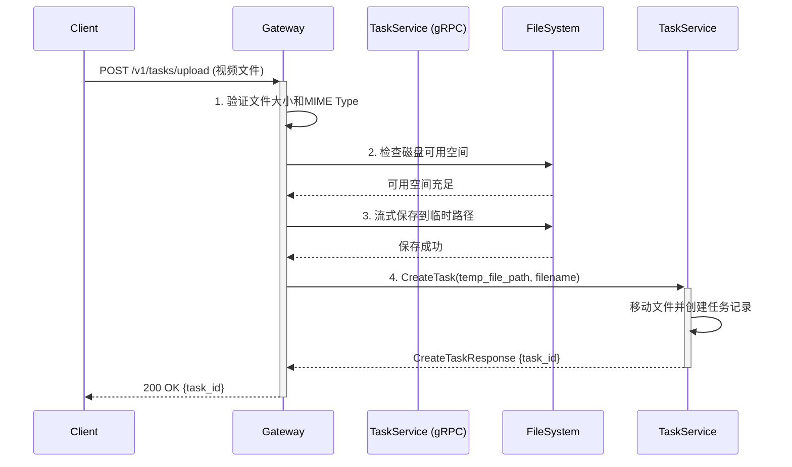
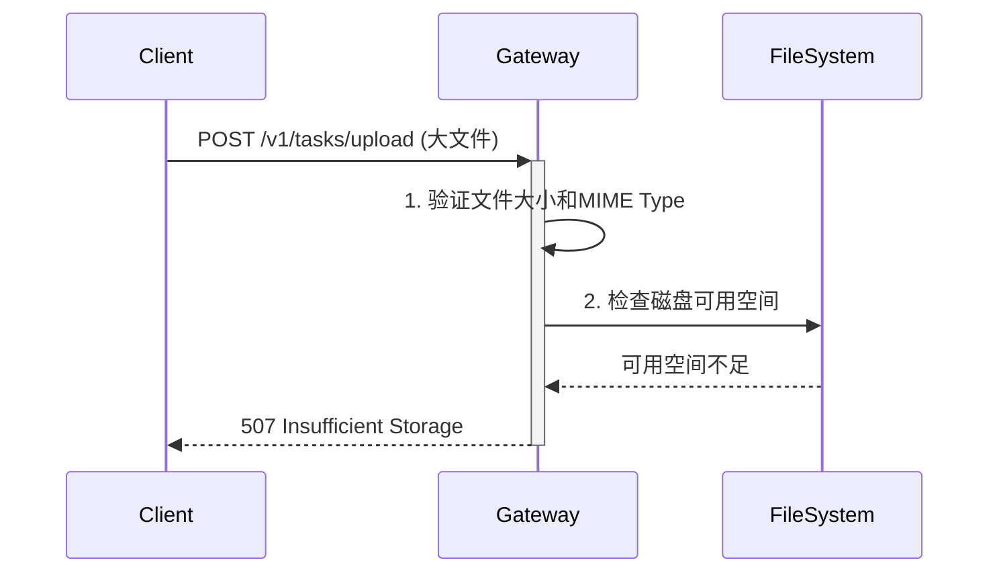
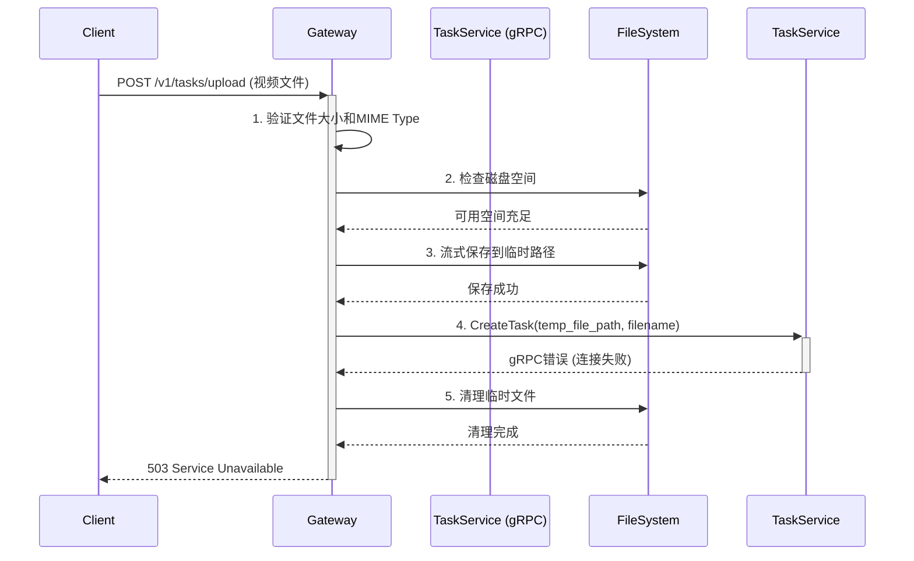
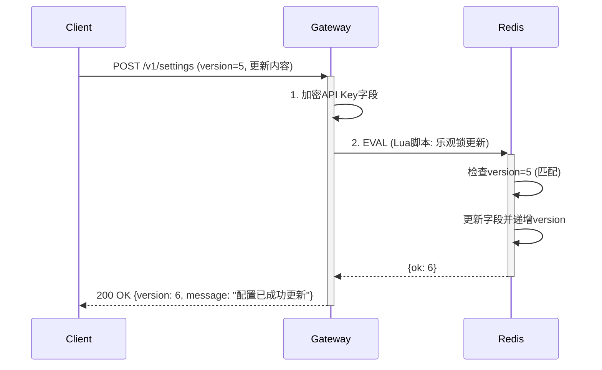
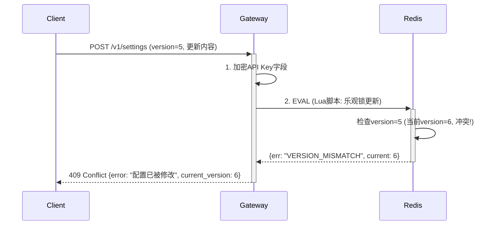
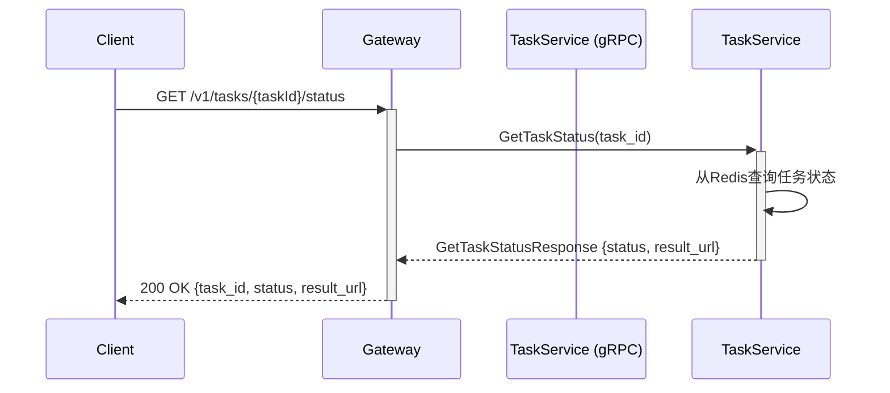
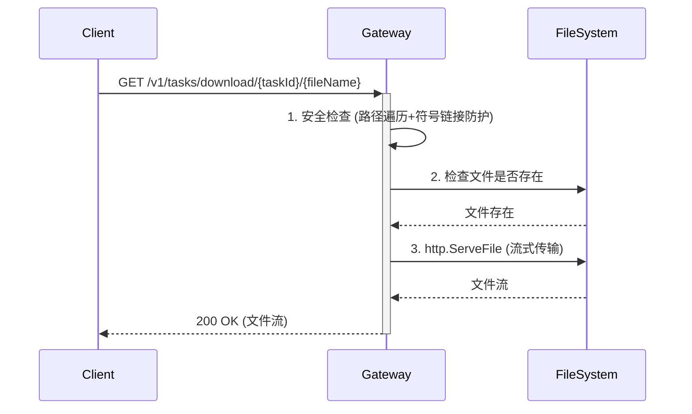

# **第二层设计文档：`gateway` 服务**

**文档版本**: 5.1
**关联宏观架构**: `notes/Base-Design.md` v1.2
**最后更新**: 2025-10-30

## **1. 服务定位与职责**

`gateway`服务 (`server/app/gateway`) 是整个视频翻译系统的唯一HTTP入口，作为轻量级的**协议转换与请求路由网关**。

### **1.1 核心职责**

1.  **协议处理**: 监听HTTP端口，管理API路由，处理外部HTTP请求。
2.  **请求校验**: 对传入的请求参数进行基础格式和有效性验证（包括文件MIME Type、大小等）。
3.  **文件处理**: 以流式方式处理文件的上传和下载，确保低内存占用。
4.  **资源预检**: 在接收文件上传前，检查服务器磁盘空间，防止因资源耗尽导致服务崩溃。
5.  **配置管理**: 提供API接口，供客户端读取和（安全地）更新存储在Redis中的应用配置。
6.  **逻辑委托**: 将所有业务逻辑通过gRPC调用，委托给下游的`task`服务。

### **1.2 架构原则**

*   `gateway`服务本身**不包含任何核心业务逻辑**，确保其作为接入层的轻量、高效和稳定。
*   所有文件操作必须使用**流式处理**，禁止将整个文件加载到内存。
*   所有外部输入必须经过**严格校验**，防止注入攻击和资源滥用。

### **1.3 非职责边界**

以下职责**不属于**Gateway服务，应委托给下游服务：

*   任务状态管理（由`task`服务负责）
*   视频处理逻辑（由`processor`服务负责）
*   AI服务调用（由`processor`服务负责）

---

## **2. 依赖服务**

Gateway服务依赖以下外部服务，服务启动时需确保这些依赖可用：

### **2.1 Task Service (gRPC)**

*   **地址配置**: `TASK_RPC_ADDRESS`
*   **用途**: 委托所有任务管理的业务逻辑
*   **关键接口**: `CreateTask`, `GetTaskStatus`
*   **容错策略**:
    *   **启动时**: 尝试连接。若失败，服务仍可启动但会进入**功能受限模式**，并输出警告日志。
    *   **功能受限模式行为**: 在此模式下，所有`/v1/tasks/`路径下的API请求都将直接返回`503 Service Unavailable`错误，并附带错误信息“任务服务当前不可用，请联系管理员”。只有`/v1/settings`接口可正常工作。

### **2.2 Redis**

*   **地址配置**: 通过go-zero框架的Redis配置（`RedisConf`）
*   **用途**: 存储应用配置（`app:settings`）
*   **持久化要求**: 必须启用AOF持久化
*   **容错策略**:
    *   **启动时**: 连接失败则**拒绝启动**，输出致命错误日志。
    *   **运行时**: 连接失败则所有依赖Redis的接口（如配置管理）返回`503 Service Unavailable`。
*   **初始化逻辑**: 服务启动时，会检查`app:settings`是否存在。若不存在，将从环境变量读取初始API Keys（可选），创建版本号为1的默认配置并写入Redis。

---

## **3. 关键配置项定义**

### **3.1 环境配置**

通过`etc/gateway-api.yaml`加载，修改后需重启服务生效。

| 配置项                       | 类型              | 作用                                                                                           |
| ---------------------------- | ----------------- | ---------------------------------------------------------------------------------------------- |
| `GATEWAY_PORT`               | `integer`         | 指定服务监听的HTTP端口。                                                                       |
| `LOCAL_STORAGE_PATH`         | `string`          | 指定用于存储临时文件和任务视频的根路径。                                                       |
| `MAX_UPLOAD_SIZE_MB`         | `integer`         | 限制单个上传文件的最大体积（MB）。                                                             |
| `SUPPORTED_MIME_TYPES`       | `[]string`        | 支持的视频文件MIME Type白名单 (例如: `["video/mp4", "video/quicktime", "video/x-matroska"]`)。 |
| `API_KEY_ENCRYPTION_SECRET`  | `string` (32字节) | 用于API密钥加密，**必需**。                                                                    |
| `TASK_RPC_ADDRESS`           | `string`          | 下游`task` gRPC服务的地址。                                                                    |
| `HTTP_TIMEOUT_SECONDS`       | `integer`         | HTTP请求超时时间（秒）。                                                                       |
| `MAX_CONCURRENT_CONNECTIONS` | `integer`         | HTTP服务器的最大并发连接数。                                                                   |

---

## **4. 架构约束**

本服务的所有设计均基于第一层架构定义的"2C2G服务器"核心约束。

*   **内存约束原则**: 所有文件处理必须采用流式操作，严禁将完整文件加载入内存。
*   **磁盘约束原则**: 服务必须具备资源预检能力。`uploadTask`逻辑中包含的磁盘空间检查（`fileSize * 3 + 500MB`）是此约束下的强制要求，旨在保证服务的稳定性。

---

## **5. 接口定义 (`gateway.api`)**

```go
syntax = "v1"

info(
	title: "视频翻译服务 API"
	desc: "用于创建和管理视频翻译任务的接口文档。"
	author: "我们的团队"
	version: "1.0.0"
)

// --------------------------------------------------
// 1. 类型定义 (请求体/响应体)
// --------------------------------------------------
type (
	// --- 应用配置相关 ---

	// 获取应用配置的响应体
	GetSettingsResponse {
		Version int64 `json:"version"` // [必需] 配置版本号，用于乐观锁。
		IsConfigured bool `json:"is_configured"` // [必需] 系统是否已完成基本配置。如果为false，前端应引导用户进行配置。

		// --- 处理模式 ---
		ProcessingMode string `json:"processing_mode"` // [必需] 视频处理模式。V1.0仅支持 "standard"。

		// --- AI服务配置 ---
		// 当 IsConfigured 为 true 时，以下必需字段必须有值。

		// ASR (语音识别) 服务配置
		AsrProvider string `json:"asr_provider"` // [条件性必需] ASR服务商标识。
		AsrApiKey   string `json:"asr_api_key"`  // [条件性必需] 脱敏后的API Key。
		AsrEndpoint string `json:"asr_endpoint,omitempty"` // [可选] 自定义的服务端点URL。

		// 文本润色服务配置 (可选功能)
		PolishingEnabled  bool   `json:"polishing_enabled"`  // [必需] 是否启用文本润色功能。
		PolishingProvider string `json:"polishing_provider,omitempty"` // [可选] 文本润色服务商标识。
		PolishingApiKey   string `json:"polishing_api_key,omitempty"`  // [可选] 脱敏后的API Key。

		// 文本翻译服务配置
		TranslationProvider string `json:"translation_provider"` // [条件性必需] 翻译服务商标识。
		TranslationApiKey   string `json:"translation_api_key"`  // [条件性必需] 脱敏后的API Key。
		TranslationEndpoint string `json:"translation_endpoint,omitempty"` // [可选] 自定义的服务端点URL。

		// 译文优化服务配置 (可选功能)
		OptimizationEnabled  bool   `json:"optimization_enabled"`  // [必需] 是否启用译文优化功能。
		OptimizationProvider string `json:"optimization_provider,omitempty"` // [可选] 译文优化服务商标识。
		OptimizationApiKey   string `json:"optimization_api_key,omitempty"`  // [可选] 脱敏后的API Key。

		// 声音克隆服务配置
		VoiceCloningProvider string `json:"voice_cloning_provider"` // [条件性必需] 声音克隆服务商标识。
		VoiceCloningApiKey   string `json:"voice_cloning_api_key"`  // [条件性必需] 脱敏后的API Key。
		VoiceCloningEndpoint string `json:"voice_cloning_endpoint,omitempty"` // [可选] 自定义的服务端点URL。

		// S2ST (AI配音) 服务配置 (V2.0 功能)
		S2stProvider string `json:"s2st_provider,omitempty"` // [可选] S2ST服务商标识。
		S2stApiKey   string `json:"s2st_api_key,omitempty"`  // [可选] 脱敏后的API Key。
	}

	// 更新应用配置的请求体
	UpdateSettingsRequest {
		Version int64 `json:"version"` // [必需] 当前配置的版本号，用于乐观锁检查。

		// --- 处理模式 ---
		ProcessingMode string `json:"processing_mode,omitempty"` // [可选] 更新处理模式。

		// --- AI服务配置 ---
		// 注意：除Version外，所有字段均为可选。只提交需要修改的字段。
		// API Key字段：如果提交的值包含"***", 则后端会忽略此字段，保持原值不变。

		AsrProvider string `json:"asr_provider,omitempty"` // [可选] ASR服务商标识。
		AsrApiKey   string `json:"asr_api_key,omitempty"`  // [可选] 如果包含"***"则保持原值。
		AsrEndpoint string `json:"asr_endpoint,omitempty"` // [可选] 自定义端点URL。

		PolishingEnabled  *bool  `json:"polishing_enabled,omitempty"` // [可选] 使用指针类型以区分 "未提交" 和 "提交了false值"。
		PolishingProvider string `json:"polishing_provider,omitempty"` // [可选] 文本润色服务商标识。
		PolishingApiKey   string `json:"polishing_api_key,omitempty"`  // [可选] 如果包含"***"则保持原值。

		TranslationProvider string `json:"translation_provider,omitempty"` // [可选] 翻译服务商标识。
		TranslationApiKey   string `json:"translation_api_key,omitempty"`  // [可选] 如果包含"***"则保持原值。
		TranslationEndpoint string `json:"translation_endpoint,omitempty"` // [可选] 自定义端点URL。

		OptimizationEnabled  *bool  `json:"optimization_enabled,omitempty"`  // [可选] 是否启用译文优化。
		OptimizationProvider string `json:"optimization_provider,omitempty"` // [可选] 译文优化服务商标识。
		OptimizationApiKey   string `json:"optimization_api_key,omitempty"`  // [可选] 如果包含"***"则保持原值。

		VoiceCloningProvider string `json:"voice_cloning_provider,omitempty"` // [可选] 声音克隆服务商标识。
		VoiceCloningApiKey   string `json:"voice_cloning_api_key,omitempty"`  // [可选] 如果包含"***"则保持原值。
		VoiceCloningEndpoint string `json:"voice_cloning_endpoint,omitempty"` // [可选] 自定义端点URL。

		S2stProvider string `json:"s2st_provider,omitempty"` // [可选] S2ST服务商标识。
		S2stApiKey   string `json:"s2st_api_key,omitempty"`  // [可选] 如果包含"***"则保持原值。
	}

	// 更新应用配置的响应体
	UpdateSettingsResponse {
		Version int64  `json:"version"` // [必需] 更新成功后，返回新的配置版本号。
		Message string `json:"message"` // [必需] 成功提示信息，例如 "配置已成功更新"。
	}

	// --- 任务管理相关 ---

	// 上传任务的响应体
	UploadTaskResponse {
		TaskId string `json:"task_id"` // [必需] 创建成功后返回的唯一任务ID。
	}

	// 查询任务状态的请求参数 (定义路径参数)
	GetTaskStatusRequest {
		TaskId string `path:"taskId"` // [必需] 需要查询的任务ID。
	}

	// 查询任务状态的响应体
	GetTaskStatusResponse {
		TaskId       string `json:"task_id"`                   // [必需] 任务ID。
		Status       string `json:"status"`                    // [必需] 任务当前状态: "PENDING", "PROCESSING", "COMPLETED", "FAILED"。
		ResultUrl    string `json:"result_url,omitempty"`    // [可选] 仅在任务状态为 "COMPLETED" 时出现。格式为 "/v1/tasks/download/{taskId}/{fileName}"。
		ErrorMessage string `json:"error_message,omitempty"` // [可选] 仅在任务状态为 "FAILED" 时出现，包含失败原因。
	}

	// 下载文件的请求参数 (定义路径参数)
	DownloadFileRequest {
		TaskId   string `path:"taskId"`   // [必需] 文件所属的任务ID。
		FileName string `path:"fileName"` // [必需] 要下载的文件名, 例如 "result.mp4" 或 "original.mp4"。
	}
)

// --------------------------------------------------
// 2. 服务与路由定义
// --------------------------------------------------

@server(
	group: settings
	prefix: /v1/settings
)
service gateway-api {
	@doc("获取当前的应用配置信息")
	@handler getSettings
	get / returns (GetSettingsResponse)

	@doc("更新应用配置信息")
	@handler updateSettings
	post / (UpdateSettingsRequest) returns (UpdateSettingsResponse)
}

@server(
	group: task
	prefix: /v1/tasks
)
service gateway-api {
	@doc("上传一个视频文件以创建一个新的翻译任务")
	@handler uploadTask
	post /upload (UploadTaskResponse)

	@doc("根据任务ID获取该任务的实时状态")
	@handler getTaskStatus
	get /:taskId/status (GetTaskStatusRequest) returns (GetTaskStatusResponse)

	@doc("下载任务关联的文件（如处理完成的视频）")
	@handler downloadFile
	get /download/:taskId/:fileName (DownloadFileRequest)
}
```

---

## **6. 核心逻辑伪代码**

### **6.1 uploadTaskLogic (文件上传与任务创建)**

```
function uploadTaskLogic(httpRequest):
    1. 从请求中解析出文件流和原始文件名。
       IF 解析失败 THEN 返回 400 Bad Request。

    2. 检查文件大小是否超限。
       IF 超限 THEN 返回 413 Payload Too Large。

    3. 通过读取文件头部字节，验证文件的MIME Type是否在白名单内。
       IF MIME Type不支持 THEN 返回 415 Unsupported Media Type。

    4. 检查磁盘可用空间。
       IF 空间不足 THEN 返回 507 Insufficient Storage。

    5. 以流式方式将文件保存到临时路径。
       IF 保存失败 THEN 清理临时文件，返回 500 Internal Server Error。

    6. 调用 gRPC `task.CreateTask` (传入临时文件路径和原始文件名)。
       IF gRPC调用失败 THEN
           清理临时文件。
           返回 503 Service Unavailable。

    7. 返回 200 OK，响应体为任务ID。
```

### **6.2 updateSettingsLogic (应用配置更新)**

```
function updateSettingsLogic(updateRequest):
    1. 验证请求参数（如version > 0）。
       IF 验证失败 THEN 返回 400 Bad Request。

    2. 调用一个执行原子性更新的Lua脚本，传入更新的字段。
       // 脚本内部执行乐观锁版本检查
    3. IF 脚本返回版本冲突 THEN 返回 409 Conflict。
    4. IF 脚本执行成功 THEN 返回 200 OK，并附带新的版本号。
    5. ELSE 返回 500 Internal Server Error。
```

### **6.3 downloadFileLogic (文件下载)**

```
function downloadFileLogic(downloadRequest):
    1. 从请求路径中解析 `taskId` 和 `fileName`。

    2. 执行路径遍历安全检查。
       IF 包含非法字符 THEN 返回 400 Bad Request。

    3. 使用平台安全的方式拼接文件路径。

    4. 执行符号链接安全检查。
       IF 是符号链接 THEN 返回 400 Bad Request。

    5. 检查文件是否存在。
       IF 不存在 THEN 返回 404 Not Found。

    6. 通过一个能自动处理Range请求和MIME Type的机制来流式传输文件。
```

---

## **7. 服务间交互 (时序图)**

### **7.1 场景1: 上传任务 - 成功路径**



### **7.2 场景2: 上传任务 - 磁盘空间不足**



### **7.3 场景3: 上传任务 - Task服务不可用**



### **7.4 场景4: 更新配置 - 成功路径**



### **7.5 场景5: 更新配置 - 版本冲突**



### **7.6 场景6: 查询任务状态**



### **7.7 场景7: 下载文件**



---

## **8. 错误码清单**

### **8.1 客户端错误 (4xx)**

| HTTP状态码                 | 错误码 (内部)            | 触发场景                                                        | 错误消息示例                                   |
| -------------------------- | ------------------------ | --------------------------------------------------------------- | ---------------------------------------------- |
| 400 Bad Request            | `INVALID_ARGUMENT`       | 1. 请求体格式错误<br>2. 路径参数包含非法字符<br>3. 访问符号链接 | "无效的任务ID"                                 |
| 404 Not Found              | `NOT_FOUND`              | 1. 请求的任务不存在<br>2. 请求的文件不存在                      | "文件不存在"                                   |
| 409 Conflict               | `CONFLICT`               | 更新配置时版本号冲突（乐观锁失败）                              | "配置已被其他请求修改，请刷新后重试"           |
| 413 Payload Too Large      | `PAYLOAD_TOO_LARGE`      | 上传文件超过 `MAX_UPLOAD_SIZE_MB` 限制                          | "文件大小超过限制 (1024MB)"                    |
| 415 Unsupported Media Type | `UNSUPPORTED_MEDIA_TYPE` | 上传文件的真实MIME Type不在白名单内。                           | "不支持的文件格式，请上传mp4, mov等视频文件。" |
| 499 Client Closed Request  | `CLIENT_CLOSED`          | 客户端在上传过程中断开连接                                      | (无响应体)                                     |

### **8.2 服务端错误 (5xx)**

| HTTP状态码                | 错误码 (内部)          | 触发场景                                                   | 错误消息示例         |
| ------------------------- | ---------------------- | ---------------------------------------------------------- | -------------------- |
| 500 Internal Server Error | `INTERNAL_ERROR`       | 1. 文件系统操作失败<br>2. 加密/解密失败<br>3. 未预期的异常 | "文件保存失败"       |
| 503 Service Unavailable   | `UNAVAILABLE`          | 1. Task Service不可用<br>2. Redis连接失败                  | "任务服务不可用"     |
| 507 Insufficient Storage  | `INSUFFICIENT_STORAGE` | 服务器磁盘空间不足                                         | "服务器磁盘空间不足" |

---

## **9. 关键数据结构**

### **9.1 Redis: `app:settings` (HASH)**

存储应用配置，支持热更新。所有字段与第5章`GetSettingsResponse`定义一致，但有以下差异：

| 字段名                   | 类型    | 示例值                | 说明                                     |
| ------------------------ | ------- | --------------------- | ---------------------------------------- |
| `version`                | integer | `1`                   | 乐观锁版本号                             |
| `is_configured`          | string  | `"true"`              | 是否已完成基本配置（布尔值存储为字符串） |
| `processing_mode`        | string  | `"standard"`          | 处理模式                                 |
| `asr_provider`           | string  | `"openai-whisper"`    | ASR服务商标识                            |
| `asr_api_key`            | string  | `"AES加密后的Base64"` | 加密存储的API Key                        |
| `asr_endpoint`           | string  | `""`                  | 自定义端点URL（可选）                    |
| `polishing_enabled`      | string  | `"true"`              | 是否启用文本润色（布尔值存储为字符串）   |
| `polishing_provider`     | string  | `"openai-gpt4o"`      | 文本润色服务商标识                       |
| `polishing_api_key`      | string  | `"AES加密后的Base64"` | 加密存储的API Key                        |
| `translation_provider`   | string  | `"google-gemini"`     | 翻译服务商标识                           |
| `translation_api_key`    | string  | `"AES加密后的Base64"` | 加密存储的API Key                        |
| `translation_endpoint`   | string  | `""`                  | 自定义端点URL（可选）                    |
| `optimization_enabled`   | string  | `"false"`             | 是否启用译文优化（布尔值存储为字符串）   |
| `optimization_provider`  | string  | `""`                  | 译文优化服务商标识                       |
| `optimization_api_key`   | string  | `""`                  | 加密存储的API Key                        |
| `voice_cloning_provider` | string  | `"elevenlabs"`        | 声音克隆服务商标识                       |
| `voice_cloning_api_key`  | string  | `"AES加密后的Base64"` | 加密存储的API Key                        |
| `voice_cloning_endpoint` | string  | `""`                  | 自定义端点URL（可选）                    |
| `s2st_provider`          | string  | `""`                  | S2ST服务商标识（V2.0）                   |
| `s2st_api_key`           | string  | `""`                  | 加密存储的API Key（V2.0）                |

**注意事项**:
- 所有API Key字段必须加密后存储
- 布尔值字段存储为字符串 "true" 或 "false"
- 空值字段存储为空字符串 ""

### **9.2 文件系统结构**

```
{LOCAL_STORAGE_PATH}/
├── _tmp/                          # 临时文件目录
│   └── {upload_id}                # 上传中的临时文件
└── videos/                        # 任务文件目录
    └── {task_id}/                 # 每个任务独立目录
        ├── original.mp4           # 原始视频文件
        └── result.mp4             # 处理完成的视频文件
```

---

## **10. 安全性设计**

### **10.1 API Key保护**

1.  **加密存储**: 必须使用行业标准的AEAD加密算法（如AES-GCM系列），密钥长度不低于256位。密钥来自环境变量 `API_KEY_ENCRYPTION_SECRET`。
2.  **脱敏返回**: `GET /v1/settings` 返回的API Key必须为脱敏格式，如 `"sk-***-xyz789"`。
3.  **更新处理**: 客户端提交脱敏值时，后端必须保持原值不变。

### **10.2 路径遍历与符号链接防护**

1.  **输入验证**: 必须严格检查路径参数，拒绝包含路径遍历字符的请求。
2.  **路径拼接**: 必须使用平台安全的方式拼接路径。
3.  **符号链接检查**: 在访问文件前，必须检查最终路径是否为符号链接，若是则拒绝访问。

---

## **12. 文档变更历史**

| 版本 | 日期       | 变更内容                                                                                                                                                            |
| ---- | ---------- | ------------------------------------------------------------------------------------------------------------------------------------------------------------------- |
| 4.0  | 2025-10-29 | 1. 解决API契约与初始化逻辑矛盾(引入IsConfigured)。 2. 修正文件验证为MIME Type嗅探。 3. 明确“功能受限模式”行为。 4. 增加符号链接攻击防护。 5. 增加资源估算模型说明。 |
| 3.0  | 2025-10-29 | 全面优化文档结构，增加依赖服务、性能约束、启动流程等。                                                                                                              |