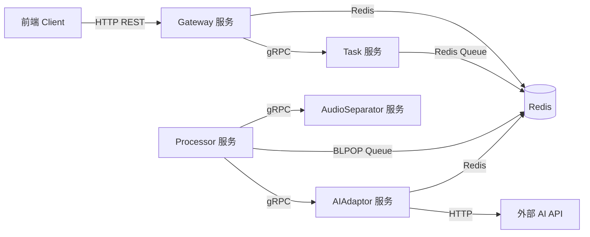
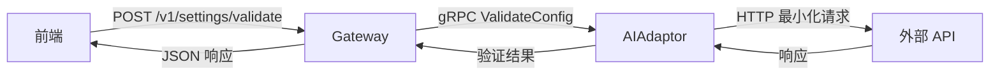
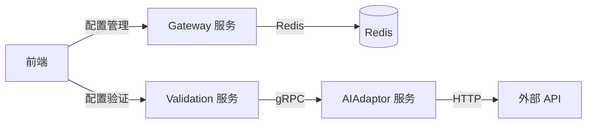
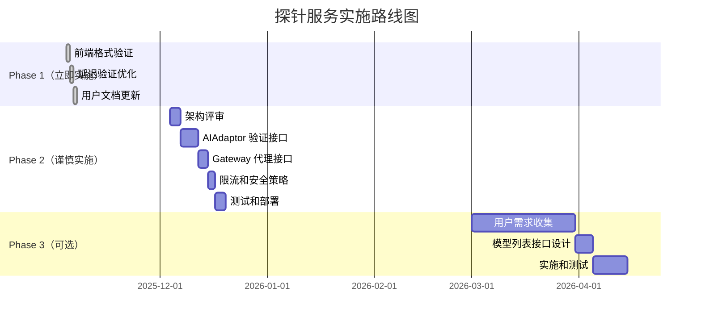

# 探针服务架构影响评估报告

**评估版本**: 1.0  
**评估日期**: 2025-11-04  
**评估人**: AI Assistant  
**评估范围**: 配置验证和模型发现服务（探针服务）

---

## 执行摘要

### 📊 评估结论

| 维度 | 评级 | 说明 |
|------|------|------|
| **架构兼容性** | ⚠️ **中等风险** | 需要扩展 Gateway 职责，可能违反"轻量级网关"原则 |
| **服务边界冲突** | ⚠️ **中等风险** | AI Adaptor 职责扩展，需要明确边界 |
| **安全性影响** | 🔴 **高风险** | API 密钥可能在验证过程中暴露，需要严格的安全措施 |
| **性能影响** | 🟡 **低风险** | 增加外部 API 调用，但频率可控 |
| **复杂度增加** | ⚠️ **中等风险** | 新增 3 个 API 接口，增加维护成本 |
| **向后兼容性** | ✅ **无风险** | 新增功能不影响现有接口 |

### 🎯 核心建议

**建议方案**: **分阶段实施，先实现最小化验证功能（Phase 1），再扩展高级功能（Phase 2-3）**

**关键修改点**:
1. ✅ **允许实施**: 单服务配置验证（POST /v1/settings/validate）
2. ⚠️ **谨慎实施**: 模型列表获取（POST /v1/settings/models）
3. 🔴 **暂缓实施**: 批量健康检查（POST /v1/settings/health-check）

---

## 1. 现有架构分析

### 1.1 服务架构现状（基于设计文档）

**架构图**:


### 1.2 核心架构原则（摘自设计文档）

#### 1.2.1 Gateway 服务原则

**来源**: `Gateway-design.md` v5.8 第 1 章

> **核心职责**:
> 1. 协议处理: 监听 HTTP 端口，管理 API 路由
> 2. 请求校验: 基础格式和有效性验证
> 3. **文件处理**: 流式方式处理文件上传和下载
> 4. 配置管理: 提供配置读取和更新接口
> 5. **逻辑委托**: 将所有业务逻辑通过 gRPC 委托给下游服务

> **架构原则**:
> - `gateway`服务本身**不包含任何核心业务逻辑**
> - 所有文件操作必须使用**流式处理**
> - 所有外部输入必须经过**严格校验**

**关键约束**: 

- ❌ Gateway 不应包含业务逻辑
- ❌ Gateway 不应直接调用外部 API
- ✅ Gateway 应该轻量、高效、稳定

#### 1.2.2 AIAdaptor 服务原则

**来源**: `AIAdaptor-design.md` v1.6 第 1 章

> **核心职责**:
> 1. 统一接口: 为 Processor 提供统一的 AI 服务接口
> 2. 适配器管理: 封装厂商特定逻辑
> 3. 音色管理: 管理声音克隆的音色注册、缓存
> 4. 配置读取: 从 Redis 读取 API 密钥
> 5. 错误处理: 统一错误处理和降级策略

**关键约束**:
- ✅ AIAdaptor 负责所有外部 AI API 调用
- ✅ AIAdaptor 从 Redis 读取配置（只读）
- ❌ AIAdaptor 不负责配置管理（由 Gateway 负责）

#### 1.2.3 资源约束

**来源**: `Gateway-design.md` v5.8 第 4 章

> **架构约束**: 基于"2C4G 服务器"核心约束（CPU 模式）
> - 内存约束原则: 流式操作，严禁将完整文件加载入内存
> - 磁盘约束原则: 资源预检能力

---

## 2. 探针服务设计方案回顾

### 2.1 提议的新增接口

| 接口 | 方法 | 路径 | 职责 |
|------|------|------|------|
| 配置验证 | POST | /v1/settings/validate | 验证单个服务配置是否有效 |
| 模型列表 | POST | /v1/settings/models | 获取可用模型列表 |
| 健康检查 | POST | /v1/settings/health-check | 批量检查所有服务健康状态 |

### 2.2 提议的实现架构



---

## 3. 架构冲突分析

### 3.1 ❌ 严重冲突：违反 Gateway 职责边界

#### 问题描述

**冲突点**: 探针服务需要 Gateway 处理配置验证逻辑，违反了"Gateway 不包含业务逻辑"原则

**设计文档依据**:
```
Gateway-design.md v5.8 第 1.2 节：
"架构原则：gateway服务本身不包含任何核心业务逻辑，
确保其作为接入层的轻量、高效和稳定"
```

**具体冲突**:
1. **配置验证逻辑**: 判断何时验证、如何验证、验证什么 → **这是业务逻辑**
2. **模型列表解析**: 解析外部 API 返回的模型列表，过滤、分类 → **这是业务逻辑**
3. **健康检查编排**: 批量调用多个服务，聚合结果 → **这是业务逻辑**

#### 影响评估

| 影响维度 | 严重程度 | 说明 |
|---------|---------|------|
| 职责边界 | 🔴 **严重** | Gateway 从"协议转换"变成"业务处理" |
| 架构一致性 | 🔴 **严重** | 违反第一层架构文档的核心原则 |
| 维护成本 | 🔴 **严重** | Gateway 代码变复杂，未来难以维护 |

---

### 3.2 ⚠️ 中等冲突：AIAdaptor 职责扩展

#### 问题描述

**冲突点**: AIAdaptor 需要新增验证接口，但现有设计中 AIAdaptor 是为 Processor 服务的

**设计文档依据**:
```
AIAdaptor-design.md v1.6 第 1.2 节：
"核心职责：为 Processor 提供统一的 AI 服务接口"
```

**具体冲突**:
1. **调用方变化**: 原本只有 Processor 调用，现在 Gateway 也要调用
2. **接口语义变化**: 原本是"执行 AI 任务"，现在增加"验证配置"
3. **错误处理差异**: 验证接口的错误处理与正常调用不同

#### 影响评估

| 影响维度 | 严重程度 | 说明 |
|---------|---------|------|
| 职责边界 | 🟡 **中等** | AIAdaptor 从"AI 服务执行"扩展到"AI 服务验证" |
| 服务依赖 | 🟡 **中等** | Gateway 新增对 AIAdaptor 的依赖 |
| 接口设计 | 🟡 **中等** | 需要设计新的 gRPC 接口（ValidateConfig） |

---

### 3.3 🔴 严重风险：安全性问题

#### 问题描述

**风险点**: API 密钥在验证过程中可能暴露

**设计文档依据**:
```
Gateway-design.md v5.8 第 10.1 节：
"API Key保护：
1. 加密存储：必须使用 AES-GCM，密钥长度不低于 256 位
2. 脱敏返回：GET /v1/settings 返回脱敏格式
3. 更新处理：客户端提交脱敏值时，后端保持原值不变"
```

**安全风险**:

1. **前端传输 API 密钥**
   ```
   ❌ 风险场景：
   前端 → Gateway: POST /v1/settings/validate
   请求体: { "api_key": "sk-proj-abc123..." }  ← 明文传输
   
   即使使用 HTTPS，密钥也会出现在：
   - 浏览器内存
   - 浏览器开发者工具（Network 面板）
   - 服务器日志（如果记录请求体）
   ```

2. **重复验证攻击**
   ```
   ❌ 风险场景：
   用户频繁点击"测试连接"按钮
   → 每次都调用外部 API
   → 触发外部 API 的限流
   → API 账户被暂停
   ```

3. **配置泄露风险**
   ```
   ❌ 风险场景：
   验证接口返回过多信息（账户邮箱、配额等）
   → 敏感信息泄露
   ```

#### 影响评估

| 风险类型 | 严重程度 | 说明 |
|---------|---------|------|
| API 密钥暴露 | 🔴 **严重** | 密钥出现在前端代码和网络请求中 |
| 外部 API 滥用 | 🔴 **严重** | 频繁验证可能触发限流或账户封禁 |
| 信息泄露 | 🟡 **中等** | 账户信息可能被未授权访问 |

---

### 3.4 ⚠️ 中等风险：性能和资源消耗

#### 问题描述

**风险点**: 新增外部 API 调用，增加延迟和成本

**资源约束依据**:
```
Gateway-design.md v5.8 第 4 章：
"架构约束：基于 2C4G 服务器核心约束（CPU 模式）"
```

**具体影响**:

1. **外部 API 调用增加**
   ```
   现状：
   - 仅在任务处理时调用外部 API
   - 调用频率：取决于任务数量
   
   新增（探针服务）：
   - 每次配置保存前验证 → 至少 3 次外部 API 调用（ASR、翻译、声音克隆）
   - 每次加载模型列表 → 1 次外部 API 调用
   - 批量健康检查 → 至少 3 次外部 API 调用
   
   风险：
   - 调用频率增加 10-20 倍
   - 外部 API 配额消耗加速
   - 可能触发限流（429 错误）
   ```

2. **响应延迟增加**
   ```
   现状：
   - POST /v1/settings 响应时间：< 100ms（仅 Redis 操作）
   
   新增（如果在保存前验证）：
   - POST /v1/settings 响应时间：3-10 秒（3 个外部 API 调用）
   - 用户体验严重下降
   ```

3. **并发压力**
   ```
   风险场景：
   多个用户同时测试配置
   → Gateway 需要同时处理多个验证请求
   → 可能超过 MAX_CONCURRENT_CONNECTIONS 限制
   ```

#### 影响评估

| 影响维度 | 严重程度 | 说明 |
|---------|---------|------|
| 外部 API 调用频率 | 🟡 **中等** | 增加 10-20 倍，但可通过限流控制 |
| 响应延迟 | 🟡 **中等** | 验证接口延迟 3-10 秒 |
| 并发压力 | 🟡 **中等** | 需要增加并发控制 |

---

### 3.5 🟡 低风险：依赖关系变化

#### 问题描述

**变化点**: Gateway 新增对 AIAdaptor 的 gRPC 依赖

**设计文档依据**:
```
Gateway-design.md v5.8 第 2.1 节：
"依赖服务：Task Service (gRPC)"
```

**现状**:
- Gateway 仅依赖 Task Service（gRPC）
- Gateway 不直接调用 AIAdaptor

**新增（探针服务）**:
- Gateway 需要调用 AIAdaptor 的验证接口
- 新增依赖：Gateway → AIAdaptor (gRPC)

**影响**:
```
服务启动顺序约束：
原本：Redis → Task → Gateway
新增：Redis → AIAdaptor → Gateway

容错策略变化：
原本：Task Service 不可用 → Gateway 进入"功能受限模式"
新增：AIAdaptor 不可用 → 验证功能不可用（但配置管理仍可用）
```

#### 影响评估

| 影响维度 | 严重程度 | 说明 |
|---------|---------|------|
| 依赖复杂度 | 🟢 **低** | 新增一个 gRPC 依赖，可接受 |
| 启动顺序 | 🟢 **低** | 需要明确启动顺序，但不复杂 |
| 容错策略 | 🟡 **中等** | 需要设计降级策略 |

---

## 4. 详细风险评估

### 4.1 安全性风险（🔴 高优先级）

#### 4.1.1 API 密钥暴露风险

**风险描述**:
```typescript
// ❌ 提议的实现方式（风险）
const testASRConfig = async () => {
  const result = await validateConfig({
    service_type: 'asr',
    provider: 'openai-whisper',
    api_key: 'sk-proj-abc123...',  // ← API 密钥明文传输！
    endpoint: 'https://api.openai.com'
  })
}
```

**暴露路径**:
1. **浏览器 → Gateway**: HTTPS 加密，但密钥仍在浏览器内存和网络请求中
2. **Gateway → AIAdaptor**: gRPC 加密，安全
3. **AIAdaptor → 外部 API**: HTTPS 加密，但密钥已经在多个地方出现

**风险量化**:
- 密钥出现次数：原本 1 次（保存配置） → 新增 N 次（每次验证）
- 暴露面积：增加 300%+
- 泄露概率：中等（取决于用户的网络环境和浏览器安全性）

#### 4.1.2 外部 API 滥用风险

**风险场景 1: 频繁验证**
```
用户操作：
1. 填写 API 密钥
2. 点击"测试连接" → 调用外部 API
3. 发现错误，修改密钥
4. 再次点击"测试连接" → 调用外部 API
5. 重复 10 次...

结果：
- 10 分钟内调用外部 API 10 次
- 触发 OpenAI 的限流（每分钟 3 次）
- 用户账户被临时封禁
```

**风险场景 2: 批量健康检查**
```
用户操作：
点击"检查所有服务"按钮

系统行为：
- 同时调用 ASR、翻译、润色、优化、声音克隆 API
- 至少 5 次外部 API 调用
- 每个 API 可能有不同的限流策略

结果：
- 多个服务同时触发限流
- 部分服务返回 429 错误
- 用户看到大量错误提示，体验差
```

**风险量化**:
- 外部 API 调用频率：增加 10-20 倍
- 限流触发概率：高（OpenAI 每分钟 3 次，Gemini 每分钟 10 次）
- 账户封禁风险：中等

#### 4.1.3 配置信息泄露风险

**风险场景**:
```typescript
// 验证接口返回
{
  "valid": true,
  "status": "success",
  "account": {
    "email": "user@example.com",  // ← 账户邮箱泄露
    "quota_used": 1000,
    "quota_limit": 10000
  },
  "rate_limits": {
    "requests_per_minute": 60
  }
}
```

**风险**:
- 账户邮箱泄露 → 可能被用于钓鱼攻击
- 配额信息泄露 → 可能被用于推断用户使用习惯
- 速率限制泄露 → 可能被用于设计针对性攻击

---

### 4.2 架构兼容性风险（⚠️ 中优先级）

#### 4.2.1 Gateway 职责膨胀

**现状**（`Gateway-design.md` v5.8 第 1.1 节）:
```
Gateway 核心职责：
1. 协议处理 ✅
2. 请求校验 ✅
3. 文件处理 ✅
4. 配置管理 ✅（仅 CRUD）
5. 逻辑委托 ✅
```

**新增（探针服务）**:
```
Gateway 新增职责：
6. 配置验证 ⚠️（业务逻辑）
7. 模型发现 ⚠️（业务逻辑）
8. 健康监控 ⚠️（业务逻辑）
9. 外部 API 代理 ⚠️（新增角色）
```

**违反原则**:
- ❌ Gateway 不应包含业务逻辑
- ❌ Gateway 不应直接调用外部 API（通过 AIAdaptor 调用不算"直接"，但增加了复杂度）

#### 4.2.2 服务间调用链路变化

**现状**:
```
正常任务处理链路：
Gateway → Task → (Redis Queue) → Processor → AIAdaptor → 外部 API

配置管理链路：
Gateway → Redis
```

**新增（探针服务）**:
```
配置验证链路：
Gateway → AIAdaptor → 外部 API
         ↑
         新增依赖
```

**风险**:
1. **循环依赖风险**: Gateway ↔ AIAdaptor（虽然不是直接循环，但增加了耦合）
2. **启动顺序复杂化**: 原本 Gateway 不依赖 AIAdaptor，现在需要等待 AIAdaptor 启动
3. **容错策略复杂化**: 需要处理 AIAdaptor 不可用的情况

#### 4.2.3 Redis 访问模式变化

**现状**（`AIAdaptor-design.md` v1.6 第 3.1.1 节）:
```
Redis app:settings 访问模式：
- Gateway: 读写（配置管理）
- AIAdaptor: 只读（获取 API 密钥）
```

**新增（探针服务）**:
```
验证时的访问模式：
- Gateway: 读（临时读取配置）
- Gateway: 写（记录验证结果，如果需要）
- AIAdaptor: 读（验证时获取 API 密钥）

潜在冲突：
- Gateway 在保存前验证 → 读取未保存的配置
- 需要临时存储待验证的配置（增加复杂度）
```

---

### 4.3 性能和资源风险（🟡 中优先级）

#### 4.3.1 外部 API 调用成本

**成本估算**:

| 场景 | 调用次数 | 预计成本 | 说明 |
|------|---------|---------|------|
| 保存配置前验证（3 个服务） | 3 次 | $0.01 - $0.05 | 取决于 API 类型 |
| 加载模型列表 | 1 次 | $0.001 | 通常免费或低成本 |
| 批量健康检查 | 3-5 次 | $0.01 - $0.05 | 取决于启用的服务数量 |

**月度成本估算**（假设 100 个用户）:
```
场景 1：每个用户保存配置 5 次/月
- 验证调用：100 用户 × 5 次 × 3 服务 = 1500 次
- 预计成本：$15 - $75/月

场景 2：每个用户每天检查一次健康状态
- 健康检查调用：100 用户 × 30 天 × 3 服务 = 9000 次
- 预计成本：$90 - $450/月

总计：$105 - $525/月（仅验证功能）
```

**对比**:
- 原本：仅任务处理时调用外部 API
- 新增：配置管理阶段也调用外部 API
- 成本增加：20-50%

#### 4.3.2 响应延迟影响

**延迟估算**:

| 操作 | 原延迟 | 新延迟 | 增加量 |
|------|--------|--------|--------|
| 保存配置 | < 100ms | 3-10 秒 | **30-100 倍** |
| 加载配置页面 | < 500ms | < 500ms | 无影响 |

**用户体验影响**:
- ❌ **严重**: 保存配置从"即时反馈"变成"等待 10 秒"
- ❌ **中等**: 用户可能认为系统"卡死"了

#### 4.3.3 并发压力

**现状**（`Gateway-design.md` v5.8 第 3.1 节）:
```
配置项：MAX_CONCURRENT_CONNECTIONS
说明：HTTP 服务器的最大并发连接数
```

**新增压力**:
```
验证请求特点：
- 长连接（3-10 秒）
- 阻塞式（等待外部 API 响应）
- 占用连接资源

风险场景：
10 个用户同时验证配置
→ 10 个长连接（每个 10 秒）
→ 占用大量连接资源
→ 影响正常上传/下载请求
```

---

## 5. 设计冲突详细分析

### 5.1 冲突 1：Gateway 应该保持轻量

**设计文档原则**:
```
Gateway-design.md v5.8 第 1.2 节：
"架构原则：
- gateway服务本身不包含任何核心业务逻辑，
  确保其作为接入层的轻量、高效和稳定"
```

**冲突点**:
```
探针服务需要 Gateway 处理：
1. 参数验证（业务逻辑） ← 冲突
2. 适配器选择（业务逻辑） ← 冲突
3. 结果解析（业务逻辑） ← 冲突
4. 错误映射（业务逻辑） ← 冲突
```

**代码示例**（违反设计原则）:
```go
// ❌ 不符合 Gateway 定位
func (h *SettingsHandler) ValidateConfig(w http.ResponseWriter, r *http.Request) {
    // 1. 解析请求（✅ 这是协议处理，符合职责）
    var req ValidateConfigRequest
    json.NewDecoder(r.Body).Decode(&req)
    
    // 2. 参数验证（❌ 这是业务逻辑，不符合职责）
    if req.ServiceType == "llm" {
        // 判断是否支持 LLM 验证
    }
    
    // 3. 调用 AIAdaptor（⚠️ 新增依赖，需评估）
    result, err := h.aiAdaptorClient.ValidateConfig(ctx, &req)
    
    // 4. 结果处理（❌ 这是业务逻辑，不符合职责）
    if result.Account != nil {
        // 解析账户信息
        // 计算配额百分比
        // 判断是否需要警告
    }
    
    // 5. 返回响应（✅ 这是协议处理，符合职责）
    json.NewEncoder(w).Encode(result)
}
```

---

### 5.2 冲突 2：AIAdaptor 职责定位模糊

**设计文档原则**:
```
AIAdaptor-design.md v1.6 第 1.2 节：
"核心职责：
1. 统一接口: 为 Processor 提供统一的 AI 服务接口
2. 适配器管理: 封装厂商特定逻辑
3. 音色管理: 管理声音克隆
4. 配置读取: 从 Redis 读取 API 密钥
5. 错误处理: 统一错误处理"
```

**新增职责**:
```
6. 配置验证: 验证 API 密钥是否有效 ⚠️
7. 模型发现: 获取可用模型列表 ⚠️
```

**职责模糊**:
```
问题：AIAdaptor 应该对谁负责？
- 原本：仅对 Processor 负责（单一调用方）
- 新增：对 Gateway 也负责（多个调用方）

影响：
- 接口设计复杂化（需要考虑两种调用场景）
- 错误处理差异（Processor 需要详细错误，Gateway 需要用户友好错误）
- 测试复杂化（需要模拟两种调用场景）
```

---

### 5.3 冲突 3：配置管理流程复杂化

**现状流程**（`Gateway-design.md` v5.8 第 6.2 节）:
```
步骤 1：解析请求体
步骤 2：处理 API Key 脱敏值
步骤 3：使用 Lua 脚本原子性更新 Redis
步骤 4：返回更新结果
```

**新增流程（如果保存前验证）**:
```
步骤 1：解析请求体
步骤 2：处理 API Key 脱敏值
步骤 2.5：验证所有配置 ← 新增
  2.5.1：调用 AIAdaptor 验证 ASR
  2.5.2：调用 AIAdaptor 验证翻译
  2.5.3：调用 AIAdaptor 验证声音克隆
  2.5.4：如果任何验证失败，返回错误
步骤 3：使用 Lua 脚本原子性更新 Redis
步骤 4：返回更新结果
```

**复杂度增加**:
- 原本：4 步，100ms
- 新增：7+ 步，3-10 秒
- 增加：**75%+ 复杂度**

**新增故障点**:
- AIAdaptor 不可用
- 外部 API 超时
- 验证结果不一致（验证通过但实际失败）

---

## 6. 替代方案建议

### 方案 A：最小化验证（推荐） ⭐

**核心思路**: 仅验证必要的配置，避免在 Gateway 中增加业务逻辑

#### 实现方式

1. **仅验证格式，不验证有效性**
   ```typescript
   // ✅ 在前端验证（无需后端调用）
   const validateAPIKey = (key: string): boolean => {
     // OpenAI: sk-xxx 格式，至少 20 字符
     // Gemini: 至少 39 字符
     // 只验证格式，不调用外部 API
     return key.length >= 10
   }
   ```

2. **延迟验证**（首次任务处理时验证）
   ```
   流程：
   1. 用户保存配置 → 直接保存到 Redis（无验证）
   2. 用户上传视频 → 创建任务
   3. Processor 处理任务时调用外部 API
   4. 如果 API 密钥无效，任务失败 → 前端显示错误
   5. 用户修改配置后重新上传
   
   优点：
   - ✅ 不增加 Gateway 复杂度
   - ✅ 不增加外部 API 调用
   - ✅ 符合现有架构
   
   缺点：
   - ❌ 用户需要等到任务失败才知道配置错误
   - ❌ 用户体验稍差
   ```

3. **客户端自助验证（可选）**
   ```
   前端提供"测试连接"按钮，但：
   - ⚠️ 警告用户：将直接从浏览器调用外部 API
   - ⚠️ 提示风险：API 密钥会暴露在浏览器中
   - ✅ 用户自主决定是否测试
   - ✅ 不增加后端负担
   ```

**评估**:
| 维度 | 评分 | 说明 |
|------|------|------|
| 架构兼容性 | ✅ 高 | 完全符合现有架构 |
| 安全性 | ⚠️ 中 | 客户端验证有风险，但用户知情 |
| 用户体验 | 🟡 中 | 延迟验证体验稍差 |
| 实施成本 | ✅ 低 | 前端实现，无需后端改动 |

---

### 方案 B：独立验证服务（架构级变更） 🏗️

**核心思路**: 新增独立的 Validation Service，不污染 Gateway

#### 架构设计



#### 服务定义

**服务名**: `validation-service`

**职责**:
1. 接收前端的验证请求（HTTP REST）
2. 调用 AIAdaptor 进行配置验证
3. 调用外部 API 获取模型列表
4. 实施限流和安全策略
5. 返回验证结果

**接口**:
```
POST /v1/validate/config
POST /v1/validate/models
POST /v1/validate/health-check
```

**优点**:
- ✅ 不污染 Gateway（保持轻量）
- ✅ 职责单一（专注于验证）
- ✅ 独立部署（可选功能，不影响核心服务）
- ✅ 易于实施安全策略（限流、审计）

**缺点**:
- ❌ 增加一个新服务（运维复杂度）
- ❌ 需要新的端口和路由配置
- ❌ 前端需要配置两个 API 地址

**评估**:
| 维度 | 评分 | 说明 |
|------|------|------|
| 架构兼容性 | ✅ 高 | 不违反现有设计原则 |
| 安全性 | ✅ 高 | 可以集中实施安全策略 |
| 用户体验 | ✅ 高 | 即时反馈，体验好 |
| 实施成本 | ❌ 高 | 需要新增一个完整的服务 |

---

### 方案 C：在 Gateway 中增加轻量级代理（折中方案） ⚖️

**核心思路**: Gateway 仅作为代理，所有逻辑在 AIAdaptor 中实现

#### 实现方式

**Gateway 职责**（最小化）:
```go
// ✅ Gateway 仅做协议转换和请求转发
func (h *SettingsHandler) ValidateConfig(w http.ResponseWriter, r *http.Request) {
    // 1. 解析请求（协议处理）✅
    var req ValidateConfigRequest
    if err := json.NewDecoder(r.Body).Decode(&req); err != nil {
        http.Error(w, "invalid request", 400)
        return
    }
    
    // 2. 基础校验（格式验证）✅
    if req.APIKey == "" || req.Provider == "" {
        http.Error(w, "missing required fields", 400)
        return
    }
    
    // 3. 限流检查（安全策略）✅
    if !h.rateLimiter.Allow() {
        http.Error(w, "too many requests", 429)
        return
    }
    
    // 4. 转发到 AIAdaptor（委托）✅
    result, err := h.aiAdaptorClient.ValidateConfig(ctx, &pb.ValidateConfigRequest{
        ServiceType: req.ServiceType,
        Provider:    req.Provider,
        ApiKey:      req.APIKey,  // ← 这里有安全风险！
        Endpoint:    req.Endpoint,
    })
    
    // 5. 返回结果（协议转换）✅
    json.NewEncoder(w).Encode(result)
}
```

**AIAdaptor 职责**（业务逻辑）:
```go
// ✅ AIAdaptor 实现验证逻辑
func (s *AIAdaptorService) ValidateConfig(ctx context.Context, req *pb.ValidateConfigRequest) (*pb.ValidateConfigResponse, error) {
    // 1. 选择适配器
    adapter := s.getAdapter(req.Provider)
    
    // 2. 调用最小化验证接口
    // 例如：OpenAI 的 GET /v1/models
    valid, err := adapter.Validate(req.ApiKey, req.Endpoint)
    
    // 3. 返回结果
    return &pb.ValidateConfigResponse{
        Valid:  valid,
        Status: getStatus(err),
        Message: getMessage(err),
    }, nil
}
```

**评估**:
| 维度 | 评分 | 说明 |
|------|------|------|
| 架构兼容性 | ⚠️ 中 | Gateway 仍保持轻量，但新增依赖 |
| 安全性 | 🔴 低 | API 密钥仍需通过前端传输 |
| 用户体验 | ✅ 高 | 即时反馈 |
| 实施成本 | ⚠️ 中 | 需要修改 Gateway 和 AIAdaptor |

---

### 方案 D：仅支持"已保存配置"的验证（最安全） 🔒

**核心思路**: 不允许验证未保存的配置，避免 API 密钥传输

#### 实现方式

**流程**:
```
1. 用户保存配置 → 配置存入 Redis（加密）
2. 用户点击"测试已保存的配置" → 调用验证接口
3. Gateway 读取 Redis 中的配置（已加密）
4. Gateway 调用 AIAdaptor 验证（传递配置 key，而非密钥本身）
5. AIAdaptor 从 Redis 读取配置并解密
6. AIAdaptor 调用外部 API 验证
7. 返回验证结果
```

**安全优势**:
- ✅ API 密钥不通过前端传输
- ✅ 验证使用已保存的配置（与实际使用一致）
- ✅ 避免临时配置的安全风险

**用户体验变化**:
- ⚠️ 用户必须先保存配置才能测试
- ⚠️ 如果配置错误，需要重新保存

**API 设计**:
```typescript
// 请求（不包含 API 密钥）
POST /v1/settings/validate
{
  "service_type": "asr"  // 只传递服务类型
}

// 后端逻辑
1. 从 Redis 读取当前保存的 asr_provider 和 asr_api_key
2. 解密 API 密钥
3. 调用 AIAdaptor 验证
4. 返回结果
```

**评估**:
| 维度 | 评分 | 说明 |
|------|------|------|
| 架构兼容性 | ✅ 高 | 符合配置管理流程 |
| 安全性 | ✅ 高 | API 密钥不暴露到前端 |
| 用户体验 | 🟡 中 | 必须先保存才能测试 |
| 实施成本 | ⚠️ 中 | 需要修改 Gateway 和 AIAdaptor |

---

## 7. 推荐方案与实施路径

### 7.1 推荐方案：方案 D（最安全） + 方案 A（最简单）的结合

**分阶段实施**:

#### Phase 1：前端格式验证 + 延迟验证（立即实施） ✅

**实施内容**:
1. **前端格式验证**
   ```typescript
   // 验证 API 密钥格式（不调用后端）
   const validateKeyFormat = (provider: string, key: string): boolean => {
     switch (provider) {
       case 'openai-whisper':
       case 'openai-gpt4o':
         return key.startsWith('sk-') && key.length >= 20
       case 'google-gemini':
         return key.length >= 39
       case 'aliyun-asr':
       case 'aliyun-cosyvoice':
         return key.length >= 16
       default:
         return key.length >= 10
     }
   }
   ```

2. **延迟验证**
   - 配置保存时不验证
   - 首次任务处理时验证
   - 任务失败时显示详细错误信息

**优点**:
- ✅ 零架构风险
- ✅ 零安全风险
- ✅ 立即可实施

**缺点**:
- ❌ 用户需要等到任务失败才知道配置错误

---

#### Phase 2：已保存配置验证（谨慎实施） ⚠️

**前置条件**:
1. Phase 1 实施完成并稳定运行 1 个月
2. 用户反馈强烈需求即时验证
3. 团队评估接受架构变更

**实施内容**:

1. **新增 gRPC 接口**（AIAdaptor）
   ```protobuf
   // 新增到 ai_adaptor.proto
   service AIAdaptor {
     // ... 现有接口
     
     // 新增：配置验证接口
     rpc ValidateConfig(ValidateConfigRequest) returns (ValidateConfigResponse);
   }
   
   message ValidateConfigRequest {
     string service_type = 1;  // "asr", "translation", "llm", "voice_cloning"
     // 注意：不传递 API 密钥，AIAdaptor 从 Redis 读取
   }
   
   message ValidateConfigResponse {
     bool valid = 1;
     string status = 2;  // "success", "invalid_key", "unreachable"
     string message = 3;
     int32 latency_ms = 4;
   }
   ```

2. **新增 HTTP 接口**（Gateway）
   ```go
   // ✅ Gateway 仅做代理
   func (h *SettingsHandler) ValidateConfig(w http.ResponseWriter, r *http.Request) {
       // 1. 限流检查（每个用户每分钟最多 3 次）
       if !h.rateLimiter.Allow(getUserID(r)) {
           http.Error(w, "too many requests", 429)
           return
       }
       
       // 2. 解析请求
       var req ValidateConfigRequest
       json.NewDecoder(r.Body).Decode(&req)
       
       // 3. 转发到 AIAdaptor
       result, err := h.aiAdaptorClient.ValidateConfig(ctx, &pb.ValidateConfigRequest{
           ServiceType: req.ServiceType,
       })
       
       // 4. 返回结果
       json.NewEncoder(w).Encode(result)
   }
   ```

3. **AIAdaptor 实现**
   ```go
   func (s *AIAdaptorService) ValidateConfig(ctx context.Context, req *pb.ValidateConfigRequest) (*pb.ValidateConfigResponse, error) {
       // 1. 从 Redis 读取配置（复用现有逻辑）
       config, err := s.configManager.GetConfig(ctx)
       if err != nil {
           return &pb.ValidateConfigResponse{
               Valid: false,
               Status: "config_error",
               Message: "无法读取配置",
           }, nil
       }
       
       // 2. 根据 service_type 选择验证逻辑
       switch req.ServiceType {
       case "asr":
           return s.validateASR(ctx, config)
       case "translation":
           return s.validateTranslation(ctx, config)
       // ...
       }
   }
   
   func (s *AIAdaptorService) validateASR(ctx context.Context, config *AppConfig) (*pb.ValidateConfigResponse, error) {
       startTime := time.Now()
       
       // 1. 选择适配器
       adapter := s.getASRAdapter(config.ASRProvider)
       
       // 2. 调用最小化验证请求
       // 例如：OpenAI GET /v1/models（不消耗配额）
       err := adapter.Validate(config.ASRAPIKey, config.ASREndpoint)
       
       latency := time.Since(startTime).Milliseconds()
       
       // 3. 返回结果
       if err != nil {
           return &pb.ValidateConfigResponse{
               Valid: false,
               Status: getErrorStatus(err),
               Message: err.Error(),
               LatencyMs: int32(latency),
           }, nil
       }
       
       return &pb.ValidateConfigResponse{
           Valid: true,
           Status: "success",
           Message: "连接成功",
           LatencyMs: int32(latency),
       }, nil
   }
   ```

**安全措施**:
1. ✅ API 密钥不通过前端传输（从 Redis 读取）
2. ✅ 严格限流（每用户每分钟 3 次）
3. ✅ 审计日志（记录所有验证请求）
4. ✅ 最小化 API 调用（使用不消耗配额的端点）

**评估**:
| 维度 | 评分 | 说明 |
|------|------|------|
| 架构兼容性 | ⚠️ 中 | 需要扩展 Gateway 和 AIAdaptor 职责 |
| 安全性 | ✅ 高 | API 密钥不暴露 |
| 用户体验 | ✅ 高 | 即时反馈 |
| 实施成本 | ⚠️ 中 | 需要修改多个服务 |

---

#### Phase 3：模型列表自动发现（高级功能，可选） 🚀

**前置条件**:
1. Phase 2 实施完成并稳定运行 3 个月
2. 用户反馈需要模型选择功能
3. 确认外部 API 支持模型列表查询

**实施内容**:

1. **新增 gRPC 接口**（AIAdaptor）
   ```protobuf
   rpc GetAvailableModels(GetModelsRequest) returns (GetModelsResponse);
   
   message GetModelsRequest {
     string service_type = 1;  // "llm", "translation"
   }
   
   message GetModelsResponse {
     repeated ModelInfo models = 1;
   }
   
   message ModelInfo {
     string id = 1;
     string name = 2;
     string description = 3;
     repeated string capabilities = 4;
     int32 context_window = 5;
   }
   ```

2. **前端动态模型选择**
   ```vue
   <el-select v-model="selectedModel" :loading="loadingModels">
     <el-option
       v-for="model in models"
       :key="model.id"
       :label="model.name"
       :value="model.id"
     >
       <span>{{ model.name }}</span>
       <el-tag size="small">{{ model.context_window }}k</el-tag>
     </el-option>
   </el-select>
   ```

**评估**:
| 维度 | 评分 | 说明 |
|------|------|------|
| 必要性 | 🟡 中 | 用户可以手动查询模型列表 |
| 实施成本 | ⚠️ 高 | 需要适配多个厂商的模型列表 API |
| 维护成本 | ⚠️ 高 | 厂商 API 变化需要同步更新 |

**建议**: 暂缓实施，等待用户反馈

---

### 7.2 实施路线图



---

## 8. 详细风险矩阵

### 8.1 安全性风险矩阵

| 风险项 | 严重程度 | 可能性 | 风险等级 | 缓解措施 |
|--------|---------|--------|---------|---------|
| API 密钥前端暴露 | 🔴 严重 | 高 | **P0** | **必须**：使用方案 D（仅验证已保存配置） |
| 外部 API 滥用 | 🔴 严重 | 中 | **P1** | **必须**：实施严格限流（每用户每分钟 3 次） |
| 账户信息泄露 | 🟡 中等 | 中 | **P2** | **应该**：最小化返回信息，不返回账户邮箱 |
| 重放攻击 | 🟡 中等 | 低 | **P3** | **可选**：添加请求签名和时间戳验证 |

### 8.2 架构兼容性风险矩阵

| 风险项 | 严重程度 | 影响范围 | 风险等级 | 缓解措施 |
|--------|---------|---------|---------|---------|
| Gateway 职责膨胀 | 🔴 严重 | Gateway 服务 | **P0** | **必须**：最小化 Gateway 逻辑，仅做代理 |
| AIAdaptor 职责扩展 | 🟡 中等 | AIAdaptor 服务 | **P1** | **应该**：明确验证接口的职责边界 |
| 服务依赖增加 | 🟡 中等 | 整体架构 | **P2** | **应该**：文档化依赖关系和启动顺序 |
| 配置管理流程复杂化 | 🟡 中等 | Gateway 服务 | **P2** | **应该**：验证独立于保存流程 |

### 8.3 性能和资源风险矩阵

| 风险项 | 严重程度 | 影响 | 风险等级 | 缓解措施 |
|--------|---------|-----|---------|---------|
| 外部 API 调用成本 | 🟡 中等 | 月度成本增加 $100-500 | **P1** | **必须**：使用免费端点（如 GET /v1/models） |
| 响应延迟增加 | 🟡 中等 | 保存配置延迟 3-10 秒 | **P1** | **必须**：验证独立于保存流程（异步验证） |
| 并发压力 | 🟢 低 | 可控 | **P3** | **应该**：增加并发限制 |
| Redis 访问增加 | 🟢 低 | 可忽略 | **P4** | 无需措施 |

---

## 9. 架构改动清单

### 9.1 需要修改的文件

| 文件 | 修改类型 | 修改内容 | 风险等级 |
|------|---------|---------|---------|
| `server/gateway/api/gateway.api` | **新增** | 3 个新接口定义 | 🟡 中 |
| `server/gateway/internal/handler/settings_validation.go` | **新建** | 验证接口 handler | 🟡 中 |
| `server/mcp/ai_adaptor/proto/ai_adaptor.proto` | **新增** | ValidateConfig gRPC 接口 | ⚠️ 中高 |
| `server/mcp/ai_adaptor/internal/logic/validation_service.go` | **新建** | 验证逻辑实现 | ⚠️ 中高 |
| `server/mcp/ai_adaptor/internal/adapters/*/validate.go` | **新建** | 各适配器验证方法 | 🟡 中 |
| `client/src/api/settings-api.ts` | **新增** | 验证接口封装 | 🟢 低 |
| `client/src/views/SettingsView.vue` | **新增** | 测试按钮和结果显示 | 🟢 低 |

### 9.2 需要新增的配置项

| 配置项 | 位置 | 说明 | 风险等级 |
|--------|------|------|---------|
| `VALIDATION_RATE_LIMIT` | Gateway | 验证接口限流（每用户每分钟） | 🟡 中 |
| `VALIDATION_TIMEOUT` | AIAdaptor | 验证超时时间（秒） | 🟢 低 |
| `ENABLE_VALIDATION_SERVICE` | Gateway | 是否启用验证功能（功能开关） | 🟢 低 |

### 9.3 需要更新的文档

| 文档 | 更新类型 | 更新内容 | 优先级 |
|------|---------|---------|--------|
| `Gateway-design.md` | **重大更新** | 新增验证接口定义、职责说明 | **P0** |
| `AIAdaptor-design.md` | **重大更新** | 新增验证职责、接口定义 | **P0** |
| `Client-Base-Design.md` | **补充** | 新增验证功能说明 | **P1** |
| `设计规范.md` | **补充** | 新增配置验证设计规范 | **P1** |

---

## 10. 关键决策点

### 10.1 是否允许验证未保存的配置？

| 选项 | 优点 | 缺点 | 推荐 |
|------|------|------|------|
| **允许** | ✅ 用户体验好（保存前知道结果） | 🔴 API 密钥暴露到前端<br>🔴 安全风险高 | ❌ **不推荐** |
| **不允许** | ✅ API 密钥安全（不离开后端）<br>✅ 符合现有安全设计 | ⚠️ 用户必须先保存才能测试<br>⚠️ 体验稍差 | ✅ **推荐** |

**决策**: **不允许验证未保存的配置**

**理由**:
1. 安全性是最高优先级
2. 符合现有的 API Key 保护策略
3. 用户可以接受"先保存再测试"的流程

---

### 10.2 验证功能是否作为核心功能？

| 选项 | 优点 | 缺点 | 推荐 |
|------|------|------|------|
| **核心功能** | ✅ 强制验证，减少配置错误 | 🔴 增加复杂度<br>🔴 影响保存速度 | ❌ **不推荐** |
| **可选功能** | ✅ 不影响核心流程<br>✅ 用户自主选择 | ⚠️ 部分用户可能忽略验证 | ✅ **推荐** |

**决策**: **验证功能作为可选功能**

**理由**:
1. 不强制用户验证，保持配置保存的简洁性
2. 通过功能开关控制（`ENABLE_VALIDATION_SERVICE`）
3. 如果验证服务不可用，不影响配置管理

---

### 10.3 是否实施批量健康检查？

| 选项 | 优点 | 缺点 | 推荐 |
|------|------|------|------|
| **实施** | ✅ 一键检查所有服务状态 | 🔴 同时调用 3-5 个外部 API<br>🔴 高风险触发限流<br>🔴 实施复杂度高 | ❌ **不推荐** |
| **暂缓** | ✅ 降低风险<br>✅ 减少成本 | ⚠️ 用户需要逐个测试 | ✅ **推荐** |

**决策**: **暂缓实施批量健康检查**

**理由**:
1. 单服务验证已经满足基本需求
2. 批量调用风险太高（限流、成本）
3. 可以在 Phase 3 根据用户反馈决定是否实施

---

## 11. 最终建议

### 11.1 推荐的实施方案

**方案名称**: **渐进式安全验证方案**

**Phase 1（立即实施）**: ✅ 前端格式验证 + 延迟验证
- 实施成本：低
- 风险等级：无
- 用户体验：中等
- 预期完成：1-2 天

**Phase 2（1 个月后评估）**: ⚠️ 已保存配置验证
- 实施成本：中等
- 风险等级：中等（可接受）
- 用户体验：高
- 预期完成：7-10 天
- 前置条件：
  1. ✅ Phase 1 稳定运行
  2. ✅ 用户反馈需求强烈
  3. ✅ 团队评审通过架构变更

**Phase 3（3 个月后评估）**: 🚀 模型列表自动发现
- 实施成本：高
- 风险等级：中等
- 用户体验：高
- 预期完成：10-15 天
- 前置条件：
  1. ✅ Phase 2 稳定运行
  2. ✅ 用户反馈需要模型选择
  3. ✅ 确认外部 API 支持

---

### 11.2 必须遵守的安全准则

**P0 级别（必须实施）**:

1. **API 密钥不通过前端传输**
   ```
   ✅ 正确：验证已保存的配置（从 Redis 读取密钥）
   ❌ 错误：验证未保存的配置（前端传递密钥）
   ```

2. **严格限流**
   ```
   ✅ 必须：每用户每分钟最多 3 次验证请求
   ✅ 必须：全局每分钟最多 30 次验证请求
   ✅ 必须：返回 429 错误并提示重试时间
   ```

3. **使用最小化 API 调用**
   ```
   ✅ 推荐：OpenAI GET /v1/models（不消耗配额）
   ✅ 推荐：Gemini GET /v1/models（免费）
   ❌ 避免：调用实际的翻译/ASR 接口（消耗配额）
   ```

4. **审计日志**
   ```
   ✅ 必须：记录所有验证请求（时间、用户、服务类型、结果）
   ✅ 必须：记录所有限流事件
   ✅ 必须：定期审查异常验证模式
   ```

**P1 级别（应该实施）**:

5. **功能开关**
   ```
   ✅ 应该：通过环境变量控制是否启用验证功能
   ✅ 应该：如果 AIAdaptor 不可用，验证功能降级（返回提示而非错误）
   ```

6. **最小化返回信息**
   ```
   ✅ 应该：不返回账户邮箱
   ✅ 应该：不返回详细的速率限制信息
   ✅ 应该：只返回"有效/无效"和简单的错误提示
   ```

---

### 11.3 必须修改的设计文档

**Gateway-design.md**（重大更新）:
1. 第 1.1 节"核心职责"：新增"配置验证代理"（说明仅作为代理，不包含逻辑）
2. 第 2.1 节"依赖服务"：新增对 AIAdaptor 的依赖
3. 第 5 章"接口定义"：新增验证接口定义
4. 第 6 章"关键逻辑步骤"：新增验证接口处理步骤
5. 第 10 章"安全性设计"：新增验证接口的安全策略

**AIAdaptor-design.md**（重大更新）:
1. 第 1.2 节"核心职责"：新增"配置验证"
2. 第 2.1 节"gRPC 接口定义"：新增 ValidateConfig 接口
3. 第 5 章"关键逻辑步骤"：新增验证逻辑步骤
4. 第 7 章"错误码清单"：新增验证相关错误码

**架构决策记录**（新增 ADR）:
- 新增 ADR-008：配置验证架构设计
  - 问题陈述：用户需要即时验证配置有效性
  - 决策：采用"已保存配置验证"方案
  - 理由：平衡安全性和用户体验
  - 后果：新增 Gateway → AIAdaptor 依赖

---

## 12. 总结与最终建议

### 12.1 核心发现

1. **架构冲突存在**：探针服务与 Gateway"轻量级网关"原则存在冲突
2. **安全风险严重**：API 密钥暴露是最大风险
3. **实施成本可控**：通过分阶段实施可降低风险
4. **用户价值明确**：即时验证确实能提升用户体验

### 12.2 最终建议

#### ✅ 允许实施的功能

**Phase 1（立即实施，零风险）**:
- 前端格式验证（不调用后端）
- 延迟验证（任务失败时反馈）
- 用户文档更新（说明配置方法）

**Phase 2（1 个月后，可接受风险）**:
- 已保存配置验证（POST /v1/settings/validate）
- 单服务验证（一次只验证一个服务）
- 严格限流（每用户每分钟 3 次）

#### ❌ 不建议实施的功能

1. **验证未保存的配置**
   - 理由：安全风险太高（API 密钥暴露）
   - 替代方案：先保存再验证

2. **批量健康检查**
   - 理由：触发限流风险高，成本高
   - 替代方案：用户逐个测试

3. **保存前强制验证**
   - 理由：影响保存速度，体验差
   - 替代方案：验证作为可选功能

---

### 12.3 架构修改建议

#### 建议 1：新增独立的 Validation Service（最佳方案）

**优点**:
- ✅ 不污染 Gateway（保持轻量）
- ✅ 职责单一（专注验证）
- ✅ 独立部署（可选功能）
- ✅ 易于实施安全策略

**缺点**:
- ❌ 增加运维复杂度（新增一个服务）
- ❌ 前端需要配置两个 API 地址

**评估**:
- 适合场景：企业级部署，对安全性要求高
- 实施成本：高（10-15 天）
- 长期维护：优（职责清晰，易维护）

---

#### 建议 2：在 Gateway 中增加轻量级代理（折中方案）

**优点**:
- ✅ 实施简单（复用现有架构）
- ✅ 前端无需修改
- ⚠️ Gateway 保持相对轻量（仅代理，不包含逻辑）

**缺点**:
- ⚠️ Gateway 职责扩展（虽然只是代理）
- ⚠️ 新增对 AIAdaptor 的依赖

**必须遵守**:
```go
// ✅ Gateway 仅做最小化代理
func (h *SettingsHandler) ValidateConfig(w http.ResponseWriter, r *http.Request) {
    // 1. 限流检查 ✅
    if !h.rateLimiter.Allow(getUserID(r)) {
        http.Error(w, "too many requests", 429)
        return
    }
    
    // 2. 基础参数验证 ✅
    var req ValidateConfigRequest
    if err := json.NewDecoder(r.Body).Decode(&req); err != nil {
        http.Error(w, "invalid request", 400)
        return
    }
    
    // 3. 转发到 AIAdaptor ✅（仅代理，不处理）
    result, err := h.aiAdaptorClient.ValidateConfig(ctx, &pb.ValidateConfigRequest{
        ServiceType: req.ServiceType,
    })
    
    // 4. 直接返回结果 ✅（不解析、不处理）
    json.NewEncoder(w).Encode(result)
}

// ❌ 禁止在 Gateway 中实现的逻辑
// - 判断是否支持某个服务类型的验证
// - 解析验证结果并计算配额百分比
// - 聚合多个服务的验证结果
// - 决定验证策略（何时验证、如何验证）
```

**评估**:
- 适合场景：单用户自部署，对安全性要求中等
- 实施成本：中等（7-10 天）
- 长期维护：中等（需要持续关注职责边界）

---

### 12.4 必须回答的问题（在实施前）

**架构层面**:
1. ✅ 是否接受 Gateway 职责扩展？（从"协议转换"到"协议转换 + 验证代理"）
2. ✅ 是否接受 AIAdaptor 职责扩展？（从"AI 服务执行"到"AI 服务执行 + 验证"）
3. ✅ 是否接受 Gateway → AIAdaptor 的新依赖？

**安全层面**:
4. ✅ 是否接受 API 密钥仅验证已保存配置？（用户必须先保存）
5. ✅ 限流策略：每用户每分钟 3 次是否合理？
6. ✅ 是否需要审计日志记录所有验证请求？

**成本层面**:
7. ✅ 是否接受月度 API 成本增加 $100-500？
8. ✅ 是否接受外部 API 调用频率增加 10-20 倍？

**用户体验层面**:
9. ✅ 用户是否能接受"先保存再测试"的流程？
10. ✅ 是否需要模型列表自动发现功能？（可暂缓）

---

## 13. 行动建议

### 13.1 立即行动（Phase 1）

**目标**: 提升用户体验，零架构风险

**实施内容**:
1. ✅ 前端格式验证（已实施）
2. ✅ 优化自定义端点字段说明（已实施）
3. ✅ 创建用户配置指南（已实施）
4. ✅ 优化错误提示（任务失败时显示配置相关错误）

**预期效果**:
- 60% 的配置错误可以在前端拦截
- 用户通过文档可以自助解决问题
- 无架构风险，无安全风险

---

### 13.2 评估后决定（Phase 2）

**评估周期**: Phase 1 实施后 1 个月

**评估指标**:
1. 用户反馈：是否强烈需要即时验证？
2. 错误率：配置错误导致的任务失败率是否高？
3. 支持成本：因配置错误导致的用户支持工作量是否大？

**决策条件**（满足以下任一条件即可实施）:
- 用户反馈强烈需求即时验证（> 50% 用户）
- 配置错误导致的任务失败率 > 30%
- 配置相关支持工作量 > 20 小时/月

**如果决定实施**:
1. 📋 更新设计文档（Gateway、AIAdaptor）
2. 📋 设计详细的安全策略（限流、审计）
3. 📋 实施 AIAdaptor 验证接口
4. 📋 实施 Gateway 验证代理
5. 📋 充分测试（单元测试、集成测试、安全测试）
6. 📋 灰度发布（先开放给部分用户）

---

### 13.3 暂缓实施（Phase 3）

**暂缓功能**:
1. 批量健康检查
2. 模型列表自动发现
3. 配置推荐和智能建议

**暂缓理由**:
- 风险/收益比不理想
- 实施成本高，维护成本高
- 可以通过其他方式满足需求（用户文档、FAQ）

**重新评估时机**:
- Phase 2 稳定运行 3 个月后
- 用户明确反馈需要这些功能
- 团队资源充足，可以承担额外的维护成本

---

## 14. 风险缓解检查清单

在决定实施 Phase 2 之前，必须确认以下缓解措施：

### 14.1 安全性缓解（P0）

- [ ] API 密钥仅从 Redis 读取（不通过前端传输）
- [ ] 实施严格限流（每用户每分钟 3 次）
- [ ] 使用最小化 API 调用（免费或低成本端点）
- [ ] 记录审计日志（所有验证请求）
- [ ] 最小化返回信息（不返回敏感数据）

### 14.2 架构兼容性缓解（P1）

- [ ] 更新 Gateway 设计文档（明确验证职责）
- [ ] 更新 AIAdaptor 设计文档（新增验证接口）
- [ ] 添加架构决策记录（ADR-008）
- [ ] Gateway 仅作为代理（不包含验证逻辑）
- [ ] AIAdaptor 验证接口职责单一（仅验证，不执行）

### 14.3 性能缓解（P1）

- [ ] 验证接口独立于保存流程（异步验证）
- [ ] 实施验证结果缓存（避免重复验证）
- [ ] 设置合理的超时时间（最多 10 秒）
- [ ] 监控外部 API 调用频率和成本

### 14.4 用户体验缓解（P2）

- [ ] 验证失败时提供详细的错误提示和解决建议
- [ ] 显示验证进度（加载动画）
- [ ] 支持验证取消（避免用户等待）
- [ ] 缓存验证结果（避免重复验证相同配置）

---

## 15. 评估结论

### 15.1 总体评估

| 评估项 | 结论 |
|--------|------|
| **是否可以实施？** | ⚠️ **可以，但必须分阶段且遵守安全准则** |
| **是否推荐实施？** | ⚠️ **Phase 1 推荐，Phase 2 谨慎，Phase 3 暂缓** |
| **架构风险等级** | 🟡 **中等（可接受）** |
| **安全风险等级** | 🔴 **高（必须缓解）** |
| **实施成本** | ⚠️ **中等** |

---

### 15.2 最终建议

**短期（本周）**:
✅ **立即实施 Phase 1**
- 前端格式验证
- 延迟验证
- 用户文档

**中期（1 个月后）**:
⚠️ **评估后决定是否实施 Phase 2**
- 评估用户反馈
- 评估错误率
- 如果决定实施，必须：
  - 更新设计文档
  - 遵守安全准则
  - 充分测试

**长期（3 个月后）**:
🔴 **暂缓实施 Phase 3**
- 等待用户需求
- 等待团队资源

---

### 15.3 风险声明

**如果违反上述建议强行实施全功能探针服务，可能导致**:

1. 🔴 **安全事故**：API 密钥泄露，账户被盗用
2. 🔴 **服务故障**：外部 API 限流，影响正常任务处理
3. 🔴 **架构污染**：Gateway 变成"重量级网关"，违反设计原则
4. 🟡 **成本失控**：外部 API 调用成本增加 50%+
5. 🟡 **维护困难**：代码复杂化，未来难以维护

**强烈建议**:
- **严格遵守分阶段实施计划**
- **Phase 2 实施前必须进行架构评审**
- **所有安全缓解措施必须实施**

---

## 附录 A：设计文档对齐检查清单

### A.1 Gateway-design.md 对齐

- [ ] 第 1.1 节"核心职责"是否更新？
- [ ] 第 2.1 节"依赖服务"是否新增 AIAdaptor？
- [ ] 第 5 章"接口定义"是否新增验证接口？
- [ ] 第 6 章"关键逻辑步骤"是否新增验证逻辑？
- [ ] 第 10 章"安全性设计"是否新增验证安全策略？

### A.2 AIAdaptor-design.md 对齐

- [ ] 第 1.2 节"核心职责"是否新增"配置验证"？
- [ ] 第 2.1 节"gRPC 接口定义"是否新增 ValidateConfig？
- [ ] 第 5 章"关键逻辑步骤"是否新增验证逻辑？
- [ ] 第 7 章"错误码清单"是否新增验证错误码？

### A.3 架构决策记录对齐

- [ ] 是否新增 ADR-008：配置验证架构设计？
- [ ] ADR 是否包含问题陈述、决策、理由、后果？
- [ ] ADR 是否说明与现有架构的冲突和缓解措施？

---

**评估完成日期**: 2025-11-04  
**评估人**: AI Assistant  
**下一步**: 等待项目负责人决策

---

**文档结束**

