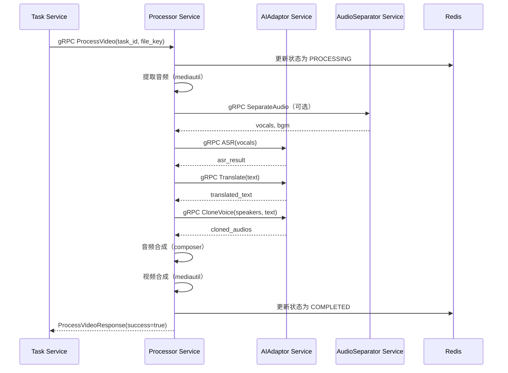

# Processor 服务设计文档（第二层）

**文档版本**: 1.2
**最后更新**: 2025-10-30
**服务定位**: Go gRPC 微服务，负责 AI 流程编排和音频合成

---

## 1. 服务定位与核心职责

### 1.1 服务定位

`Processor` 是整个视频翻译系统的**核心编排者**，负责协调所有 AI 服务和音频处理流程，将原始视频转换为翻译后的视频。

### 1.2 核心职责

* **AI 流程编排**: 协调 ai-adaptor、audio-separator 等服务，按顺序执行 18 步处理流程
* **音频合成**: 拼接、对齐、合并音频（通过内部 composer 包实现）
* **媒体处理**: 提取音频、合并视频（通过内部 mediautil 包实现）
* **状态管理**: 更新 Redis 中的任务状态
* **并发控制**: 通过 Channel 信号量控制最大并发处理数

### 1.3 服务边界

**负责**:
- 编排 AI 服务调用（ASR、翻译、声音克隆等）
- 音频合成（拼接、对齐、合并）
- 媒体处理（音频提取、视频合成）
- 任务状态更新

**不负责**:
- AI 服务的具体实现（由 ai-adaptor 负责）
- 音频分离（由 audio-separator 负责）
- 任务调度（由 task 负责）
- API 密钥管理（由 gateway 负责）

---

## 2. 内部结构设计

### 2.1 目录结构

```
server/mcp/processor/
├── main.go                         # gRPC 服务入口
├── internal/
│   ├── logic/
│   │   └── processor_logic.go      # 主流程编排逻辑
│   ├── composer/                    # 音频合成包（独立，未来可拆分为 gRPC 服务）
│   │   ├── composer.go              # 核心接口定义
│   │   ├── concatenate.go           # 音频拼接
│   │   ├── align.go                 # 时长对齐
│   │   ├── merge.go                 # 音频合并
│   │   └── composer_test.go         # 单元测试
│   └── mediautil/                   # 媒体工具包（FFmpeg 封装）
│       ├── extract.go               # 提取音频
│       ├── merge.go                 # 合并音视频
│       └── mediautil_test.go        # 单元测试
└── proto/
    └── processor.proto              # gRPC 接口定义
```

### 2.2 模块职责说明

#### logic 包（主流程编排）
- **职责**: 实现 18 步处理流程，协调各个服务和内部工具
- **输入**: task_id, original_file_key
- **输出**: 更新 Redis 任务状态为 COMPLETED 或 FAILED

#### composer 包（音频合成）
- **职责**: 音频拼接、时长对齐、音频合并
- **设计原则**: 独立接口，未来可无缝拆分为 gRPC 服务
- **输入**: 克隆后的音频片段、背景音、原始视频时长
- **输出**: 最终合成的音频路径

#### mediautil 包（媒体工具）
- **职责**: FFmpeg 封装，提取音频、合并音视频
- **输入**: 视频路径、音频路径
- **输出**: 处理后的文件路径

---

## 3. gRPC 接口定义

### 3.1 Proto 文件定义

```protobuf
syntax = "proto3";

package processor;

option go_package = "./processor";

// Processor 服务定义
service Processor {
  // 处理视频翻译任务
  rpc ProcessVideo(ProcessVideoRequest) returns (ProcessVideoResponse);
}

// 处理视频请求
message ProcessVideoRequest {
  string task_id = 1;           // 任务 ID
  string original_file_key = 2; // 原始视频文件路径
}

// 处理视频响应
message ProcessVideoResponse {
  bool success = 1;        // 是否成功
  string error_message = 2; // 错误信息（如果失败）
}
```

---

## 4. 核心逻辑伪代码

### 4.1 主流程编排（logic 包）

```
function ProcessVideo(task_id, original_file_key):
    # 1-3. 并发控制 + 状态更新
    acquire_worker_slot()
    defer release_worker_slot()
    update_status(task_id, PROCESSING)

    # 4-5. 文件准备 + 音频提取
    video_path = storage.get_path(task_id, "original.mp4")
    audio_path = mediautil.extract_audio(video_path)

    # 6. 音频分离（可选）
    if config.audio_separation_enabled:
        vocals, bgm = audio_separator.separate(audio_path)
    else:
        vocals = audio_path
        bgm = ""

    # 7-11. AI 处理（调用 ai-adaptor）
    asr_result = ai_adaptor.asr(vocals)                    # ASR + 说话人日志
    polished_text = ai_adaptor.polish(asr_result.text)    # 文本润色（可选）
    translated_text = ai_adaptor.translate(polished_text) # 翻译
    optimized_text = ai_adaptor.optimize(translated_text) # 译文优化（可选）
    cloned_audios = ai_adaptor.clone_voice(asr_result.speakers, optimized_text)  # 声音克隆

    # 12-14. 音频合成（调用内部 composer 包）
    final_audio = composer.compose(
        cloned_audios=cloned_audios,
        background_audio=bgm,
        original_duration=get_duration(video_path)
    )

    # 15-17. 视频合成 + 保存
    result_video = mediautil.merge_audio_video(video_path, final_audio)
    storage.save(task_id, result_video)
    update_status(task_id, COMPLETED)

    # 18. 异常处理
    on_error:
        update_status(task_id, FAILED, error_message)
        release_worker_slot()
```

### 4.2 音频合成（composer 包）

```
function Compose(cloned_audios, background_audio, original_duration):
    # 1. 音频拼接
    concatenated = concatenate_audios(cloned_audios)

    # 2. 时长对齐
    aligned = align_duration(concatenated, original_duration)

    # 3. 音频合并（人声 + 背景音）
    if background_audio != "":
        final = merge_audios(aligned, background_audio)
    else:
        final = aligned

    return final
```

**注**：具体实现见第三层文档 `Processor-design-detail.md`。

---

## 5. 服务交互时序图



---

## 6. 错误码清单

| 错误码               | gRPC 状态码          | 说明            | 处理建议                   |
| -------------------- | -------------------- | --------------- | -------------------------- |
| `RESOURCE_EXHAUSTED` | `RESOURCE_EXHAUSTED` | 并发槽位已满    | 任务保持 PENDING，等待重试 |
| `INVALID_ARGUMENT`   | `INVALID_ARGUMENT`   | 文件不存在      | 检查文件路径               |
| `INTERNAL`           | `INTERNAL`           | AI 服务调用失败 | 检查 API 密钥和网络        |
| `INTERNAL`           | `INTERNAL`           | 音频合成失败    | 检查音频文件格式           |
| `INTERNAL`           | `INTERNAL`           | 视频合成失败    | 检查 ffmpeg 是否正常       |

---

## 7. 关键配置项定义

### 7.1 环境变量（.env 文件）

```bash
# Processor 服务配置
PROCESSOR_MAX_CONCURRENCY=1              # 最大并发处理数
PROCESSOR_GRPC_PORT=50051                # gRPC 服务端口
LOCAL_STORAGE_PATH=./data/videos         # 本地存储路径

# AI Adaptor 服务地址
AI_ADAPTOR_GRPC_ADDR=ai-adaptor:50053    # ai-adaptor 服务地址

# Audio Separator 服务地址（可选）
AUDIO_SEPARATOR_GRPC_ADDR=audio-separator:50052  # audio-separator 服务地址
```

### 7.2 应用配置（Redis）

```json
{
  "audio_separation_enabled": true,      // 是否启用音频分离
  "polishing_enabled": false,            // 是否启用文本润色
  "optimization_enabled": false          // 是否启用译文优化
}
```

---

## 8. Composer 包接口设计

### 8.1 接口定义（伪代码）

```
interface Composer:
    function Compose(request: ComposeRequest) -> ComposeResponse

struct ComposeRequest:
    cloned_audios: []AudioSegment      // 克隆后的音频片段
    background_audio: string           // 背景音路径（可选）
    original_duration: float64         // 原始视频时长（秒）

struct ComposeResponse:
    final_audio_path: string           // 最终音频路径
    processing_time_ms: int64          // 处理耗时（毫秒）

struct AudioSegment:
    speaker_id: string                 // 说话人 ID
    audio_path: string                 // 音频文件路径
    start_time: float64                // 开始时间（秒）
    end_time: float64                  // 结束时间（秒）
```

**注**：
- 这是内部包接口，不是 gRPC 接口
- 未来如需拆分为 gRPC 服务，只需将此接口转换为 Proto 定义
- 具体实现见第三层文档 `Processor-design-detail.md`

---

## 9. 与第一层文档的对应关系

本文档是 `notes/Base-Design.md` 第一层架构文档的细化，对应以下章节：

- **1.2 系统架构与设计**: Processor 服务定位
- **1.4 项目工程结构**: `server/mcp/processor/`
- **1.5 核心业务工作流**: 18 步详细流程
- **ADR-002**: 并发控制策略
- **ADR-010**: 时长对齐策略

---

## 10. 后续工作

### 10.1 第三层文档

创建 `notes/Processor-design-detail.md`，包含：
- Go 代码实现
- composer 包的具体实现
- mediautil 包的具体实现
- 单元测试和集成测试

### 10.2 开发任务

1. 实现 gRPC 服务（main.go）
2. 实现主流程编排（logic/processor_logic.go）
3. 实现 composer 包（composer/*.go）
4. 实现 mediautil 包（mediautil/*.go）
5. 编写单元测试
6. 集成到 docker-compose.yml

---
