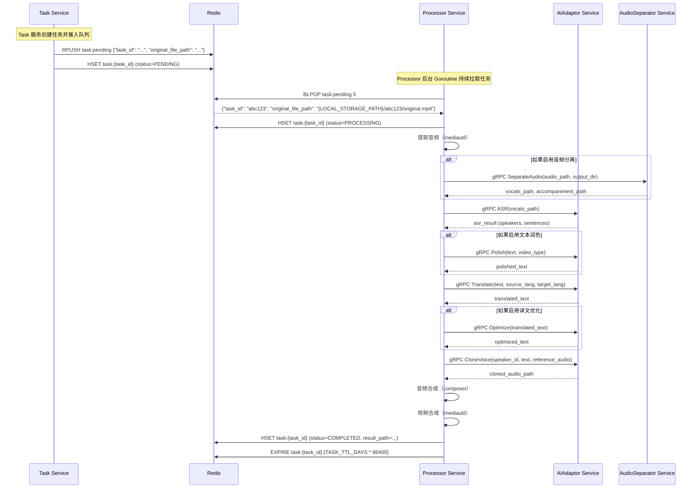
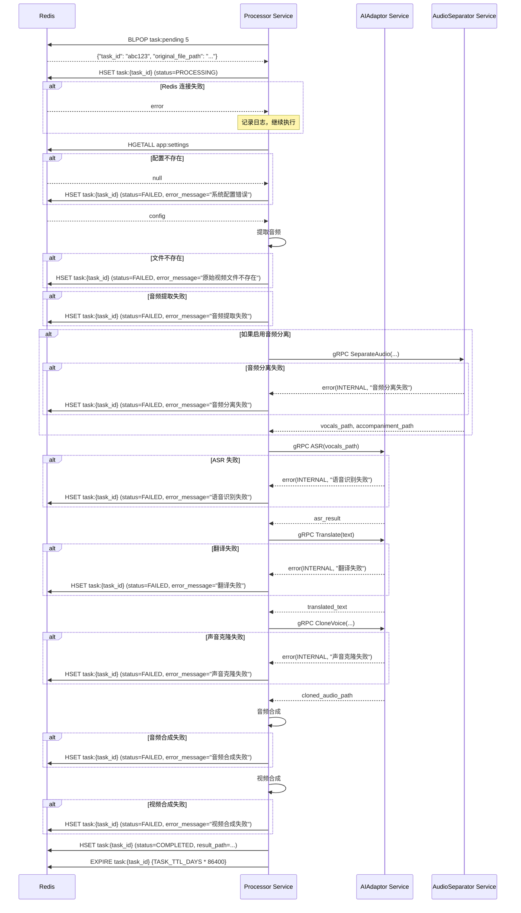

# Processor 服务设计文档（第二层）

**文档版本**: 2.4
**关联宏观架构**: `notes/Base-Design.md` v2.0
**最后更新**: 2025-11-01
**服务定位**: Go 后台服务（无 gRPC 接口），负责 AI 流程编排和音频合成

## 版本历史

- **v2.4 (2025-11-01)**:
  - **重大更新**：全面完善第二层文档质量，符合 design-rules.md 规范
  - 补充第 3 章"核心数据结构"：增加 Redis 数据结构和内存数据结构定义
  - 完善第 5 章"服务交互时序图"：增加错误处理分支
  - 完善第 7 章"配置项定义"：增加类型、默认值、是否必填说明
  - 更新文档变更历史
- **v2.3 (2025-10-31)**:
  - **修复架构基线冲突**：完全移除 gRPC 推模式的遗留内容
  - 修复第 5 章时序图：改为完整的 Redis 拉模式流程（Task → Redis → Processor）
  - 修复字段命名：将 `original_file_key` 统一改为 `original_file_path`
  - 修复配置项：删除 `PROCESSOR_GRPC_PORT`，增加 Redis 相关配置
  - 确保与 Base-Design.md v2.0 架构基线完全一致
- **v2.2 (2025-10-30)**:
  - 修复路径硬编码问题：所有路径统一使用 `{LOCAL_STORAGE_PATH}` 占位符
  - 在队列消息示例中增加路径配置说明
  - 确保与 Gateway-design.md 和 Task-design.md 的路径表示方式保持一致
- **v2.1 (2025-10-30)**:
  - 更新关联宏观架构版本为 v2.0（Base-Design.md 已完成冗余清理）
  - 同步版本引用，确保与第一层文档版本一致
- **v2.0 (2025-10-30)**:
  - **重大架构变更**：废弃 gRPC 接口（ProcessVideo），改为从 Redis 队列主动拉取任务
  - 更新核心职责：增加"任务拉取"，移除"gRPC 接口提供"
  - 更新内部结构：移除 gRPC 服务入口，改为后台 Goroutine
  - 废弃第 3 章"gRPC 接口定义"，改为"任务拉取机制"
  - 更新第 4 章"关键逻辑步骤"：从"ProcessVideo"改为"TaskPullLoop"
  - 更新关联宏观架构版本为 v1.5
- **v1.2 (2025-10-30)**: 旧版本（使用 gRPC 接口）
- **v1.0 (2025-10-30)**: 初始版本

---

## 1. 服务定位与核心职责

### 1.1 服务定位

`Processor` 是整个视频翻译系统的**核心编排者**，负责协调所有 AI 服务和音频处理流程，将原始视频转换为翻译后的视频。

### 1.2 核心职责

* **任务拉取**: 从 Redis 待处理队列（List: `task:pending`）主动拉取任务
* **AI 流程编排**: 协调 ai-adaptor、audio-separator 等服务，按顺序执行 18 步处理流程
* **音频合成**: 拼接、对齐、合并音频（通过内部 composer 包实现）
* **媒体处理**: 提取音频、合并视频（通过内部 mediautil 包实现）
* **状态管理**: 更新 Redis 中的任务状态
* **并发控制**: 通过 Channel 信号量控制最大并发处理数

**核心理念**：Processor 服务不提供 gRPC 接口供 Task 服务调用，而是主动从 Redis 队列拉取任务。这种"拉模式"在解耦、弹性和健壮性上优于"推模式"。详见 `notes/架构决策记录.md` ADR-002。

### 1.3 服务边界

**负责**:
- 从 Redis 队列拉取任务
- 编排 AI 服务调用（ASR、翻译、声音克隆等）
- 音频合成（拼接、对齐、合并）
- 媒体处理（音频提取、视频合成）
- 任务状态更新
- 并发控制（worker 槽位管理）

**不负责**:
- 提供 gRPC 接口（已废弃，改为主动拉取任务）
- AI 服务的具体实现（由 ai-adaptor 负责）
- 音频分离（由 audio-separator 负责）
- 任务创建和调度（由 task 负责）
- API 密钥管理（由 gateway 负责）

---

## 2. 内部结构设计

### 2.1 目录结构

```
server/mcp/processor/
├── main.go                         # 后台服务入口（启动任务拉取 Goroutine）
├── internal/
│   ├── logic/
│   │   ├── task_pull_loop.go       # 任务拉取循环逻辑
│   │   └── processor_logic.go      # 主流程编排逻辑
│   ├── composer/                    # 音频合成包（独立，未来可拆分为 gRPC 服务）
│   │   ├── composer.go              # 核心接口定义
│   │   ├── concatenate.go           # 音频拼接
│   │   ├── align.go                 # 时长对齐
│   │   ├── merge.go                 # 音频合并
│   │   └── composer_test.go         # 单元测试
│   └── mediautil/                   # 媒体工具包（FFmpeg 封装）
│       ├── extract.go               # 提取音频
│       ├── merge.go                 # 合并音视频
│       └── mediautil_test.go        # 单元测试
└── proto/
    └── processor.proto              # gRPC 接口定义
```

### 2.2 模块职责说明

#### logic 包（主流程编排）
- **职责**: 实现 18 步处理流程，协调各个服务和内部工具
- **输入**: task_id, original_file_path
- **输出**: 更新 Redis 任务状态为 COMPLETED 或 FAILED

#### composer 包（音频合成）
- **职责**: 音频拼接、时长对齐、音频合并
- **设计原则**: 独立接口，未来可无缝拆分为 gRPC 服务
- **输入**: 克隆后的音频片段、背景音、原始视频时长
- **输出**: 最终合成的音频路径

#### mediautil 包（媒体工具）
- **职责**: FFmpeg 封装，提取音频、合并音视频
- **输入**: 视频路径、音频路径
- **输出**: 处理后的文件路径

---

## 3. 核心数据结构

### 3.1 Redis 数据结构

#### 3.1.1 待处理任务队列（List）

**Key**: `task:pending`

**用途**: 存储待处理的任务，Processor 服务从此队列拉取任务

**数据类型**: Redis List

**元素格式**: JSON 字符串

**元素结构**:
```json
{
  "task_id": "abc123",
  "original_file_path": "{LOCAL_STORAGE_PATH}/abc123/original.mp4"
}
```

**操作方式**:
- **Task 服务推入任务**: `RPUSH task:pending <json>`
- **Processor 服务拉取任务**: `BLPOP task:pending 5`（阻塞 5 秒）
- **任务重新入队**: `LPUSH task:pending <json>`（并发已满时）

**生命周期**:
- 创建时机：Task 服务创建任务时
- 删除时机：Processor 服务拉取任务后
- 重新入队：并发槽位已满时

#### 3.1.2 任务状态（Hash）

**Key**: `task:{task_id}`

**用途**: 存储任务的详细信息和状态

**数据类型**: Redis Hash

**字段定义**:

| 字段名 | 类型 | 示例值 | 说明 |
|--------|------|--------|------|
| `task_id` | string | `"abc123"` | 任务 ID |
| `status` | string | `"PROCESSING"` | 任务状态（PENDING, PROCESSING, COMPLETED, FAILED） |
| `original_file_path` | string | `"{LOCAL_STORAGE_PATH}/abc123/original.mp4"` | 原始视频路径 |
| `result_path` | string | `"{LOCAL_STORAGE_PATH}/abc123/result.mp4"` | 结果视频路径（完成后） |
| `error_message` | string | `"音频提取失败"` | 错误信息（失败时） |
| `created_at` | string | `"2025-11-01T10:30:00Z"` | 创建时间（ISO 8601 格式） |
| `updated_at` | string | `"2025-11-01T10:35:00Z"` | 更新时间（ISO 8601 格式） |

**访问模式**: 读写（Processor 服务）

**生命周期**:
- 创建时机：Task 服务创建任务时
- 过期策略：`EXPIRE task:{task_id} {TASK_TTL_DAYS * 86400}`（默认 7 天）
- 重置时机：任务完成或失败时重新计时

#### 3.1.3 应用配置（Hash）

**Key**: `app:settings`

**用途**: 存储应用配置，Processor 服务从此读取 AI 服务配置

**数据类型**: Redis Hash

**关键字段**（Processor 服务关注的字段）:

| 字段名 | 类型 | 说明 |
|--------|------|------|
| `audio_separation_enabled` | string | 是否启用音频分离（`"true"` 或 `"false"`） |
| `polishing_enabled` | string | 是否启用文本润色（`"true"` 或 `"false"`） |
| `optimization_enabled` | string | 是否启用译文优化（`"true"` 或 `"false"`） |

**访问模式**: 只读（由 Gateway 服务写入和更新）

### 3.2 内存数据结构

#### 3.2.1 处理上下文（ProcessorContext）

**用途**: 存储任务处理过程中的上下文信息

**数据结构**（伪代码）:

```go
type ProcessorContext struct {
    TaskID           string    // 任务 ID
    OriginalFilePath string    // 原始视频路径
    WorkDir          string    // 工作目录（{LOCAL_STORAGE_PATH}/{task_id}/）

    // 文件路径
    AudioPath        string    // 提取的音频路径
    VocalsPath       string    // 人声路径（如果启用音频分离）
    BGMPath          string    // 背景音路径（如果启用音频分离）
    FinalAudioPath   string    // 最终音频路径
    ResultVideoPath  string    // 结果视频路径

    // AI 处理结果
    ASRResult        *ASRResult        // ASR 结果
    PolishedText     string            // 润色后的文本
    TranslatedText   string            // 翻译后的文本
    OptimizedText    string            // 优化后的文本
    ClonedAudios     []AudioSegment    // 克隆后的音频片段

    // 配置
    Config           *AppConfig        // 应用配置

    // 时间戳
    StartTime        time.Time         // 开始时间
}
```

#### 3.2.2 音频合成请求（ComposeRequest）

**用途**: 传递给 composer 包的音频合成请求

**数据结构**（伪代码）:

```go
type ComposeRequest struct {
    ClonedAudios     []AudioSegment    // 克隆后的音频片段
    BackgroundAudio  string            // 背景音路径（可选）
    OriginalDuration float64           // 原始视频时长（秒）
    OutputPath       string            // 输出路径
}

type AudioSegment struct {
    SpeakerID  string    // 说话人 ID
    AudioPath  string    // 音频文件路径
    StartTime  float64   // 开始时间（秒）
    EndTime    float64   // 结束时间（秒）
}
```

#### 3.2.3 并发控制信号量

**用途**: 控制最大并发处理数

**数据结构**（伪代码）:

```go
var workerSemaphore chan struct{}

func InitWorkerSemaphore(maxConcurrency int) {
    workerSemaphore = make(chan struct{}, maxConcurrency)
}
```

**使用方式**:
- 获取槽位：`workerSemaphore <- struct{}{}`（阻塞）
- 非阻塞获取：`select { case workerSemaphore <- struct{}{}: ... default: ... }`
- 释放槽位：`<-workerSemaphore`

---

## 4. 任务拉取机制

> ⚠️ **重大架构变更**：Processor 服务不再提供 gRPC 接口（ProcessVideo 已废弃），改为从 Redis 队列主动拉取任务。

### 4.1 任务队列定义

**Redis 数据结构**：
- **队列名称**：`task:pending`
- **数据类型**：Redis List
- **元素格式**：JSON 字符串
- **元素结构**：
  ```json
  {
    "task_id": "abc123",
    "original_file_path": "{LOCAL_STORAGE_PATH}/abc123/original.mp4"
  }
  ```

  > 📝 **说明**：示例中的路径使用 `{LOCAL_STORAGE_PATH}` 占位符，实际运行时会替换为配置的本地存储路径（如 `./data/videos`）。

**操作方式**：
- **Task 服务推入任务**：`RPUSH task:pending <json>`
- **Processor 服务拉取任务**：`BLPOP task:pending 5`（阻塞 5 秒）

### 4.2 任务拉取循环

**启动方式**：
- Processor 服务启动时，在 `main.go` 中创建一个后台 Goroutine
- 该 Goroutine 持续运行，从 Redis 队列拉取任务

**拉取逻辑**（伪代码）：
```go
func TaskPullLoop() {
    for {
        // 1. 阻塞式拉取任务（超时 5 秒）
        taskJSON, err := redis.BLPop("task:pending", 5*time.Second)
        if err == redis.Nil {
            // 超时，继续下一次循环
            continue
        }
        if err != nil {
            log.Error("Redis 连接失败", err)
            time.Sleep(5 * time.Second)
            continue
        }

        // 2. 解析任务
        var task struct {
            TaskID           string `json:"task_id"`
            OriginalFilePath string `json:"original_file_path"`
        }
        json.Unmarshal(taskJSON, &task)

        // 3. 非阻塞地尝试获取 worker 槽位
        select {
        case workerSemaphore <- struct{}{}:
            // 成功获取槽位，启动 Goroutine 处理任务
            go func() {
                defer func() { <-workerSemaphore }() // 释放槽位
                ProcessVideo(task.TaskID, task.OriginalFilePath)
            }()
        default:
            // 槽位已满，将任务重新推回队列头部
            redis.LPush("task:pending", taskJSON)
            log.Info("并发已满，任务重新入队", task.TaskID)
        }
    }
}
```

### 4.3 并发控制

**机制**：
- 使用带缓冲的 Channel 作为信号量：`workerSemaphore := make(chan struct{}, maxConcurrency)`
- 默认 `maxConcurrency = 1`（用户可通过环境变量配置）

**流程**：
1. 拉取到任务后，使用 `select + default` 非阻塞地尝试获取 worker 槽位
2. 如果获取成功，启动 Goroutine 处理任务，处理完成后释放槽位
3. 如果获取失败（已达并发上限），将任务重新推回队列头部（`LPUSH task:pending <json>`），等待下次拉取

**用户体验**：
- 前端看到多个任务状态都是 PENDING（排队中）
- 然后按顺序一个个变成 PROCESSING

**详见**：`notes/架构决策记录.md` ADR-002

---

## 5. 关键逻辑步骤

> ⚠️ **注意**：根据 `design-rules.md` 第 122-154 行的规范，本章使用"关键逻辑步骤"而非"核心逻辑伪代码"。每个步骤是明确的业务动作，而非具体代码。

### 5.1 主流程编排（ProcessVideo）

**步骤 1：状态更新**
- 立即更新 Redis 中任务状态为 PROCESSING（Hash: `task:{task_id}`，字段 `status: PROCESSING`）
- 目的：让前端立即感知到任务已开始执行
- **边界处理**：如果 Redis 连接失败，记录日志并继续执行（状态更新失败不应阻塞任务处理）

**步骤 2：读取应用配置**
- 从 Redis 读取应用配置（Key: `app:settings`）
- 解密所有 API Key（使用 AES-256-GCM，密钥来自环境变量 `API_KEY_ENCRYPTION_SECRET`）
- 获取各个 AI 服务的 API 密钥用于后续调用外部服务
- **边界处理**：如果配置不存在或解密失败，更新任务状态为 FAILED，错误信息："系统配置错误，请联系管理员"

**步骤 3：文件准备**
- 从本地文件存储读取原始视频（路径：`original_file_path`，如 `{LOCAL_STORAGE_PATH}/{task_id}/original.mp4`）
- 检查文件是否存在
- **边界处理**：如果文件不存在，更新任务状态为 FAILED，错误信息："原始视频文件不存在"

**步骤 4：音频提取**
- 使用内部 mediautil 包提取音频
- 输出路径：`{LOCAL_STORAGE_PATH}/{task_id}/audio.wav`
- **边界处理**：如果提取失败，更新任务状态为 FAILED，错误信息："音频提取失败"

**步骤 5：音频分离（可选）**
- 检查配置：`audio_separation_enabled`
- 如果启用，调用 audio-separator 服务分离人声和背景音
  - 输入：`{LOCAL_STORAGE_PATH}/{task_id}/audio.wav`
  - 输出：`{LOCAL_STORAGE_PATH}/{task_id}/vocals.wav`、`{LOCAL_STORAGE_PATH}/{task_id}/bgm.wav`
- 如果未启用，跳过此步骤
  - `vocals = audio.wav`
  - `bgm = ""`（空字符串）
- **边界处理**：如果分离失败，更新任务状态为 FAILED，错误信息："音频分离失败"

**步骤 6：ASR（语音识别）**
- 调用 ai-adaptor 服务的 ASR 接口
- 输入：`{LOCAL_STORAGE_PATH}/{task_id}/vocals.wav`
- 输出：ASR 结果（包含文本和说话人日志）
- **边界处理**：如果 ASR 失败，更新任务状态为 FAILED，错误信息："语音识别失败"

**步骤 7：文本润色（可选）**
- 检查配置：`polishing_enabled`
- 如果启用，调用 ai-adaptor 服务的文本润色接口
- 输入：ASR 结果文本
- 输出：润色后的文本
- 如果未启用，跳过此步骤
- **边界处理**：如果润色失败，更新任务状态为 FAILED，错误信息："文本润色失败"

**步骤 8：翻译**
- 调用 ai-adaptor 服务的翻译接口
- 输入：润色后的文本（或 ASR 结果文本）
- 输出：翻译后的文本
- **边界处理**：如果翻译失败，更新任务状态为 FAILED，错误信息："翻译失败"

**步骤 9：译文优化（可选）**
- 检查配置：`optimization_enabled`
- 如果启用，调用 ai-adaptor 服务的译文优化接口
- 输入：翻译后的文本
- 输出：优化后的文本
- 如果未启用，跳过此步骤
- **边界处理**：如果优化失败，更新任务状态为 FAILED，错误信息："译文优化失败"

**步骤 10：声音克隆**
- 调用 ai-adaptor 服务的声音克隆接口
- 输入：说话人日志、优化后的文本
- 输出：克隆后的音频片段列表（每个片段对应一个说话人的一句话）
- **边界处理**：如果声音克隆失败，更新任务状态为 FAILED，错误信息："声音克隆失败"

**步骤 11：音频合成**
- 调用内部 composer 包的音频合成接口
- 输入：克隆后的音频片段列表、背景音、原始视频时长
- 输出：最终音频（`{LOCAL_STORAGE_PATH}/{task_id}/final_audio.wav`）
- 合成逻辑：
  1. 音频拼接：将所有克隆音频片段按时间顺序拼接
  2. 时长对齐：调整拼接后的音频时长，使其与原始视频时长一致
  3. 音频合并：如果有背景音，将人声和背景音合并
- **边界处理**：如果合成失败，更新任务状态为 FAILED，错误信息："音频合成失败"

**步骤 12：视频合成**
- 使用内部 mediautil 包合并视频和音频
- 输入：原始视频、最终音频
- 输出：结果视频（`{LOCAL_STORAGE_PATH}/{task_id}/result.mp4`）
- **边界处理**：如果合成失败，更新任务状态为 FAILED，错误信息："视频合成失败"

**步骤 13：更新任务状态为 COMPLETED**
- 更新 Redis 中任务状态为 COMPLETED（Hash: `task:{task_id}`，字段 `status: COMPLETED`）
- 更新 `result_path` 字段为 `{LOCAL_STORAGE_PATH}/{task_id}/result.mp4`
- 重置任务记录过期时间：`EXPIRE task:{task_id} {TASK_TTL_DAYS * 86400}`（确保完成后保留 7 天）
  - 说明：任务完成后重新计时,从完成时刻开始保留 7 天
- **边界处理**：如果 Redis 连接失败，记录日志（任务已完成，状态更新失败不影响结果）

**步骤 14：异常处理**
- 如果任何步骤失败，更新任务状态为 FAILED
- 记录错误信息到 Redis（Hash: `task:{task_id}`，字段 `error_message`）
- 重置任务记录过期时间：`EXPIRE task:{task_id} {TASK_TTL_DAYS * 86400}`（确保失败任务也保留 7 天）
  - 说明：失败任务同样需要保留,便于用户查看错误信息和排查问题
- 清理临时文件（可选）

---

### 5.2 音频合成（composer 包）

**步骤 1：音频拼接**
- 将所有克隆音频片段按时间顺序拼接
- 使用 FFmpeg 或 pydub 库实现
- **边界处理**：如果拼接失败，返回错误

**步骤 2：时长对齐**
- 调整拼接后的音频时长，使其与原始视频时长一致
- 如果音频过短，在末尾添加静音
- 如果音频过长，截断末尾
- **边界处理**：如果对齐失败，返回错误

**步骤 3：音频合并（人声 + 背景音）**
- 如果有背景音，将人声和背景音合并
- 使用 FFmpeg 的 amix 滤镜实现
- 如果没有背景音，直接返回人声
- **边界处理**：如果合并失败，返回错误

**注**：具体实现见第三层文档 `Processor-design-detail.md`。

---

## 6. 服务交互时序图

### 6.1 任务处理时序图（成功路径）



### 6.2 任务处理时序图（错误处理分支）



---

## 7. 错误类型与处理策略

> 📝 **说明**: Processor 服务不对外提供 gRPC 接口,以下错误类型用于内部错误处理和更新 Redis 任务状态。

| 错误类型             | Redis 状态更新      | 说明                     | 处理策略                                   |
| -------------------- | ------------------- | ------------------------ | ------------------------------------------ |
| `RESOURCE_EXHAUSTED` | 任务重新入队        | 并发槽位已满             | 将任务推回队列头部（LPUSH），等待下次拉取  |
| `FILE_NOT_FOUND`     | status=FAILED       | 原始视频文件不存在       | 记录错误信息到 Redis，通知用户检查文件路径 |
| `CONFIG_ERROR`       | status=FAILED       | 系统配置错误（API Key）  | 记录错误信息，提示用户检查配置             |
| `AI_SERVICE_ERROR`   | status=FAILED       | AI 服务调用失败          | 记录错误信息，建议检查 API 密钥和网络      |
| `AUDIO_PROCESS_ERROR`| status=FAILED       | 音频处理失败（合成/分离）| 记录错误信息，建议检查音频文件格式         |
| `VIDEO_PROCESS_ERROR`| status=FAILED       | 视频处理失败（合成）     | 记录错误信息，建议检查 ffmpeg 是否正常     |
| `REDIS_ERROR`        | 记录日志，继续执行  | Redis 连接失败           | 记录日志，任务已完成则不影响结果           |

---

## 8. 关键配置项定义

### 8.1 环境变量（.env 文件）

| 配置项 | 类型 | 默认值 | 是否必填 | 说明 |
|--------|------|--------|----------|------|
| `PROCESSOR_MAX_CONCURRENCY` | int | `1` | 否 | 最大并发处理数 |
| `LOCAL_STORAGE_PATH` | string | `./data/videos` | 否 | 本地存储路径 |
| `REDIS_HOST` | string | `redis` | 否 | Redis 主机地址 |
| `REDIS_PORT` | int | `6379` | 否 | Redis 端口 |
| `REDIS_PASSWORD` | string | 空 | 否 | Redis 密码（如果 Redis 启用了认证） |
| `REDIS_DB` | int | `0` | 否 | Redis 数据库编号 |
| `TASK_QUEUE_KEY` | string | `task:pending` | 否 | 待处理队列的 Redis Key |
| `TASK_TTL_DAYS` | int | `7` | 否 | 任务记录过期时间（天） |
| `AI_ADAPTOR_GRPC_ADDR` | string | `ai-adaptor:50053` | **是** | ai-adaptor 服务地址 |
| `AUDIO_SEPARATOR_GRPC_ADDR` | string | `audio-separator:50052` | 否 | audio-separator 服务地址（可选） |
| `API_KEY_ENCRYPTION_SECRET` | string | 无 | **是** | API 密钥加密密钥（必须是 32 字节的十六进制字符串） |
| `LOG_LEVEL` | string | `info` | 否 | 日志级别（debug, info, warn, error） |

**示例 .env 文件**:

```bash
# Processor 服务配置
PROCESSOR_MAX_CONCURRENCY=1
LOCAL_STORAGE_PATH=./data/videos

# Redis 配置
REDIS_HOST=redis
REDIS_PORT=6379
REDIS_PASSWORD=
REDIS_DB=0
TASK_QUEUE_KEY=task:pending
TASK_TTL_DAYS=7

# AI 服务地址
AI_ADAPTOR_GRPC_ADDR=ai-adaptor:50053
AUDIO_SEPARATOR_GRPC_ADDR=audio-separator:50052

# 加密配置
API_KEY_ENCRYPTION_SECRET=0123456789abcdef0123456789abcdef0123456789abcdef0123456789abcdef

# 日志配置
LOG_LEVEL=info
```

### 8.2 应用配置（Redis）

```json
{
  "audio_separation_enabled": true,      // 是否启用音频分离
  "polishing_enabled": false,            // 是否启用文本润色
  "optimization_enabled": false          // 是否启用译文优化
}
```

---

## 9. Composer 包接口设计

### 9.1 接口定义（伪代码）

```
interface Composer:
    function Compose(request: ComposeRequest) -> ComposeResponse

struct ComposeRequest:
    cloned_audios: []AudioSegment      // 克隆后的音频片段
    background_audio: string           // 背景音路径（可选）
    original_duration: float64         // 原始视频时长（秒）

struct ComposeResponse:
    final_audio_path: string           // 最终音频路径
    processing_time_ms: int64          // 处理耗时（毫秒）

struct AudioSegment:
    speaker_id: string                 // 说话人 ID
    audio_path: string                 // 音频文件路径
    start_time: float64                // 开始时间（秒）
    end_time: float64                  // 结束时间（秒）
```

**注**：
- 这是内部包接口，不是 gRPC 接口
- 未来如需拆分为 gRPC 服务，只需将此接口转换为 Proto 定义
- 具体实现见第三层文档 `Processor-design-detail.md`

---

## 10. 与第一层文档的对应关系

本文档是 `notes/Base-Design.md v2.0` 第一层架构文档的细化，对应以下章节：

### 10.1 对应章节

| 第一层文档章节 | 对应内容 | 本文档章节 |
|--------------|---------|-----------|
| Base-Design.md 第 1.2 节"系统架构与设计" | Processor 服务定位、核心理念（拉模式） | 第 1 章"服务定位与核心职责" |
| Base-Design.md 第 1.4 节"项目工程结构" | `server/mcp/processor/` 目录结构 | 第 2 章"内部结构设计" |
| Base-Design.md 第 1.5 节"核心业务工作流" | 18 步详细流程 | 第 4 章"关键逻辑步骤" |
| Base-Design.md 第 4.1 节"流程概述" | 任务拉取与并发控制策略 | 第 3 章"任务拉取机制" |
| Base-Design.md 第 4.2 节"详细步骤拆解" | 完整的 18 步处理流程 | 第 5.1 章"主流程编排" |
| Base-Design.md ADR-002 | 并发控制策略（Channel 信号量） | 第 4.3 章"并发控制" |

### 10.2 与第一层文档的一致性

- ✅ **拉模式架构**：Processor 服务从 Redis 队列主动拉取任务（与 Base-Design.md v2.0 一致）
- ✅ **任务队列格式**：`{"task_id": "...", "original_file_path": "..."}`（与 Base-Design.md v2.0 一致）
- ✅ **并发控制**：使用 Channel 信号量，默认 `maxConcurrency = 1`（与 Base-Design.md v2.0 一致）
- ✅ **AudioSeparationEnabled 默认值**：false（与 Base-Design.md v2.0 一致）
- ✅ **文件路径**：使用 `original_file_path` 而非 `original_file_key`（与 Base-Design.md v2.0 一致）
- ✅ **废弃 gRPC 接口**：不再提供 ProcessVideo gRPC 接口（与 Base-Design.md v2.0 一致）

---

## 11. 后续工作

### 11.1 第三层文档

创建 `notes/Processor-design-detail.md`，包含：
- Go 代码实现（task_pull_loop.go、processor_logic.go）
- composer 包的具体实现
- mediautil 包的具体实现
- 单元测试和集成测试

### 11.2 开发任务

1. 实现后台服务入口（main.go）
2. 实现任务拉取循环（logic/task_pull_loop.go）
3. 实现主流程编排（logic/processor_logic.go）
4. 实现 composer 包（composer/*.go）
5. 实现 mediautil 包（mediautil/*.go）
6. 编写单元测试
7. 集成到 docker-compose.yml

---

## 12. 文档变更历史

| 版本 | 日期       | 变更内容                                                                                                                                                            |
| ---- | ---------- | ------------------------------------------------------------------------------------------------------------------------------------------------------------------- |
| 2.4  | 2025-11-01 | **重大更新**：全面完善第二层文档质量，符合 design-rules.md 规范。<br>1. **补充第 3 章"核心数据结构"**：增加 Redis 数据结构（task:pending 队列、task:{task_id} Hash、app:settings Hash）和内存数据结构（ProcessorContext、ComposeRequest、并发控制信号量）。<br>2. **完善第 6 章"服务交互时序图"**：增加错误处理分支（6.2 节）。<br>3. **完善第 8 章"配置项定义"**：增加类型、默认值、是否必填说明（8.1 节）。<br>4. 调整章节编号：第 3 章"任务拉取机制" → 第 4 章，第 4 章"关键逻辑步骤" → 第 5 章，以此类推。 |
| 2.3  | 2025-10-31 | 1. **修复架构基线冲突**：完全移除 gRPC 推模式的遗留内容。 2. 修复第 5 章时序图为完整的 Redis 拉模式流程。 3. 修复字段命名：`original_file_key` → `original_file_path`。 4. 修复配置项：删除 `PROCESSOR_GRPC_PORT`，增加 Redis 配置。 |
| 2.2  | 2025-10-30 | 1. 修复路径硬编码问题：所有路径统一使用 `{LOCAL_STORAGE_PATH}` 占位符。 2. 在队列消息示例中增加路径配置说明。 3. 确保与 Gateway-design.md 和 Task-design.md 的路径表示方式保持一致。 |
| 2.1  | 2025-10-30 | 1. 更新关联宏观架构版本为 v2.0（Base-Design.md 已完成冗余清理）。 2. 同步版本引用，确保与第一层文档版本一致。                                                      |
| 2.0  | 2025-10-30 | 1. 废弃 gRPC 接口（ProcessVideo），改为从 Redis 队列主动拉取任务。 2. 更新核心职责、内部结构、关键逻辑步骤。 3. 更新关联版本为 v1.5。 4. 增加"与第一层文档的对应关系"章节。 |
| 1.2  | 2025-10-30 | 旧版本（使用 gRPC 接口）。                                                                                                                                          |
| 1.0  | 2025-10-30 | 初始版本。                                                                                                                                                          |

---
