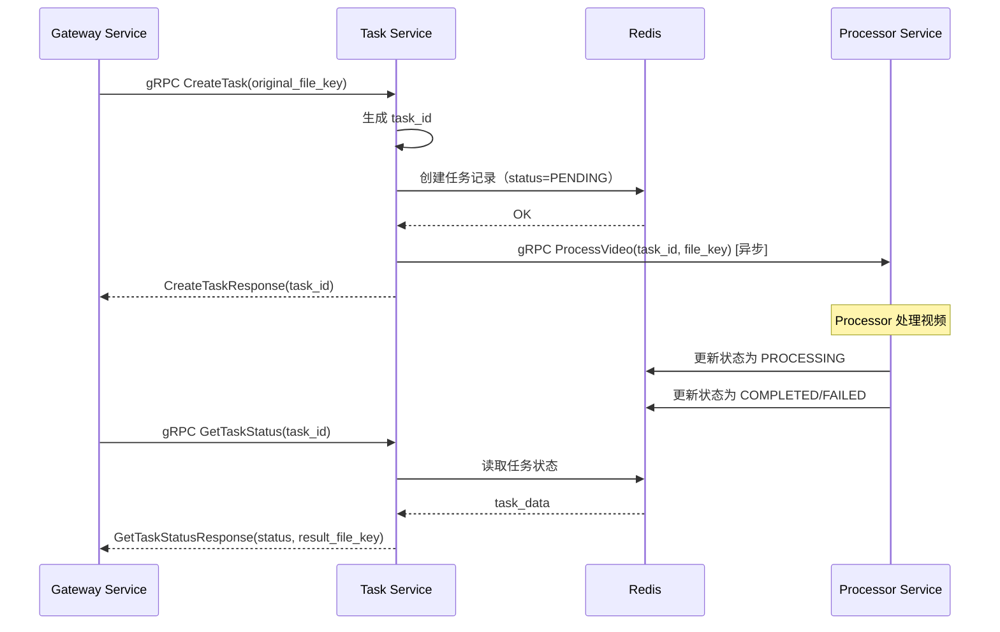

# Task 服务设计文档（第二层）

**文档版本**: 1.0
**最后更新**: 2025-10-30
**服务定位**: Go gRPC 微服务，负责任务状态管理和任务调度

---

## 1. 服务定位与核心职责

### 1.1 服务定位

`Task` 是整个系统的**任务管理中心**，负责任务的创建、状态管理、任务调度和任务查询。

### 1.2 核心职责

* **任务创建**: 接收 Gateway 的任务创建请求，生成唯一的 task_id
* **状态管理**: 在 Redis 中维护任务状态（PENDING、PROCESSING、COMPLETED、FAILED）
* **任务调度**: 调用 Processor 服务执行视频处理
* **任务查询**: 提供任务状态查询接口
* **文件路径管理**: 管理任务相关的文件路径（原始视频、结果视频）

### 1.3 服务边界

**负责**:
- 任务生命周期管理
- 任务状态持久化（Redis）
- 调用 Processor 服务
- 任务查询接口

**不负责**:
- 视频处理逻辑（由 Processor 负责）
- AI 服务调用（由 AIAdaptor 负责）
- 文件上传下载（由 Gateway 负责）

---

## 2. gRPC 接口定义

### 2.1 Proto 文件定义

```protobuf
syntax = "proto3";

package task;

option go_package = "./task";

// Task 服务定义
service Task {
  // 创建任务
  rpc CreateTask(CreateTaskRequest) returns (CreateTaskResponse);

  // 查询任务状态
  rpc GetTaskStatus(GetTaskStatusRequest) returns (GetTaskStatusResponse);
}

// 创建任务请求
message CreateTaskRequest {
  string original_file_key = 1; // 原始视频文件路径（相对于 LOCAL_STORAGE_PATH）
}

// 创建任务响应
message CreateTaskResponse {
  string task_id = 1; // 任务 ID
}

// 查询任务状态请求
message GetTaskStatusRequest {
  string task_id = 1; // 任务 ID
}

// 查询任务状态响应
message GetTaskStatusResponse {
  string task_id = 1;        // 任务 ID
  string status = 2;         // 任务状态：PENDING, PROCESSING, COMPLETED, FAILED
  string result_file_key = 3; // 结果文件路径（仅 COMPLETED 状态）
  string error_message = 4;  // 错误信息（仅 FAILED 状态）
}
```

---

## 3. 核心数据结构

### 3.1 Redis 数据结构

#### 任务状态（Hash）

**Key**: `task:{task_id}`

**字段**:
```json
{
  "task_id": "uuid-string",
  "status": "PENDING | PROCESSING | COMPLETED | FAILED",
  "original_file_key": "./data/videos/{task_id}/original.mp4",
  "result_file_key": "./data/videos/{task_id}/result.mp4",
  "error_message": "错误信息（仅 FAILED 状态）",
  "created_at": "2025-10-30T10:00:00Z",
  "updated_at": "2025-10-30T10:05:00Z"
}
```

**TTL**: 7 天（任务完成后）

---

## 4. 核心逻辑伪代码

### 4.1 创建任务逻辑

```
function CreateTask(request: CreateTaskRequest):
    # 1. 生成唯一的 task_id
    task_id = generate_uuid()

    # 2. 创建任务记录到 Redis
    task_data = {
        "task_id": task_id,
        "status": "PENDING",
        "original_file_key": request.original_file_key,
        "result_file_key": "",
        "error_message": "",
        "created_at": now(),
        "updated_at": now()
    }
    redis.hset("task:" + task_id, task_data)

    # 3. 异步调用 Processor 服务（不等待结果）
    go async_call_processor(task_id, request.original_file_key)

    # 4. 返回 task_id
    return CreateTaskResponse(task_id=task_id)
```

### 4.2 异步调用 Processor

```
function async_call_processor(task_id, original_file_key):
    # 1. 调用 Processor 的 ProcessVideo 接口
    response = processor.ProcessVideo(
        task_id=task_id,
        original_file_key=original_file_key
    )

    # 2. Processor 会自己更新 Redis 状态
    # Task 服务不需要处理返回结果
```

### 4.3 查询任务状态逻辑

```
function GetTaskStatus(request: GetTaskStatusRequest):
    # 1. 从 Redis 读取任务状态
    task_data = redis.hgetall("task:" + request.task_id)

    # 2. 检查任务是否存在
    if task_data == null:
        return error("任务不存在")

    # 3. 返回任务状态
    return GetTaskStatusResponse(
        task_id=task_data.task_id,
        status=task_data.status,
        result_file_key=task_data.result_file_key,
        error_message=task_data.error_message
    )
```

---

## 5. 服务交互时序图



---

## 6. 错误码清单

| 错误码             | gRPC 状态码        | 说明               | 处理建议                |
| ------------------ | ------------------ | ------------------ | ----------------------- |
| `INVALID_ARGUMENT` | `INVALID_ARGUMENT` | 参数无效           | 检查输入参数            |
| `NOT_FOUND`        | `NOT_FOUND`        | 任务不存在         | 检查 task_id 是否正确   |
| `INTERNAL`         | `INTERNAL`         | Redis 连接失败     | 检查 Redis 服务状态     |
| `INTERNAL`         | `INTERNAL`         | Processor 调用失败 | 检查 Processor 服务状态 |

---

## 7. 关键配置项定义

### 7.1 环境变量（.env 文件）

```bash
# Task 服务配置
TASK_GRPC_PORT=50050                     # gRPC 服务端口
LOCAL_STORAGE_PATH=./data/videos         # 本地存储路径

# Processor 服务地址
PROCESSOR_GRPC_ADDR=processor:50051      # processor 服务地址

# Redis 配置
REDIS_HOST=redis
REDIS_PORT=6379
TASK_TTL_DAYS=7                          # 任务记录保留天数
```

---

## 8. 与第一层文档的对应关系

本文档是 `notes/Base-Design.md` 第一层架构文档的细化，对应以下章节：

- **1.2 系统架构与设计**: Task 服务定位
- **1.4 项目工程结构**: `server/mcp/task/`
- **1.5 核心业务工作流**: 步骤 1-3（接收任务、并发控制、状态更新）

---

## 9. 后续工作

### 9.1 第三层文档

创建 `notes/Task-design-detail.md`，包含：
- Go 代码实现
- gRPC 服务实现
- Redis 操作实现
- 单元测试和集成测试

### 9.2 开发任务

1. 实现 gRPC 服务（main.go）
2. 实现任务创建逻辑（logic/create_task.go）
3. 实现任务查询逻辑（logic/get_task_status.go）
4. 实现 Redis 操作（storage/redis.go）
5. 编写单元测试
6. 集成到 docker-compose.yml

---
