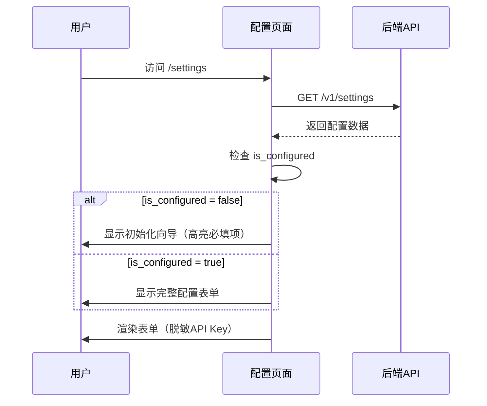
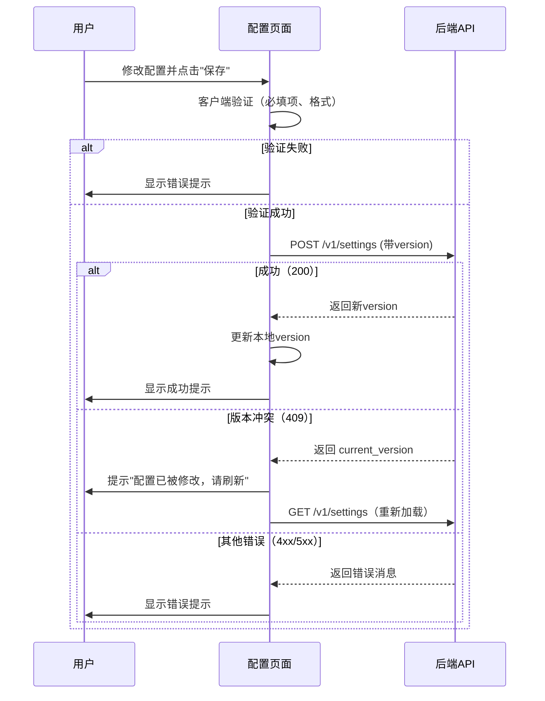
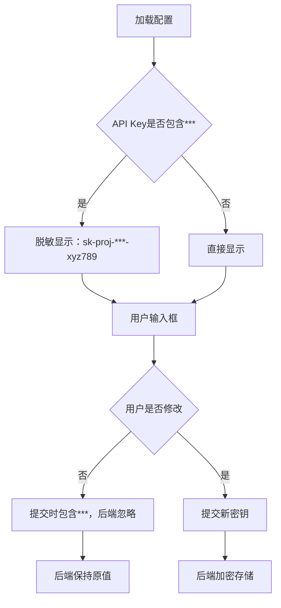
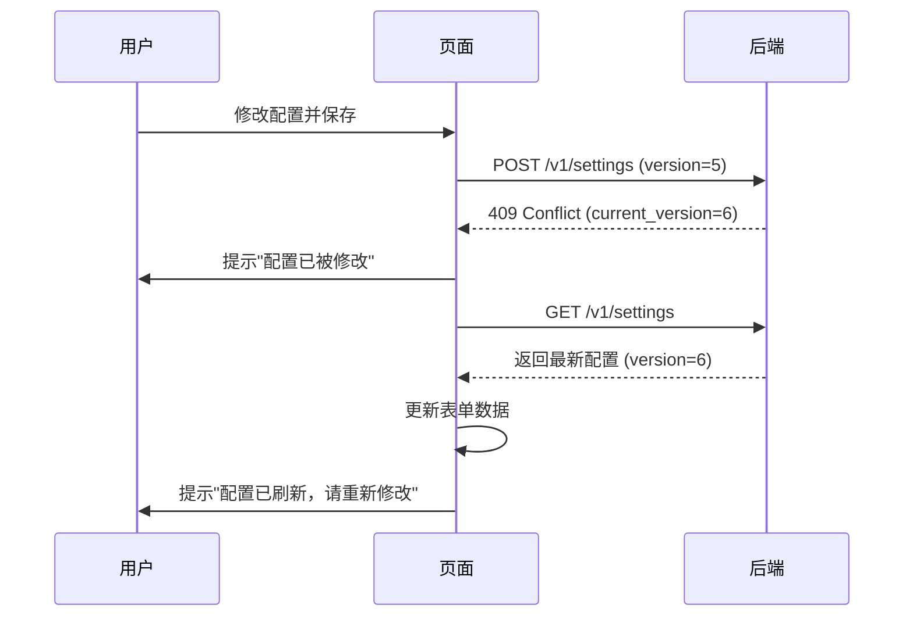

# 配置管理页面设计文档（第二层）

**文档版本**: 1.0
**创建日期**: 2025-11-03
**关联后端文档**: `notes/server/2nd/Gateway-design.md` v5.9

---

## 版本历史

- **v1.0 (2025-11-03)**:
  - 初始版本，定义配置管理页面功能和交互流程
  - 对齐后端GET/POST /v1/settings接口
  - 定义表单字段和验证规则
  - 定义错误处理策略

---

## 1. 页面功能描述

### 1.1 页面定位

**配置管理页面**是用户首次访问系统时的入口页面，用于配置视频翻译服务所需的AI服务API密钥和服务商选择。

### 1.2 核心功能

1. **获取并显示当前配置**：从后端加载配置，显示在表单中
2. **修改配置**：用户修改API密钥、服务商选择等配置项
3. **保存配置**：提交修改到后端，使用乐观锁防止并发冲突
4. **初始化向导**：首次访问时引导用户完成基本配置（ASR、Translation、VoiceCloning）
5. **API Key脱敏显示**：显示脱敏后的API Key（前缀-***-后6位）
6. **配置验证**：检查is_configured状态，决定是否显示"初始化向导"

### 1.3 页面路由

- **路由路径**: `/settings`
- **路由名称**: `Settings`
- **路由守卫**: 无需检查配置状态（requiresConfig: false）

---

## 2. 交互流程

### 2.1 页面加载流程



### 2.2 配置保存流程



### 2.3 API Key处理流程



---

## 3. 表单字段设计

### 3.1 字段分组

```typescript
interface SettingsFormGroups {
  // 基础配置组
  basic: {
    processing_mode: string  // 处理模式（V1.0固定为"standard"）
  }

  // ASR服务组（必需）
  asr: {
    asr_provider: string     // 服务商选择
    asr_api_key: string      // API密钥
    asr_endpoint?: string    // 自定义端点（可选）
  }

  // 音频分离组（可选）
  audio_separation: {
    audio_separation_enabled: boolean  // 是否启用
  }

  // 文本润色组（可选）
  polishing: {
    polishing_enabled: boolean              // 是否启用
    polishing_provider?: string             // 服务商选择
    polishing_api_key?: string              // API密钥
    polishing_custom_prompt?: string        // 自定义Prompt
    polishing_video_type?: string           // 预设类型
  }

  // 翻译服务组（必需）
  translation: {
    translation_provider: string       // 服务商选择
    translation_api_key: string        // API密钥
    translation_endpoint?: string      // 自定义端点（可选）
    translation_video_type?: string    // 预设类型
  }

  // 译文优化组（可选）
  optimization: {
    optimization_enabled: boolean          // 是否启用
    optimization_provider?: string         // 服务商选择
    optimization_api_key?: string          // API密钥
  }

  // 声音克隆组（必需）
  voice_cloning: {
    voice_cloning_provider: string                  // 服务商选择
    voice_cloning_api_key: string                   // API密钥
    voice_cloning_endpoint?: string                 // 自定义端点（可选）
    voice_cloning_auto_select_reference: boolean    // 自动选择参考音频
  }

  // S2ST服务组（V2.0功能，暂时隐藏）
  s2st: {
    s2st_provider?: string     // 服务商选择
    s2st_api_key?: string      // API密钥
  }
}
```

### 3.2 字段验证规则

```typescript
const validationRules = {
  // ASR服务（必需）
  asr_provider: [
    { required: true, message: '请选择ASR服务商', trigger: 'change' }
  ],
  asr_api_key: [
    { required: true, message: '请输入ASR API密钥', trigger: 'blur' },
    { min: 10, message: 'API密钥长度至少10个字符', trigger: 'blur' }
  ],

  // 翻译服务（必需）
  translation_provider: [
    { required: true, message: '请选择翻译服务商', trigger: 'change' }
  ],
  translation_api_key: [
    { required: true, message: '请输入翻译API密钥', trigger: 'blur' },
    { min: 10, message: 'API密钥长度至少10个字符', trigger: 'blur' }
  ],

  // 声音克隆服务（必需）
  voice_cloning_provider: [
    { required: true, message: '请选择声音克隆服务商', trigger: 'change' }
  ],
  voice_cloning_api_key: [
    { required: true, message: '请输入声音克隆API密钥', trigger: 'blur' },
    { min: 10, message: 'API密钥长度至少10个字符', trigger: 'blur' }
  ],

  // 可选服务（仅在启用时验证）
  polishing_api_key: [
    {
      validator: (rule: any, value: string, callback: Function) => {
        if (form.polishing_enabled && !value?.includes('***') && value?.length < 10) {
          callback(new Error('API密钥长度至少10个字符'))
        } else {
          callback()
        }
      },
      trigger: 'blur'
    }
  ],

  optimization_api_key: [
    {
      validator: (rule: any, value: string, callback: Function) => {
        if (form.optimization_enabled && !value?.includes('***') && value?.length < 10) {
          callback(new Error('API密钥长度至少10个字符'))
        } else {
          callback()
        }
      },
      trigger: 'blur'
    }
  ]
}
```

### 3.3 服务商选项

```typescript
// ASR服务商选项
const asrProviderOptions = [
  { label: 'OpenAI Whisper', value: 'openai-whisper' },
  { label: '阿里云语音识别', value: 'aliyun-asr' },
  { label: 'Azure Speech', value: 'azure-speech' },
  { label: 'Google Cloud Speech', value: 'google-speech' }
]

// 翻译服务商选项
const translationProviderOptions = [
  { label: 'Google Gemini', value: 'google-gemini' },
  { label: 'DeepL', value: 'deepl' },
  { label: 'Azure Translator', value: 'azure-translator' },
  { label: '火山引擎翻译', value: 'volcengine-translate' }
]

// 文本润色/译文优化服务商选项
const llmProviderOptions = [
  { label: 'OpenAI GPT-4o', value: 'openai-gpt4o' },
  { label: 'Claude 3.5', value: 'claude-3.5' },
  { label: 'Google Gemini', value: 'google-gemini' },
  { label: '火山引擎 Doubao', value: 'volcengine-doubao' }
]

// 声音克隆服务商选项
const voiceCloningProviderOptions = [
  { label: '阿里云 CosyVoice', value: 'aliyun-cosyvoice' },
  { label: 'ElevenLabs', value: 'elevenlabs' }  // V2.0
]

// 翻译预设类型选项
const videoTypeOptions = [
  { label: '专业科技', value: 'professional_tech', description: '保留专业术语，避免口语化' },
  { label: '口语自然', value: 'casual_natural', description: '口语化表达，更自然流畅' },
  { label: '教育严谨', value: 'educational_rigorous', description: '严谨准确，适合教学场景' },
  { label: '默认', value: 'default', description: '无倾向性，平衡准确性和流畅性' }
]
```

---

## 4. UI布局设计

### 4.1 页面结构

```vue
<template>
  <div class="settings-page">
    <!-- 页面标题 -->
    <el-page-header @back="goBack" content="配置管理" />

    <!-- 初始化向导（仅首次访问显示） -->
    <el-alert
      v-if="!settings.is_configured"
      title="欢迎使用视频翻译服务"
      type="info"
      description="请先完成以下基本配置（ASR、翻译、声音克隆），然后即可开始上传视频。"
      :closable="false"
      show-icon
    />

    <!-- 配置表单 -->
    <el-form
      ref="formRef"
      :model="form"
      :rules="validationRules"
      label-width="160px"
      label-position="right"
    >
      <!-- 基础配置 -->
      <el-divider content-position="left">基础配置</el-divider>
      <el-form-item label="处理模式">
        <el-tag>标准模式（Standard）</el-tag>
        <el-text type="info" size="small">V1.0仅支持标准模式</el-text>
      </el-form-item>

      <!-- ASR服务配置（必需） -->
      <el-divider content-position="left">
        ASR服务配置
        <el-tag type="danger" size="small">必需</el-tag>
      </el-divider>
      <el-form-item label="服务商" prop="asr_provider">
        <el-select v-model="form.asr_provider" placeholder="请选择ASR服务商">
          <el-option
            v-for="item in asrProviderOptions"
            :key="item.value"
            :label="item.label"
            :value="item.value"
          />
        </el-select>
      </el-form-item>
      <el-form-item label="API密钥" prop="asr_api_key">
        <el-input
          v-model="form.asr_api_key"
          type="password"
          placeholder="请输入API密钥"
          show-password
        >
          <template #append>
            <el-button @click="testApiKey('asr')">测试</el-button>
          </template>
        </el-input>
      </el-form-item>
      <el-form-item label="自定义端点" prop="asr_endpoint">
        <el-input
          v-model="form.asr_endpoint"
          placeholder="可选，留空使用默认端点"
        />
      </el-form-item>

      <!-- 音频分离配置（可选） -->
      <el-divider content-position="left">
        音频分离配置
        <el-tag type="info" size="small">可选</el-tag>
      </el-divider>
      <el-form-item label="启用音频分离">
        <el-switch v-model="form.audio_separation_enabled" />
        <el-text type="warning" size="small">需要GPU支持</el-text>
      </el-form-item>

      <!-- 其他服务组... -->

      <!-- 操作按钮 -->
      <el-form-item>
        <el-button type="primary" @click="saveSettings" :loading="saving">
          保存配置
        </el-button>
        <el-button @click="resetForm">重置</el-button>
      </el-form-item>
    </el-form>
  </div>
</template>
```

### 4.2 响应式设计

```scss
.settings-page {
  max-width: 1000px;
  margin: 0 auto;
  padding: 20px;

  @media (max-width: 768px) {
    padding: 10px;
    
    .el-form {
      label-width: 120px;
    }
  }
}
```

---

## 5. 数据流设计

### 5.1 状态管理

```typescript
import { ref, computed, onMounted } from 'vue'
import { getSettings, updateSettings } from '@/api/settings-api'
import type { GetSettingsResponse, UpdateSettingsRequest } from '@/api/types'
import { ElMessage } from 'element-plus'

// 原始配置数据（从后端加载）
const settings = ref<GetSettingsResponse | null>(null)

// 表单数据（用户编辑）
const form = ref<Partial<UpdateSettingsRequest>>({})

// 当前版本号（用于乐观锁）
const currentVersion = ref(0)

// 加载状态
const loading = ref(false)
const saving = ref(false)

// 计算属性：是否已完成配置
const isConfigured = computed(() => settings.value?.is_configured ?? false)

// 加载配置
const loadSettings = async () => {
  loading.value = true
  try {
    settings.value = await getSettings()
    currentVersion.value = settings.value.version

    // 初始化表单数据
    form.value = {
      version: settings.value.version,
      processing_mode: settings.value.processing_mode,
      asr_provider: settings.value.asr_provider,
      asr_api_key: settings.value.asr_api_key,
      asr_endpoint: settings.value.asr_endpoint,
      // ... 其他字段
    }
  } catch (error) {
    ElMessage.error('加载配置失败')
  } finally {
    loading.value = false
  }
}

// 保存配置
const saveSettings = async () => {
  // 表单验证
  const valid = await formRef.value?.validate()
  if (!valid) return

  saving.value = true
  try {
    const request: UpdateSettingsRequest = {
      version: currentVersion.value,
      ...form.value
    }

    const response = await updateSettings(request)
    currentVersion.value = response.version
    ElMessage.success(response.message)

    // 更新localStorage缓存
    storage.setConfigStatus(true)
  } catch (error) {
    if (axios.isAxiosError(error) && error.response?.status === 409) {
      // 版本冲突，重新加载
      ElMessage.warning('配置已被修改，正在刷新...')
      await loadSettings()
    }
  } finally {
    saving.value = false
  }
}

onMounted(() => {
  loadSettings()
})
```

### 5.2 API Key处理

```typescript
// 判断API Key是否为脱敏格式
const isApiKeyMasked = (apiKey: string): boolean => {
  return apiKey.includes('***')
}

// 处理API Key输入
const handleApiKeyInput = (field: string, value: string) => {
  // 如果用户输入了新密钥，直接使用
  // 如果用户未修改（仍包含***），提交时后端会忽略
  form.value[field] = value
}

// 提交前检查
const prepareSubmitData = (): UpdateSettingsRequest => {
  const data: UpdateSettingsRequest = {
    version: currentVersion.value
  }

  // 只提交已修改的字段
  for (const [key, value] of Object.entries(form.value)) {
    if (value !== undefined && value !== settings.value?.[key]) {
      data[key] = value
    }
  }

  return data
}
```

---

## 6. 错误处理策略

### 6.1 错误类型与处理

```typescript
const handleError = (error: unknown) => {
  if (!axios.isAxiosError(error)) {
    ElMessage.error('未知错误')
    return
  }

  const status = error.response?.status
  const errorData = error.response?.data as APIError

  switch (status) {
    case 400:
      // 参数错误
      ElMessage.error(`参数错误: ${errorData.message}`)
      break

    case 409:
      // 版本冲突
      ElMessage.warning({
        message: '配置已被其他用户修改，正在刷新...',
        duration: 3000
      })
      // 自动重新加载
      setTimeout(() => loadSettings(), 1000)
      break

    case 500:
      // 加密/解密失败
      if (errorData.code === 'ENCRYPTION_FAILED' || errorData.code === 'DECRYPTION_FAILED') {
        ElMessage.error('API密钥加密/解密失败，请联系管理员')
      } else {
        ElMessage.error('服务器内部错误')
      }
      break

    case 503:
      // Redis不可用
      if (errorData.code === 'REDIS_UNAVAILABLE') {
        ElMessage.error('配置服务暂时不可用，请稍后重试')
      } else {
        ElMessage.error('服务暂时不可用')
      }
      break

    default:
      ElMessage.error(errorData.message || '请求失败')
  }
}
```

### 6.2 乐观锁冲突处理



---

## 7. 对齐的后端接口

### 7.1 GET /v1/settings

**后端文档**: Gateway-design.md v5.9 第276-277行
**关键逻辑**: Gateway-design.md v5.9 第309-340行

```typescript
/**
 * 获取应用配置
 * 
 * @backend GET /v1/settings
 * @returns GetSettingsResponse
 * 
 * 后端处理步骤：
 * 1. 从Redis读取 app:settings
 * 2. 解密所有API Key
 * 3. API Key脱敏处理（前缀-***-后6位）
 * 4. 判断is_configured状态
 * 5. 返回配置
 */
const loadSettings = async () => {
  const response = await getSettings()
  // response.is_configured 用于判断是否显示初始化向导
  // response.asr_api_key 已脱敏（sk-proj-***-xyz789）
}
```

### 7.2 POST /v1/settings

**后端文档**: Gateway-design.md v5.9 第279-281行
**关键逻辑**: Gateway-design.md v5.9 第342-370行

```typescript
/**
 * 更新应用配置
 * 
 * @backend POST /v1/settings
 * @param request UpdateSettingsRequest（只提交修改的字段）
 * @returns UpdateSettingsResponse
 * @throws {APIError} 409 Conflict - 版本冲突
 * 
 * 后端处理步骤：
 * 1. 解析请求体，提取version和配置字段
 * 2. 处理API Key脱敏值（包含***的字段不更新）
 * 3. 加密新的API Key
 * 4. 使用Lua脚本原子性更新Redis
 *    - 检查version是否一致（乐观锁）
 *    - 更新配置字段
 *    - 版本号+1
 * 5. 返回新的version
 */
const saveSettings = async () => {
  const request: UpdateSettingsRequest = {
    version: currentVersion.value,
    asr_api_key: form.value.asr_api_key,  // 如果包含***，后端会忽略
    // 只提交修改的字段
  }

  try {
    const response = await updateSettings(request)
    currentVersion.value = response.version
    ElMessage.success(response.message)
  } catch (error) {
    if (error.response?.status === 409) {
      // 版本冲突，重新加载
      await loadSettings()
    }
  }
}
```

---

## 8. 用户体验优化

### 8.1 初始化向导

```typescript
// 首次访问时的引导
const showInitWizard = computed(() => !settings.value?.is_configured)

// 高亮必填项
const highlightRequiredFields = () => {
  const requiredFields = ['asr_provider', 'asr_api_key', 'translation_provider', 'translation_api_key', 'voice_cloning_provider', 'voice_cloning_api_key']
  
  requiredFields.forEach(field => {
    const element = document.querySelector(`[prop="${field}"]`)
    if (element) {
      element.classList.add('highlight-required')
    }
  })
}
```

### 8.2 API Key可见性切换

```vue
<el-input
  v-model="form.asr_api_key"
  type="password"
  placeholder="请输入API密钥"
  show-password
>
  <template #append>
    <el-button @click="testApiKey('asr')">测试</el-button>
  </template>
</el-input>
```

### 8.3 保存前确认

```typescript
const saveSettings = async () => {
  // 如果修改了关键配置，弹出确认框
  if (hasKeyConfigChanges()) {
    await ElMessageBox.confirm(
      '修改配置后，正在处理的任务可能会失败。是否继续？',
      '确认保存',
      {
        confirmButtonText: '继续',
        cancelButtonText: '取消',
        type: 'warning'
      }
    )
  }

  // 保存配置...
}
```

---

## 9. 文档变更历史

| 版本 | 日期       | 变更内容                     |
| ---- | ---------- | ---------------------------- |
| 1.0  | 2025-11-03 | 初始版本，定义配置管理页面设计 |

---

**文档结束**
