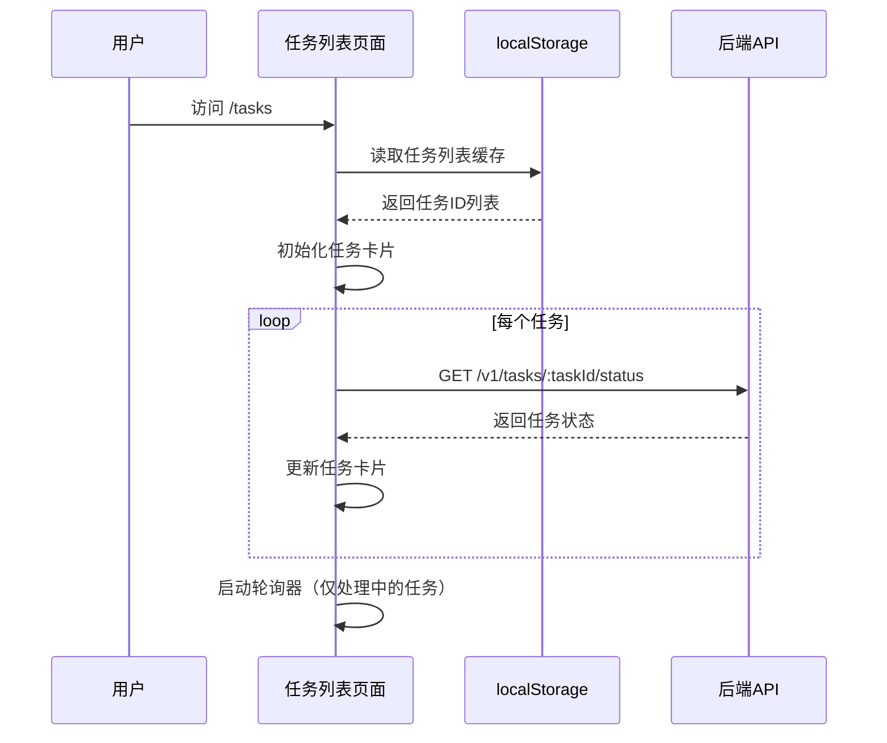
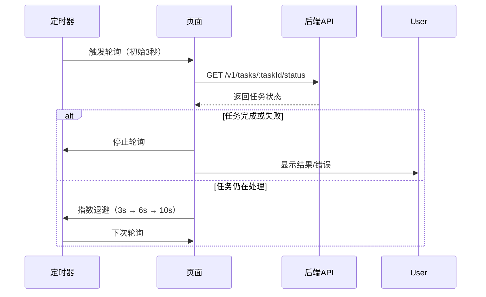
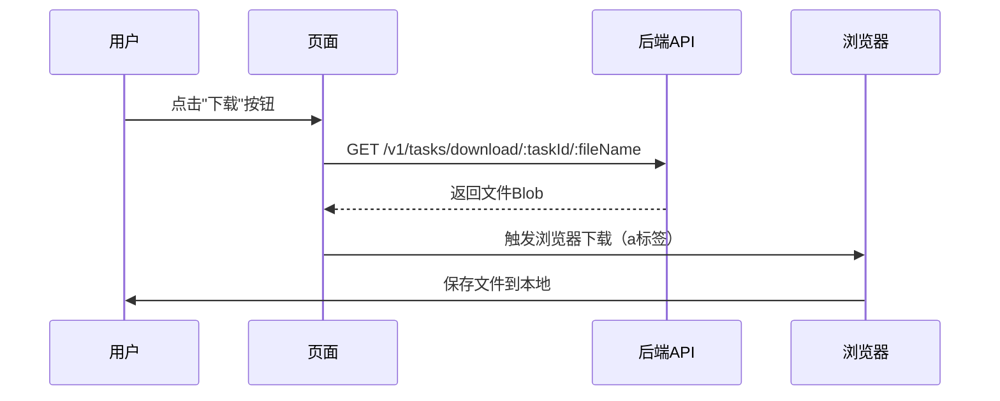

# 任务列表页面设计文档（第二层）

**文档版本**: 1.0
**创建日期**: 2025-11-03
**关联后端文档**: `notes/server/2nd/Gateway-design.md` v5.9

---

## 版本历史

- **v1.0 (2025-11-03)**:
  - 初始版本，定义任务列表页面功能和交互流程
  - 对齐后端GET /v1/tasks/:taskId/status接口
  - 对齐后端GET /v1/tasks/download/:taskId/:fileName接口
  - 定义轮询策略（3秒 → 指数退避 → 最多10秒）
  - 定义任务状态映射和错误处理策略

---

## 1. 页面功能描述

### 1.1 页面定位

**任务列表页面**用于显示所有上传的视频翻译任务，实时查询任务状态，并提供下载翻译结果的功能。

### 1.2 核心功能

1. **任务列表显示**：以卡片形式展示所有任务
2. **实时状态查询**：通过轮询机制实时更新任务状态
3. **状态可视化**：使用不同颜色和图标区分任务状态（PENDING、PROCESSING、COMPLETED、FAILED）
4. **下载结果**：任务完成后提供下载按钮
5. **任务持久化**：使用localStorage缓存任务列表，避免刷新丢失
6. **轮询优化**：使用指数退避策略，减少不必要的API调用

### 1.3 页面路由

- **路由路径**: `/tasks`
- **路由名称**: `TaskList`
- **路由守卫**: 需要检查配置状态（requiresConfig: true）
- **Query参数**: `taskId`（可选，用于高亮显示特定任务）

---

## 2. 交互流程

### 2.1 页面加载流程



### 2.2 轮询机制流程



### 2.3 下载流程



---

## 3. UI布局设计

### 3.1 页面结构

```vue
<template>
  <div class="task-list-page">
    <!-- 页面标题 -->
    <el-page-header content="任务列表">
      <template #extra>
        <el-button type="primary" @click="goToUpload">上传新视频</el-button>
      </template>
    </el-page-header>

    <!-- 空状态 -->
    <el-empty
      v-if="taskList.length === 0"
      description="暂无任务"
      :image-size="200"
    >
      <el-button type="primary" @click="goToUpload">立即上传</el-button>
    </el-empty>

    <!-- 任务列表 -->
    <div v-else class="task-grid">
      <TaskCard
        v-for="task in taskList"
        :key="task.task_id"
        :task="task"
        :highlight="task.task_id === highlightTaskId"
        @download="handleDownload"
        @retry="handleRetry"
      />
    </div>
  </div>
</template>
```

### 3.2 TaskCard组件

```vue
<template>
  <el-card class="task-card" :class="{ highlight: highlight }">
    <!-- 任务标题 -->
    <template #header>
      <div class="card-header">
        <span class="task-id">任务 {{ task.task_id.slice(0, 8) }}</span>
        <StatusBadge :status="task.status" />
      </div>
    </template>

    <!-- 任务信息 -->
    <div class="task-info">
      <!-- 状态图标 -->
      <div class="status-icon">
        <el-icon v-if="task.status === 'PENDING'" class="pending">
          <clock />
        </el-icon>
        <el-icon v-else-if="task.status === 'PROCESSING'" class="processing rotating">
          <loading />
        </el-icon>
        <el-icon v-else-if="task.status === 'COMPLETED'" class="completed">
          <circle-check />
        </el-icon>
        <el-icon v-else-if="task.status === 'FAILED'" class="failed">
          <circle-close />
        </el-icon>
      </div>

      <!-- 状态描述 -->
      <div class="status-desc">
        <p v-if="task.status === 'PENDING'">任务已创建，正在排队等待处理...</p>
        <p v-else-if="task.status === 'PROCESSING'">
          任务正在处理中，请耐心等待...
          <br />
          <el-text type="info" size="small">
            （处理时间约为视频时长的3倍）
          </el-text>
        </p>
        <p v-else-if="task.status === 'COMPLETED'">
          任务已完成！
          <br />
          <el-link type="primary" @click="$emit('download', task)">
            点击下载结果
          </el-link>
        </p>
        <p v-else-if="task.status === 'FAILED'">
          任务处理失败
          <br />
          <el-text type="danger" size="small">
            错误信息：{{ task.error_message }}
          </el-text>
        </p>
      </div>
    </div>

    <!-- 操作按钮 -->
    <template #footer>
      <div class="card-footer">
        <el-button
          v-if="task.status === 'COMPLETED'"
          type="primary"
          size="small"
          @click="$emit('download', task)"
        >
          下载结果
        </el-button>
        <el-button
          v-if="task.status === 'FAILED'"
          type="warning"
          size="small"
          @click="$emit('retry', task)"
        >
          重新上传
        </el-button>
        <el-text type="info" size="small">
          创建时间：{{ formatTime(task.created_at) }}
        </el-text>
      </div>
    </template>
  </el-card>
</template>

<style scoped>
.task-card {
  margin-bottom: 16px;
  transition: all 0.3s;

  &.highlight {
    border-color: var(--el-color-primary);
    box-shadow: 0 0 10px rgba(64, 158, 255, 0.3);
  }

  .status-icon {
    font-size: 48px;
    text-align: center;
    margin-bottom: 16px;

    .pending { color: var(--el-color-info); }
    .processing { color: var(--el-color-warning); }
    .completed { color: var(--el-color-success); }
    .failed { color: var(--el-color-danger); }

    .rotating {
      animation: rotate 2s linear infinite;
    }
  }

  @keyframes rotate {
    from { transform: rotate(0deg); }
    to { transform: rotate(360deg); }
  }
}
</style>
```

---

## 4. 任务状态映射

### 4.1 状态枚举定义

```typescript
/**
 * 任务状态枚举（对齐后端）
 * 
 * @backend Gateway-design.md v5.9 第254行
 */
export type TaskStatus = 'PENDING' | 'PROCESSING' | 'COMPLETED' | 'FAILED'

/**
 * 任务状态配置
 */
export const TASK_STATUS_CONFIG = {
  PENDING: {
    text: '排队中',
    color: 'info',
    icon: 'Clock',
    description: '任务已创建，正在排队等待处理'
  },
  PROCESSING: {
    text: '处理中',
    color: 'warning',
    icon: 'Loading',
    description: '任务正在处理中，请耐心等待'
  },
  COMPLETED: {
    text: '已完成',
    color: 'success',
    icon: 'CircleCheck',
    description: '任务已完成，可以下载结果'
  },
  FAILED: {
    text: '失败',
    color: 'danger',
    icon: 'CircleClose',
    description: '任务处理失败'
  }
} as const
```

### 4.2 任务数据结构

```typescript
/**
 * 任务数据结构（扩展后端响应）
 */
export interface Task {
  // 后端字段
  task_id: string
  status: TaskStatus
  result_url?: string
  error_message?: string

  // 前端扩展字段
  created_at: number    // 创建时间（Unix时间戳）
  updated_at: number    // 最后更新时间
  polling: boolean      // 是否正在轮询
}
```

---

## 5. 轮询策略实现

### 5.1 轮询器设计

```typescript
/**
 * 任务轮询器
 * 
 * @backend 对齐Gateway-design.md v5.9 第2.4节"轮询机制"
 * 
 * 策略：
 * - 初始间隔：3秒
 * - 指数退避：3s → 6s → 10s
 * - 最大间隔：10秒
 * - 停止条件：任务完成或失败
 */
class TaskPoller {
  private timers: Map<string, number> = new Map()
  private intervals: Map<string, number> = new Map()

  /**
   * 开始轮询单个任务
   */
  start(taskId: string, callback: (status: GetTaskStatusResponse) => void) {
    // 初始间隔3秒
    this.intervals.set(taskId, 3000)
    this.poll(taskId, callback)
  }

  /**
   * 执行轮询
   */
  private async poll(taskId: string, callback: (status: GetTaskStatusResponse) => void) {
    try {
      const response = await getTaskStatus(taskId)
      callback(response)

      // 任务完成或失败，停止轮询
      if (response.status === 'COMPLETED' || response.status === 'FAILED') {
        this.stop(taskId)
        return
      }

      // 指数退避（3s → 6s → 10s）
      const currentInterval = this.intervals.get(taskId) || 3000
      const nextInterval = Math.min(currentInterval * 2, 10000)
      this.intervals.set(taskId, nextInterval)

      // 继续轮询
      const timerId = window.setTimeout(() => {
        this.poll(taskId, callback)
      }, nextInterval)

      this.timers.set(taskId, timerId)
    } catch (error) {
      console.error(`轮询任务${taskId}失败:`, error)
      // 轮询失败，停止轮询
      this.stop(taskId)
    }
  }

  /**
   * 停止轮询单个任务
   */
  stop(taskId: string) {
    const timerId = this.timers.get(taskId)
    if (timerId) {
      clearTimeout(timerId)
      this.timers.delete(taskId)
      this.intervals.delete(taskId)
    }
  }

  /**
   * 停止所有轮询
   */
  stopAll() {
    for (const timerId of this.timers.values()) {
      clearTimeout(timerId)
    }
    this.timers.clear()
    this.intervals.clear()
  }
}

// 创建全局轮询器实例
const taskPoller = new TaskPoller()
```

### 5.2 轮询使用示例

```typescript
import { ref, onMounted, onUnmounted } from 'vue'
import { getTaskStatus } from '@/api/task-api'
import type { Task } from './types'

const taskList = ref<Task[]>([])

// 初始化轮询
const initPolling = () => {
  taskList.value.forEach(task => {
    // 只轮询处理中的任务
    if (task.status === 'PROCESSING' || task.status === 'PENDING') {
      taskPoller.start(task.task_id, (response) => {
        updateTaskStatus(task.task_id, response)
      })
    }
  })
}

// 更新任务状态
const updateTaskStatus = (taskId: string, response: GetTaskStatusResponse) => {
  const task = taskList.value.find(t => t.task_id === taskId)
  if (task) {
    task.status = response.status
    task.result_url = response.result_url
    task.error_message = response.error_message
    task.updated_at = Date.now()

    // 保存到localStorage
    saveTaskList()

    // 状态变化通知
    if (response.status === 'COMPLETED') {
      ElNotification.success({
        title: '任务完成',
        message: `任务 ${taskId.slice(0, 8)} 已完成，可以下载结果`,
        duration: 0  // 不自动关闭
      })
    } else if (response.status === 'FAILED') {
      ElNotification.error({
        title: '任务失败',
        message: `任务 ${taskId.slice(0, 8)} 处理失败：${response.error_message}`,
        duration: 0  // 不自动关闭
      })
    }
  }
}

onMounted(() => {
  loadTaskList()
  initPolling()
})

onUnmounted(() => {
  // 组件卸载时停止所有轮询
  taskPoller.stopAll()
})
```

---

## 6. 本地存储策略

### 6.1 任务列表持久化

```typescript
/**
 * localStorage存储策略
 */
const STORAGE_KEY = 'task_list'
const MAX_TASKS = 50  // 最多保存50个任务

/**
 * 加载任务列表
 */
const loadTaskList = (): Task[] => {
  try {
    const data = localStorage.getItem(STORAGE_KEY)
    if (!data) return []

    const tasks: Task[] = JSON.parse(data)
    
    // 按创建时间倒序排列
    return tasks.sort((a, b) => b.created_at - a.created_at)
  } catch (error) {
    console.error('加载任务列表失败:', error)
    return []
  }
}

/**
 * 保存任务列表
 */
const saveTaskList = (tasks: Task[]) => {
  try {
    // 只保存最近的50个任务
    const tasksToSave = tasks.slice(0, MAX_TASKS)
    localStorage.setItem(STORAGE_KEY, JSON.stringify(tasksToSave))
  } catch (error) {
    console.error('保存任务列表失败:', error)
  }
}

/**
 * 添加新任务
 */
const addTask = (taskId: string) => {
  const tasks = loadTaskList()
  
  // 检查是否已存在
  if (tasks.some(t => t.task_id === taskId)) {
    return
  }

  // 添加新任务
  const newTask: Task = {
    task_id: taskId,
    status: 'PENDING',
    created_at: Date.now(),
    updated_at: Date.now(),
    polling: false
  }

  tasks.unshift(newTask)
  saveTaskList(tasks)
  taskList.value = tasks
}

/**
 * 清理过期任务（7天前）
 */
const cleanupExpiredTasks = () => {
  const tasks = loadTaskList()
  const sevenDaysAgo = Date.now() - 7 * 24 * 60 * 60 * 1000
  
  const activeTasks = tasks.filter(task => {
    // 保留7天内的任务，或者仍在处理中的任务
    return task.created_at > sevenDaysAgo || task.status === 'PROCESSING' || task.status === 'PENDING'
  })

  saveTaskList(activeTasks)
  taskList.value = activeTasks
}
```

---

## 7. 下载功能实现

### 7.1 下载逻辑

```typescript
/**
 * 下载任务结果
 * 
 * @backend GET /v1/tasks/download/:taskId/:fileName
 * @reference Gateway-design.md v5.9 第452-488行
 */
const handleDownload = async (task: Task) => {
  if (!task.result_url) {
    ElMessage.error('下载链接不存在')
    return
  }

  // 解析result_url
  // 格式：/v1/tasks/download/{taskId}/{fileName}
  const urlParts = task.result_url.split('/')
  const taskId = urlParts[urlParts.length - 2]
  const fileName = urlParts[urlParts.length - 1]

  try {
    ElMessage.info('正在下载，请稍候...')

    // 调用下载API
    const blob = await downloadFile(taskId, fileName)

    // 触发浏览器下载
    triggerDownload(blob, fileName)

    ElMessage.success('下载成功')
  } catch (error) {
    // 错误已由http-client拦截器处理
  }
}

/**
 * 辅助函数：触发浏览器下载
 */
const triggerDownload = (blob: Blob, fileName: string) => {
  const url = URL.createObjectURL(blob)
  const link = document.createElement('a')
  link.href = url
  link.download = fileName
  document.body.appendChild(link)
  link.click()
  document.body.removeChild(link)
  URL.revokeObjectURL(url)
}
```

### 7.2 下载进度显示（可选）

```typescript
/**
 * 带进度显示的下载
 */
const handleDownloadWithProgress = async (task: Task) => {
  const urlParts = task.result_url!.split('/')
  const taskId = urlParts[urlParts.length - 2]
  const fileName = urlParts[urlParts.length - 1]

  // 显示加载对话框
  const loadingInstance = ElLoading.service({
    lock: true,
    text: '下载中...',
    background: 'rgba(0, 0, 0, 0.7)'
  })

  try {
    const response = await httpClient.get(
      `/v1/tasks/download/${taskId}/${fileName}`,
      {
        responseType: 'blob',
        onDownloadProgress: (progressEvent) => {
          if (progressEvent.total) {
            const percent = Math.round((progressEvent.loaded * 100) / progressEvent.total)
            loadingInstance.setText(`下载中... ${percent}%`)
          }
        }
      }
    )

    triggerDownload(response.data, fileName)
    ElMessage.success('下载成功')
  } catch (error) {
    // 错误处理
  } finally {
    loadingInstance.close()
  }
}
```

---

## 8. 错误处理策略

### 8.1 任务状态查询错误

```typescript
/**
 * 处理任务状态查询错误
 * 
 * @backend Gateway-design.md v5.9 第8章"错误码清单"
 */
const handleTaskStatusError = (taskId: string, error: unknown) => {
  if (!axios.isAxiosError(error)) {
    console.error(`查询任务${taskId}状态失败:`, error)
    return
  }

  const status = error.response?.status

  switch (status) {
    case 404:
      // 任务不存在（可能已被清理）
      ElMessage.warning(`任务 ${taskId.slice(0, 8)} 不存在或已过期`)
      
      // 从列表中移除
      taskList.value = taskList.value.filter(t => t.task_id !== taskId)
      saveTaskList(taskList.value)
      break

    case 503:
      // 任务服务不可用
      ElMessage.error('任务服务暂时不可用')
      
      // 停止所有轮询
      taskPoller.stopAll()
      break

    default:
      console.error(`查询任务${taskId}状态失败:`, error)
  }
}
```

### 8.2 下载错误处理

```typescript
/**
 * 处理下载错误
 */
const handleDownloadError = (error: unknown) => {
  if (!axios.isAxiosError(error)) {
    ElMessage.error('下载失败：未知错误')
    return
  }

  const status = error.response?.status

  switch (status) {
    case 400:
      // 路径参数错误
      ElMessage.error('下载链接无效')
      break

    case 404:
      // 文件不存在
      ElMessage.error('文件不存在或已被删除')
      break

    case 503:
      // 服务不可用
      ElMessage.error('服务暂时不可用，请稍后重试')
      break

    default:
      ElMessage.error('下载失败')
  }
}
```

---

## 9. 对齐的后端接口

### 9.1 GET /v1/tasks/:taskId/status

**后端文档**: Gateway-design.md v5.9 第293-294行
**关键逻辑**: Gateway-design.md v5.9 第416-450行

```typescript
/**
 * 查询任务状态
 * 
 * @backend GET /v1/tasks/:taskId/status
 * @reference Gateway-design.md v5.9 第416-450行
 * 
 * 后端处理步骤：
 * 1. 解析路径参数taskId
 * 2. 调用Task服务GetTaskStatus
 * 3. 状态枚举映射（TaskStatus → "PENDING"/"PROCESSING"/"COMPLETED"/"FAILED"）
 * 4. 如果任务完成，生成下载URL（/v1/tasks/download/{taskId}/{fileName}）
 * 5. 返回任务状态
 * 
 * 错误场景：
 * - 404 Not Found: 任务不存在
 * - 503 Service Unavailable: Task服务不可用
 */
const queryTaskStatus = async (taskId: string) => {
  const response = await getTaskStatus(taskId)
  
  // response.status: "PENDING" | "PROCESSING" | "COMPLETED" | "FAILED"
  // response.result_url: "/v1/tasks/download/{taskId}/result.mp4" (仅COMPLETED状态)
  // response.error_message: "错误信息" (仅FAILED状态)
  
  return response
}
```

### 9.2 GET /v1/tasks/download/:taskId/:fileName

**后端文档**: Gateway-design.md v5.9 第297-298行
**关键逻辑**: Gateway-design.md v5.9 第452-488行

```typescript
/**
 * 下载任务结果文件
 * 
 * @backend GET /v1/tasks/download/:taskId/:fileName
 * @reference Gateway-design.md v5.9 第452-488行
 * 
 * 后端处理步骤：
 * 1. 解析路径参数（taskId、fileName）
 * 2. 路径遍历安全检查
 * 3. 拼接文件路径（{LOCAL_STORAGE_PATH}/{taskId}/{fileName}）
 * 4. 符号链接安全检查
 * 5. 检查文件是否存在
 * 6. 流式传输文件（自动处理Range请求）
 * 
 * 错误场景：
 * - 400 Bad Request: 路径参数包含非法字符
 * - 404 Not Found: 文件不存在
 * - 503 Service Unavailable: 服务不可用
 */
const downloadResult = async (taskId: string, fileName: string) => {
  const blob = await downloadFile(taskId, fileName)
  
  // blob为文件内容，MIME Type根据扩展名自动设置
  // - .mp4 → video/mp4
  // - .mov → video/quicktime
  // - .mkv → video/x-matroska
  
  triggerDownload(blob, fileName)
}
```

---

## 10. 用户体验优化

### 10.1 任务高亮显示

```typescript
// 通过query参数高亮显示新上传的任务
import { useRoute } from 'vue-router'

const route = useRoute()
const highlightTaskId = ref<string>('')

onMounted(() => {
  highlightTaskId.value = route.query.taskId as string || ''

  // 3秒后取消高亮
  if (highlightTaskId.value) {
    setTimeout(() => {
      highlightTaskId.value = ''
    }, 3000)
  }
})
```

### 10.2 状态变化通知

```typescript
// 任务状态变化时发送桌面通知
const sendNotification = (task: Task) => {
  if (!('Notification' in window)) return

  if (Notification.permission === 'granted') {
    new Notification('任务状态更新', {
      body: `任务 ${task.task_id.slice(0, 8)} 状态：${TASK_STATUS_CONFIG[task.status].text}`,
      icon: '/favicon.ico'
    })
  } else if (Notification.permission !== 'denied') {
    Notification.requestPermission()
  }
}
```

### 10.3 刷新按钮

```vue
<template>
  <el-button @click="refreshAllTasks" :loading="refreshing">
    <el-icon><refresh /></el-icon>
    刷新
  </el-button>
</template>

<script setup lang="ts">
const refreshing = ref(false)

const refreshAllTasks = async () => {
  refreshing.value = true
  
  try {
    // 重新查询所有任务状态
    await Promise.all(
      taskList.value.map(task => 
        getTaskStatus(task.task_id).then(response => {
          updateTaskStatus(task.task_id, response)
        })
      )
    )
    
    ElMessage.success('刷新成功')
  } catch (error) {
    ElMessage.error('刷新失败')
  } finally {
    refreshing.value = false
  }
}
</script>
```

---

## 11. 文档变更历史

| 版本 | 日期       | 变更内容                     |
| ---- | ---------- | ---------------------------- |
| 1.0  | 2025-11-03 | 初始版本，定义任务列表页面设计 |

---

**文档结束**
