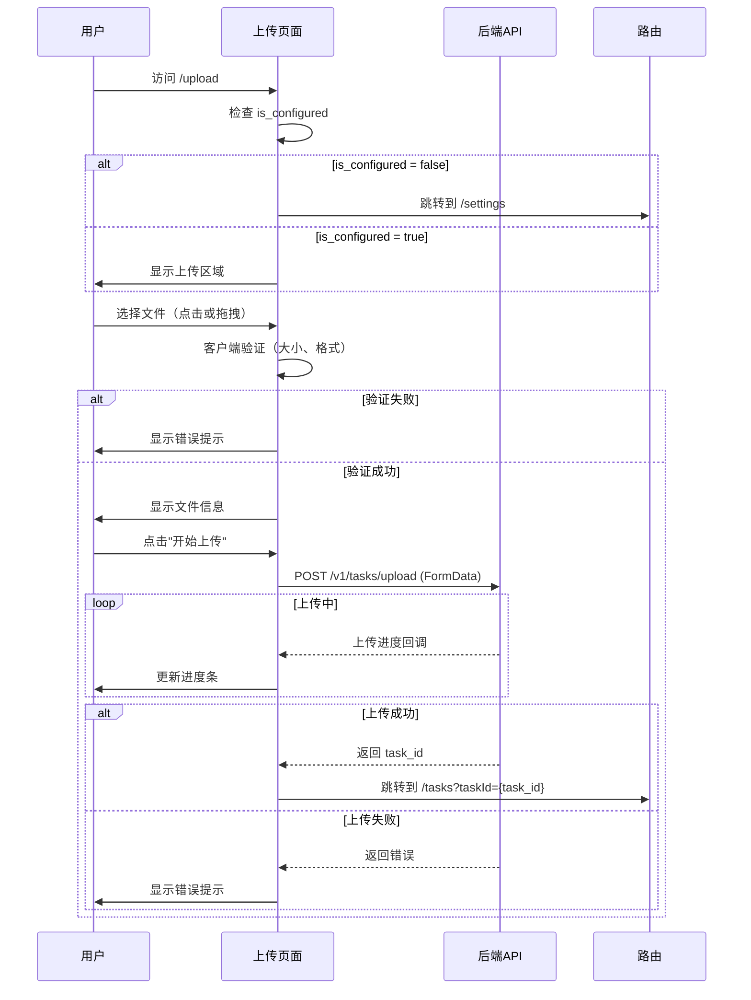
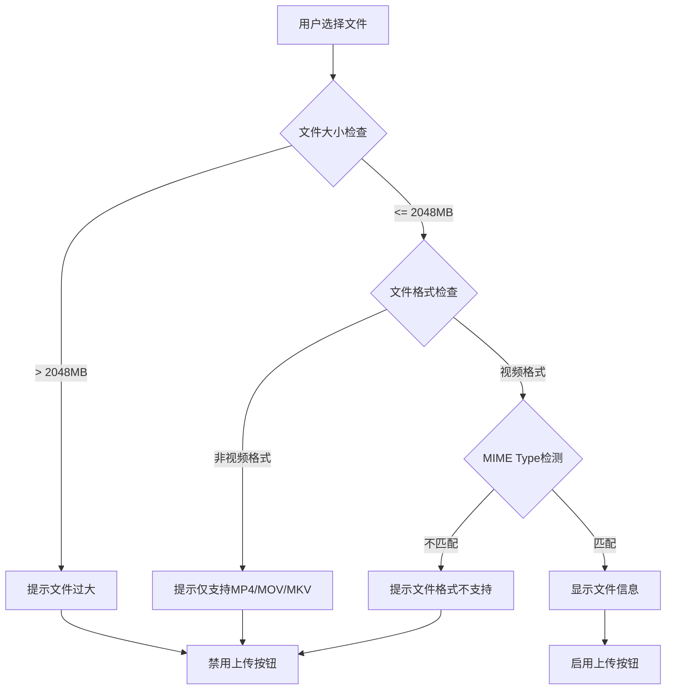
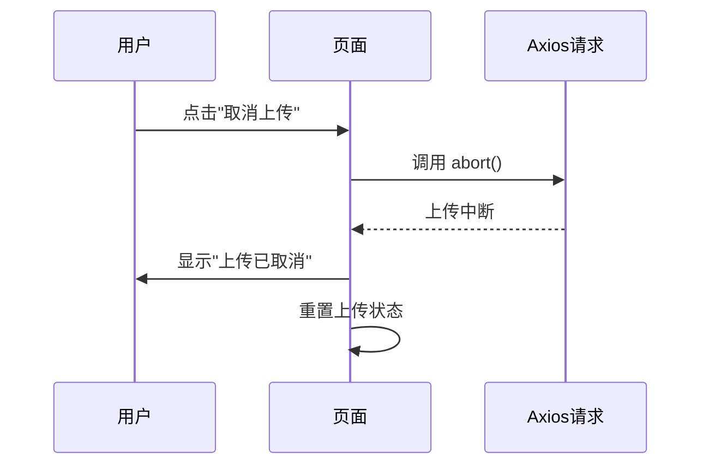

# 任务上传页面设计文档（第二层）

**文档版本**: 1.0
**创建日期**: 2025-11-03
**关联后端文档**: `notes/server/2nd/Gateway-design.md` v5.9

---

## 版本历史

- **v1.0 (2025-11-03)**:
  - 初始版本，定义任务上传页面功能和交互流程
  - 对齐后端POST /v1/tasks/upload接口
  - 定义文件验证规则和上传进度显示
  - 定义错误处理策略

---

## 1. 页面功能描述

### 1.1 页面定位

**任务上传页面**用于选择本地视频文件并上传到服务器，创建视频翻译任务。

### 1.2 核心功能

1. **文件选择**：支持点击选择和拖拽上传
2. **文件验证**：
   - 大小验证：最大2048MB
   - 格式验证：仅支持MP4、MOV、MKV
   - MIME Type检测：通过文件头检测而非扩展名
3. **上传进度显示**：实时显示上传百分比和速度
4. **上传控制**：支持取消上传
5. **自动跳转**：上传成功后自动跳转到任务列表页面

### 1.3 页面路由

- **路由路径**: `/upload`
- **路由名称**: `Upload`
- **路由守卫**: 需要检查配置状态（requiresConfig: true）

---

## 2. 交互流程

### 2.1 完整上传流程



### 2.2 文件验证流程



### 2.3 上传取消流程



---

## 3. UI布局设计

### 3.1 页面结构

```vue
<template>
  <div class="upload-page">
    <!-- 页面标题 -->
    <el-page-header @back="goBack" content="上传视频" />

    <!-- 上传区域 -->
    <el-card class="upload-card">
      <!-- 拖拽上传区域 -->
      <el-upload
        ref="uploadRef"
        class="upload-dragger"
        drag
        :auto-upload="false"
        :show-file-list="false"
        :on-change="handleFileChange"
        :before-upload="beforeUpload"
        accept="video/mp4,video/quicktime,video/x-matroska"
      >
        <el-icon class="el-icon--upload"><upload-filled /></el-icon>
        <div class="el-upload__text">
          将文件拖到此处，或<em>点击选择文件</em>
        </div>
        <template #tip>
          <div class="el-upload__tip">
            仅支持 MP4、MOV、MKV 格式，最大 2048MB
          </div>
        </template>
      </el-upload>

      <!-- 文件信息展示 -->
      <div v-if="selectedFile" class="file-info">
        <el-descriptions :column="2" border>
          <el-descriptions-item label="文件名">
            {{ selectedFile.name }}
          </el-descriptions-item>
          <el-descriptions-item label="文件大小">
            {{ formatFileSize(selectedFile.size) }}
          </el-descriptions-item>
          <el-descriptions-item label="文件格式">
            {{ selectedFile.type }}
          </el-descriptions-item>
          <el-descriptions-item label="上传状态">
            <el-tag :type="uploadStatusType">{{ uploadStatusText }}</el-tag>
          </el-descriptions-item>
        </el-descriptions>

        <!-- 上传进度条 -->
        <el-progress
          v-if="uploading"
          :percentage="uploadProgress"
          :status="uploadStatus"
        >
          <template #default="{ percentage }">
            <span>{{ percentage }}%</span>
            <span v-if="uploadSpeed"> ({{ uploadSpeed }})</span>
          </template>
        </el-progress>

        <!-- 操作按钮 -->
        <div class="actions">
          <el-button
            v-if="!uploading && !uploadComplete"
            type="primary"
            size="large"
            @click="startUpload"
            :disabled="!canUpload"
          >
            开始上传
          </el-button>
          <el-button
            v-if="uploading"
            type="danger"
            size="large"
            @click="cancelUpload"
          >
            取消上传
          </el-button>
          <el-button
            v-if="uploadComplete"
            type="success"
            size="large"
            @click="goToTaskList"
          >
            查看任务
          </el-button>
          <el-button
            v-if="!uploading"
            size="large"
            @click="resetUpload"
          >
            重新选择
          </el-button>
        </div>
      </div>
    </el-card>

    <!-- 上传须知 -->
    <el-card class="notice-card">
      <template #header>
        <span>上传须知</span>
      </template>
      <ul>
        <li>支持的视频格式：MP4、MOV、MKV</li>
        <li>单个文件最大支持 2048MB</li>
        <li>上传成功后将自动创建翻译任务</li>
        <li>任务处理时间取决于视频长度（约 10分钟视频需要 30分钟）</li>
        <li>处理过程中请勿关闭浏览器</li>
      </ul>
    </el-card>
  </div>
</template>
```

### 3.2 样式设计

```scss
.upload-page {
  max-width: 900px;
  margin: 0 auto;
  padding: 20px;

  .upload-card {
    margin-bottom: 20px;

    .upload-dragger {
      width: 100%;
    }

    .file-info {
      margin-top: 20px;

      .el-progress {
        margin: 20px 0;
      }

      .actions {
        display: flex;
        gap: 12px;
        margin-top: 20px;
      }
    }
  }

  .notice-card {
    ul {
      margin: 0;
      padding-left: 20px;

      li {
        margin-bottom: 8px;
        color: var(--el-text-color-secondary);
      }
    }
  }
}
```

---

## 4. 文件验证规则

### 4.1 验证规则定义

```typescript
/**
 * 文件验证规则（对齐后端）
 * 
 * @backend Gateway-design.md v5.9 第3.1章
 */
const FILE_VALIDATION_RULES = {
  // 最大文件大小：2048MB
  MAX_FILE_SIZE_MB: 2048,
  MAX_FILE_SIZE_BYTES: 2048 * 1024 * 1024,

  // 支持的MIME Type（对齐后端SUPPORTED_MIME_TYPES）
  ALLOWED_MIME_TYPES: [
    'video/mp4',
    'video/quicktime',    // MOV格式
    'video/x-matroska'    // MKV格式
  ],

  // 支持的文件扩展名
  ALLOWED_EXTENSIONS: ['.mp4', '.mov', '.mkv']
}
```

### 4.2 客户端验证实现

```typescript
/**
 * 文件大小验证
 * 
 * @backend 对齐Gateway uploadTaskLogic步骤2
 */
const validateFileSize = (file: File): boolean => {
  if (file.size > FILE_VALIDATION_RULES.MAX_FILE_SIZE_BYTES) {
    ElMessage.error(`文件大小超过限制（最大 ${FILE_VALIDATION_RULES.MAX_FILE_SIZE_MB}MB）`)
    return false
  }
  return true
}

/**
 * 文件格式验证
 * 
 * @backend 对齐Gateway uploadTaskLogic步骤3
 */
const validateFileType = (file: File): boolean => {
  // 检查MIME Type
  if (!FILE_VALIDATION_RULES.ALLOWED_MIME_TYPES.includes(file.type)) {
    ElMessage.error('不支持的文件格式，仅支持 MP4、MOV、MKV 格式')
    return false
  }

  // 检查文件扩展名（双重验证）
  const fileName = file.name.toLowerCase()
  const hasValidExtension = FILE_VALIDATION_RULES.ALLOWED_EXTENSIONS.some(
    ext => fileName.endsWith(ext)
  )

  if (!hasValidExtension) {
    ElMessage.error('文件扩展名不支持')
    return false
  }

  return true
}

/**
 * 完整的文件验证
 */
const validateFile = (file: File): boolean => {
  return validateFileSize(file) && validateFileType(file)
}
```

---

## 5. 上传实现

### 5.1 上传状态管理

```typescript
import { ref, computed } from 'vue'
import { uploadTask } from '@/api/task-api'
import type { UploadTaskResponse } from '@/api/types'
import { useRouter } from 'vue-router'

// 选中的文件
const selectedFile = ref<File | null>(null)

// 上传状态
const uploading = ref(false)
const uploadComplete = ref(false)
const uploadProgress = ref(0)
const uploadSpeed = ref('')

// 上传控制
const abortController = ref<AbortController | null>(null)

// 任务ID（上传成功后获取）
const taskId = ref('')

// 计算属性
const canUpload = computed(() => {
  return selectedFile.value && !uploading.value && !uploadComplete.value
})

const uploadStatus = computed(() => {
  if (uploadComplete.value) return 'success'
  if (uploading.value) return undefined
  return undefined
})

const uploadStatusType = computed(() => {
  if (uploadComplete.value) return 'success'
  if (uploading.value) return 'warning'
  return 'info'
})

const uploadStatusText = computed(() => {
  if (uploadComplete.value) return '上传成功'
  if (uploading.value) return '上传中'
  return '等待上传'
})
```

### 5.2 上传进度计算

```typescript
// 上传速度计算
let lastLoaded = 0
let lastTime = Date.now()

const calculateUploadSpeed = (loaded: number) => {
  const now = Date.now()
  const timeDiff = (now - lastTime) / 1000  // 秒
  const loadedDiff = loaded - lastLoaded

  if (timeDiff >= 1) {
    const speed = loadedDiff / timeDiff  // 字节/秒
    uploadSpeed.value = formatSpeed(speed)
    lastLoaded = loaded
    lastTime = now
  }
}

const formatSpeed = (bytesPerSecond: number): string => {
  if (bytesPerSecond < 1024) {
    return `${bytesPerSecond.toFixed(0)} B/s`
  } else if (bytesPerSecond < 1024 * 1024) {
    return `${(bytesPerSecond / 1024).toFixed(2)} KB/s`
  } else {
    return `${(bytesPerSecond / 1024 / 1024).toFixed(2)} MB/s`
  }
}

const formatFileSize = (bytes: number): string => {
  if (bytes < 1024) {
    return `${bytes} B`
  } else if (bytes < 1024 * 1024) {
    return `${(bytes / 1024).toFixed(2)} KB`
  } else if (bytes < 1024 * 1024 * 1024) {
    return `${(bytes / 1024 / 1024).toFixed(2)} MB`
  } else {
    return `${(bytes / 1024 / 1024 / 1024).toFixed(2)} GB`
  }
}
```

### 5.3 上传核心逻辑

```typescript
/**
 * 开始上传
 * 
 * @backend POST /v1/tasks/upload
 * @reference Gateway-design.md v5.9 第373-413行
 */
const startUpload = async () => {
  if (!selectedFile.value) return

  // 重置状态
  uploading.value = true
  uploadProgress.value = 0
  uploadSpeed.value = ''
  lastLoaded = 0
  lastTime = Date.now()

  // 创建AbortController用于取消上传
  abortController.value = new AbortController()

  try {
    const response: UploadTaskResponse = await uploadTask(
      selectedFile.value,
      (percent) => {
        uploadProgress.value = percent
        calculateUploadSpeed(selectedFile.value!.size * percent / 100)
      }
    )

    // 上传成功
    taskId.value = response.task_id
    uploadComplete.value = true
    uploading.value = false

    ElMessage.success('上传成功！正在跳转到任务列表...')

    // 3秒后自动跳转
    setTimeout(() => {
      goToTaskList()
    }, 3000)
  } catch (error) {
    uploading.value = false
    // 错误已由http-client拦截器处理
  }
}

/**
 * 取消上传
 */
const cancelUpload = () => {
  if (abortController.value) {
    abortController.value.abort()
    abortController.value = null
  }

  uploading.value = false
  uploadProgress.value = 0
  uploadSpeed.value = ''

  ElMessage.info('上传已取消')
}

/**
 * 重置上传状态
 */
const resetUpload = () => {
  selectedFile.value = null
  uploading.value = false
  uploadComplete.value = false
  uploadProgress.value = 0
  uploadSpeed.value = ''
  taskId.value = ''
  abortController.value = null
}

/**
 * 跳转到任务列表页面
 */
const goToTaskList = () => {
  const router = useRouter()
  router.push({ 
    name: 'TaskList', 
    query: { taskId: taskId.value }  // 传递taskId用于高亮显示
  })
}
```

---

## 6. 错误处理策略

### 6.1 错误类型与处理

```typescript
/**
 * 上传错误处理
 * 
 * @backend Gateway-design.md v5.9 第8章"错误码清单"
 */
const handleUploadError = (error: unknown) => {
  if (!axios.isAxiosError(error)) {
    ElMessage.error('上传失败：未知错误')
    return
  }

  const status = error.response?.status
  const errorData = error.response?.data as APIError

  switch (status) {
    case 400:
      // 参数错误（通常不会发生，因为客户端已验证）
      ElMessage.error(`上传失败: ${errorData.message}`)
      break

    case 413:
      // 文件过大（后端二次验证）
      ElMessage.error('文件大小超过服务器限制（2048MB）')
      break

    case 415:
      // MIME Type不支持（后端通过文件头检测）
      ElMessage.error('文件格式验证失败，请确保上传的是真实的视频文件')
      break

    case 499:
      // 客户端主动取消
      ElMessage.info('上传已取消')
      break

    case 503:
      // 任务服务不可用
      ElMessage.error('任务服务暂时不可用，请稍后重试')
      break

    case 507:
      // 服务器磁盘空间不足
      ElMessage.error('服务器存储空间不足，请联系管理员')
      break

    default:
      ElMessage.error(errorData.message || '上传失败')
  }
}
```

### 6.2 网络异常处理

```typescript
// 监听网络状态
window.addEventListener('online', () => {
  ElMessage.success('网络已恢复')
})

window.addEventListener('offline', () => {
  ElMessage.error('网络连接已断开')
  
  // 如果正在上传，自动取消
  if (uploading.value) {
    cancelUpload()
  }
})
```

---

## 7. 对齐的后端接口

### 7.1 POST /v1/tasks/upload

**后端文档**: Gateway-design.md v5.9 第289-290行
**关键逻辑**: Gateway-design.md v5.9 第373-413行

```typescript
/**
 * 上传视频文件并创建任务
 * 
 * @backend POST /v1/tasks/upload
 * @reference Gateway-design.md v5.9 第373-413行
 * 
 * 后端处理步骤：
 * 1. 解析文件流和原始文件名
 * 2. 检查文件大小（最大2048MB）
 * 3. 验证MIME Type（通过文件头检测）
 * 4. 检查磁盘空间（availableSpace >= fileSize * 3 + 500MB）
 * 5. 保存到临时目录（流式保存，避免内存占用）
 * 6. 调用Task服务创建任务
 * 7. 返回task_id
 * 
 * 错误场景：
 * - 413 Payload Too Large: 文件超过2048MB
 * - 415 Unsupported Media Type: MIME Type不在白名单
 * - 507 Insufficient Storage: 磁盘空间不足
 * - 503 Service Unavailable: Task服务不可用
 */
const uploadFile = async (file: File) => {
  const formData = new FormData()
  formData.append('file', file)

  const response = await httpClient.post<UploadTaskResponse>(
    '/v1/tasks/upload',
    formData,
    {
      headers: {
        'Content-Type': 'multipart/form-data'
      },
      onUploadProgress: (progressEvent) => {
        // 更新上传进度
      }
    }
  )

  return response.data
}
```

---

## 8. 用户体验优化

### 8.1 拖拽上传优化

```typescript
// 拖拽区域高亮
const dragOver = ref(false)

const handleDragEnter = () => {
  dragOver.value = true
}

const handleDragLeave = () => {
  dragOver.value = false
}

const handleDrop = (event: DragEvent) => {
  dragOver.value = false
  // 处理文件...
}
```

### 8.2 上传前确认

```typescript
// 大文件上传前确认
const startUpload = async () => {
  if (!selectedFile.value) return

  // 如果文件超过500MB，弹出确认框
  if (selectedFile.value.size > 500 * 1024 * 1024) {
    await ElMessageBox.confirm(
      `文件大小为 ${formatFileSize(selectedFile.value.size)}，上传可能需要较长时间。是否继续？`,
      '确认上传',
      {
        confirmButtonText: '继续',
        cancelButtonText: '取消',
        type: 'warning'
      }
    )
  }

  // 开始上传...
}
```

### 8.3 上传失败重试

```typescript
// 上传失败后提供重试选项
const retryUpload = async () => {
  ElMessageBox.confirm(
    '是否重新上传该文件？',
    '上传失败',
    {
      confirmButtonText: '重试',
      cancelButtonText: '取消',
      type: 'error'
    }
  ).then(() => {
    startUpload()
  })
}
```

---

## 9. 文档变更历史

| 版本 | 日期       | 变更内容                     |
| ---- | ---------- | ---------------------------- |
| 1.0  | 2025-11-03 | 初始版本，定义任务上传页面设计 |

---

**文档结束**
