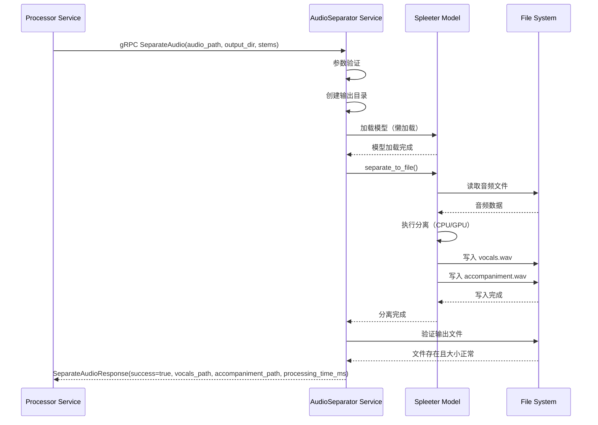
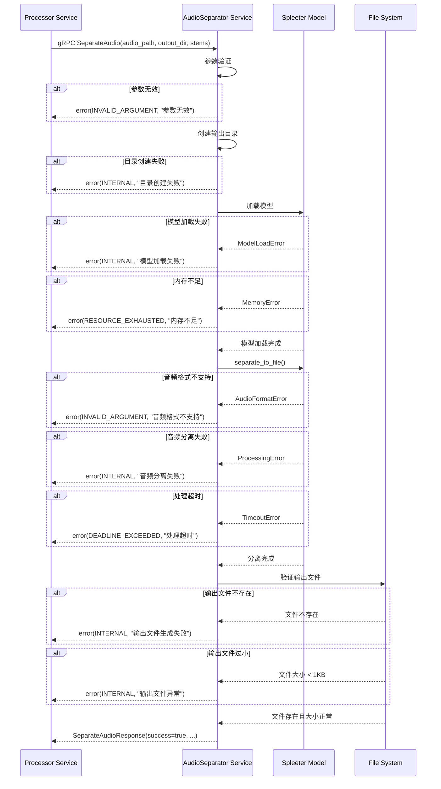

# AudioSeparator 服务设计文档（第二层）

**文档版本**: 1.5
**关联宏观架构**: `notes/Base-Design.md` v2.2
**最后更新**: 2025-11-02
**服务定位**: Python gRPC 微服务，负责音频分离（人声 + 背景音）

## 版本历史

- **v1.5 (2025-11-02)**:
  - **版本引用修复**：统一更新所有版本引用为 Base-Design.md v2.2
  - 更新第 10.1 节、第 10.2 节的版本引用
  - 确保文档版本引用一致性和准确性
- **v1.4 (2025-11-02)**:
  - **文档质量修复**：修复第 10.1 节和第 11.1 节的描述错误
  - **修复第 10.1 节**：将"第 4 章'关键逻辑伪代码'"修正为"第 4 章'关键逻辑步骤'"（第 501 行）
  - **修复第 11.1 节**：更新第三层文档的描述，明确第三层文档的核心是"核心实现决策与上下文"，而非"Python 代码实现"
  - **新增第 11.3 节**：明确部署阶段文档的撰写时机和存放位置
  - **引用规范**：明确引用 design-rules.md 的具体行号（第 809-814 行、第 181-330 行）
- **v1.3 (2025-11-02)**:
  - **重大修复**：严格遵循 design-rules.md 规范，修复第二层文档质量问题
  - **修复第 4 章"关键逻辑步骤"**：移除伪代码形式，改为步骤化描述（步骤 1-9），每个步骤是明确的业务动作
  - **修复第 3 章"核心数据结构"**：移除 Python 代码实现（@dataclass），改为表格形式定义字段和含义
  - **修复第 9 章"部署说明"**：移除 Dockerfile 和 requirements.txt 的具体内容，改为部署要求和依赖概览
  - **新增部署阶段文档说明**：明确 Dockerfile、docker-compose.yml、requirements.txt 等部署文档将在项目完成后、到达部署阶段时专门撰写
- **v1.2 (2025-11-01)**:
  - **重大更新**：全面完善第二层文档质量，符合 design-rules.md 规范
  - 补充第 4 章"关键逻辑步骤"：增加详细的错误处理、数据验证、模型加载等步骤
  - 完善第 5 章"服务交互时序图"：增加错误处理分支
  - 完善第 6 章"错误码清单"：增加业务特定错误码和错误处理策略
  - 完善第 7 章"配置项定义"：增加类型、默认值、是否必填说明
  - 更新文档变更历史
- **v1.1 (2025-10-30)**:
  - 更新关联宏观架构版本为 v2.0（Base-Design.md 已完成冗余清理）
  - 新增版本历史章节
  - 更新"与第一层文档的对应关系"章节，引用 v2.0
  - 新增"文档变更历史"章节
  - 确认 AudioSeparationEnabled 默认值为 false（与 Base-Design.md v2.0 一致）
- **v1.0 (2025-10-30)**: 初始版本

---

## 1. 服务定位与核心职责

### 1.1 服务定位

`AudioSeparator` 是一个**独立的 Python gRPC 微服务**，部署在 `server/mcp/audio-separator/` 目录下。它是整个系统中唯一的 Python 服务，专门负责音频分离任务。

### 1.2 核心职责

* **音频分离**: 使用 Spleeter 模型将音频分离为人声（vocals）和背景音（accompaniment）
* **gRPC 服务**: 提供 gRPC 接口供 Processor 服务调用
* **可选启用**: 通过配置开关 `audio_separation_enabled` 控制是否启用
* **降级处理**: 如果分离失败，返回错误，由 Processor 服务决定是否降级

### 1.3 服务边界

**负责**:
- 接收音频文件路径
- 调用 Spleeter 模型进行分离
- 返回分离后的人声和背景音文件路径

**不负责**:
- 音频格式转换（由 Processor 服务使用 ffmpeg 完成）
- 音频质量检查（由 Processor 服务完成）
- 文件存储管理（由 Processor 服务完成）

---

## 2. gRPC 接口定义

### 2.1 Proto 文件定义

```protobuf
syntax = "proto3";

package audioseparator;

option go_package = "./audioseparator";

// AudioSeparator 服务定义
service AudioSeparator {
  // 分离音频为人声和背景音
  rpc SeparateAudio(SeparateAudioRequest) returns (SeparateAudioResponse);
}

// 分离音频请求
message SeparateAudioRequest {
  string audio_path = 1;  // 输入音频文件的绝对路径
  string output_dir = 2;  // 输出目录的绝对路径
  int32 stems = 3;        // 分离模式：2stems（人声+背景音），默认 2
}

// 分离音频响应
message SeparateAudioResponse {
  bool success = 1;              // 是否成功
  string vocals_path = 2;        // 人声文件路径
  string accompaniment_path = 3; // 背景音文件路径
  string error_message = 4;      // 错误信息（如果失败）
  int32 processing_time_ms = 5;  // 处理耗时（毫秒）
}
```

### 2.2 接口说明

#### SeparateAudio

**功能**: 分离音频为人声和背景音

**输入**:
- `audio_path`: 输入音频文件的绝对路径（例如：`/data/videos/task_123/audio.wav`）
- `output_dir`: 输出目录的绝对路径（例如：`/data/videos/task_123/separated/`）
- `stems`: 分离模式，默认 2（2stems = 人声 + 背景音）

**输出**:
- `success`: 是否成功（true/false）
- `vocals_path`: 人声文件路径（例如：`/data/videos/task_123/separated/vocals.wav`）
- `accompaniment_path`: 背景音文件路径（例如：`/data/videos/task_123/separated/accompaniment.wav`）
- `error_message`: 错误信息（如果失败）
- `processing_time_ms`: 处理耗时（毫秒）

**错误码**:
- `INVALID_ARGUMENT`: 输入参数无效（文件不存在、路径格式错误）
- `INTERNAL`: Spleeter 模型加载失败或处理失败
- `RESOURCE_EXHAUSTED`: 内存不足或 GPU 资源不足

---

## 3. 核心数据结构

### 3.1 配置结构（AudioSeparatorConfig）

| 字段 | 类型 | 默认值 | 说明 |
|------|------|--------|------|
| model_name | string | "spleeter:2stems" | Spleeter 模型名称 |
| model_path | string | "/models" | 模型文件路径 |
| max_workers | int | 1 | 最大并发处理数 |
| grpc_port | int | 50052 | gRPC 服务端口 |
| use_gpu | bool | false | 是否使用 GPU（从环境变量读取） |

### 3.2 处理上下文（SeparationContext）

| 字段 | 类型 | 说明 |
|------|------|------|
| task_id | string | 任务 ID（从 audio_path 提取） |
| audio_path | string | 输入音频路径 |
| output_dir | string | 输出目录 |
| stems | int | 分离模式 |
| start_time | float | 开始时间（用于计算耗时） |
| vocals_path | string (可选) | 人声文件路径 |
| accompaniment_path | string (可选) | 背景音文件路径 |

---

## 4. 关键逻辑步骤

> ⚠️ **注意**：根据 `design-rules.md` 第 122-154 行的规范，本章使用"关键逻辑步骤"而非具体代码。每个步骤是明确的业务动作，包含关键判断条件和数据流向。

### 4.1 SeparateAudio 处理流程

**步骤 1: 参数验证**
- 验证 `audio_path` 是否为空，为空则返回 `INVALID_ARGUMENT` 错误
- 验证音频文件是否存在，不存在则返回 `INVALID_ARGUMENT` 错误
- 验证音频文件格式（支持：wav, mp3, flac, ogg, m4a），不支持则返回 `INVALID_ARGUMENT` 错误
- 验证 `stems` 参数（必须是 2, 4, 或 5），无效则返回 `INVALID_ARGUMENT` 错误
- 如果 `stems` 未指定，使用默认值 2
- 验证 `output_dir` 是否为空，为空则返回 `INVALID_ARGUMENT` 错误

**步骤 2: 创建输出目录**
- 检查 `output_dir` 是否存在，不存在则创建
- 如果创建失败（文件系统错误），返回 `INTERNAL` 错误

**步骤 3: 初始化处理上下文**
- 从 `audio_path` 提取 `task_id`（例如：从 `/data/videos/task_123/audio.wav` 提取 `task_123`）
- 创建 `SeparationContext` 对象，包含：task_id, audio_path, output_dir, stems, start_time
- 记录日志：开始音频分离（task_id, stems）

**步骤 4: 加载 Spleeter 模型（懒加载）**
- 检查模型是否已加载，如果未加载则加载对应的 stems 模型
- 如果模型加载失败（模型文件不存在、版本不兼容），返回 `INTERNAL` 错误
- 如果内存不足（模型加载需要 500MB - 1GB），返回 `RESOURCE_EXHAUSTED` 错误
- 记录日志：模型加载成功（stems）

**步骤 5: 执行音频分离**
- 调用 Spleeter 的 `separate_to_file()` 方法，输入：audio_path, output_dir
- 如果音频格式不支持（文件损坏、格式错误），返回 `INVALID_ARGUMENT` 错误
- 如果处理失败（未知错误），返回 `INTERNAL` 错误
- 如果内存不足（音频文件过大），返回 `RESOURCE_EXHAUSTED` 错误
- 如果处理超时（超过 10 分钟），返回 `DEADLINE_EXCEEDED` 错误
- 记录日志：音频分离完成（task_id）

**步骤 6: 构建输出路径**
- 从 `audio_path` 提取文件名（不含扩展名），例如：`audio.wav` → `audio`
- 构建 `vocals_path`: `{output_dir}/{audio_name}/vocals.wav`
- 构建 `accompaniment_path`: `{output_dir}/{audio_name}/accompaniment.wav`

**步骤 7: 验证输出文件**
- 检查 `vocals_path` 是否存在，不存在则返回 `INTERNAL` 错误（人声文件生成失败）
- 检查 `accompaniment_path` 是否存在，不存在则返回 `INTERNAL` 错误（背景音文件生成失败）
- 检查 `vocals_path` 文件大小是否 >= 1KB，过小则返回 `INTERNAL` 错误（文件异常）
- 检查 `accompaniment_path` 文件大小是否 >= 1KB，过小则返回 `INTERNAL` 错误（文件异常）

**步骤 8: 计算处理耗时**
- 计算从 `start_time` 到当前时间的耗时（毫秒）
- 记录日志：音频分离成功（task_id, processing_time, vocals_size, accompaniment_size）

**步骤 9: 返回成功响应**
- 返回 `SeparateAudioResponse`，包含：
  - `success`: true
  - `vocals_path`: 人声文件路径
  - `accompaniment_path`: 背景音文件路径
  - `error_message`: 空字符串
  - `processing_time_ms`: 处理耗时（毫秒）

---

## 5. 服务交互时序图

### 5.1 音频分离服务时序图（成功路径）



### 5.2 音频分离服务时序图（错误处理分支）



---

## 6. 错误码清单

### 6.1 通用错误码

| 错误码 | gRPC 状态码 | 说明 | 触发场景 | 处理建议 |
|--------|-------------|------|----------|----------|
| `INVALID_ARGUMENT` | `INVALID_ARGUMENT` | 参数无效 | 1. audio_path 为空或不存在<br>2. output_dir 为空<br>3. stems 值无效（不是 2/4/5）<br>4. 音频格式不支持 | 检查输入参数，确保文件路径正确且格式支持 |
| `INTERNAL` | `INTERNAL` | 内部错误 | 1. 模型加载失败<br>2. 音频分离处理失败<br>3. 输出文件生成失败<br>4. 输出文件过小（< 1KB） | 检查模型文件、音频格式、磁盘空间 |
| `RESOURCE_EXHAUSTED` | `RESOURCE_EXHAUSTED` | 资源不足 | 1. 内存不足（模型加载）<br>2. 内存不足（音频处理）<br>3. 磁盘空间不足 | 降低并发数、增加内存、清理磁盘空间 |
| `DEADLINE_EXCEEDED` | `DEADLINE_EXCEEDED` | 处理超时 | 音频分离处理超时（超过 10 分钟） | 检查音频文件大小、增加超时时间 |

### 6.2 业务特定错误码详细说明

#### 6.2.1 参数验证错误

| 场景 | 错误码 | 错误消息示例 | 处理建议 |
|------|--------|--------------|----------|
| audio_path 为空 | `INVALID_ARGUMENT` | `audio_path is required` | 检查请求参数 |
| 音频文件不存在 | `INVALID_ARGUMENT` | `audio file not found: /path/to/file.wav` | 检查文件路径是否正确 |
| 音频格式不支持 | `INVALID_ARGUMENT` | `unsupported audio format: avi` | 支持的格式：wav, mp3, flac, ogg, m4a |
| stems 值无效 | `INVALID_ARGUMENT` | `invalid stems value, must be 2, 4, or 5` | 使用 2stems（人声+背景音）、4stems 或 5stems |
| output_dir 为空 | `INVALID_ARGUMENT` | `output_dir is required` | 检查请求参数 |

#### 6.2.2 模型加载错误

| 场景 | 错误码 | 错误消息示例 | 处理建议 |
|------|--------|--------------|----------|
| 模型文件不存在 | `INTERNAL` | `model loading failed: model file not found` | 检查 AUDIO_SEPARATOR_MODEL_PATH 配置 |
| 模型加载内存不足 | `RESOURCE_EXHAUSTED` | `insufficient memory: failed to load model` | 增加内存或使用 CPU 模式 |
| 模型版本不兼容 | `INTERNAL` | `model loading failed: incompatible model version` | 更新 Spleeter 版本或重新下载模型 |

#### 6.2.3 音频处理错误

| 场景 | 错误码 | 错误消息示例 | 处理建议 |
|------|--------|--------------|----------|
| 音频格式解析失败 | `INVALID_ARGUMENT` | `audio format not supported: corrupted file` | 检查音频文件是否损坏 |
| 音频分离处理失败 | `INTERNAL` | `separation processing failed: unknown error` | 检查音频文件格式和内容 |
| 处理内存不足 | `RESOURCE_EXHAUSTED` | `insufficient memory: audio too large` | 减小音频文件大小或增加内存 |
| 处理超时 | `DEADLINE_EXCEEDED` | `separation timeout: processing time > 10 minutes` | 减小音频文件大小或增加超时时间 |

#### 6.2.4 输出文件错误

| 场景 | 错误码 | 错误消息示例 | 处理建议 |
|------|--------|--------------|----------|
| 人声文件未生成 | `INTERNAL` | `vocals file generation failed` | 检查音频分离是否成功 |
| 背景音文件未生成 | `INTERNAL` | `accompaniment file generation failed` | 检查音频分离是否成功 |
| 输出文件过小 | `INTERNAL` | `vocals file generation failed: file too small` | 检查音频文件是否包含有效内容 |
| 磁盘空间不足 | `RESOURCE_EXHAUSTED` | `insufficient disk space` | 清理磁盘空间 |

### 6.3 错误处理策略

#### 6.3.1 重试策略

| 错误类型 | 是否重试 | 重试次数 | 重试间隔 | 说明 |
|---------|---------|---------|---------|------|
| `RESOURCE_EXHAUSTED` (内存) | 否 | - | - | 内存不足，重试无意义 |
| `RESOURCE_EXHAUSTED` (磁盘) | 否 | - | - | 磁盘空间不足，需要人工清理 |
| `DEADLINE_EXCEEDED` | 否 | - | - | 超时错误，重试可能再次超时 |
| `INVALID_ARGUMENT` | 否 | - | - | 参数错误，重试无意义 |
| `INTERNAL` (模型加载) | 是 | 1 | 5 秒 | 模型加载失败，可能是临时问题 |
| `INTERNAL` (音频处理) | 否 | - | - | 音频处理失败，重试无意义 |

#### 6.3.2 降级策略

| 服务 | 降级场景 | 降级行为 | 说明 |
|------|---------|---------|------|
| 音频分离 | 1. 模型加载失败<br>2. 内存不足<br>3. 处理超时 | 返回错误给 Processor，由 Processor 决定是否跳过音频分离 | 音频分离是可选功能，降级不影响核心流程 |

#### 6.3.3 错误日志级别

| 错误码 | 日志级别 | 说明 |
|--------|---------|------|
| `INVALID_ARGUMENT` | `WARN` | 客户端错误，记录警告 |
| `INTERNAL` | `ERROR` | 内部错误，需要排查 |
| `RESOURCE_EXHAUSTED` | `ERROR` | 资源不足，需要人工介入 |
| `DEADLINE_EXCEEDED` | `WARN` | 超时错误，可能是音频文件过大 |

---

## 7. 关键配置项定义

### 7.1 环境变量（.env 文件）

| 配置项 | 类型 | 默认值 | 是否必填 | 说明 |
|--------|------|--------|----------|------|
| `AUDIO_SEPARATOR_GRPC_PORT` | int | `50052` | 否 | gRPC 服务监听端口 |
| `AUDIO_SEPARATOR_USE_GPU` | bool | `false` | 否 | 是否使用 GPU 加速（true/false） |
| `AUDIO_SEPARATOR_MODEL_PATH` | string | `/models` | 否 | Spleeter 模型文件路径 |
| `AUDIO_SEPARATOR_MAX_WORKERS` | int | `1` | 否 | 最大并发处理数（建议 1，避免 OOM） |
| `AUDIO_SEPARATOR_TIMEOUT` | int | `600` | 否 | 音频分离超时时间（秒，默认 10 分钟） |
| `LOG_LEVEL` | string | `info` | 否 | 日志级别（debug, info, warn, error） |

**示例 .env 文件**:

```bash
# AudioSeparator 服务配置
AUDIO_SEPARATOR_GRPC_PORT=50052
AUDIO_SEPARATOR_USE_GPU=false
AUDIO_SEPARATOR_MODEL_PATH=/models
AUDIO_SEPARATOR_MAX_WORKERS=1
AUDIO_SEPARATOR_TIMEOUT=600

# 日志配置
LOG_LEVEL=info
```

### 7.2 配置项详细说明

#### 7.2.1 AUDIO_SEPARATOR_GRPC_PORT

- **类型**: int
- **默认值**: 50052
- **说明**: gRPC 服务监听端口，需要与 Processor 服务配置的 `AUDIO_SEPARATOR_GRPC_ADDR` 端口一致
- **建议**: 使用默认值，避免端口冲突

#### 7.2.2 AUDIO_SEPARATOR_USE_GPU

- **类型**: bool
- **默认值**: false
- **说明**: 是否使用 GPU 加速音频分离
- **GPU 模式**: 需要安装 `tensorflow-gpu` 和 CUDA 驱动
- **CPU 模式**: 使用 `tensorflow` CPU 版本
- **性能对比**:
  - CPU 模式: 10 分钟音频约 5-15 分钟
  - GPU 模式: 10 分钟音频约 1-2 分钟

#### 7.2.3 AUDIO_SEPARATOR_MODEL_PATH

- **类型**: string
- **默认值**: /models
- **说明**: Spleeter 模型文件存储路径
- **模型下载**: 首次运行时自动下载到此路径
- **建议**: 使用 Docker Volume 持久化模型文件，避免重复下载

#### 7.2.4 AUDIO_SEPARATOR_MAX_WORKERS

- **类型**: int
- **默认值**: 1
- **说明**: 最大并发处理数
- **建议**: 设置为 1，避免内存溢出（OOM）
- **原因**: Spleeter 模型占用内存较大（500MB - 1GB），并发处理容易导致 OOM

#### 7.2.5 AUDIO_SEPARATOR_TIMEOUT

- **类型**: int
- **默认值**: 600（10 分钟）
- **说明**: 音频分离超时时间（秒）
- **建议**: 根据音频文件大小调整，长音频（> 30 分钟）建议增加超时时间

---

## 8. 性能指标

### 8.1 CPU 模式

- **处理速度**: 10 分钟音频约 5-15 分钟
- **内存占用**: 500MB - 1GB
- **CPU 占用**: 100%（单核）

### 8.2 GPU 模式

- **处理速度**: 10 分钟音频约 1-2 分钟
- **显存占用**: 2GB - 4GB
- **GPU 占用**: 80% - 100%

---

## 9. 部署要求

> ⚠️ **注意**：根据 `design-rules.md` 的规范，部署阶段的详细文档（Dockerfile、docker-compose.yml、依赖清单等）将在项目完成后、到达部署阶段时专门撰写。本章仅说明部署要求和依赖概览。

### 9.1 Docker 镜像要求

- **基础镜像**: Python 3.9-slim
- **系统依赖**: ffmpeg, libsndfile1
- **Python 依赖**: grpcio, spleeter, tensorflow（详见第三层文档）
- **暴露端口**: 50052（gRPC）

### 9.2 依赖清单概览

| 依赖库 | 版本要求 | 说明 |
|--------|---------|------|
| grpcio | >= 1.60.0 | gRPC 服务框架 |
| grpcio-tools | >= 1.60.0 | gRPC 代码生成工具 |
| spleeter | >= 2.4.0 | 音频分离模型 |
| tensorflow | >= 2.13.0 | CPU 版本（默认） |
| tensorflow-gpu | >= 2.13.0 | GPU 版本（可选，需要 CUDA 支持） |

> 📋 **详细的 Dockerfile、requirements.txt、构建说明**将在部署阶段专门撰写，不在第二层和第三层文档中包含。

---

## 10. 与第一层文档的对应关系

本文档是 `notes/Base-Design.md v2.2` 第一层架构文档的细化，对应以下章节：

### 10.1 对应章节

| 第一层文档章节 | 对应内容 | 本文档章节 |
|--------------|---------|-----------|
| Base-Design.md 第 1.2 节"系统架构与设计" | Python 微服务（audio-separator） | 第 1 章"服务定位与核心职责" |
| Base-Design.md 第 1.3 节"技术栈选型" | Spleeter（音频分离） | 第 9 章"部署要求" |
| Base-Design.md 第 1.4 节"项目工程结构" | `server/mcp/audio-separator/` | 本文档整体 |
| Base-Design.md 第 1.5 节"核心业务工作流" | 步骤 6（音频分离） | 第 4 章"关键逻辑步骤" |
| Base-Design.md ADR-008 | 音频分离方案选型（Spleeter） | 第 9 章"部署要求" |

### 10.2 与第一层文档的一致性

- ✅ **可选启用**：通过配置开关 `audio_separation_enabled` 控制是否启用（与 Base-Design.md v2.2 一致）
- ✅ **AudioSeparationEnabled 默认值**：false（与 Base-Design.md v2.2 一致）
- ✅ **Python 微服务**：独立的 Python gRPC 微服务（与 Base-Design.md v2.2 一致）
- ✅ **Spleeter 模型**：使用 Spleeter 2stems 模型进行音频分离（与 Base-Design.md v2.2 一致）
- ✅ **GPU 支持**：支持 GPU 加速，提升处理速度（与 Base-Design.md v2.2 一致）

---

## 11. 后续工作

### 11.1 第三层文档

创建 `notes/AudioSeparator-design-detail.md`，包含：
- **核心实现决策与上下文**（解释"为什么这么写"，而不是"写了什么"）
- **依赖库清单**（及选型原因）
- **构建要求说明**（Python 版本、环境变量、运行要求）
- **测试策略与示例**
- **待实现任务清单**（TODO List）

> ⚠️ **注意**：根据 `design-rules.md` 第 809-814 行的规范，第三层文档不包含完整代码实现，代码片段严格限制在 20 行以内，仅用于阐明决策。

### 11.2 开发任务

1. 实现 gRPC 服务（main.py）
2. 实现 Spleeter 集成（separator.py）
3. 编写单元测试

### 11.3 部署阶段文档

> ⚠️ **注意**：根据 `design-rules.md` 第 181-330 行的"部署阶段文档约束"规则，Dockerfile、docker-compose.yml、requirements.txt 等部署文档将在项目完成后、到达部署阶段时专门撰写，存放在 `deployment/` 目录下。

---

## 12. 文档变更历史

| 版本 | 日期       | 变更内容                                                                                     |
| ---- | ---------- | -------------------------------------------------------------------------------------------- |
| 1.5  | 2025-11-02 | 1. **版本引用修复**：统一更新所有版本引用为 Base-Design.md v2.2。 2. 更新第 10.1 节、第 10.2 节的版本引用。 3. 确保文档版本引用一致性和准确性。                   |
| 1.4  | 2025-11-02 | **文档质量修复**：修复第 10.1 节和第 11.1 节的描述错误。<br>1. **修复第 10.1 节**：将"第 4 章'关键逻辑伪代码'"修正为"第 4 章'关键逻辑步骤'"（第 501 行），避免误导开发者认为第二层文档使用伪代码。<br>2. **修复第 11.1 节**：更新第三层文档的描述，明确第三层文档的核心是"核心实现决策与上下文"（解释"为什么这么写"），而非"Python 代码实现"。<br>3. **新增第 11.3 节**：明确部署阶段文档的撰写时机和存放位置（`deployment/` 目录）。<br>4. **引用规范**：明确引用 design-rules.md 的具体行号（第 809-814 行、第 181-330 行），避免信息模糊。 |
| 1.3  | 2025-11-02 | **重大修复**：严格遵循 design-rules.md 规范，修复第二层文档质量问题。<br>1. **修复第 4 章"关键逻辑步骤"**：移除伪代码形式（`function SeparateAudio(request)...`），改为步骤化描述（步骤 1-9），每个步骤是明确的业务动作，包含关键判断条件和数据流向。<br>2. **修复第 3 章"核心数据结构"**：移除 Python 代码实现（`@dataclass`），改为表格形式定义字段和含义。<br>3. **修复第 9 章"部署说明"**：移除 Dockerfile 和 requirements.txt 的具体内容，改为部署要求和依赖概览。<br>4. **新增部署阶段文档说明**：明确 Dockerfile、docker-compose.yml、requirements.txt 等部署文档将在项目完成后、到达部署阶段时专门撰写，不在第二层和第三层文档中包含。 |
| 1.2  | 2025-11-01 | **重大更新**：全面完善第二层文档质量，符合 design-rules.md 规范。<br>1. **补充第 4 章"关键逻辑步骤"**：增加详细的错误处理、数据验证、模型加载等步骤（9 个步骤）。<br>2. **完善第 5 章"服务交互时序图"**：增加错误处理分支（5.2 节）。<br>3. **完善第 6 章"错误码清单"**：增加业务特定错误码（6.2 节）、错误处理策略（6.3 节），包括重试策略、降级策略、错误日志级别。<br>4. **完善第 7 章"配置项定义"**：增加类型、默认值、是否必填说明（7.1 节），新增配置项详细说明（7.2 节）。 |
| 1.1  | 2025-10-30 | 1. 更新关联宏观架构版本为 v2.0。 2. 新增版本历史章节。 3. 更新"与第一层文档的对应关系"章节。 4. 新增"文档变更历史"章节。 5. 确认 AudioSeparationEnabled 默认值为 false。 |
| 1.0  | 2025-10-30 | 初始版本。                                                                                   |

---

