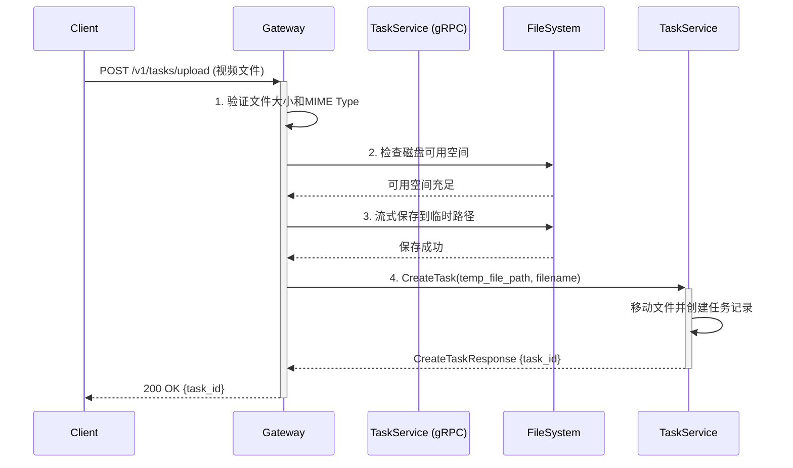
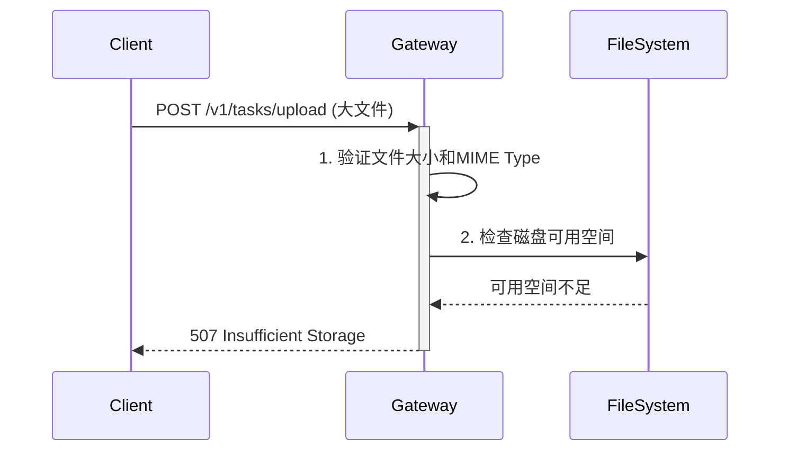
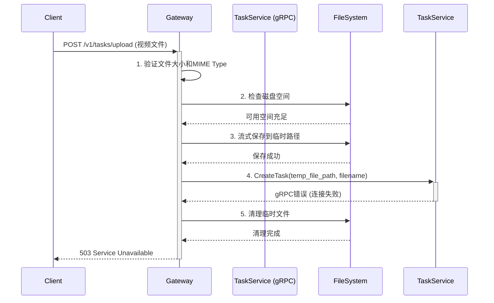
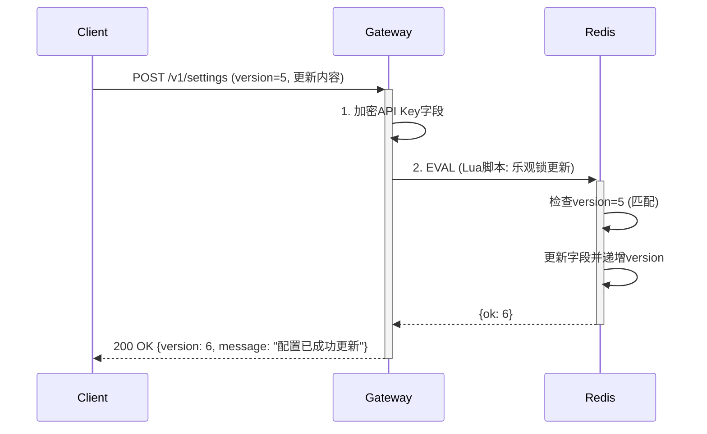
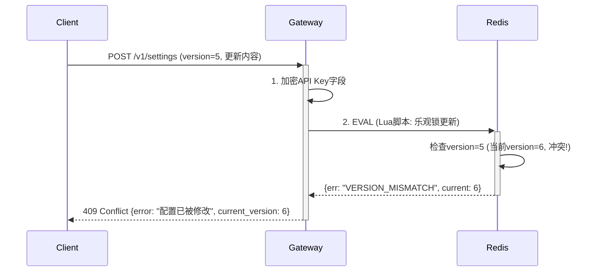
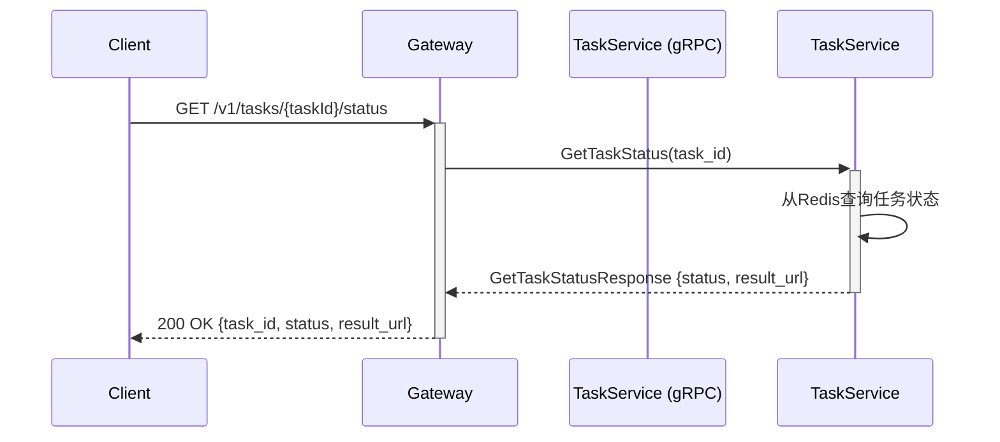
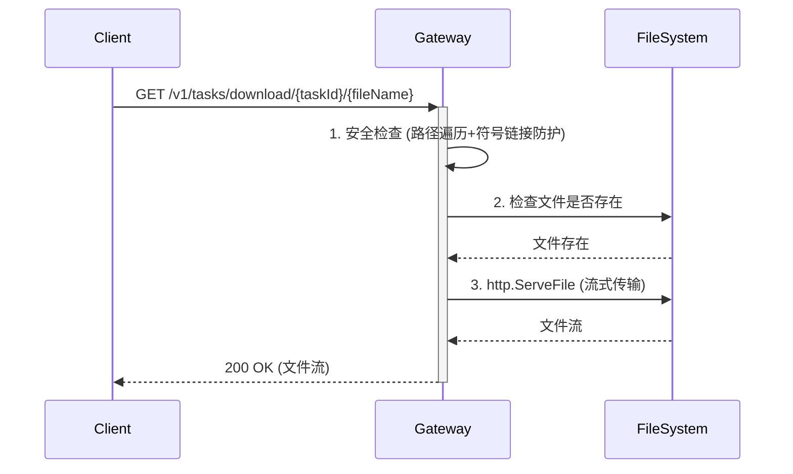

# **第二层设计文档：`gateway` 服务**

**文档版本**: 5.8
**关联宏观架构**: `notes/Base-Design.md` v2.0
**最后更新**: 2025-10-30

## 版本历史

- **v5.8 (2025-10-30)**:
  - 更新第 11.7 章"设计差异说明"的提示，反映 Base-Design.md v2.0 已移除 API 定义的事实
  - 确保文档说明的准确性和时效性
- **v5.7 (2025-10-30)**:
  - 更新关联宏观架构版本为 v2.0（Base-Design.md 已完成冗余清理）
  - 同步版本引用，确保与第一层文档版本一致
- **v5.6 (2025-10-30)**:
  - 修复状态值映射问题：使用 API 契约定义的大写格式（"PENDING" 等）而非中文
  - 修复硬编码路径问题：使用 {LOCAL_STORAGE_PATH} 占位符而非 ./data/temp/
  - 确保第二层文档内部一致性（接口定义 vs 逻辑步骤）
  - 确保遵守第一层文档的架构原则（路径可配置性）
- **v5.5 (2025-10-30)**:
  - 补充 getSettingsLogic 和 getTaskStatusLogic 关键逻辑步骤
  - 调整章节编号，按 handler 定义顺序（6.1-6.5）
  - 增加"设计差异说明"章节，明确与第一层文档的差异
  - 更新关联宏观架构版本为 v1.5
- **v5.4 (2025-10-30)**:
  - 完善 IsConfigured 字段说明
  - 更新资源需求为 2C4G（与 Base-Design.md v1.4 一致）
  - 统一临时目录路径为 `{LOCAL_STORAGE_PATH}/temp/`
- **v5.3 (2025-10-30)**:
  - 更新关联宏观架构版本为 v1.4
  - 调整字段顺序，与 Base-Design.md 保持一致
  - 将 downloadFileLogic 改为步骤化描述
- **v5.2 (2025-10-30)**:
  - 更新关联宏观架构版本为 v1.3
  - 补充缺失的配置字段：`audio_separation_enabled`、`polishing_custom_prompt`、`polishing_video_type`、`translation_video_type`、`voice_cloning_auto_select_reference`
  - 将"核心逻辑伪代码"改为"关键逻辑步骤"（符合 design-rules.md 规范）
  - 补充缺失的错误码：`MIME_TYPE_MISMATCH`、`ENCRYPTION_FAILED`、`DECRYPTION_FAILED`、`REDIS_UNAVAILABLE`
  - 增加"与第一层文档的对应关系"章节
  - 优化逻辑步骤粒度，补充关键判断条件
- **v5.1 (2025-10-30)**: 初始版本

## **1. 服务定位与职责**

`gateway`服务 (`server/app/gateway`) 是整个视频翻译系统的唯一HTTP入口，作为轻量级的**协议转换与请求路由网关**。

### **1.1 核心职责**

1.  **协议处理**: 监听HTTP端口，管理API路由，处理外部HTTP请求。
2.  **请求校验**: 对传入的请求参数进行基础格式和有效性验证（包括文件MIME Type、大小等）。
3.  **文件处理**: 以流式方式处理文件的上传和下载，确保低内存占用。
4.  **资源预检**: 在接收文件上传前，检查服务器磁盘空间，防止因资源耗尽导致服务崩溃。
5.  **配置管理**: 提供API接口，供客户端读取和（安全地）更新存储在Redis中的应用配置。
6.  **逻辑委托**: 将所有业务逻辑通过gRPC调用，委托给下游的`task`服务。

### **1.2 架构原则**

*   `gateway`服务本身**不包含任何核心业务逻辑**，确保其作为接入层的轻量、高效和稳定。
*   所有文件操作必须使用**流式处理**，禁止将整个文件加载到内存。
*   所有外部输入必须经过**严格校验**，防止注入攻击和资源滥用。

### **1.3 非职责边界**

以下职责**不属于**Gateway服务，应委托给下游服务：

*   任务状态管理（由`task`服务负责）
*   视频处理逻辑（由`processor`服务负责）
*   AI服务调用（由`processor`服务负责）

---

## **2. 依赖服务**

Gateway服务依赖以下外部服务，服务启动时需确保这些依赖可用：

### **2.1 Task Service (gRPC)**

*   **地址配置**: `TASK_RPC_ADDRESS`
*   **用途**: 委托所有任务管理的业务逻辑
*   **关键接口**: `CreateTask`, `GetTaskStatus`
*   **容错策略**:
    *   **启动时**: 尝试连接。若失败，服务仍可启动但会进入**功能受限模式**，并输出警告日志。
    *   **功能受限模式行为**: 在此模式下，所有`/v1/tasks/`路径下的API请求都将直接返回`503 Service Unavailable`错误，并附带错误信息“任务服务当前不可用，请联系管理员”。只有`/v1/settings`接口可正常工作。

### **2.2 Redis**

*   **地址配置**: 通过go-zero框架的Redis配置（`RedisConf`）
*   **用途**: 存储应用配置（`app:settings`）
*   **持久化要求**: 必须启用AOF持久化
*   **容错策略**:
    *   **启动时**: 连接失败则**拒绝启动**，输出致命错误日志。
    *   **运行时**: 连接失败则所有依赖Redis的接口（如配置管理）返回`503 Service Unavailable`。
*   **初始化逻辑**: 服务启动时，会检查`app:settings`是否存在。若不存在，将从环境变量读取初始API Keys（可选），创建版本号为1的默认配置并写入Redis。

---

## **3. 关键配置项定义**

### **3.1 环境配置**

通过`etc/gateway-api.yaml`加载，修改后需重启服务生效。

| 配置项                       | 类型              | 作用                                                                                           |
| ---------------------------- | ----------------- | ---------------------------------------------------------------------------------------------- |
| `GATEWAY_PORT`               | `integer`         | 指定服务监听的HTTP端口。                                                                       |
| `TEMP_STORAGE_PATH`          | `string`          | 指定用于存储上传临时文件的目录路径（与 Task 服务共享此配置项）。                               |
| `LOCAL_STORAGE_PATH`         | `string`          | 指定用于存储任务视频的根路径（用于下载时拼接文件路径）。                                       |
| `MAX_UPLOAD_SIZE_MB`         | `integer`         | 限制单个上传文件的最大体积（MB）。                                                             |
| `SUPPORTED_MIME_TYPES`       | `[]string`        | 支持的视频文件MIME Type白名单 (例如: `["video/mp4", "video/quicktime", "video/x-matroska"]`)。 |
| `API_KEY_ENCRYPTION_SECRET`  | `string` (32字节) | 用于API密钥加密，**必需**。                                                                    |
| `TASK_RPC_ADDRESS`           | `string`          | 下游`task` gRPC服务的地址。                                                                    |
| `HTTP_TIMEOUT_SECONDS`       | `integer`         | HTTP请求超时时间（秒）。                                                                       |
| `MAX_CONCURRENT_CONNECTIONS` | `integer`         | HTTP服务器的最大并发连接数。                                                                   |

---

## **4. 架构约束**

本服务的所有设计均基于第一层架构定义的"2C4G服务器"核心约束（CPU 模式）。

*   **内存约束原则**: 所有文件处理必须采用流式操作，严禁将完整文件加载入内存。
*   **磁盘约束原则**: 服务必须具备资源预检能力。`uploadTask`逻辑中包含的磁盘空间检查（`fileSize * 3 + 500MB`）是此约束下的强制要求，旨在保证服务的稳定性。

---

## **5. 接口定义 (`gateway.api`)**

```go
syntax = "v1"

info(
	title: "视频翻译服务 API"
	desc: "用于创建和管理视频翻译任务的接口文档。"
	author: "我们的团队"
	version: "1.0.0"
)

// --------------------------------------------------
// 1. 类型定义 (请求体/响应体)
// --------------------------------------------------
type (
	// --- 应用配置相关 ---

	// 获取应用配置的响应体
	GetSettingsResponse {
		Version int64 `json:"version"` // [必需] 配置版本号，用于乐观锁。
		IsConfigured bool `json:"is_configured"` // [必需] 系统是否已完成基本配置。判断逻辑：至少配置了 ASR、Translation、VoiceCloning 三个必需服务的 API Key。如果为 false，前端应显示"初始化向导"引导用户完成配置。

		// --- 处理模式 ---
		ProcessingMode string `json:"processing_mode"` // [必需] 视频处理模式。V1.0仅支持 "standard"。

		// --- AI服务配置 ---
		// 当 IsConfigured 为 true 时，以下必需字段必须有值。

		// ASR (语音识别) 服务配置
		AsrProvider string `json:"asr_provider"` // [条件性必需] ASR服务商标识。
		AsrApiKey   string `json:"asr_api_key"`  // [条件性必需] 脱敏后的API Key。
		AsrEndpoint string `json:"asr_endpoint,omitempty"` // [可选] 自定义的服务端点URL。

		// 音频分离配置（内部服务，无需 API Key）
		AudioSeparationEnabled bool `json:"audio_separation_enabled"` // [必需] 是否启用音频分离（需要GPU）。默认 false。

		// 文本润色服务配置 (可选功能)
		PolishingEnabled  bool   `json:"polishing_enabled"`  // [必需] 是否启用文本润色功能。
		PolishingProvider string `json:"polishing_provider,omitempty"` // [可选] 文本润色服务商标识。
		PolishingApiKey   string `json:"polishing_api_key,omitempty"`  // [可选] 脱敏后的API Key。
		PolishingCustomPrompt string `json:"polishing_custom_prompt,omitempty"` // [可选] 用户自定义的润色 Prompt。
		PolishingVideoType string `json:"polishing_video_type,omitempty"` // [可选] 翻译预设类型："professional_tech"（专业科技）、"casual_natural"（口语自然）、"educational_rigorous"（教育严谨）。

		// 文本翻译服务配置
		TranslationProvider string `json:"translation_provider"` // [条件性必需] 翻译服务商标识。
		TranslationApiKey   string `json:"translation_api_key"`  // [条件性必需] 脱敏后的API Key。
		TranslationEndpoint string `json:"translation_endpoint,omitempty"` // [可选] 自定义的服务端点URL。
		TranslationVideoType string `json:"translation_video_type,omitempty"` // [可选] 翻译预设类型："professional_tech"（专业科技）、"casual_natural"（口语自然）、"educational_rigorous"（教育严谨）。

		// 译文优化服务配置 (可选功能)
		OptimizationEnabled  bool   `json:"optimization_enabled"`  // [必需] 是否启用译文优化功能。
		OptimizationProvider string `json:"optimization_provider,omitempty"` // [可选] 译文优化服务商标识。
		OptimizationApiKey   string `json:"optimization_api_key,omitempty"`  // [可选] 脱敏后的API Key。

		// 声音克隆服务配置
		VoiceCloningProvider string `json:"voice_cloning_provider"` // [条件性必需] 声音克隆服务商标识。
		VoiceCloningApiKey   string `json:"voice_cloning_api_key"`  // [条件性必需] 脱敏后的API Key。
		VoiceCloningEndpoint string `json:"voice_cloning_endpoint,omitempty"` // [可选] 自定义的服务端点URL。
		VoiceCloningAutoSelectReference bool `json:"voice_cloning_auto_select_reference"` // [必需] 是否自动选择参考音频。默认 true。

		// S2ST (AI配音) 服务配置 (V2.0 功能)
		S2stProvider string `json:"s2st_provider,omitempty"` // [可选] S2ST服务商标识。
		S2stApiKey   string `json:"s2st_api_key,omitempty"`  // [可选] 脱敏后的API Key。
	}

	// 更新应用配置的请求体
	UpdateSettingsRequest {
		Version int64 `json:"version"` // [必需] 当前配置的版本号，用于乐观锁检查。

		// --- 处理模式 ---
		ProcessingMode string `json:"processing_mode,omitempty"` // [可选] 更新处理模式。

		// --- AI服务配置 ---
		// 注意：除Version外，所有字段均为可选。只提交需要修改的字段。
		// API Key字段：如果提交的值包含"***", 则后端会忽略此字段，保持原值不变。

		AsrProvider string `json:"asr_provider,omitempty"` // [可选] ASR服务商标识。
		AsrApiKey   string `json:"asr_api_key,omitempty"`  // [可选] 如果包含"***"则保持原值。
		AsrEndpoint string `json:"asr_endpoint,omitempty"` // [可选] 自定义端点URL。

		// 音频分离配置
		AudioSeparationEnabled *bool `json:"audio_separation_enabled,omitempty"` // [可选] 是否启用音频分离。使用指针类型以区分 "未提交" 和 "提交了false值"。

		PolishingEnabled  *bool  `json:"polishing_enabled,omitempty"` // [可选] 使用指针类型以区分 "未提交" 和 "提交了false值"。
		PolishingProvider string `json:"polishing_provider,omitempty"` // [可选] 文本润色服务商标识。
		PolishingApiKey   string `json:"polishing_api_key,omitempty"`  // [可选] 如果包含"***"则保持原值。
		PolishingCustomPrompt string `json:"polishing_custom_prompt,omitempty"` // [可选] 用户自定义的润色 Prompt。
		PolishingVideoType string `json:"polishing_video_type,omitempty"` // [可选] 翻译预设类型。

		TranslationProvider string `json:"translation_provider,omitempty"` // [可选] 翻译服务商标识。
		TranslationApiKey   string `json:"translation_api_key,omitempty"`  // [可选] 如果包含"***"则保持原值。
		TranslationEndpoint string `json:"translation_endpoint,omitempty"` // [可选] 自定义端点URL。
		TranslationVideoType string `json:"translation_video_type,omitempty"` // [可选] 翻译预设类型。

		OptimizationEnabled  *bool  `json:"optimization_enabled,omitempty"`  // [可选] 是否启用译文优化。
		OptimizationProvider string `json:"optimization_provider,omitempty"` // [可选] 译文优化服务商标识。
		OptimizationApiKey   string `json:"optimization_api_key,omitempty"`  // [可选] 如果包含"***"则保持原值。

		VoiceCloningProvider string `json:"voice_cloning_provider,omitempty"` // [可选] 声音克隆服务商标识。
		VoiceCloningApiKey   string `json:"voice_cloning_api_key,omitempty"`  // [可选] 如果包含"***"则保持原值。
		VoiceCloningEndpoint string `json:"voice_cloning_endpoint,omitempty"` // [可选] 自定义端点URL。
		VoiceCloningAutoSelectReference *bool `json:"voice_cloning_auto_select_reference,omitempty"` // [可选] 是否自动选择参考音频。

		S2stProvider string `json:"s2st_provider,omitempty"` // [可选] S2ST服务商标识。
		S2stApiKey   string `json:"s2st_api_key,omitempty"`  // [可选] 如果包含"***"则保持原值。
	}

	// 更新应用配置的响应体
	UpdateSettingsResponse {
		Version int64  `json:"version"` // [必需] 更新成功后，返回新的配置版本号。
		Message string `json:"message"` // [必需] 成功提示信息，例如 "配置已成功更新"。
	}

	// --- 任务管理相关 ---

	// 上传任务的响应体
	UploadTaskResponse {
		TaskId string `json:"task_id"` // [必需] 创建成功后返回的唯一任务ID。
	}

	// 查询任务状态的请求参数 (定义路径参数)
	GetTaskStatusRequest {
		TaskId string `path:"taskId"` // [必需] 需要查询的任务ID。
	}

	// 查询任务状态的响应体
	GetTaskStatusResponse {
		TaskId       string `json:"task_id"`                   // [必需] 任务ID。
		Status       string `json:"status"`                    // [必需] 任务当前状态: "PENDING", "PROCESSING", "COMPLETED", "FAILED"。
		ResultUrl    string `json:"result_url,omitempty"`    // [可选] 仅在任务状态为 "COMPLETED" 时出现。格式为 "/v1/tasks/download/{taskId}/{fileName}"。
		ErrorMessage string `json:"error_message,omitempty"` // [可选] 仅在任务状态为 "FAILED" 时出现，包含失败原因。
	}

	// 下载文件的请求参数 (定义路径参数)
	DownloadFileRequest {
		TaskId   string `path:"taskId"`   // [必需] 文件所属的任务ID。
		FileName string `path:"fileName"` // [必需] 要下载的文件名, 例如 "result.mp4" 或 "original.mp4"。
	}
)

// --------------------------------------------------
// 2. 服务与路由定义
// --------------------------------------------------

@server(
	group: settings
	prefix: /v1/settings
)
service gateway-api {
	@doc("获取当前的应用配置信息")
	@handler getSettings
	get / returns (GetSettingsResponse)

	@doc("更新应用配置信息")
	@handler updateSettings
	post / (UpdateSettingsRequest) returns (UpdateSettingsResponse)
}

@server(
	group: task
	prefix: /v1/tasks
)
service gateway-api {
	@doc("上传一个视频文件以创建一个新的翻译任务")
	@handler uploadTask
	post /upload (UploadTaskResponse)

	@doc("根据任务ID获取该任务的实时状态")
	@handler getTaskStatus
	get /:taskId/status (GetTaskStatusRequest) returns (GetTaskStatusResponse)

	@doc("下载任务关联的文件（如处理完成的视频）")
	@handler downloadFile
	get /download/:taskId/:fileName (DownloadFileRequest)
}
```

---

## **6. 关键逻辑步骤**

### **6.1 getSettingsLogic (获取应用配置)**

**步骤 1：从 Redis 读取应用配置**
- 使用 Redis 命令 `HGETALL app:settings` 读取所有配置字段
- **边界处理**：如果 Redis 连接失败，返回 `503 Service Unavailable`，错误码：`REDIS_UNAVAILABLE`

**步骤 2：检查配置是否存在**
- 如果 Redis 返回空（首次访问），返回默认配置：
  - `version: 0`
  - `is_configured: false`
  - 所有 API Key 为空字符串
  - 所有布尔值为默认值（如 `audio_separation_enabled: false`）
- **边界处理**：返回 `200 OK`，响应体包含默认配置

**步骤 3：解密所有 API Key**
- 遍历所有 API Key 字段（`asr_api_key`、`translation_api_key`、`voice_cloning_api_key` 等）
- 使用 AES-256-GCM 解密，密钥来自环境变量 `API_KEY_ENCRYPTION_SECRET`
- **边界处理**：如果解密失败，返回 `500 Internal Server Error`，错误码：`DECRYPTION_FAILED`

**步骤 4：API Key 脱敏处理**
- 对所有解密后的 API Key 进行脱敏：
  - 格式：`前缀-***-后6位`
  - 示例：`sk-proj-abc123...xyz789` → `sk-proj-***-xyz789`
- 目的：保护用户隐私，防止 API Key 泄露

**步骤 5：判断 IsConfigured 状态**
- 检查是否至少配置了 ASR、Translation、VoiceCloning 三个必需服务的 API Key
- 如果三个 API Key 都不为空，设置 `is_configured: true`
- 否则设置 `is_configured: false`

**步骤 6：封装并返回**
- 将脱敏后的配置封装到 `GetSettingsResponse` 结构体
- 返回 `200 OK`

---

### **6.2 updateSettingsLogic (更新应用配置)**

**步骤 1：解析请求体**
- 从 `http.Request` 中解析 `UpdateSettingsRequest`
- 提取 `version`（乐观锁版本号）和所有配置字段
- **边界处理**：如果解析失败，返回 `400 Bad Request`，错误信息："无效的请求体"

**步骤 2：处理 API Key 脱敏值**
- 遍历所有 API Key 字段（如 `asr_api_key`、`translation_api_key` 等）
- 如果字段值包含 `***`（脱敏标记），则从更新请求中移除该字段（保持原值不变）
- 如果字段值不包含 `***`，则使用 `API_KEY_ENCRYPTION_SECRET` 加密该字段
- **边界处理**：如果加密失败，返回 `500 Internal Server Error`，错误码：`ENCRYPTION_FAILED`

**步骤 3：使用 Lua 脚本原子性更新 Redis**
- 执行 Lua 脚本：
  1. 读取 Redis 中的当前版本号（`HGET app:settings version`）
  2. 比较请求中的版本号与 Redis 中的版本号
  3. 如果不一致，返回冲突错误（乐观锁失败）
  4. 如果一致，更新所有配置字段（`HMSET app:settings ...`）
  5. 版本号加 1（`HINCRBY app:settings version 1`）
- **边界处理**：
  - 如果版本号不一致，返回 `409 Conflict`，错误信息："配置已被其他用户修改，请刷新后重试"，附带当前版本号
  - 如果 Redis 连接失败，返回 `503 Service Unavailable`，错误码：`REDIS_UNAVAILABLE`

**步骤 4：返回更新结果**
- 返回 `200 OK`
- 响应体：`{"version": {new_version}, "message": "配置已成功更新"}`

---

### **6.3 uploadTaskLogic (文件上传与任务创建)**

**步骤 1：解析文件流和原始文件名**
- 从 `multipart/form-data` 请求中解析文件流和原始文件名
- **边界处理**：如果解析失败，返回 `400 Bad Request`，错误信息："无效的文件上传请求"

**步骤 2：检查文件大小**
- 获取文件大小（从 Content-Length 或文件流）
- 检查是否超过 `MAX_UPLOAD_SIZE_MB` 配置项
- **边界处理**：如果超限，返回 `413 Payload Too Large`，错误信息："文件大小超过限制（最大 {MAX_UPLOAD_SIZE_MB} MB）"

**步骤 3：验证文件 MIME Type**
- 读取文件头部（前 512 字节）
- 使用 MIME Type 检测机制验证文件类型
- 检查是否在 `SUPPORTED_MIME_TYPES` 白名单内
- **边界处理**：如果 MIME Type 不支持，返回 `415 Unsupported Media Type`，错误信息："不支持的文件类型，仅支持 MP4、MOV、MKV 格式"

**步骤 4：检查磁盘可用空间**
- 获取当前磁盘可用空间
- 检查条件：`availableSpace >= (fileSize * 3 + 500MB)`
- **边界处理**：如果空间不足，返回 `507 Insufficient Storage`，错误信息："服务器存储空间不足，请稍后重试或联系管理员"

**步骤 5：保存文件到临时目录**
- 生成唯一的临时文件名（UUID）
- 从 `original_filename` 提取文件扩展名（如 `.mp4`、`.mov`、`.mkv`）
- 以流式方式将文件保存到 `{TEMP_STORAGE_PATH}/{uuid}{ext}`（保留原始扩展名）
  - 示例：`original_filename="video.mov"` → 保存到 `{TEMP_STORAGE_PATH}/{uuid}.mov`
- 使用 `io.Copy` 直接写入文件，避免将整个文件读入内存
- **边界处理**：如果保存失败，清理临时文件，返回 `500 Internal Server Error`，错误信息："文件保存失败"

**步骤 6：调用 Task 服务创建任务**
- 通过 gRPC 调用 `task.CreateTask`
- 传入参数：
  - `temp_file_path`：`{TEMP_STORAGE_PATH}/{uuid}{ext}`（临时文件路径，包含实际扩展名）
  - `original_filename`：原始文件名（如 `video.mov`）
- **边界处理**：如果 gRPC 调用失败，清理临时文件，返回 `503 Service Unavailable`，错误信息："任务服务当前不可用，请稍后重试"

**步骤 7：返回任务 ID**
- 返回 `200 OK`
- 响应体：`{"task_id": "{task_id}"}`

---

### **6.4 getTaskStatusLogic (查询任务状态)**

**步骤 1：解析请求参数**
- 从请求路径中解析 `taskId`（格式：`/v1/tasks/{taskId}`）
- 示例：`/v1/tasks/abc123` → `taskId="abc123"`
- **边界处理**：如果 `taskId` 为空，返回 `400 Bad Request`，错误信息："缺少任务 ID"

**步骤 2：调用 Task 服务查询任务状态**
- 通过 gRPC 调用 `task.GetTaskStatus`
- 传入参数：`task_id`
- **边界处理**：如果 gRPC 调用失败，返回 `503 Service Unavailable`，错误信息："任务服务当前不可用，请稍后重试"

**步骤 3：接收 Task 服务响应**
- 接收响应字段（根据 Task proto 定义）：
  - `task_id`：任务 ID（string）
  - `status`：任务状态（TaskStatus 枚举：UNKNOWN=0, PENDING=1, PROCESSING=2, COMPLETED=3, FAILED=4）
  - `result_path`：结果文件路径（string，仅 COMPLETED 状态有值）
  - `error_message`：错误信息（string，仅 FAILED 状态有值）

**步骤 4：执行响应转换**
- **状态映射**：将 Task 服务的枚举状态转换为 API 契约定义的字符串格式
  - `TaskStatus.PENDING` (1) → `"PENDING"`
  - `TaskStatus.PROCESSING` (2) → `"PROCESSING"`
  - `TaskStatus.COMPLETED` (3) → `"COMPLETED"`
  - `TaskStatus.FAILED` (4) → `"FAILED"`
  - `TaskStatus.UNKNOWN` (0) → `"UNKNOWN"`
- **URL 生成**：如果任务状态为 `TaskStatus.COMPLETED`，生成下载 URL
  - 从 `result_path` 提取文件名（如 `result.mp4`）
  - 格式：`/v1/tasks/download/{task_id}/{filename}`
  - 示例：`/v1/tasks/download/abc123/result.mp4`

**步骤 5：封装并返回**
- 将转换后的数据封装到 `GetTaskStatusResponse` 结构体
- 返回 `200 OK`

---

### **6.5 downloadFileLogic (文件下载)**

**步骤 1：解析请求参数**
- 从请求路径中解析 `taskId` 和 `fileName`（格式：`/v1/tasks/download/{taskId}/{fileName}`）
- 示例：`/v1/tasks/download/abc123/result.mp4` → `taskId="abc123"`, `fileName="result.mp4"`

**步骤 2：路径遍历安全检查**
- 检查 `taskId` 和 `fileName` 是否包含路径遍历字符（如 `..`、`/`、`\`）
- **边界处理**：如果包含非法字符，返回 `400 Bad Request`，错误信息："非法的文件路径"

**步骤 3：拼接文件路径**
- 使用平台安全的方式拼接文件路径：`{LOCAL_STORAGE_PATH}/{taskId}/{fileName}`
- 示例：`./data/videos/abc123/result.mp4`

**步骤 4：符号链接安全检查**
- 检查最终路径是否为符号链接
- **边界处理**：如果是符号链接，返回 `400 Bad Request`，错误信息："非法的文件路径"

**步骤 5：检查文件是否存在**
- 使用文件系统 API 检查文件是否存在
- **边界处理**：如果文件不存在，返回 `404 Not Found`，错误信息："文件不存在"

**步骤 6：流式传输文件**
- 根据文件扩展名检测 MIME 类型：
  - `.mp4` → `video/mp4`
  - `.mov` → `video/quicktime`
  - `.mkv` → `video/x-matroska`
  - 其他扩展名 → `application/octet-stream`（兜底）
- 设置响应头：
  - `Content-Type: {detected_mime_type}`（根据上述规则动态设置）
  - `Content-Disposition: attachment; filename={fileName}`
  - `Accept-Ranges: bytes`（支持断点续传）
- 使用 `io.Copy` 将文件流直接写入 `http.ResponseWriter`，避免将整个文件读入内存
- 自动处理 Range 请求（如果客户端发送 `Range` 头）
- **边界处理**：如果传输过程中发生错误，记录日志并关闭连接

---

## **7. 服务间交互 (时序图)**

### **7.1 场景1: 上传任务 - 成功路径**



### **7.2 场景2: 上传任务 - 磁盘空间不足**



### **7.3 场景3: 上传任务 - Task服务不可用**



### **7.4 场景4: 更新配置 - 成功路径**



### **7.5 场景5: 更新配置 - 版本冲突**



### **7.6 场景6: 查询任务状态**



### **7.7 场景7: 下载文件**



---

## **8. 错误码清单**

### **8.1 客户端错误 (4xx)**

| HTTP状态码                 | 错误码 (内部)            | 触发场景                                                        | 错误消息示例                                   |
| -------------------------- | ------------------------ | --------------------------------------------------------------- | ---------------------------------------------- |
| 400 Bad Request            | `INVALID_ARGUMENT`       | 1. 请求体格式错误<br>2. 路径参数包含非法字符<br>3. 访问符号链接 | "无效的任务ID"                                 |
| 404 Not Found              | `NOT_FOUND`              | 1. 请求的任务不存在<br>2. 请求的文件不存在                      | "文件不存在"                                   |
| 409 Conflict               | `CONFLICT`               | 更新配置时版本号冲突（乐观锁失败）                              | "配置已被其他请求修改，请刷新后重试"           |
| 413 Payload Too Large      | `PAYLOAD_TOO_LARGE`      | 上传文件超过 `MAX_UPLOAD_SIZE_MB` 限制                          | "文件大小超过限制 (1024MB)"                    |
| 415 Unsupported Media Type | `UNSUPPORTED_MEDIA_TYPE` | 上传文件的真实MIME Type不在白名单内                             | "不支持的文件格式，请上传mp4, mov等视频文件。" |
| 415 Unsupported Media Type | `MIME_TYPE_MISMATCH`     | 文件扩展名与文件头部检测到的 MIME Type 不匹配                   | "文件类型验证失败，文件可能已损坏"             |
| 499 Client Closed Request  | `CLIENT_CLOSED`          | 客户端在上传过程中断开连接                                      | (无响应体)                                     |

### **8.2 服务端错误 (5xx)**

| HTTP状态码                | 错误码 (内部)          | 触发场景                                     | 错误消息示例                 |
| ------------------------- | ---------------------- | -------------------------------------------- | ---------------------------- |
| 500 Internal Server Error | `INTERNAL_ERROR`       | 1. 文件系统操作失败<br>2. 未预期的异常       | "文件保存失败"               |
| 500 Internal Server Error | `ENCRYPTION_FAILED`    | API Key 加密失败                             | "配置加密失败，请联系管理员" |
| 500 Internal Server Error | `DECRYPTION_FAILED`    | API Key 解密失败（可能是密钥错误或数据损坏） | "配置解密失败，请联系管理员" |
| 503 Service Unavailable   | `UNAVAILABLE`          | Task Service 不可用                          | "任务服务不可用"             |
| 503 Service Unavailable   | `REDIS_UNAVAILABLE`    | Redis 连接失败                               | "配置服务不可用"             |
| 507 Insufficient Storage  | `INSUFFICIENT_STORAGE` | 服务器磁盘空间不足                           | "服务器磁盘空间不足"         |

---

## **9. 关键数据结构**

### **9.1 Redis: `app:settings` (HASH)**

存储应用配置，支持热更新。所有字段与第5章`GetSettingsResponse`定义一致，但有以下差异：

| 字段名                                | 类型    | 示例值                | 说明                                       |
| ------------------------------------- | ------- | --------------------- | ------------------------------------------ |
| `version`                             | integer | `1`                   | 乐观锁版本号                               |
| `is_configured`                       | string  | `"true"`              | 是否已完成基本配置（布尔值存储为字符串）   |
| `processing_mode`                     | string  | `"standard"`          | 处理模式                                   |
| `audio_separation_enabled`            | string  | `"false"`             | 是否启用音频分离（布尔值存储为字符串）     |
| `asr_provider`                        | string  | `"openai-whisper"`    | ASR服务商标识                              |
| `asr_api_key`                         | string  | `"AES加密后的Base64"` | 加密存储的API Key                          |
| `asr_endpoint`                        | string  | `""`                  | 自定义端点URL（可选）                      |
| `polishing_enabled`                   | string  | `"true"`              | 是否启用文本润色（布尔值存储为字符串）     |
| `polishing_provider`                  | string  | `"openai-gpt4o"`      | 文本润色服务商标识                         |
| `polishing_api_key`                   | string  | `"AES加密后的Base64"` | 加密存储的API Key                          |
| `polishing_custom_prompt`             | string  | `""`                  | 用户自定义的润色 Prompt（可选）            |
| `polishing_video_type`                | string  | `"professional_tech"` | 翻译预设类型（可选）                       |
| `translation_provider`                | string  | `"google-gemini"`     | 翻译服务商标识                             |
| `translation_api_key`                 | string  | `"AES加密后的Base64"` | 加密存储的API Key                          |
| `translation_endpoint`                | string  | `""`                  | 自定义端点URL（可选）                      |
| `translation_video_type`              | string  | `"professional_tech"` | 翻译预设类型（可选）                       |
| `optimization_enabled`                | string  | `"false"`             | 是否启用译文优化（布尔值存储为字符串）     |
| `optimization_provider`               | string  | `""`                  | 译文优化服务商标识                         |
| `optimization_api_key`                | string  | `""`                  | 加密存储的API Key                          |
| `voice_cloning_provider`              | string  | `"elevenlabs"`        | 声音克隆服务商标识                         |
| `voice_cloning_api_key`               | string  | `"AES加密后的Base64"` | 加密存储的API Key                          |
| `voice_cloning_endpoint`              | string  | `""`                  | 自定义端点URL（可选）                      |
| `voice_cloning_auto_select_reference` | string  | `"true"`              | 是否自动选择参考音频（布尔值存储为字符串） |
| `s2st_provider`                       | string  | `""`                  | S2ST服务商标识（V2.0）                     |
| `s2st_api_key`                        | string  | `""`                  | 加密存储的API Key（V2.0）                  |

**注意事项**:
- 所有API Key字段必须加密后存储
- 布尔值字段存储为字符串 "true" 或 "false"
- 空值字段存储为空字符串 ""

### **9.2 文件系统结构**

```
{TEMP_STORAGE_PATH}/               # 临时文件目录（Gateway 上传文件）
└── {uuid}.{ext}                   # 上传中的临时文件（保留原始扩展名）

{LOCAL_STORAGE_PATH}/              # 任务文件目录（Task 服务管理）
└── {task_id}/                     # 每个任务独立目录
    ├── original.{ext}             # 原始视频文件（保留原始扩展名）
    └── result.mp4                 # 处理完成的视频文件
```

> 📝 **说明**：
> - `{TEMP_STORAGE_PATH}` 和 `{LOCAL_STORAGE_PATH}` 是两个独立的配置项
> - Gateway 使用 `{TEMP_STORAGE_PATH}` 保存上传文件
> - Task 服务从 `{TEMP_STORAGE_PATH}` 读取临时文件,移动到 `{LOCAL_STORAGE_PATH}` 进行处理
> - `{ext}` 表示原始文件扩展名（如 `.mp4`、`.mov`、`.mkv`）

---

## **10. 安全性设计**

### **10.1 API Key保护**

1.  **加密存储**: 必须使用行业标准的AEAD加密算法（如AES-GCM系列），密钥长度不低于256位。密钥来自环境变量 `API_KEY_ENCRYPTION_SECRET`。
2.  **脱敏返回**: `GET /v1/settings` 返回的API Key必须为脱敏格式，如 `"sk-***-xyz789"`。
3.  **更新处理**: 客户端提交脱敏值时，后端必须保持原值不变。

### **10.2 路径遍历与符号链接防护**

1.  **输入验证**: 必须严格检查路径参数，拒绝包含路径遍历字符的请求。
2.  **路径拼接**: 必须使用平台安全的方式拼接路径。
3.  **符号链接检查**: 在访问文件前，必须检查最终路径是否为符号链接，若是则拒绝访问。

---

## **11. 与第一层文档的对应关系**

本文档（Gateway-design.md v5.2）严格遵循 `notes/Base-Design.md` v1.3 的架构定义。

### **11.1 服务定位对应**

| 第一层文档章节                         | 对应内容                                           | 本文档章节              |
| -------------------------------------- | -------------------------------------------------- | ----------------------- |
| Base-Design.md 第 1.2 节"核心组件交互" | Gateway 作为 HTTP 入口，委托 Task 服务处理业务逻辑 | 第 1 章"服务定位与职责" |
| Base-Design.md 第 2.1 节"Gateway 服务" | Gateway 的核心职责和非职责边界                     | 第 1.1、1.3 章          |

### **11.2 接口定义对应**

| 第一层文档章节                             | 对应内容                                  | 本文档章节                                               |
| ------------------------------------------ | ----------------------------------------- | -------------------------------------------------------- |
| Base-Design.md 第 2.1 节"Gateway API 定义" | 完整的 RESTful API 接口定义               | 第 5 章"接口定义 (gateway.api)"                          |
| Base-Design.md 第 2.2 节"应用配置结构"     | 配置字段定义（包含 v1.3 新增的 5 个字段） | 第 5 章 `GetSettingsResponse` 和 `UpdateSettingsRequest` |

### **11.3 核心逻辑对应**

| 第一层文档章节                                | 对应内容                                                 | 本文档章节                 |
| --------------------------------------------- | -------------------------------------------------------- | -------------------------- |
| Base-Design.md 第 2.3 节"uploadTaskLogic"     | 文件上传与任务创建的关键逻辑步骤                         | 第 6.1 章"uploadTaskLogic" |
| Base-Design.md 第 2.3 节"使用 temp_file_path" | Gateway 保存到临时目录，传递 temp_file_path 给 Task 服务 | 第 6.1 章步骤 5、6         |

### **11.4 数据结构对应**

| 第一层文档章节                                | 对应内容                                         | 本文档章节                            |
| --------------------------------------------- | ------------------------------------------------ | ------------------------------------- |
| Base-Design.md 第 2.2 节"Redis: app:settings" | 应用配置的 Redis Hash 结构（包含 v1.3 新增字段） | 第 9.1 章"Redis: app:settings (HASH)" |
| Base-Design.md 第 1.4 节"文件系统结构"        | 临时文件目录和任务文件目录                       | 第 9.2 章"文件系统结构"               |

### **11.5 架构约束对应**

| 第一层文档章节                         | 对应内容                                  | 本文档章节        |
| -------------------------------------- | ----------------------------------------- | ----------------- |
| Base-Design.md 第 1.3 节"硬件约束"     | 2C4G 服务器约束，流式处理，磁盘空间预检   | 第 4 章"架构约束" |
| Base-Design.md 第 1.3 节"磁盘空间估算" | `fileSize * 3 + 500MB` 的磁盘空间检查公式 | 第 6.1 章步骤 4   |

### **11.6 一致性检查清单**

- [x] **接口定义一致**：gateway.api 与 Base-Design.md 第 4 章保持架构一致
- [x] **配置字段一致**：包含 Base-Design.md v2.0 定义的 IsConfigured 字段和 5 个配置字段
- [x] **逻辑步骤一致**：uploadTaskLogic 使用 temp_file_path 而非 original_file_key
- [x] **数据结构一致**：Redis Hash 包含所有 Base-Design.md 定义的字段
- [x] **架构约束一致**：遵循 2C4G 服务器约束，使用流式处理和磁盘空间预检
- [x] **错误码一致**：错误码清单覆盖所有 Base-Design.md 定义的错误场景

---

### **11.7 设计差异说明**

> ⚠️ **重要说明**：根据 `design-rules.md` 和 `Base-Design.md v2.0` 的明确规定，**最终 API 契约以本文档（第二层文档）为准**。Base-Design.md v2.0 仅包含架构级别的接口能力概览，不包含 API 契约细节（所有 API 定义、数据结构、详细逻辑步骤已在 v2.0 中移除）。

本文档（Gateway-design.md）与第一层文档（Base-Design.md v2.0）在以下方面存在设计差异，这些差异是基于第二层文档的细化权利和工程实践考虑：

#### **差异 1：DownloadFileRequest 参数设计**

| 对比项 | Base-Design.md（预览） | Gateway-design.md（最终契约） | 差异理由 |
|-------|----------------------|----------------------------|---------|
| **参数数量** | 单参数：`key` | 双参数：`taskId`、`fileName` | 双参数设计更清晰，避免路径解析的复杂性和安全风险 |
| **路径格式** | `/v1/tasks/download?key={task_id}/{file_name}` | `/v1/tasks/download/{taskId}/{fileName}` | RESTful 风格更符合 HTTP 最佳实践 |
| **安全性** | 需要解析 `key` 参数，可能存在路径遍历风险 | 分离 `taskId` 和 `fileName`，更容易进行安全检查 | 提升安全性，降低路径遍历攻击风险 |

**设计决策**：
-  采用双参数设计（`taskId`、`fileName`）
-  使用 RESTful 路径格式：`/v1/tasks/download/{taskId}/{fileName}`
-  在第 6.5 章"downloadFileLogic"中包含完整的路径遍历安全检查和符号链接安全检查

#### **差异 2：AudioSeparationEnabled 默认值**

| 对比项 | Base-Design.md v1.4（已废弃） | Base-Design.md v2.0（当前版本） | Gateway-design.md（最终契约） |
|-------|----------------------------|-------------------------------|----------------------------|
| **默认值** | `true`（已废弃） | `false` | `false` |
| **理由** | - | 避免无 GPU 用户启动失败 | 避免无 GPU 用户启动失败 |

**设计决策**：
-  Base-Design.md v2.0 已修正默认值为 `false`
-  Gateway-design.md 与 Base-Design.md v2.0 保持一致
-  此差异已在 Base-Design.md v2.0 版本历史中记录

#### **差异 3：临时目录路径表示**（已废弃）

> ⚠️ **此差异已在 v5.9 版本中修复**：Gateway-design.md 现已与 Task-design.md 对齐，统一使用 `TEMP_STORAGE_PATH` 配置项。

| 对比项 | Base-Design.md（预览） | Gateway-design.md v5.9（最终契约） | Task-design.md（最终契约） |
|-------|----------------------|----------------------------------|---------------------------|
| **路径表示** | `{TEMP_STORAGE_PATH}/{uuid}.mp4` | `{TEMP_STORAGE_PATH}/{uuid}.{ext}` | `{TEMP_STORAGE_PATH}` |
| **配置项** | `TEMP_STORAGE_PATH` | `TEMP_STORAGE_PATH` | `TEMP_STORAGE_PATH` |

**设计决策**：
-  统一使用 `TEMP_STORAGE_PATH` 配置项（与 Task-design.md 一致）
-  保留原始文件扩展名：`{uuid}.{ext}`（而非强制 `.mp4`）
-  在第 3.1 章"环境配置"中定义 `TEMP_STORAGE_PATH` 配置项
-  在第 9.2 章"文件系统结构"中明确两个独立的存储路径

#### **差异 4：关键逻辑步骤的粒度**

| 对比项 | Base-Design.md（预览） | Gateway-design.md（最终契约） | 差异理由 |
|-------|----------------------|----------------------------|---------|
| **逻辑粒度** | 高层次流程（3-5 步） | 详细步骤（6-7 步） | 第二层文档需要提供可直接实现的详细步骤 |
| **边界处理** | 简要说明 | 每个步骤都包含详细的边界处理 | 第二层文档需要覆盖所有错误场景 |
| **安全检查** | 未明确 | 包含路径遍历检查、符号链接检查、MIME Type 检测 | 第二层文档需要明确所有安全措施 |

**设计决策**：
-  第 6 章"关键逻辑步骤"包含 5 个核心接口的详细步骤
-  每个步骤都包含详细的边界处理和错误码
-  符合 `design-rules.md` 第 122-154 行的"关键逻辑步骤"规范

---

**总结**：
-  所有设计差异都是基于第二层文档的细化权利和工程实践考虑
-  所有差异都符合第一层文档的架构原则（如流式处理、磁盘空间预检、安全性设计）
-  本文档（Gateway-design.md）是 Gateway 服务的最终 API 契约

---

## **12. 文档变更历史**

| 版本 | 日期       | 变更内容                                                                                                                                                            |
| ---- | ---------- | ------------------------------------------------------------------------------------------------------------------------------------------------------------------- |
| 5.8  | 2025-10-30 | 1. 更新第 11.7 章"设计差异说明"的提示，反映 Base-Design.md v2.0 已移除 API 定义的事实。 2. 确保文档说明的准确性和时效性。                                          |
| 5.7  | 2025-10-30 | 1. 更新关联宏观架构版本为 v2.0（Base-Design.md 已完成冗余清理）。 2. 同步版本引用，确保与第一层文档版本一致。                                                      |
| 5.6  | 2025-10-30 | 1. 修复状态值映射问题（使用大写格式）。 2. 修复硬编码路径问题（使用 {LOCAL_STORAGE_PATH}）。 3. 确保第二层文档内部一致性和遵守第一层架构原则。                    |
| 5.5  | 2025-10-30 | 1. 补充 getSettingsLogic 和 getTaskStatusLogic 关键逻辑步骤。 2. 调整章节编号为 6.1-6.5。 3. 增加"设计差异说明"章节（第 11.7 节）。 4. 更新关联版本为 v1.5。      |
| 5.4  | 2025-10-30 | 1. 完善 IsConfigured 字段说明。 2. 更新资源需求为 2C4G。 3. 统一临时目录路径为 `{LOCAL_STORAGE_PATH}/temp/`。                                                     |
| 5.3  | 2025-10-30 | 1. 更新关联版本为 v1.4。 2. 调整字段顺序，与 Base-Design.md 保持一致。 3. 将 downloadFileLogic 改为步骤化描述。                                                     |
| 5.2  | 2025-10-30 | 1. 更新关联版本为 v1.3。 2. 补充 5 个缺失配置字段。 3. 改为"关键逻辑步骤"。 4. 补充 4 个错误码。 5. 增加"与第一层文档的对应关系"章节。 6. 优化逻辑步骤粒度。        |
| 5.1  | 2025-10-30 | 初始版本。                                                                                                                                                          |
| 4.0  | 2025-10-29 | 1. 解决API契约与初始化逻辑矛盾(引入IsConfigured)。 2. 修正文件验证为MIME Type嗅探。 3. 明确“功能受限模式”行为。 4. 增加符号链接攻击防护。 5. 增加资源估算模型说明。 |
| 3.0  | 2025-10-29 | 全面优化文档结构，增加依赖服务、性能约束、启动流程等。                                                                                                              |
