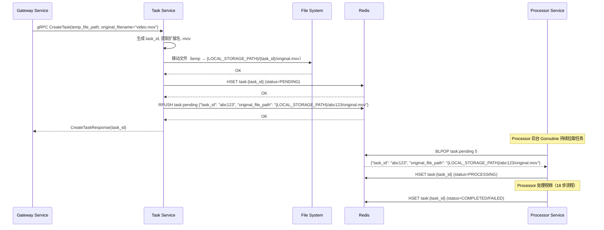
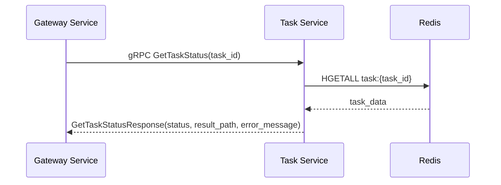

# Task 服务设计文档（第二层）

**文档版本**: 1.5
**关联宏观架构**: `notes/Base-Design.md` v2.0
**最后更新**: 2025-10-31
**服务定位**: Go gRPC 微服务，负责任务生命周期管理

## 版本历史

- **v1.5 (2025-10-31)**:
  - **修复数据契约准确性**：修复时序图中 JSON 示例语法错误
  - 第 256 行和 262 行：将 `{"task_id", "original_file_path"}` 改为完整的 JSON 格式（包含冒号和具体值）
  - 确保所有 JSON 示例可直接落地使用
- **v1.4 (2025-10-30)**:
  - 修复路径硬编码问题：所有路径统一使用 `{LOCAL_STORAGE_PATH}` 占位符
  - 在队列消息示例中增加路径配置说明
  - 确保与 Gateway-design.md 的路径表示方式保持一致
- **v1.3 (2025-10-30)**:
  - 更新关联宏观架构版本为 v2.0（Base-Design.md 已完成冗余清理）
  - 同步版本引用，确保与第一层文档版本一致
- **v1.2 (2025-10-30)**:
  - 更新关联宏观架构版本为 v1.5
  - 确认与 Base-Design.md v1.5 的一致性（AudioSeparationEnabled 默认值为 false）
- **v1.1 (2025-10-30)**:
  - **重大架构变更**：废弃"推模式"，统一为"拉模式"
  - 更新 gRPC 接口定义：使用 `temp_file_path` 和 `original_filename` 而非 `original_file_key`
  - 更新核心职责：增加"文件交接"，改为"推入 Redis 队列"而非"调用 Processor gRPC"
  - 新增 Redis 队列数据结构定义（List: `task:pending`）
  - 更新关键逻辑步骤：增加文件交接步骤，改为推入队列
  - 更新服务交互时序图：移除 Task → Processor gRPC 调用
  - 更新错误码清单：移除 Processor 调用失败错误
- **v1.0 (2025-10-30)**: 初始版本

---

## 1. 服务定位与核心职责

### 1.1 服务定位

`Task` 是整个系统的**任务生命周期管理器**，负责任务的创建、文件交接、状态管理和任务查询。

**核心理念**：Task 服务不直接调用 Processor 服务，而是通过 Redis 队列解耦。Processor 服务从队列中拉取任务并处理。这种"拉模式"在解耦、弹性和健壮性上优于"推模式"。

### 1.2 核心职责

1. **接收任务创建请求**：接收 Gateway 的任务创建请求，生成唯一的 task_id
2. **文件交接**：将 Gateway 存入临时目录的文件移动到正式目录（`{LOCAL_STORAGE_PATH}/{task_id}/`）
3. **创建任务记录**：在 Redis 中创建任务记录（Hash: `task:{task_id}`），初始状态为 PENDING
4. **推入待处理队列**：将任务信息推入 Redis 待处理队列（List: `task:pending`）
5. **任务状态查询**：提供任务状态查询接口

### 1.3 服务边界

**负责**:
- 任务生命周期管理（创建、查询）
- 文件交接（临时目录 → 正式目录）
- 任务状态持久化（Redis Hash）
- 任务入队（Redis List）
- 任务查询接口

**不负责**:
- 视频处理逻辑（由 Processor 负责）
- AI 服务调用（由 AIAdaptor 负责）
- 文件上传下载（由 Gateway 负责）
- 任务执行（由 Processor 从队列拉取并执行）

---

## 2. gRPC 接口定义

### 2.1 Proto 文件定义

```protobuf
syntax = "proto3";

package task.v1;

// go_package 指向我们 Go 项目中的目录，goctl 会在此生成代码
option go_package = "video-In-Chinese/server/mcp/task/pb";

// 任务状态枚举，作为服务间通信的标准
enum TaskStatus {
  UNKNOWN = 0;    // 未知状态
  PENDING = 1;    // 排队中，任务已创建但未被处理
  PROCESSING = 2; // 处理中
  COMPLETED = 3;  // 处理成功
  FAILED = 4;     // 处理失败
}

// TaskService 定义了所有可用的 RPC 方法
service TaskService {
  // 创建一个新任务
  rpc CreateTask(CreateTaskRequest) returns (CreateTaskResponse);

  // 获取指定任务的状态
  rpc GetTaskStatus(GetTaskStatusRequest) returns (GetTaskStatusResponse);
}

// --- 消息体定义 ---

// 创建任务请求
message CreateTaskRequest {
  // 临时文件路径（Gateway 存入临时目录的文件路径）
  string temp_file_path = 1;
  // 原始文件名，用于日志记录和问题排查
  string original_filename = 2;
}

// 创建任务响应
message CreateTaskResponse {
  // 返回给调用方的唯一任务 ID
  string task_id = 1;
}

// 查询任务状态请求
message GetTaskStatusRequest {
  string task_id = 1;
}

// 查询任务状态响应
message GetTaskStatusResponse {
  string task_id = 1;
  TaskStatus status = 2;
  // 任务成功时，结果文件在本地文件系统中的路径
  // 由上游服务(gateway)负责根据此路径生成下载 URL
  string result_path = 3;
  // 任务失败时，记录的错误信息
  string error_message = 4;
}
```

---

## 3. 核心数据结构

### 3.1 Redis 数据结构

#### 3.1.1 待处理队列（List）

**Key**: `task:pending`

**数据类型**: Redis List

**元素格式**: JSON 字符串，包含 `task_id` 和 `original_file_path`

**示例**:
```json
{
  "task_id": "abc123",
  "original_file_path": "{LOCAL_STORAGE_PATH}/abc123/original.{ext}"
}
```

> 📝 **说明**：
> - 示例中的路径使用 `{LOCAL_STORAGE_PATH}` 占位符，实际运行时会替换为配置的本地存储路径（如 `./data/videos`）
> - `{ext}` 表示原始文件的扩展名（如 `.mp4`、`.mov`、`.mkv`），由 `original_filename` 提取而来

**操作**:
- **Task 服务**：使用 `RPUSH task:pending <json>` 推入任务
- **Processor 服务**：使用 `BLPOP task:pending 5` 拉取任务（阻塞 5 秒）

**说明**：
- 队列采用 FIFO（先进先出）模式
- Processor 服务从队列头部拉取任务，Task 服务从队列尾部推入任务
- 如果队列为空，`BLPOP` 会阻塞等待，避免空轮询

#### 3.1.2 任务状态（Hash）

**Key**: `task:{task_id}`

**数据类型**: Redis Hash

**字段**:
```json
{
  "task_id": "uuid-string",
  "status": "PENDING | PROCESSING | COMPLETED | FAILED",
  "original_file_path": "{LOCAL_STORAGE_PATH}/{task_id}/original.{ext}",
  "result_path": "{LOCAL_STORAGE_PATH}/{task_id}/result.mp4",
  "error_message": "错误信息（仅 FAILED 状态）",
  "created_at": "1698652800",
  "updated_at": "1698653100"
}
```

**字段说明**:
- `task_id`: 任务唯一标识符（UUID）
- `status`: 任务状态（PENDING、PROCESSING、COMPLETED、FAILED）
- `original_file_path`: 原始视频文件路径
- `result_path`: 结果视频文件路径（仅 COMPLETED 状态有值）
- `error_message`: 错误信息（仅 FAILED 状态有值）
- `created_at`: 创建时间（Unix 时间戳）
- `updated_at`: 更新时间（Unix 时间戳）

**TTL**: 7 天（任务完成后）

**操作**:
- **Task 服务**：创建任务时写入，查询任务时读取
- **Processor 服务**：更新任务状态（PROCESSING、COMPLETED、FAILED）

---

## 4. 关键逻辑步骤

### 4.1 CreateTask - 创建任务

**步骤 1：输入校验**
- 检查 `temp_file_path` 和 `original_filename` 是否为空
- 如果为空，返回 `gRPC codes.InvalidArgument` 错误

**步骤 2：文件交接**
- 生成唯一的 `task_id`（使用 UUID）
- 创建任务目录：`{LOCAL_STORAGE_PATH}/{task_id}/`
- 从 `original_filename` 提取文件扩展名（如 `.mp4`、`.mov`、`.mkv`）
- 将临时文件从 `temp_file_path` 移动到 `{LOCAL_STORAGE_PATH}/{task_id}/original{ext}`（保留原始扩展名）
  - 示例：`original_filename="video.mov"` → 移动到 `{LOCAL_STORAGE_PATH}/{task_id}/original.mov`
- **边界处理**：如果文件移动失败（临时文件不存在、权限不足、磁盘空间不足），返回 `gRPC codes.Internal` 错误，附带错误信息 "文件交接失败"

**步骤 3：创建任务记录**
- 构建初始任务状态（`status: PENDING`）
- 写入 Redis（Hash: `task:{task_id}`）
- 设置任务记录过期时间：`EXPIRE task:{task_id} {TASK_TTL_DAYS * 86400}`（将天数转换为秒）
  - 示例：`TASK_TTL_DAYS=7` → `EXPIRE task:abc123 604800`（7天后自动删除）
- **边界处理**：如果 Redis 连接失败或写入超时，返回 `gRPC codes.Unavailable` 错误，附带错误信息 "无法连接到状态存储服务，请稍后重试"。任务创建失败，删除已创建的任务目录

**步骤 4：推入待处理队列**
- 构建队列消息：`{"task_id": "{task_id}", "original_file_path": "{LOCAL_STORAGE_PATH}/{task_id}/original.{ext}"}`（`{ext}` 为实际扩展名）
- 推入 Redis 待处理队列：`RPUSH task:pending <json>`
- **边界处理**：如果推入失败，更新 Redis 中该任务的状态为 `FAILED`，错误信息为 "任务入队失败"。然后返回 `gRPC codes.Internal` 错误

**步骤 5：返回响应**
- 成功推入队列后，返回 `CreateTaskResponse(task_id)`

### 4.2 GetTaskStatus - 查询任务状态

**步骤 1：从 Redis 查询任务数据**
- 使用 `HGETALL task:{task_id}` 查询任务数据

**步骤 2：检查任务是否存在**
- 如果根据 `task_id` 在 Redis 中找不到对应的键，返回 `gRPC codes.NotFound` 错误，信息为 "任务ID不存在"

**步骤 3：返回任务状态**
- 反序列化数据并返回 `GetTaskStatusResponse`
- 包含：`task_id`、`status`、`result_path`（如果成功）、`error_message`（如果失败）

---

## 5. 服务交互时序图

### 5.1 创建任务流程



### 5.2 查询任务状态流程



---

## 6. 错误码清单

| 错误码             | gRPC 状态码        | 触发场景                 | 错误信息示例                         | 处理建议               |
| ------------------ | ------------------ | ------------------------ | ------------------------------------ | ---------------------- |
| `INVALID_ARGUMENT` | `INVALID_ARGUMENT` | 参数为空或无效           | "temp_file_path 不能为空"            | 检查输入参数           |
| `NOT_FOUND`        | `NOT_FOUND`        | 任务不存在               | "任务ID不存在"                       | 检查 task_id 是否正确  |
| `INTERNAL`         | `INTERNAL`         | 文件移动失败             | "文件交接失败"                       | 检查文件系统权限和空间 |
| `UNAVAILABLE`      | `UNAVAILABLE`      | Redis 连接失败或写入超时 | "无法连接到状态存储服务，请稍后重试" | 检查 Redis 服务状态    |
| `INTERNAL`         | `INTERNAL`         | 任务入队失败             | "任务入队失败"                       | 检查 Redis 队列状态    |

---

## 7. 关键配置项定义

### 7.1 环境变量（.env 文件）

```bash
# Task 服务配置
TASK_GRPC_PORT=50050                     # gRPC 服务端口
LOCAL_STORAGE_PATH=./data/videos         # 本地存储路径（正式目录）
TEMP_STORAGE_PATH=./data/temp            # 临时存储路径

# Redis 配置
REDIS_HOST=redis                         # Redis 主机地址
REDIS_PORT=6379                          # Redis 端口
REDIS_PASSWORD=                          # Redis 密码（可选）
REDIS_DB=0                               # Redis 数据库编号
TASK_TTL_DAYS=7                          # 任务记录保留天数

# 队列配置
TASK_QUEUE_KEY=task:pending              # 待处理队列的 Redis Key
```

### 7.2 配置项说明

| 配置项               | 类型   | 默认值        | 说明                                   |
| -------------------- | ------ | ------------- | -------------------------------------- |
| `TASK_GRPC_PORT`     | int    | 50050         | Task 服务的 gRPC 监听端口              |
| `LOCAL_STORAGE_PATH` | string | ./data/videos | 正式视频文件存储路径                   |
| `TEMP_STORAGE_PATH`  | string | ./data/temp   | 临时文件存储路径（Gateway 上传的文件） |
| `REDIS_HOST`         | string | redis         | Redis 服务器地址                       |
| `REDIS_PORT`         | int    | 6379          | Redis 服务器端口                       |
| `REDIS_PASSWORD`     | string | ""            | Redis 密码（可选）                     |
| `REDIS_DB`           | int    | 0             | Redis 数据库编号                       |
| `TASK_TTL_DAYS`      | int    | 7             | 任务记录在 Redis 中的保留天数          |
| `TASK_QUEUE_KEY`     | string | task:pending  | 待处理队列的 Redis Key                 |

---

## 8. 与第一层文档的对应关系

本文档是 `notes/Base-Design.md v2.0` 第一层架构文档的细化，对应以下章节：

### 8.1 对应章节

- **Base-Design.md 第 1.2 节 - 系统架构与设计**：
  - 核心组件交互：Task 服务创建任务记录并推入 Redis 待处理队列
  - 文件存储方案：本地文件系统存储（`{LOCAL_STORAGE_PATH}`）
  - 状态管理：Redis Hash 存储任务状态

- **Base-Design.md 第 3 章 - Task 服务架构设计**：
  - 3.1 服务定位与核心职责
  - 3.2 gRPC 接口定义（task.proto）
  - 3.3 关键逻辑流程与边界处理
  - 3.4 Redis 队列数据结构

### 8.2 细化内容

本文档在第一层文档的基础上，进行了以下细化：

1. **完整的 Proto 文件定义**：包含所有消息体和服务定义的完整代码
2. **详细的 Redis 数据结构**：包含队列和 Hash 的完整字段定义和操作说明
3. **关键逻辑步骤**：将第一层的高层次描述细化为可执行的步骤
4. **服务交互时序图**：使用 Mermaid 图清晰展示服务间的交互顺序
5. **错误码清单**：列出所有可能的错误场景和处理建议
6. **配置项定义**：详细说明所有环境变量和配置项

### 8.3 与第一层文档的一致性

- ✅ 使用 `temp_file_path` 而非 `original_file_key`（与 Base-Design.md v2.0 一致）
- ✅ 采用 Redis 队列"拉模式"而非 gRPC "推模式"（与 Base-Design.md v2.0 一致）
- ✅ Task 服务负责文件交接（与 Base-Design.md v2.0 一致）
- ✅ 使用 `result_path` 而非 `result_key`（与 Base-Design.md v2.0 一致）
- ✅ AudioSeparationEnabled 默认值为 false（与 Base-Design.md v2.0 一致）

---

## 9. 后续工作

### 9.1 第三层文档

更新 `notes/Task-design-detail.md`（已存在），包含：
- 项目结构（关键文件和目录）
- 核心实现决策与上下文（为什么这么写）
- 依赖库清单（及选型原因）
- Dockerfile（及构建说明）
- 测试策略与示例
- 待实现任务清单

### 9.2 开发任务

1. 使用 goctl 生成 gRPC 代码骨架（基于 task.proto）
2. 实现 gRPC 服务（main.go）
3. 实现任务创建逻辑（logic/create_task.go）：
   - 文件交接（移动临时文件到正式目录）
   - 创建任务记录（Redis Hash）
   - 推入待处理队列（Redis List）
4. 实现任务查询逻辑（logic/get_task_status.go）
5. 实现 Redis 操作封装（storage/redis.go）
6. 实现文件操作封装（storage/file.go）
7. 编写单元测试和集成测试
8. 集成到 docker-compose.yml

### 9.3 验证清单

在开发完成后，使用以下清单验证实现是否符合设计：

- [ ] gRPC 接口定义与 Proto 文件完全一致
- [ ] 文件交接逻辑正确（临时目录 → 正式目录）
- [ ] Redis 队列操作正确（RPUSH task:pending）
- [ ] 错误处理符合错误码清单
- [ ] 所有边界情况都已处理
- [ ] 单元测试覆盖率 > 80%
- [ ] 集成测试通过

---


## 9. 文档变更历史

| 版本 | 日期       | 变更内容                                                                                     |
| ---- | ---------- | -------------------------------------------------------------------------------------------- |
| 1.5  | 2025-10-31 | 1. **修复数据契约准确性**：修复时序图中 JSON 示例语法错误（第 256、262 行）。 2. 将 `{"task_id", "original_file_path"}` 改为完整的 JSON 格式。 3. 确保所有 JSON 示例可直接落地使用。 |
| 1.4  | 2025-10-30 | 1. 修复路径硬编码问题：所有路径统一使用 `{LOCAL_STORAGE_PATH}` 占位符。 2. 在队列消息示例中增加路径配置说明。 3. 确保与 Gateway-design.md 的路径表示方式保持一致。 |
| 1.3  | 2025-10-30 | 1. 更新关联宏观架构版本为 v2.0（Base-Design.md 已完成冗余清理）。 2. 同步版本引用，确保与第一层文档版本一致。 |
| 1.2  | 2025-10-30 | 1. 更新关联宏观架构版本为 v1.5。 2. 确认与 Base-Design.md v1.5 的一致性。                    |
| 1.1  | 2025-10-30 | 1. 废弃"推模式"，统一为"拉模式"。 2. 更新 gRPC 接口定义。 3. 新增 Redis 队列数据结构定义。 |
| 1.0  | 2025-10-30 | 初始版本。                                                                                   |

---
