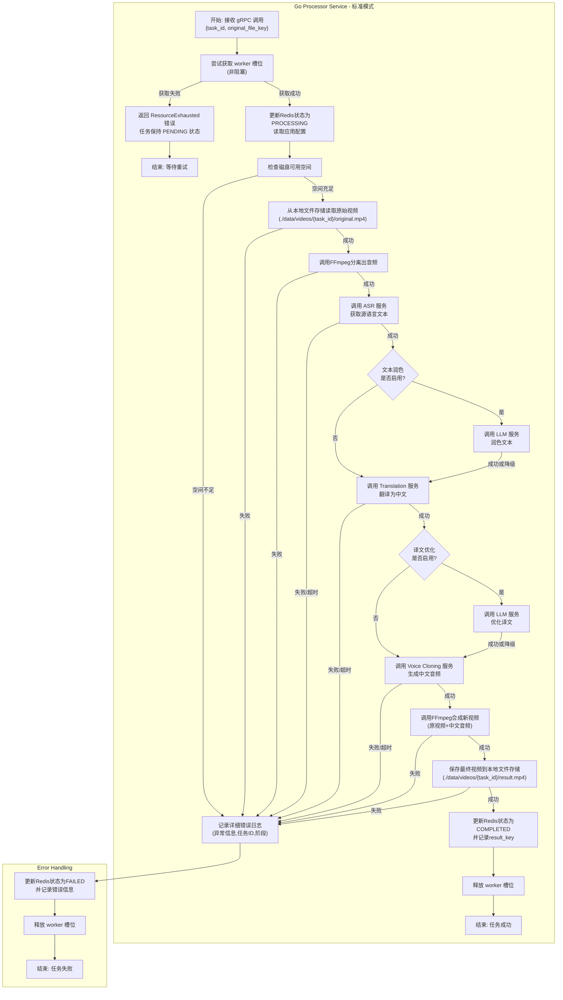

# **1. 项目基石文档：视频翻译服务 (V1.0)**

**文档版本**: 1.0
**最后更新**: 2025年10月29日
**负责人**: (AI技术合伙人)

## **文档层次说明**

本项目采用三层文档体系，确保从宏观架构到具体实现的清晰划分：

**第一层：宏观架构设计（本文档）**
- 定位：项目的"宪法"，定义系统边界、核心组件、技术栈和高级工作流
- 内容：项目愿景、架构模式、技术选型、核心业务流程、架构决策记录（ADR）
- 稳定性：高度稳定，所有后续设计不得违背本文档
- 注意：本文档第 2-4 章包含部分第二层内容预览（API 定义、数据结构），最终契约以第二层文档为准

**第二层：模块细分设计（待创建）**
- 定位：项目的"部门法"，指导具体编码工作的直接蓝图
- 内容：每个微服务的完整 API 契约（.api / .proto 文件）、详细数据结构、核心逻辑伪代码、服务交互时序图
- 产出物：《Gateway 服务设计文档》、《Task 服务设计文档》、《Processor 服务设计文档》

**第三层：代码实现与接口文档（开发阶段）**
- 定位：最终可运行、可交互的产物
- 内容：符合第二层设计的 Go 代码、自动生成的 Swagger/gRPC 文档、单元测试和集成测试
- 细粒度：控制到接口层级，明确约定函数、方法的入参、返回元素

---

## **1.1 项目愿景与MVP范围**

* **项目愿景**: 创建一个**单用户自部署服务**，能够将包含外语对话的视频（初期为英语）无缝翻译为中文对话。核心目标是不仅翻译内容，还要最大程度地保留原说话者的**情感、语调和节奏**，提供"身临其境"的母语化体验。
* **注明**: 受限于服务器资源有限，当前 MVP 产品仅供用户拉取代码后，通过 Docker 一键部署在本地或自有服务器上使用。服务器资源需求极低（2C2G 即可），所有 AI 能力通过调用大模型厂商 API 实现。
* **MVP核心范围**:
  * **产品形态**: 一个无需登录的单页面Web应用。
  * **核心流程**: 用户配置 API 密钥 -> 上传视频文件 -> 服务进行异步处理 -> 前端通过轮询机制获取处理状态 -> 处理完成后提供可供下载的、替换了中文音轨的视频文件。
  * **技术路径**: 采用级联式处理流程（ASR → 文本润色 → Translation → 译文优化 → Voice Cloning），通过调用大模型厂商 API 实现。V2.0 将扩展端到端 S2ST（AI Dubbing）模式，进一步提升情感韵律还原质量。详见第 1.6 节"处理模式"。

## **1.2 系统架构与设计**

* **架构模式**: 采用**轻量级微服务架构**，明确划分**接入层 (app)** 与 **服务层 (mcp)**。所有 AI 能力通过调用大模型厂商 API 实现，通过**适配器模式**实现业务逻辑与厂商解耦。详见 `notes/架构决策记录.md` ADR-004。
  * **接入层 (`server/app`)**: 负责对外提供 **RESTful API**，作为流量入口，直接与前端客户端交互。
  * **服务层 (`server/mcp`)**: 负责实现所有核心业务逻辑，以内部 **gRPC** 服务的形式存在，不直接对外暴露。
* **核心组件交互**:
  * **异步任务处理**: task 服务通过 gRPC 直接调用 processor 服务，processor 服务在 Goroutine 中异步执行处理任务。
  * **文件存储方案**:
    * **MVP 阶段**: 使用本地文件系统存储视频文件（`./data/videos`），通过 Volume 挂载到宿主机确保持久化。
    * **存储结构**: `./data/videos/{task_id}/original.mp4` 和 `./data/videos/{task_id}/result.mp4`。
    * **GC 策略**: 定时任务每小时扫描，删除创建时间超过 3 小时的任务目录，避免磁盘空间耗尽。
    * **接口抽象**: 代码层面设计 Storage 接口（Upload, Download, Delete, GetDownloadURL），业务逻辑与存储实现解耦。MVP 阶段实现 LocalStorage，未来可无缝迁移到 MinIO / AWS S3 / 阿里云 OSS，业务代码无需修改。
    * **选型理由**: 单用户自部署场景下，本地文件系统足够满足需求，且节省 100-200MB 内存（MinIO 的资源消耗）。详见 `notes/架构决策记录.md` ADR-001。
  * **状态管理**: MVP阶段，任务的实时状态（排队中、处理中、成功、失败）将存储在 **Redis** 中，通过唯一的 `task_id` 进行快速读写。
  * **应用配置管理**:
    * **配置源**: Redis 作为应用配置的唯一数据源（Key: `app:settings`）。容器启动时从环境变量或配置文件读取初始配置，如果 Redis 中不存在则写入，如果已存在则使用 Redis 中的配置（用户可能已通过 Web 修改）。
    * **持久化**: Redis 启用 AOF 持久化（`appendonly yes`），数据目录挂载到宿主机（`./data/redis`），确保容器重启后配置不丢失。
    * **加密存储**: 用户配置的 API 密钥使用 AES-256-GCM 加密后存储在 Redis 中，加密密钥通过环境变量 `API_KEY_ENCRYPTION_SECRET` 传入。
    * **运行时读取**: processor 服务调用外部 API 时，从 Redis 读取最新配置并解密使用。所有服务共享同一套配置，无需会话隔离（单用户部署场景）。
    * **Web 修改**: 用户通过 Web 界面修改配置时，后端使用 Lua 脚本原子性更新 Redis，并引入乐观锁机制（版本号）避免并发冲突。

## **1.3 技术栈选型**

* **后端语言与框架**: Go, GoZero
* **服务间通信**: gRPC（内部服务间通信）
* **中间件**:
  * **状态缓存/存储**: Redis
  * **文件存储**: 本地文件系统（MVP 阶段），通过 Storage 接口抽象，未来可迁移到 MinIO / AWS S3 / 阿里云 OSS
* **核心工具库**:
  * **音视频处理**: `ffmpeg`
* **外部 API 服务**（用户自行配置 API 密钥，通过适配器模式支持多厂商）:
  * **语音识别 (ASR)**: 待定（候选：OpenAI Whisper / 火山引擎 / 阿里云 / Azure）
  * **文本润色 (LLM)**: 待定（候选：OpenAI GPT / Claude / 火山引擎 Doubao）
  * **翻译 (Translation)**: 待定（候选：OpenAI GPT / DeepL / 火山引擎 / 阿里云）
  * **译文优化 (LLM)**: 待定（候选：OpenAI GPT / Claude / 火山引擎 Doubao）
  * **语音合成 (TTS)**: 待定（候选：OpenAI TTS / 火山引擎 / Azure / ElevenLabs）
  * **声音克隆 (Voice Cloning)**: 待定（候选：ElevenLabs / 火山引擎 / Azure Personal Voice）
  * **AI 配音 (S2ST)**: 待定，V2.0 扩展（候选：ElevenLabs Dubbing / Azure Speech-to-Speech）
  * 注：所有 API 厂商选型将在后期进行专业评估，当前仅为候选方案
* **部署方案**:
  * **容器化**: Docker + Docker Compose
  * **一键部署**: Gateway + Task + Processor + Redis
  * **部署依赖**:
    * Docker 镜像必须包含 `ffmpeg` 二进制文件（建议版本 >= 4.0）。在 Dockerfile 中通过 `apt-get install ffmpeg` 或从官方源安装。启动时应验证 ffmpeg 是否可用，不可用则拒绝启动。
    * 文件存储目录（`./data/videos`）和 Redis 数据目录（`./data/redis`）必须挂载到宿主机，确保容器重启后数据不丢失。
  * **配置初始化**:
    * 用户可在 `.env` 文件或环境变量中配置初始 API 密钥（可选）。
    * Gateway 服务启动时检查 Redis 中是否存在配置（Key: `system:api_keys`）。如果不存在，将环境变量中的初始配置写入 Redis（版本号初始化为 1）。如果已存在，则使用 Redis 中的配置，忽略环境变量。
    * Redis 启用 AOF 持久化（`appendonly yes`），确保容器重启后配置不丢失。

**技术选型说明**:

- 所有 AI 能力通过调用大模型厂商 API 实现，用户需自行申请和配置 API 密钥。
- 所有 API 选型为用户可配置项，非硬性依赖，后期会持续接入更多 API 厂商。
- 通过适配器模式实现业务逻辑与厂商解耦，用户可自由选择和混搭不同厂商的服务。详见 `notes/架构决策记录.md` ADR-004。
- 服务器资源需求极低（2C2G 即可），无需 GPU。
- 用户只为自己使用的 API 调用付费，成本可控。

**配置管理说明**:

本项目的配置分为两类，采用不同的管理方式。详见 `notes/架构决策记录.md` ADR-006。

1. **应用配置（热更新）**：
   - 包含：AI 服务厂商选择、API 密钥、服务端点等
   - 存储：Redis（Key: `app:settings`）
   - 修改方式：通过 Web UI 的"设置"页面实时修改，无需重启服务
   - 持久化：Redis AOF + Volume 挂载

2. **环境配置（冷启动）**：
   - 包含：系统资源限制、存储路径、Redis 连接信息、日志级别等
   - 存储：`.env` 文件或环境变量
   - 修改方式：手动编辑 `.env` 文件，执行 `docker-compose restart` 重启服务
   - 配置项清单：
     - `REDIS_HOST`、`REDIS_PORT`：Redis 连接信息
     - `LOCAL_STORAGE_PATH`：本地存储路径（默认 `./data/videos`）
     - `PROCESSOR_MAX_CONCURRENCY`：最大并发处理数（默认 1）
     - `API_KEY_ENCRYPTION_SECRET`：API Key 加密密钥（必填，32字节）
     - `LOG_LEVEL`：日志级别（默认 `info`）
     - `GATEWAY_PORT`：Gateway 服务端口（默认 `8080`）

## **1.4 项目工程结构**

```
video-translator/
├── server/
│   ├── app/      # RESTful API 服务 (接入层)
│   │   └── gateway/
│   ├── mcp/      # gRPC 微服务 (业务逻辑/服务层)
│   │   ├── task/
│   │   └── processor/
│   └── common/   # 公共代码库
├── client/
│   └── web/      # 前端项目 (Vue, React, etc.)
├── etc/          # 全局部署配置文件
└── go.mod
```

## **1.5 核心业务工作流 (`processor`服务)**

本节描述 MVP 阶段（V1.0）采用的标准模式（级联式流程）。V2.0 将扩展 AI 配音模式（端到端 S2ST），详见第 1.6 节"处理模式"。

1. **接收任务**: task 服务通过 gRPC 调用 processor 服务，传递 (`task_id`, `original_file_key`)。
2. **并发控制**: 尝试获取 worker 槽位（使用 Channel 信号量），如果已达并发上限，返回 ResourceExhausted 错误，任务保持 PENDING 状态。详见 `notes/架构决策记录.md` ADR-002。
3. **状态更新**: 立即更新Redis中任务状态为 `PROCESSING`。
4. **文件准备**: 从本地文件存储读取原始视频（`./data/videos/{task_id}/original.mp4`）。
5. **音轨分离**: 调用 `ffmpeg`从视频中提取原始音频。
6. **语音识别**: 调用 ASR 服务统一接口，获取带时间戳的源语言文本。
7. **文本润色**（可选）: 调用 LLM 服务统一接口，去除口语化表达，修正识别错误，优化标点符号。
8. **文本翻译**: 调用 Translation 服务统一接口，将源语言文本翻译为中文。
9. **译文优化**（可选）: 调用 LLM 服务统一接口，优化翻译，使其更符合中文表达习惯。
10. **语音合成**: 调用 Voice Cloning 服务统一接口，生成中文音频（克隆原音色）。
11. **音轨合成**: 调用 `ffmpeg`将原始视频流与新的中文音频合并。
12. **结果保存**: 将最终生成的视频保存到本地文件存储（`./data/videos/{task_id}/result.mp4`）。
13. **状态终更**: 更新Redis中任务状态为 `COMPLETED`，并记录文件路径。
14. **异常处理**: 全程监控，任何步骤失败则立即中止，并更新Redis状态为 `FAILED`，记录错误信息。释放 worker 槽位。

注：所有 AI 服务调用通过统一接口实现，具体厂商由用户在应用配置中选择。详见 `notes/架构决策记录.md` ADR-004。


## **1.6 处理模式**

本项目支持两种视频翻译处理模式，用户可根据需求选择。MVP 阶段（V1.0）实现标准模式，V2.0 扩展 AI 配音模式。详见 `notes/架构决策记录.md` ADR-005。

### **标准模式（Cascaded Mode）**

**流程**: ASR → 文本润色 → Translation → 译文优化 → Voice Cloning → 视频合成

**特点**:
- **高可控性**: 每个步骤可独立配置，支持混搭不同厂商
- **翻译准确**: 可在翻译后人工校对（未来版本支持）
- **成本灵活**: 用户可选择性价比高的 API 组合
- **适用场景**: 技术演讲、在线课程、教学视频、需要精确翻译的内容

**质量指标**:

- 翻译准确性: 高（可人工校对）
- 情感保留: 约 70%
- 音色克隆: 较好
- 韵律保留: 一般（停顿、语速可能不匹配）

**实现细节**:
- 文本润色和译文优化步骤可由用户选择是否启用
- 所有 AI 服务通过统一接口调用，具体厂商由用户配置
- 详细流程见第 4.2 节"详细步骤拆解"

### **AI 配音模式（S2ST Mode）**

**流程**: AI Dubbing Service（端到端）→ 视频合成

**特点**:
- **情感保留优秀**: 端到端模型，保留 85-95% 情感和韵律
- **音色自然**: 原生支持音色克隆
- **流程简单**: 单次 API 调用，延迟更低
- **黑盒处理**: 翻译质量不可控，无法人工干预
- **适用场景**: 娱乐视频、访谈节目、情感表达重要的内容

**质量指标**:
- 翻译准确性: 较高（但不可校对）
- 情感保留: 约 90%
- 音色克隆: 优秀
- 韵律保留: 优秀

**支持的服务商**（待定）:
- ElevenLabs Dubbing
- Azure AI Speech（Speech-to-Speech Translation）
- Google Cloud（未来支持）

**注意事项**:
- 成本较高（约为标准模式的 1.5-2 倍）
- 语言支持有限（取决于厂商）
- API 稳定性待验证（较新功能）

**实现计划**:
- V2.0 在 processor 服务中新增 S2ST 模式执行路径
- 用户在应用配置中选择处理模式
- 两种模式共享相同的任务管理和状态更新逻辑

---

# **2. `gateway`服务架构设计**

## **2.1 服务定位与核心职责**

`gateway` 服务 (`server/app/gateway`) 是整个视频翻译系统的**唯一流量入口**和**协议转换网关**。它作为接入层，直接面向前端客户端(`client/web`)，负责处理所有外部HTTP请求。

其核心职责严格限定于：

* **HTTP协议处理**: 监听并处理外部HTTP/HTTPS请求，管理API路由。
* **请求校验**: 对传入的请求参数进行基础的格式和有效性验证。
* **文件流式处理**: 接收用户上传的文件流，并直接将其**流式保存**至本地文件存储（`./data/videos/{task_id}/original.mp4`），避免将整个文件读入内存。
* **资源检查**: 上传前检查磁盘可用空间，拒绝条件：`availableSpace < (inputFileSize * 3 + 500MB)`，返回 507 Insufficient Storage 错误。
* **协议转换**: 将HTTP请求转换为对内部 `mcp`层gRPC微服务的调用。
* **响应格式化**: 将gRPC的Protobuf响应转换为对前端友好的、统一的JSON格式。
* **文件下载服务**: 提供文件下载接口（`GET /v1/tasks/download/{key}`），流式返回处理完成的视频文件。
* **应用配置管理**: 提供应用配置的读取和更新接口（`GET/POST /v1/settings`），支持用户通过 Web UI 配置 AI 服务。

**架构原则**: `gateway` **不包含任何核心业务逻辑**。所有业务判断和数据处理都委托给下游的gRPC服务。这确保了接入层的轻量、高效和稳定。

## **2.2 MVP接口定义 (`gateway.api`)**

为了快速验证核心价值，MVP阶段的接口设计聚焦于完成核心用户旅程的闭环。我们采用GoZero的 `.api`语法进行定义。

```go
syntax = "v1"

info(
	title: "Video Translation Service API"
	desc: "API for creating and managing video translation tasks."
	author: "Our Team"
	version: "1.0.0"
)

// types 定义了API的请求和响应结构体
type (
	// 获取应用配置的响应体
	GetSettingsResponse {
		Version int64 `json:"version"` // 配置版本号（乐观锁）

		// 处理模式（V1.0 仅支持 standard，V2.0 扩展 s2st）
		ProcessingMode string `json:"processing_mode"` // standard, s2st

		// ASR 服务配置
		AsrProvider string `json:"asr_provider"` // 服务商标识（待定）
		AsrApiKey   string `json:"asr_api_key"`  // 脱敏后的 API Key
		AsrEndpoint string `json:"asr_endpoint,omitempty"` // 自定义端点（可选）

		// 文本润色配置（可选）
		PolishingEnabled  bool   `json:"polishing_enabled"`
		PolishingProvider string `json:"polishing_provider,omitempty"`
		PolishingApiKey   string `json:"polishing_api_key,omitempty"`

		// 翻译服务配置
		TranslationProvider string `json:"translation_provider"`
		TranslationApiKey   string `json:"translation_api_key"`
		TranslationEndpoint string `json:"translation_endpoint,omitempty"`

		// 译文优化配置（可选）
		OptimizationEnabled  bool   `json:"optimization_enabled"`
		OptimizationProvider string `json:"optimization_provider,omitempty"`
		OptimizationApiKey   string `json:"optimization_api_key,omitempty"`

		// 声音克隆服务配置
		VoiceCloningProvider string `json:"voice_cloning_provider"`
		VoiceCloningApiKey   string `json:"voice_cloning_api_key"`
		VoiceCloningEndpoint string `json:"voice_cloning_endpoint,omitempty"`

		// S2ST 服务配置（V2.0）
		S2stProvider string `json:"s2st_provider,omitempty"`
		S2stApiKey   string `json:"s2st_api_key,omitempty"`
	}

	// 更新应用配置的请求体
	UpdateSettingsRequest {
		Version int64 `json:"version"` // 乐观锁版本号

		// 处理模式
		ProcessingMode string `json:"processing_mode,omitempty"`

		// ASR 服务配置
		AsrProvider string `json:"asr_provider,omitempty"`
		AsrApiKey   string `json:"asr_api_key,omitempty"` // 如果是脱敏值，后端保持原值
		AsrEndpoint string `json:"asr_endpoint,omitempty"`

		// 文本润色配置
		PolishingEnabled  *bool  `json:"polishing_enabled,omitempty"`
		PolishingProvider string `json:"polishing_provider,omitempty"`
		PolishingApiKey   string `json:"polishing_api_key,omitempty"`

		// 翻译服务配置
		TranslationProvider string `json:"translation_provider,omitempty"`
		TranslationApiKey   string `json:"translation_api_key,omitempty"`
		TranslationEndpoint string `json:"translation_endpoint,omitempty"`

		// 译文优化配置
		OptimizationEnabled  *bool  `json:"optimization_enabled,omitempty"`
		OptimizationProvider string `json:"optimization_provider,omitempty"`
		OptimizationApiKey   string `json:"optimization_api_key,omitempty"`

		// 声音克隆服务配置
		VoiceCloningProvider string `json:"voice_cloning_provider,omitempty"`
		VoiceCloningApiKey   string `json:"voice_cloning_api_key,omitempty"`
		VoiceCloningEndpoint string `json:"voice_cloning_endpoint,omitempty"`

		// S2ST 服务配置（V2.0）
		S2stProvider string `json:"s2st_provider,omitempty"`
		S2stApiKey   string `json:"s2st_api_key,omitempty"`
	}

	// 更新应用配置的响应体
	UpdateSettingsResponse {
		Version int64  `json:"version"` // 更新后的版本号
		Message string `json:"message"`
	}

	// 上传任务的响应体
	UploadTaskResponse {
		TaskId string `json:"task_id"`
	}

	// 查询任务状态的请求体 (路径参数)
	GetTaskStatusRequest {
		TaskId string `path:"taskId"`
	}

	// 查询任务状态的响应体
	GetTaskStatusResponse {
		TaskId       string `json:"task_id"`
		Status       string `json:"status"` // PENDING, PROCESSING, COMPLETED, FAILED
		ResultUrl    string `json:"result_url,omitempty"`    // 仅在COMPLETED时出现（格式：/v1/tasks/download/{task_id}/result.mp4）
		ErrorMessage string `json:"error_message,omitempty"` // 仅在FAILED时出现
	}

	// 下载文件的请求参数（路径参数）
	DownloadFileRequest {
		Key string `path:"key"` // 文件标识符（格式：{task_id}/result.mp4）
	}
)

// service 定义了路由和对应的Handler
@server(
	group: settings
	prefix: /v1/settings
)
service gateway-api {
	@doc("Get application settings")
	@handler getSettings
	get / returns (GetSettingsResponse)

	@doc("Update application settings")
	@handler updateSettings
	post / (UpdateSettingsRequest) returns (UpdateSettingsResponse)
}

@server(
	group: task
	prefix: /v1/tasks
)
service gateway-api {
	@doc("Upload a video file to create a translation task")
	@handler uploadTask
	post /upload (UploadTaskResponse)

	@doc("Get the status of a specific task by its ID")
	@handler getTaskStatus
	get /:taskId/status (GetTaskStatusRequest) returns (GetTaskStatusResponse)

	@doc("Download the result video file")
	@handler downloadFile
	get /download/:key
}
```

## **2.3 关键逻辑流程 (`internal/logic`)**

* **`getSettingsLogic` (处理 `GET /v1/settings`)**:

  1. 从 Redis 读取应用配置（Key: `app:settings`，数据结构为 HASH）。
  2. 如果配置不存在（首次访问），返回默认配置（所有 API Key 为空，版本号为 0）。
  3. 解密所有 API Key（使用 AES-256-GCM，密钥来自环境变量 `API_KEY_ENCRYPTION_SECRET`）。
  4. **API Key 脱敏处理**:
     * 格式：`前缀-***-后6位`
     * 示例：`sk-proj-abc123...xyz789` → `sk-proj-***-xyz789`
     * 目的：保护用户隐私，防止 API Key 泄露
  5. 将脱敏后的配置封装到 `GetSettingsResponse` 并返回。

* **`updateSettingsLogic` (处理 `POST /v1/settings`)**:

  1. 从 `http.Request` 中解析出用户提交的配置。
  2. 从 Redis 读取当前配置的版本号（`app:settings` 中的 `version` 字段）。
  3. **乐观锁检查**: 比较请求中的版本号与 Redis 中的版本号。如果不一致，返回 409 Conflict 错误，附带当前版本号，要求客户端刷新后重试。
  4. **API Key 处理**:
     * 如果请求中的 API Key 是脱敏值（包含 `***`），保持 Redis 中的原值不变
     * 如果是完整的新 API Key，使用 AES-256-GCM 加密后更新
  5. 使用 Lua 脚本原子性更新 Redis 配置:
     * 再次检查版本号（防止并发修改）
     * 更新所有配置字段
     * 版本号加 1
  6. 返回更新后的版本号和成功消息。

* **`uploadTaskLogic` (处理 `POST /v1/tasks/upload`)**:

  1. 从 `http.Request` 中解析出 `multipart/form-data` 里的文件流和文件大小。
  2. **资源检查**: 检查磁盘可用空间，拒绝条件：`availableSpace < (inputFileSize * 3 + 500MB)`。如果空间不足，返回 507 Insufficient Storage 错误，附带友好提示："服务器存储空间不足，请稍后重试或联系管理员"。
  3. 生成唯一的 `task_id`，创建任务目录 `./data/videos/{task_id}/`。
  4. 调用 Storage 接口的 Upload 方法，将文件流直接保存到 `./data/videos/{task_id}/original.mp4`。
     * **实现细节**: 必须使用流式写入，通过 `io.Copy` 将 `http.Request.Body` 直接写入文件。严禁将整个文件读入内存，否则在 2C2G 服务器上处理大视频文件会导致 OOM。
  5. 通过gRPC客户端，调用 `task` 服务的 `CreateTask` 方法，传递 `task_id` 和 `original_file_key`（格式：`{task_id}/original.mp4`）。
  6. 接收 `CreateTask` 的响应，确认任务创建成功。
  7. 将 `task_id` 封装到 `UploadTaskResponse` 结构体中并返回给客户端。

* **`getTaskStatusLogic` (处理 `GET /v1/tasks/:taskId/status`)**:

  1. 从请求路径中解析出 `taskId`。
  2. 通过gRPC客户端，调用 `task` 服务的 `GetTaskStatus` 方法，传递 `taskId`。
  3. 接收 `GetTaskStatus` 的响应，包含任务状态、`result_key` (如果成功) 或错误信息 (如果失败)。
  4. **执行响应转换**:
     * **状态映射**: 将gRPC返回的枚举类型状态转换为对前端友好的字符串（例如 `task.TaskStatus_COMPLETED` -> `"COMPLETED"`）。
     * **URL生成**: 如果状态为 `COMPLETED`，则根据 `result_key` 生成下载 URL（格式：`/v1/tasks/download/{task_id}/result.mp4`）。
     * **错误信息映射 (未来)**: 将技术性错误信息映射为用户可理解的友好提示。
  5. 将转换后的数据封装到 `GetTaskStatusResponse` 结构体中并返回。

* **`downloadFileLogic` (处理 `GET /v1/tasks/download/:key`)**:

  1. 从请求路径中解析出 `key`（格式：`{task_id}/result.mp4`）。
  2. 调用 Storage 接口的 Download 方法，获取文件流（`io.ReadCloser`）。
  3. 如果文件不存在，返回 404 Not Found 错误。
  4. 设置响应头：
     * `Content-Type: video/mp4`
     * `Content-Disposition: attachment; filename=result.mp4`
  5. 使用 `io.Copy` 将文件流直接写入 `http.ResponseWriter`，实现流式下载，避免将整个文件读入内存。

## **2.4 MVP的局限性与未来迭代方向**

我们清晰地认识到，当前设计是一个**战略性的最小化实现**，存在以下待完善之处，这些将作为后续版本的迭代方向：

* **用户体验**:
  * **处理过程不透明**: 当前仅有四个粗粒度状态。未来应提供更细化的处理阶段（如：转录中、合成中），以提升用户的感知度和信任感。
  * **错误提示不友好**: 当前可能直接暴露后端错误。未来应在 `gateway`层建立错误映射机制，提供更人性化的提示。
  * **轮询机制**: 当前前端通过轮询获取任务状态（建议间隔 3 秒）。前端应实现指数退避策略，如果任务长时间处于 PROCESSING 状态，逐渐增加轮询间隔至最多 10 秒。V2.0 可考虑使用 WebSocket 或 SSE（Server-Sent Events）替代轮询，提供更实时的体验并减少不必要的 HTTP 请求。
* **功能完整性**:
  * **缺少用户系统**: 无法查看历史任务。
  * **缺少任务管理**: 无法取消正在进行的任务。
  * **上传体验**: 不支持大文件断点续传和进度显示。
* **服务可维护性**:
  * **缺少运维接口**: 当前未定义 `/healthz` (健康检查) 和 `/metrics` (监控指标) 接口。这在正式投入生产环境前**必须补充**，以确保服务的可观测性和稳定性。

---

# **3. `task`服务架构设计**

## **3.1 服务定位与核心职责**

`task` 服务 (`server/mcp/task`) 是一个内部gRPC服务，定位为**任务生命周期管理器**。在单用户自部署场景下，它负责接收任务创建请求，持久化任务状态，并**直接、同步地触发**`processor`服务开始异步处理。

## **3.2 gRPC接口定义 (`task.proto`)**

```protobuf
syntax = "proto3";

package task.v1;

// go_package 指向我们Go项目中的目录，goctl会在此生成代码
option go_package = "github.com/our-org/video-translator/server/mcp/task/pb";

// 任务状态枚举，作为服务间通信的标准
enum TaskStatus {
  UNKNOWN = 0;    // 未知状态
  PENDING = 1;    // 排队中，任务已创建但未被处理
  PROCESSING = 2; // 处理中
  COMPLETED = 3;  // 处理成功
  FAILED = 4;     // 处理失败
}

// TaskService 定义了所有可用的RPC方法
service TaskService {
  // 创建一个新任务
  rpc CreateTask(CreateTaskRequest) returns (CreateTaskResponse);

  // 获取指定任务的状态
  rpc GetTaskStatus(GetTaskStatusRequest) returns (GetTaskStatusResponse);
}

// --- 消息体定义 ---

message CreateTaskRequest {
  // 原始文件在对象存储中的唯一标识
  string original_file_key = 1;
  // 原始文件名，用于日志记录和问题排查
  string original_filename = 2;
}

message CreateTaskResponse {
  // 返回给调用方的唯一任务ID
  string task_id = 1;
}

message GetTaskStatusRequest {
  string task_id = 1;
}

message GetTaskStatusResponse {
  string task_id = 1;
  TaskStatus status = 2;
  // 任务成功时，结果文件在对象存储中的唯一标识
  // 由上游服务(gateway)负责根据此key生成下载URL
  string result_key = 3;
  // 任务失败时，记录的错误信息
  string error_message = 4;
}
```


## **3.3 关键逻辑流程与边界处理**

*   **`CreateTaskLogic` (实现 `rpc CreateTask`)**:
    1.  **输入校验**: 检查 `original_file_key` 是否为空，若为空则返回 `gRPC codes.InvalidArgument` 错误。
    2.  生成唯一的 `task_id`。
    3.  构建初始任务状态 (`status: PENDING`)，并写入Redis。
        *   **边界处理 (Redis写入失败)**: 如果Redis连接失败或写入超时，将向调用方(`gateway`)返回 `gRPC codes.Unavailable` 错误，并附带明确的错误信息 "无法连接到状态存储服务，请稍后重试"。任务创建失败。
    4.  通过gRPC客户端，调用 `processor` 服务的 `ExecuteTask` 方法。
        *   **边界处理 (服务过载/超时)**: 为gRPC调用设置一个合理的、**较短的超时时间**（例如2秒）。`ExecuteTask` 的设计目标是立即返回，如果超过这个时间，我们有理由认为`processor`服务处于无响应或过载状态。
        *   **边界处理 (调用失败)**:
            *   **超时**: 如果调用超时，立即更新Redis中该任务的状态为 `FAILED`，错误信息为 "任务调度超时，处理服务可能正忙"。然后向`gateway`返回 `gRPC codes.DeadlineExceeded` 错误。
            *   **连接拒绝/服务不可达**: 如果`processor`服务未启动或网络不通，立即更新Redis状态为 `FAILED`，错误信息为 "无法连接到处理服务"。然后向`gateway`返回 `gRPC codes.Unavailable` 错误。
    5.  `processor` 服务成功接收任务后（即`ExecuteTask`在超时时间内成功返回），`task` 服务将 `task_id` 封装并成功返回给 `gateway`。

*   **`GetTaskStatusLogic` (实现 `rpc GetTaskStatus`)**:
    1.  从请求中获取 `task_id`。
    2.  从Redis查询任务数据。
        *   **边界处理 (任务丢失/不存在)**: 如果根据`task_id`在Redis中找不到对应的键，这意味着任务从未被创建或数据已丢失（在本地部署场景下，可能是Redis数据被手动清除）。此时，应返回 `gRPC codes.NotFound` 错误，信息为 "任务ID不存在"。这为上游提供了清晰的反馈。
    3.  成功查询后，反序列化数据并返回。

## **3.4 `processor` 服务的配合设计**

为了支持上述边界处理，`processor`服务的设计也需要相应强化。

*   **`processor.proto` (补充定义)**:
    ```protobuf
    service ProcessorService {
      rpc ExecuteTask(ExecuteTaskRequest) returns (ExecuteTaskResponse);
    }
    
    message ExecuteTaskRequest {
      string task_id = 1;
      string original_file_key = 2;
    }
    
    message ExecuteTaskResponse {
      bool accepted = 1;
      string message = 2;
    }
    ```

*   **`ExecuteTaskLogic` (在 `processor` 服务中)**:
    1.  **接收任务**: 接收到 `task_id` 和 `original_file_key`。
    2.  **前置检查**:
        *   **过载保护**: 在服务内部可以设置一个**并发处理任务数的上限**。如果当前正在处理的任务数已达到上限，可以直接拒绝请求，返回 `gRPC codes.ResourceExhausted` 错误，信息为 "处理服务已达到最大并发数，请稍后提交"。
    3.  **启动异步处理**: 在一个新的Goroutine中启动完整的业务处理流程。
    4.  **立即返回**: 主Goroutine立即向`task`服务返回成功响应。

---

# **4. `processor`服务架构设计**

本章节详细描述了 `server/mcp/processor` 服务在处理一个视频翻译任务时的完整生命周期。该流程是异步的，通过调用外部 API 实现所有 AI 能力。

## **4.1 流程概述**

整个业务流程始于 `processor` 服务接收到 `task` 服务的 gRPC 调用，止于其更新 Redis 中的任务状态为最终状态（`COMPLETED` 或 `FAILED`）。流程中的所有持久化文件均通过本地文件存储进行交换（`./data/videos/{task_id}/`）。所有 AI 处理能力通过调用用户配置的外部 API 实现。

**并发控制策略**：
- 使用带缓冲的 Channel 作为信号量，限制同时处理的任务数量（默认 `maxConcurrency = 1`，用户可配置）。
- ExecuteTask 收到请求后，使用 `select + default` 非阻塞地尝试获取 worker 槽位。
- 如果获取失败，立即返回 `gRPC codes.ResourceExhausted` 错误，任务保持 PENDING 状态。
- processor 服务内部有后台 Goroutine，定期从 Redis 拉取 PENDING 任务重试。
- 用户体验：前端看到多个任务状态都是 PENDING（排队中），然后按顺序一个个变成 PROCESSING。
- 详见 `notes/架构决策记录.md` ADR-002。

## **4.2 详细步骤拆解**

**阶段一：任务初始化与预处理**

1. **接收任务指令**:
   * **触发**: `processor` 服务接收到 `task` 服务的 gRPC 调用。
   * **输入**: `{ "task_id": "...", "original_file_key": "..." }`。
   * **动作**: 尝试获取 worker 槽位（非阻塞）。如果获取失败（已达并发上限），返回 `gRPC codes.ResourceExhausted` 错误，任务保持 PENDING 状态。
   * **动作**: 立即向 Redis 写入/更新任务状态，`SET task:<task_id> '{"status": "PROCESSING", ...}'`。此举可让前端立即感知到任务已开始执行。
   * **动作**: 从 Redis 读取应用配置（Key: `app:settings`），解密后获取各个 AI 服务的 API 密钥用于后续调用外部服务。

2. **读取原始文件**:
   * **动作**: 从本地文件存储读取由 `original_file_key` 指定的原始视频文件（路径：`./data/videos/{task_id}/original.mp4`）。
   * **资源检查**: 再次检查磁盘可用空间，确保有足够空间存储处理过程中的临时文件和最终结果。如果空间不足，更新任务状态为 FAILED，释放 worker 槽位。
   * **输出**: 视频文件路径被保存在当前任务的执行上下文中，以备后续处理步骤使用。

3. **分离音频**:
   * **动作**: 在服务本地调用 `ffmpeg` 工具，从刚下载的视频文件中提取出音频轨道。
   * **输入**: 本地视频文件路径。
   * **输出**: 本地临时音频文件路径 (例如 `extracted_audio.wav`)。

**阶段二：核心AI处理（调用统一服务接口）**

4. **调用 ASR 服务进行语音识别**:
   * **动作**: 调用 ASR 服务统一接口。
   * **输入**: 本地音频文件。
   * **处理**: 适配器根据用户配置的服务商（待定），调用对应的 ASR API，处理请求格式转换、响应解析、错误码映射等。
   * **输出**: 统一格式的带时间戳文本结果。
   * **错误处理**: 如果 API 调用失败，记录错误并尝试重试（最多3次）。如果仍然失败，跳转到失败处理流程。

5. **调用 LLM 服务进行文本润色**（可选）:
   * **触发条件**: 用户在应用配置中启用了文本润色功能。
   * **动作**: 调用 LLM 服务统一接口。
   * **输入**: 上一步获取的源语言文本。
   * **处理**: 适配器调用 LLM API（待定），执行以下任务：
     * 去除口语化表达（um, like, you know 等）
     * 修正识别错误（基于上下文推理）
     * 优化标点符号
     * 合并不合理的分段
   * **输出**: 润色后的源语言文本。
   * **错误处理**: 如果失败，使用原始文本继续流程（降级处理）。

6. **调用 Translation 服务进行文本翻译**:
   * **动作**: 调用 Translation 服务统一接口。
   * **输入**: 润色后的源语言文本（或原始文本，如果未启用润色）。
   * **处理**: 适配器根据用户配置的服务商（待定），调用对应的翻译 API，将文本翻译为中文。
   * **输出**: 翻译后的中文文本，保持时间戳信息。
   * **错误处理**: 如果 API 调用失败，记录错误并尝试重试（最多3次）。如果仍然失败，跳转到失败处理流程。

7. **调用 LLM 服务进行译文优化**（可选）:
   * **触发条件**: 用户在应用配置中启用了译文优化功能。
   * **动作**: 调用 LLM 服务统一接口。
   * **输入**: 上一步获取的中文翻译文本。
   * **处理**: 适配器调用 LLM API（待定），执行以下任务：
     * 调整为更自然的中文表达
     * 保持简洁流畅
     * 确保与视频内容的同步性
   * **输出**: 优化后的中文文本。
   * **错误处理**: 如果失败，使用原始翻译文本继续流程（降级处理）。

8. **调用 Voice Cloning 服务生成中文音频**:
   * **动作**: 调用 Voice Cloning 服务统一接口。
   * **输入**: 优化后的中文文本 + 原视频音频（作为音色参考）。
   * **处理**: 适配器根据用户配置的服务商（待定），调用对应的声音克隆 API，生成克隆原音色的中文音频。
   * **输出**: 生成的中文音频文件（本地临时文件）。
   * **错误处理**: 如果声音克隆 API 失败，可选择降级到普通 TTS API（如果用户配置了备用方案）。如果仍然失败，跳转到失败处理流程。

**阶段三：合成与终处理**

7. **合成最终视频**:
   * **动作**: 再次调用 `ffmpeg`。
   * **输入**:
     1. 原始视频文件的本地路径 (在第2步中保留)。
     2. 翻译后中文音频的本地路径。
   * **动作**: 将原始视频的视频流与新的中文音轨合并，生成最终的成品视频。
   * **输出**: 最终成品视频的本地路径。

8. **保存并完成任务 (成功路径)**:
   * **动作**: 将最终成品视频保存到本地文件存储（路径：`./data/videos/{task_id}/result.mp4`）。
   * **输出**: 最终视频的文件路径 `{task_id}/result.mp4`。
   * **动作**: 更新 Redis 状态，`SET task:<task_id> '{"status": "COMPLETED", "result_key": "{task_id}/result.mp4"}'`。
   * **收尾**: 清理本地临时工作目录中的中间文件（保留 original.mp4 和 result.mp4）。
   * **释放资源**: 从 worker 槽位 Channel 中取出信号，为下一个任务腾出空间。

**阶段四：全局异常处理 (失败路径)**

在以上**任何步骤**遭遇失败（如文件读取失败、`ffmpeg`执行错误、API 调用超时或返回错误、磁盘空间不足等），将立即中断正常流程，并执行以下操作：

1. **捕获并记录日志**:
   * **动作**: 捕获异常，并记录包含 `task_id`、失败阶段、详细错误信息的结构化日志。

2. **更新状态**:
   * **动作**: 更新 Redis 状态，`SET task:<task_id> '{"status": "FAILED", "error": "详细的错误信息"}'`。

3. **收尾**:
   * **动作**: 尽力清理本地临时文件。
   * **释放资源**: 从 worker 槽位 Channel 中取出信号，确保失败任务不会占用槽位。

**阶段五：GC 定时任务**

为避免磁盘空间耗尽，processor 服务启动时会创建一个后台 Goroutine，定期执行文件清理：

1. **触发**: 每小时执行一次。
2. **动作**: 扫描 `./data/videos` 目录，删除创建时间超过 3 小时的任务目录（包括 original.mp4 和 result.mp4）。
3. **目的**: 确保服务长期稳定运行，避免磁盘空间耗尽导致服务不可用。


## **4.3 可视化流程图**

以下图表直观地展示了上述的完整工作流程。




